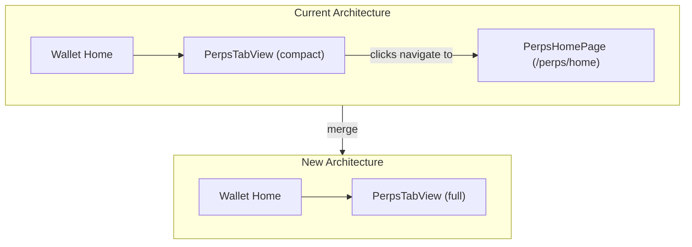

# TAT-2582: Merge Perps Home into Perps Tab

## Overview

Eliminate the standalone `PerpsHomePage` (`/perps/home`) and promote all of its content into the `PerpsTabView` component embedded in the wallet home. This includes the full balance display with add/withdraw dropdown, watchlist section (stubbed with mocks), always-visible explore/activity/support sections, and the tutorial modal.

---

## Architecture Change



The `PerpsTabView` absorbs all content from `PerpsHomePage`. The `/perps/home` route and `PerpsHomePage` are deleted.

---

## Sections in the New Tab (top to bottom, per design)

1. **Balance header** — total balance + unrealized P&L + chevron dropdown for Add Funds / Withdraw
2. **Positions** — with "Close all" action (always visible when positions exist)
3. **Orders** — with "Cancel all" action (always visible when orders exist)
4. **Watchlist** — new section with stubbed mock data
5. **Explore markets** — always visible (currently hidden when positions exist); "Explore markets >" row links to `/perps/market-list`
6. **Activity** — always visible (currently gated by `hasPositions`)
7. **Support & Learn** — "Learn about perps", "Contact support", "Give us feedback"
8. **Tutorial Modal** — `PerpsTutorialModal` rendered in the tab

---

## Phase 1: New Components

### 1a. Create `PerpsBalanceDropdown` component

New file: `ui/components/app/perps/perps-balance-dropdown/perps-balance-dropdown.tsx`

Replaces the current `PerpsTabControlBar`. Renders:
- "Total balance" row with value + chevron (v) toggle
- "Unrealized P&L" row (when positions exist, same as current)
- Dropdown panel with "Add funds" and "Withdraw" buttons (toggled by chevron)

Data source: `usePerpsLiveAccount()` (same as current `PerpsTabControlBar` and `PerpsMarketBalanceActions`)

The current `perps-tab-control-bar.tsx` has the balance/P&L display logic; the new component extends it with the dropdown toggle.

### 1b. Create `PerpsWatchlist` component

New file: `ui/components/app/perps/perps-watchlist/perps-watchlist.tsx`

Stubbed with mock data from `mocks.ts` (consistent with existing mock pattern). Renders a list of market cards with columns: Volume, Price, Price change.

Add mock watchlist data to `mocks.ts`:

```typescript
export const mockWatchlist: string[] = ['BTC', 'ETH'];
```

The component cross-references `mockWatchlist` symbols against `usePerpsLiveMarketData()` to get live price/volume data.

---

## Phase 2: Rewrite `PerpsTabView`

File: `ui/components/app/perps/perps-tab-view.tsx`

Major changes:

- **Replace `PerpsTabControlBar`** with new `PerpsBalanceDropdown`
- **Remove position-gating on explore sections** — the `{!hasPositions && (...)}` conditional (lines 158–344) becomes unconditional
- **Remove position-gating on activity** — `{hasPositions && <PerpsRecentActivity />}` (line 423) becomes unconditional
- **Add Watchlist section** between Orders and Explore markets
- **Add Support & Learn section** (move from `PerpsHomePage` lines 737–815)
- **Add `PerpsTutorialModal`** (move from `PerpsHomePage` line 818)
- **Add `handleLearnPerps` dispatch** using `setTutorialModalOpen(true)` from `ui/ducks/perps`
- **Remove navigation to `/perps/home`** — `handleManageBalancePress` and `handleNewTrade` no longer navigate away; the dropdown handles add/withdraw inline
- **Condense "Explore" sections** — replace the two separate crypto/HIP-3 sections with a single "Explore markets >" row that navigates to `/perps/market-list`, followed by a combined preview of top markets (keeping the current market card rendering)

---

## Phase 3: Delete PerpsHomePage

### 3a. Remove the page component

Delete: `ui/pages/perps/perps-home-page.tsx`

### 3b. Remove the route

In `ui/pages/routes/routes.component.tsx`:
- Remove the `WrappedPerpsHomePage` const (lines 358–362)
- Remove the `PerpsHomePage` lazy import (lines 332–335)
- Remove the route entry for `PERPS_HOME_ROUTE` (lines 881–885)

### 3c. Remove the route constant

In `ui/helpers/constants/routes.ts`:
- Remove `PERPS_HOME_ROUTE` export (line 150)
- Remove the analytics entry for it (line 166)

### 3d. Update exports

In `ui/pages/perps/index.ts`:
- Remove `export { default as PerpsHomePage }` (line 9)

### 3e. Update all references to `PERPS_HOME_ROUTE`

Files that import it:
- `ui/components/app/perps/perps-tab-view.tsx` — remove import and navigation uses
- `ui/pages/perps/perps-market-detail-page.tsx` — if it references the home route, update to `DEFAULT_ROUTE`
- `ui/providers/perps/PerpsControllerProvider.mock.tsx` — check and update

---

## Phase 4: Update Existing Components

### 4a. `PerpsRecentActivity` — keep as-is (still uses mocks)

No changes needed to `perps-recent-activity.tsx`. It already renders the right UI. Wiring to real data via `usePerpsTransactionHistory` is a separate task.

### 4b. `PerpsTabControlBar` — deprecate/delete

Once `PerpsBalanceDropdown` replaces it, delete:
- `ui/components/app/perps/perps-tab-control-bar/perps-tab-control-bar.tsx`
- `ui/components/app/perps/perps-tab-control-bar/perps-tab-control-bar.test.tsx`

**Why replace rather than extend?** The interaction model is fundamentally different — `PerpsTabControlBar` was built to navigate the user away to `PerpsHomePage` on click. With `PerpsHomePage` gone, the balance header needs inline dropdown behavior, not navigation. The interface changes significantly enough (no `onManageBalancePress` prop, no navigation concern) that a new component is cleaner.

### 4c. Update barrel exports in `ui/components/app/perps/index.ts`

- Add exports for `PerpsBalanceDropdown` and `PerpsWatchlist`
- Remove `PerpsTabControlBar` export if it was previously exported

---

## Phase 5: Tests

### 5a. New test files
- `perps-balance-dropdown.test.tsx` — renders balance, P&L, dropdown toggle, button callbacks
- `perps-watchlist.test.tsx` — renders mock watchlist items, click navigates to market detail

### 5b. Update `perps-tab-view.test.tsx`
- Update to reflect new layout (balance dropdown instead of control bar, always-visible sections, support links, tutorial modal)
- Remove assertions about navigation to `/perps/home`

### 5c. Run lint
- `yarn lint:changed:fix` before completion

---

## Files Summary

| Action | File |
|--------|------|
| **Create** | `ui/components/app/perps/perps-balance-dropdown/perps-balance-dropdown.tsx` |
| **Create** | `ui/components/app/perps/perps-balance-dropdown/perps-balance-dropdown.test.tsx` |
| **Create** | `ui/components/app/perps/perps-watchlist/perps-watchlist.tsx` |
| **Create** | `ui/components/app/perps/perps-watchlist/perps-watchlist.test.tsx` |
| **Major edit** | `ui/components/app/perps/perps-tab-view.tsx` |
| **Major edit** | `ui/components/app/perps/perps-tab-view.test.tsx` |
| **Edit** | `ui/components/app/perps/mocks.ts` (add watchlist mock) |
| **Edit** | `ui/components/app/perps/index.ts` (update exports) |
| **Edit** | `ui/pages/perps/index.ts` (remove PerpsHomePage export) |
| **Edit** | `ui/pages/routes/routes.component.tsx` (remove route) |
| **Edit** | `ui/helpers/constants/routes.ts` (remove PERPS_HOME_ROUTE) |
| **Delete** | `ui/pages/perps/perps-home-page.tsx` |
| **Delete** | `ui/components/app/perps/perps-tab-control-bar/perps-tab-control-bar.tsx` |
| **Delete** | `ui/components/app/perps/perps-tab-control-bar/perps-tab-control-bar.test.tsx` |

---

## Out of Scope (Separate Tasks)

- Wiring `PerpsRecentActivity` to real data via `usePerpsTransactionHistory` (currently mocked)
- Implementing real Watchlist persistence (Redux slice + controller integration)
- Implementing the "Add Funds" and "Withdraw" flows themselves (the dropdown buttons will be wired to callbacks, flows TBD)
- Market list filter modal (third/fourth screens in the design)
