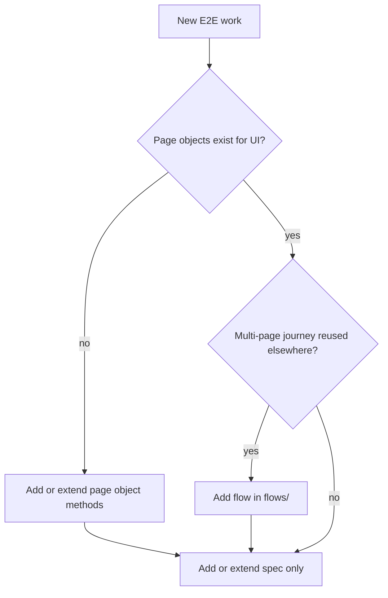

# Creating E2E tests (MetaMask Extension)

Standards and anti-patterns live in the E2E rule — read them before writing code. This skill is the **workflow** for adding new tests.

**Canonical copy:** Edit only `.cursor/skills/creating-e2e-tests/` in this repo. The same path is **symlinked** from `.claude/skills/creating-e2e-tests/` and `.agents/skills/creating-e2e-tests/` so every agent runtime reads one source of truth.

## Canonical standards (do not duplicate)

- **E2E guidelines:** `.cursor/rules/e2e-testing-guidelines/RULE.md` (POM, TypeScript-only specs, waits, prohibited patterns, checklist)
- **Deprecated patterns / automation hints:** `.cursor/BUGBOT.md`
- **E2E directory index:** `test/e2e/AGENTS.md`
- **Driver API:** `test/e2e/webdriver/README.md`
- **Feature Flag Registry:** `test/e2e/feature-flags/feature-flag-registry.ts` — production defaults for remote flags; `test/e2e/mock-e2e.js` serves them via `getProductionRemoteFlagApiResponse()`

## When to use this skill

Use when the user asks to:

- Add or scaffold a new `test/e2e/**/*.spec.ts` file
- Add or extend page objects under `test/e2e/page-objects/pages/`
- Add or extend flows under `test/e2e/page-objects/flows/`
- Wire fixtures, mocks, or manifest flags for a new scenario

**Not covered here:** Playwright MCP visual testing — use the `metamask-visual-testing` skill and `test/e2e/playwright/llm-workflow/` docs.

## Copy-paste templates

For starter snippets (spec, page object, flow, mocks), see [references/TEMPLATES.md](references/TEMPLATES.md).

## Decision: what to build?



- **Spec only:** Feature already has page objects; test new behavior with new `it` blocks or a new spec file in the right folder.
- **Page object:** New screen or new controls — add selectors and methods on a class under `test/e2e/page-objects/pages/` (mirror UI folder structure when practical).
- **Flow:** The same sequence of pages will be reused across multiple specs — add `*.flow.ts` under `test/e2e/page-objects/flows/` that orchestrates page objects only.

## Workflow progress

Copy this checklist and tick items as you go (skip any step the [decision tree](#decision-what-to-build) says you do not need):

- [ ] **Step 1:** Plan — outcome, preconditions, existing coverage, test name
- [ ] **Step 2:** Page objects — skip if the UI is already covered by existing page objects
- [ ] **Step 3:** Flows — optional; skip if the journey is not reused across specs
- [ ] **Step 4:** Spec file — `withFixtures`, `FixtureBuilderV2`, page objects and flows only in the spec body (no hardcoded selectors)
- [ ] **Step 5:** Fixtures, mocks, flags — state, `testSpecificMock`, feature flags (registry baseline + optional `manifestFlags` override), local node if needed
- [ ] **Step 6:** Run and debug — `yarn build:test` / `yarn test:e2e:single`, fix flakes without sleeps
- [ ] **Pre-submit:** [Checklist below](#pre-submit-checklist) (lint, POM, `title`, snap privacy helper when applicable)

## Step 1: Plan

1. Identify the **user-visible outcome** to assert (not implementation details).
2. List **preconditions** (wallet state, network, permissions, feature flags). Prefer `FixtureBuilderV2` over building state through the UI.
3. Search for existing coverage:
   - `test/e2e/tests/**` for similar specs
   - `test/e2e/page-objects/pages/**` for page objects
   - `test/e2e/page-objects/flows/**` for flows
4. Confirm **test name** follows the rule: descriptive, present tense, **no** leading `should`, avoid chaining multiple behaviors in one name.

## Step 2: Page objects

1. Place the file under `test/e2e/page-objects/pages/` (use subfolders that match feature areas, e.g. `confirmations/`, `settings/`).
2. Import `Driver` from `test/e2e/webdriver/driver` using the correct relative depth.
3. Keep **selectors private** on the class; expose behavior via methods.
4. Prefer `data-testid` via `{ testId: '...' }` locators (see `Driver` / `RawLocator` in `test/e2e/page-objects/common.ts`).
5. Add `checkPageIsLoaded()` (or equivalent) that waits for stable, characteristic elements.
6. **Sort** private fields and public methods **alphabetically** (per E2E rule).
7. Reference implementations: `test/e2e/page-objects/pages/login-page.ts`, `test/e2e/page-objects/pages/confirmations/confirmation.ts`.

**Spec files must not** contain raw selector strings or direct `driver.clickElement('[data-testid=...]')` — move that into page objects.

## Step 3: Flows (optional)

1. Add `something.flow.ts` under `test/e2e/page-objects/flows/`.
2. Export async functions that take `driver: Driver` and optional typed options.
3. Flows call page object methods only; avoid embedding selector strings in flows.
4. Reference: `test/e2e/page-objects/flows/login.flow.ts` for unlock + home validation.

**`console.log` in flows:** Include short `console.log` breadcrumbs at key steps (as in `login.flow.ts`). This is an intentional project convention for E2E debugging output, not placeholder code to delete.

## Step 4: Spec file

1. Create `test/e2e/tests/<feature>/<scenario>.spec.ts` (folder per feature area).
2. Wrap each test body in `withFixtures` from `test/e2e/helpers.js` (import path relative to spec; typical depth is `../../helpers`).
3. Pass `title: this.test?.fullTitle()` for artifact naming and debugging. **Use traditional `function` callbacks for `describe` / `it` bodies** — not arrow functions. Mocha sets `this.test` on the function context; arrow functions do not receive it, so `this.test?.fullTitle()` becomes `undefined` and artifacts lose useful titles.
4. Use **`FixtureBuilderV2`** by default: `test/e2e/fixtures/fixture-builder-v2.ts`. Use legacy `FixtureBuilder` only if a required `with*` method is not available in V2 (see list in the E2E rule).
5. Start from logged-in home when possible: `import { login } from '../../page-objects/flows/login.flow'` (adjust path).
6. Instantiate page objects with `new MyPage(driver)` inside the `withFixtures` callback.
7. For **snap** tests using `FixtureBuilderV2`, chain `.withSnapsPrivacyWarningAlreadyShown()` when applicable (see `.cursor/BUGBOT.md`).
8. For **dapp** flows, use existing constants/helpers (`WINDOW_TITLES`, `DAPP_URL`, etc.) from nearby specs; switch windows with driver helpers as in sibling tests.

## Step 5: Fixtures, mocks, flags

**Fixture state**

- Build chains like `new FixtureBuilderV2().withPreferencesController({...}).withPermissionControllerConnectedToTestDapp().build()` — exact methods are documented in `.cursor/rules/e2e-testing-guidelines/RULE.md`.
- Prefer setting controller state in fixtures over clicking through onboarding unless the test explicitly covers onboarding.

**HTTP mocking**

- Global mocks apply automatically; add **`testSpecificMock`** when a test needs deterministic responses (see E2E rule mock example and [references/TEMPLATES.md](references/TEMPLATES.md)).

**Feature flags**

E2E runs use **production-accurate** remote flag defaults from the **Feature Flag Registry** (`test/e2e/feature-flags/feature-flag-registry.ts`). The global mock (`test/e2e/mock-e2e.js`) serves those defaults on the client-config `/v1/flags` endpoint via `getProductionRemoteFlagApiResponse()`.

- **Override an existing flag for one test:** Pass `manifestFlags: { remoteFeatureFlags: { flagName: value } }` on the `withFixtures` options. Only the listed flags change; the rest stay at registry defaults. Example: `test/e2e/tests/update-modal/update-modal.spec.ts`.

- **Add a new remote flag used in E2E:** Register it in `FEATURE_FLAG_REGISTRY` with `name`, `type` (`FeatureFlagType.Remote` or `FeatureFlagType.Build`), `inProd`, `productionDefault` (shape must match the real API response), and `status` (`FeatureFlagStatus.Active` or `Deprecated`). Then use `manifestFlags` in specs that need a value other than `productionDefault`.

- **Fixture alternative:** `FixtureBuilder.withRemoteFeatureFlags({ ... })` can set flag state in fixtures (see registry file header comment).

**Local chain / contracts**

- When the test needs a node or deployed contracts, use `withFixtures` options such as `localNodeOptions`, `smartContract`, or patterns from an existing spec in the same feature area — copy the minimal working combination.

## Step 6: Run and debug

From repo root:

```bash
yarn build:test   # or yarn start:test for faster iteration; LavaMoat off
yarn test:e2e:single test/e2e/tests/<path>/<name>.spec.ts --browser=chrome
```

Useful flags (see `AGENTS.md` / docs):

- `--leave-running` — inspect browser on failure
- `--debug` — verbose logging

**Reliability:** Never use `driver.delay()` or arbitrary `setTimeout` for synchronization — use `waitForSelector`, `waitForMultipleSelectors`, page object waits, or driver wait helpers per the E2E rule.

## Troubleshooting (common failures)

- **`checkPageIsLoaded()` / `waitFor*` times out:** The UI may have changed. Search the React source for the current `data-testid` (or copy a working locator from a sibling page object in the same feature area). Do not add sleeps — fix the locator or wait for the correct state.
- **Passes locally, flakes in CI:** Prefer explicit waits (`waitForSelector`, `waitForMultipleSelectors`, page-object helpers) over assuming layout timing. Compare with a stable spec in the same folder for window switching and fixture options.
- **`title` is missing in logs / artifacts:** Confirm the `it` callback is `async function () { ... }`, not `async () => { ... }`, and that `title: this.test?.fullTitle()` is inside that same function’s `withFixtures` options (see Step 4).
- **Unhandled errors in `withFixtures`:** If the browser or extension is left in a bad state, re-run with `--leave-running` and `--debug`, then compare fixture + mock setup with a passing test in the same directory.

## Pre-submit checklist

After the [workflow progress](#workflow-progress) steps above:

- [ ] New or updated spec is **TypeScript** (`.spec.ts`)
- [ ] **Page object model** enforced — no selectors or raw driver interactions in the spec
- [ ] No `driver.delay()` / sleep-based waits
- [ ] **`FixtureBuilderV2`** used when supported; legacy builder only when necessary
- [ ] Snap specs using V2 include **`.withSnapsPrivacyWarningAlreadyShown()`** when required (see BUGBOT)
- [ ] `title: this.test?.fullTitle()` passed to `withFixtures`, and the enclosing `it` uses `function ()`, not `=>`, so `this.test` is defined
- [ ] Test names follow rule conventions (no `should`, focused scenario)
- [ ] Any **new remote feature flag** required for the scenario is added to `test/e2e/feature-flags/feature-flag-registry.ts` (so global E2E mocks stay consistent)
- [ ] `yarn lint:changed:fix` run on touched files

## Related skills

- **Visual / MCP validation:** `.claude/skills/metamask-visual-testing/SKILL.md`
