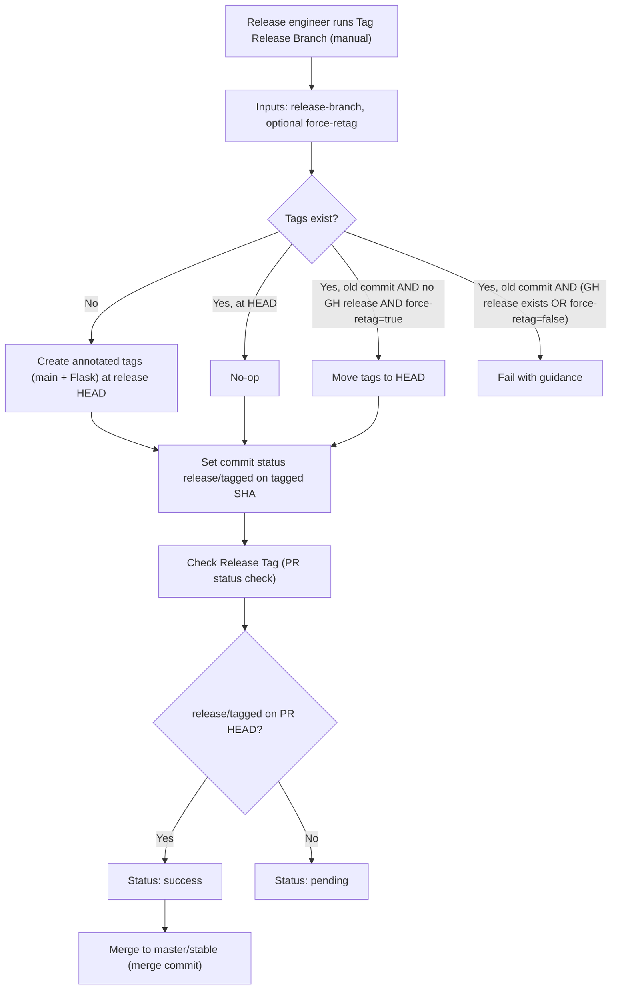

## **Description**

This PR aligns the Extension release process with Mobile by tagging the release branch at HEAD before merging to master/stable. The new process ensures the exact QA‑tested code is tagged, and a dedicated check enforces this prior to merge.

### Release Workflow Diagram



[](https://codespaces.new/MetaMask/metamask-extension/pull/35549?quickstart=1)

## **Changelog**

CHANGELOG entry: null
<!-- This is an internal process improvement that doesn't affect end users -->

## **Related issues**

Fixes: [INFRA-2847](https://consensyssoftware.atlassian.net/browse/INFRA-2847)

## **Manual testing steps**

### Testing the Tag Release Branch workflow

1. Create a release branch (e.g., `Version-v12.0.0`).
2. Push any required changes; wait for CI to complete.
3. Run “Tag Release Branch” with:
   - release-branch: `Version-v12.0.0`
   - target-branch: `master` (or `stable`)
   - force-retag: leave unchecked (default)
4. Verify:
   - Tag `v12.0.0` is created at branch HEAD
   - Flask tag `v12.0.0-flask.0` is created at branch HEAD
   - Commit status `release/tagged` is set on the tagged SHA

### Testing Security Validations

1. Try running workflow with invalid version (e.g., `12.0.0'; rm -rf /`)
   - Should fail with validation error
2. Try with invalid branch name containing `..`
   - Should fail with path traversal error
3. Try re-running on already tagged release
   - Should skip with message "Tag already at HEAD"

### Testing Check Release Tag workflow

1. Open a PR from `Version-v12.0.0` to `master` (or `stable`).
2. The check runs and inspects PR HEAD for `release/tagged`.
3. If not tagged: check shows pending with guidance in the run summary.
4. After tagging at HEAD: check turns green.

### Testing Force Re-tag:

1. Tag a release branch at HEAD
2. Add another commit to the branch
3. Run Tag Release Branch with `force-retag: true`
4. Verify both tags (main and Flask) move to new HEAD (only if no GitHub release exists)

## **Screenshots/Recordings**

### **Before**
- Tags were created on merge commits after merging to master
- No verification that release branches were tagged
- Manual process prone to errors

### **After**

#### Tag Release Branch Workflow Success (example)
```
Created and pushed main tag: v12.0.0 at abc123f
Created and pushed Flask tag: v12.0.0-flask.0 at abc123f
Main tag already points to current HEAD.
Flask tag already points to current HEAD.
No action needed for tags.
```

## **Pre-merge author checklist**

- [x] I've followed [MetaMask Contributor Docs](https://github.com/MetaMask/contributor-docs) and [MetaMask Extension Coding Standards](https://github.com/MetaMask/metamask-extension/blob/main/.github/guidelines/CODING_GUIDELINES.md).
- [x] I've completed the PR template to the best of my ability
- [x] I've included tests if applicable
- [x] I've documented my code using [JSDoc](https://jsdoc.app/) format if applicable
- [x] I've applied the right labels on the PR (see [labeling guidelines](https://github.com/MetaMask/metamask-extension/blob/main/.github/guidelines/LABELING_GUIDELINES.md)). Not required for external contributors.

## **Pre-merge reviewer checklist**

- [ ] I've manually tested the PR (e.g. pull and build branch, run the app, test code being changed).
- [ ] I confirm that this PR addresses all acceptance criteria described in the ticket it closes and includes the necessary testing evidence such as recordings and or screenshots.

[INFRA-2847]: https://consensyssoftware.atlassian.net/browse/INFRA-2847
