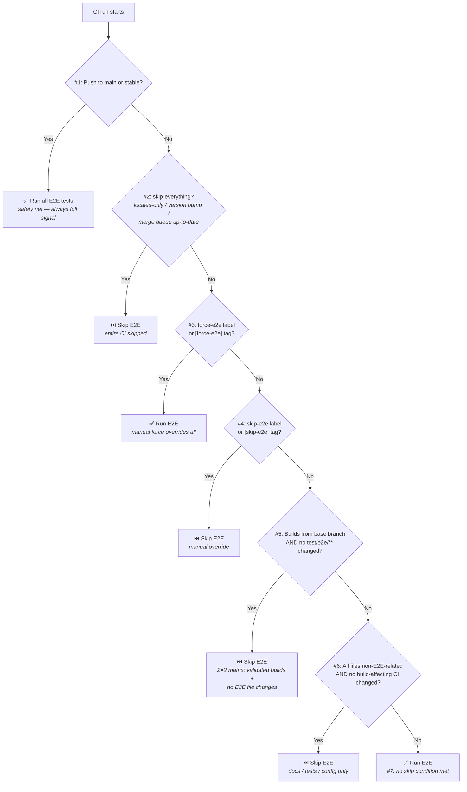

# E2E Test Decision Tree

The following diagram shows the high-level decision flow used by Extension CI
to determine whether E2E tests run on a given PR or push.

All logic lives in
[`get-requirements.yml`](../workflows/get-requirements.yml) and the filter
definitions in [`filter-rules.yml`](../rules/filter-rules.yml).

---

## Skip rules

The skip conditions below are evaluated in this order — first match wins.
These are referenced as **rule #1** through **rule #7** throughout this
document.

| # | Condition | Result | Rationale |
|---|-----------|--------|-----------|
| 1 | Push to `main` or `stable` | **Always run** | Safety net; all tests must pass on run-everything branches |
| 2 | `skip-everything` is true | **Skip all CI** | Locales-only, version-bump-only, or merge-queue-up-to-date |
| 3 | `force-e2e` label or `[force-e2e]` commit tag | **Force run** | Overrides skip conditions #4–#6 (but not #2 — `skip-everything` gates the entire step) |
| 4 | `skip-e2e` label or `[skip-e2e]` commit tag | **Skip** | Manual escape hatch for infra issues |
| 5 | Builds reused from base branch AND no `test/e2e/**` files changed | **Skip** | 2×2 matrix — validated builds + no test changes |
| 6 | ALL changed files match `non_e2e_related_files` AND no build-affecting CI files changed | **Skip** | Docs, unit tests, config, CI, dev tools only |
| 7 | None of the above | **Run** | Default — when in doubt, run E2E |

---

## Build reuse and the 2×2 matrix

The "builds from base branch" condition (rule #5) deserves special attention:

| Builds from… | E2E test files changed? | E2E runs? | Why |
|---|---|---|---|
| `main` or `stable` | No | **Skip** | Builds validated by full CI on base branch |
| `main` or `stable` | Yes | **Run** | Test fixtures/specs changed — must verify |
| Same branch | Any | **Run** | Same-branch builds may not have passed tests |
| Other branch (e.g. `feature-parent`) | Any | **Run** | Non-run-everything branches aren't validated |
| No reuse (fresh build) | Any | **Run** | New builds need full verification |

---

## Manual overrides

| Mechanism | Scope | Effect |
|---|---|---|
| `force-e2e` label | PR | Force E2E to run, overrides skip conditions #4–#6 |
| `skip-e2e` label | PR | Skip E2E (escape hatch for infra issues) |
| `[force-e2e]` in commit message | Single push | Same as label — force run |
| `[skip-e2e]` in commit message | Single push | Same as label — skip |
| `force-builds` label | PR | Force fresh builds (disables build reuse) |
| `skip-builds` label | PR | Force build reuse regardless of hash match |

> **Note:** E2E labels (`skip-e2e`, `force-e2e`) carry through to merge queue
> runs via API label lookup. Build labels (`skip-builds`, `force-builds`) only
> apply on `pull_request` events — the build-overrides step is skipped in the
> merge queue.

> **`skip-builds` and merge:** When `skip-builds` is used, builds are reused
> without hash verification. The CI status gate blocks merge in this case —
> remove the label and push again to merge.

> **Cross-repo PRs:** Manual overrides are ignored for PRs from forks
> (security measure — external contributors cannot bypass E2E).

---

## Non-E2E-related file categories

These file types, when they are the ONLY changes in a PR, allow E2E to be
skipped via rule #6:

| Category | Patterns |
|---|---|
| Documentation | `**/*.{md,mdx,txt}`, `docs/**`, `LICENSE` |
| Unit/integration tests | `**/*.test.*`, `**/*.snap`, `**/*.stories.*`, `test/{jest,lib,mocks,stub,unit-global}/**` |
| Config files | `.eslint*`, `.prettierrc*`, `codecov.yml`, `stylelint.config.js`, etc. |
| Dev tools | `development/{attributions,fitness-functions,lint-*,ts-migration-dashboard}/**` |
| CI/GitHub | `.github/**` (with build-affecting exception below) |
| Editor/Agent | `.agents/**`, `.claude/**`, `.cursor/**`, `.vscode/**`, `.storybook/**` |

### Exception: build-affecting CI files

`.github/workflows/run-build.yml` is under `.github/` (matches `ci_files`) but
directly affects build output. If this file changes, rule #6 is blocked even if
all other files are non-E2E-related.

---

## Other test types

The same 2×2 matrix pattern applies to unit/integration and storybook tests:

| Test type | Skip when | Filter |
|---|---|---|
| Unit & integration | Builds from base branch AND no `unit_integration_test_files` changed | `**/*.test.*`, `jest.config.js`, etc. |
| Storybook | Builds from base branch AND no `storybook_files` changed | `**/*.stories.*`, `.storybook/**`, `**/*.snap` |
| Benchmarks | Any build reuse (same or base branch) | N/A — identical builds = identical perf |

---

## Release branches

Release branches (`release/*`) have stricter CI behavior than feature branches.

| Behavior | Reason |
|---|---|
| `IS_RUN_EVERYTHING_BRANCH` = false | Only `main` and `stable` are run-everything |
| `BRANCH` starts with `release/` | Detected via `startsWith` |
| Build reuse **disabled** | `find-reusable-builds` is skipped — too high-risk to reuse builds on release branches |
| E2E runs (unless rule #6 fires) | Rule #5 (2×2 matrix) can't fire without build reuse; rule #6 can still skip for docs/config-only pushes |
| `BASE_BRANCH` = `stable` | Fallback for non-PR pushes on release branches |

### PRs targeting `release/*` (cherry-picks)

When a PR targets a release branch (e.g. `cherry-pick-fix` → `release/12.0.0`):

| Behavior | Reason |
|---|---|
| `BRANCH` = PR head (e.g. `cherry-pick-fix`) | Not a release branch itself |
| `BASE_BRANCH` = `release/12.0.0` | From `github.event.pull_request.base.ref` |
| Build reuse **can occur** | `BRANCH` doesn't start with `release/`, so `find-reusable-builds` runs |
| But: `builds-from-base-branch` = false | `release/*` is NOT in `runEverythingBranches` (`main`/`stable` only) |
| E2E **runs** (unless rule #4 or #6 applies) | 2×2 matrix skip is blocked because builds aren't from a validated base |

**Summary for release PRs:** Builds may be reused (saving build time), but
tests always run because `release/*` branches aren't in the run-everything set.
The only ways to skip E2E on a release PR are:

- **Manual skip** — `skip-e2e` label or `[skip-e2e]` commit tag (rule #4)
- **Non-E2E files only** — all changes are docs/tests/config (rule #6)

Rule #2 (`skip-everything`) also applies in theory, but locales-only or
version-bump-only cherry-picks to release branches don't happen in practice.

### Why release branches don't allow test skipping

Release branches always build and test fresh because:
- They don't participate in the merge queue (no batching guarantees)
- Cherry-picks may interact with release-specific state (version numbers, changelogs)
- The cost of a missed regression on a release is much higher than on `main`
- Release branches have low PR volume, so the time savings would be minimal

---

## FAQ

**Q: My PR only changes docs but E2E still runs. Why?**
A: Check that ALL files in the diff match `non_e2e_related_files`. A single
file outside those patterns (even `package.json`) will prevent the skip.

**Q: Why does the merge queue show more files changed than my PR?**
A: The merge queue compares the merge group head against its base. If other
PRs merged ahead of yours, their changes are included in the diff.

**Q: My cherry-pick PR to a release branch takes longer than the same PR to main. Why?**
A: PRs to `main` can skip tests via the 2×2 matrix (builds validated on main).
PRs to `release/*` can reuse builds but always run tests because `release/*`
isn't a run-everything branch. This is intentional — release stability takes
priority over CI speed.
