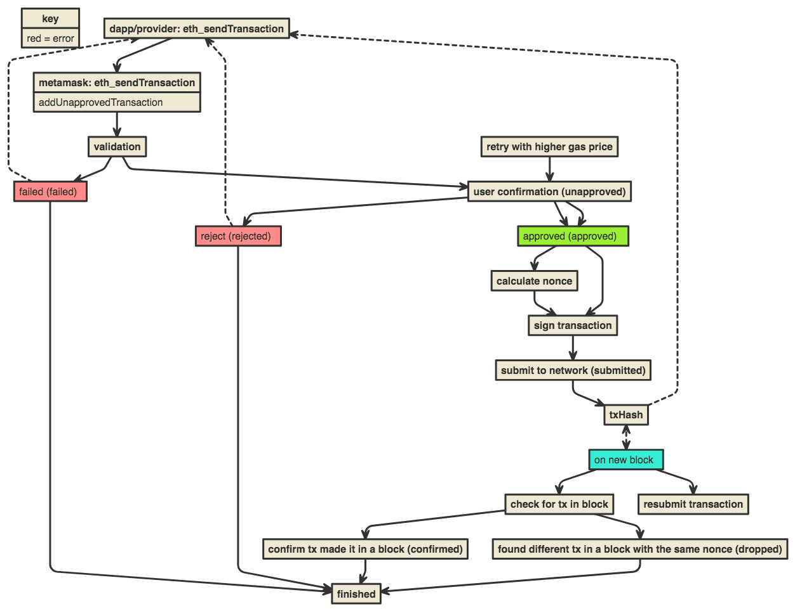

# Transaction Controller

Transaction Controller is an aggregate of sub-controllers and trackers
exposed to the MetaMask controller.

- txStateManager
    responsible for the state of a transaction and
    storing the transaction
- pendingTxTracker
    watching blocks for transactions to be include
    and emitting confirmed events
- txGasUtil
    gas calculations and safety buffering
- nonceTracker
    calculating nonces

## Flow diagram of processing a transaction



## txMeta's & txParams

A txMeta is the "meta" object it has all the random bits of info we need about a transaction on it. txParams are sacred every thing on txParams gets signed so it must
be a valid key and be hex prefixed except for the network number. Extra stuff must go on the txMeta!

Here is a txMeta too look at:

```js
txMeta = {
  "id": 2828415030114568, // unique id for this txMeta used for look ups
  "time": 1524094064821, // time of creation
  "status": "confirmed",
  "metamaskNetworkId": "1524091532133", //the network id for the transaction
  "loadingDefaults": false, // used to tell the ui when we are done calculating gas defaults
  "txParams": { // the txParams object
    "from": "0x8acce2391c0d510a6c5e5d8f819a678f79b7e675",
    "to": "0x8acce2391c0d510a6c5e5d8f819a678f79b7e675",
    "value": "0x0",
    "gasPrice": "0x3b9aca00",
    "gas": "0x7b0c",
    "nonce": "0x0"
  },
  "history": [
    { // debug information
      "id": 2828415030114568,
      "time": 1524094064821,
      "status": "unapproved",
      "metamaskNetworkId": "1524091532133",
      "loadingDefaults": true,
      "txParams": {
        "from": "0x8acce2391c0d510a6c5e5d8f819a678f79b7e675",
        "to": "0x8acce2391c0d510a6c5e5d8f819a678f79b7e675",
        "value": "0x0"
      }
    },
    [{
      "op": "add",
      "path": "/txParams/gasPrice",
      "value": "0x3b9aca00"
    }]
  ], // I've removed most of history for this
  "origin": "MetaMask", //debug
  "nonceDetails": {
    "params": {
      "highestLocallyConfirmed": 0,
      "highestSuggested": 0,
      "nextNetworkNonce": 0
    },
    "local": {
      "name": "local",
      "nonce": 0,
      "details": {
        "startPoint": 0,
        "highest": 0
      }
    },
    "network": {
      "name": "network",
      "nonce": 0,
      "details": {
        "baseCount": 0
      }
    }
  },
  "rawTx": "0xf86980843b9aca00827b0c948acce2391c0d510a6c5e5d8f819a678f79b7e67580808602c5b5de66eea05c01a320b96ac730cb210ca56d2cb71fa360e1fc2c21fa5cf333687d18eb323fa02ed05987a6e5fd0f2459fcff80710b76b83b296454ad9a37594a0ccb4643ea90", // used for rebroadcast
  "hash": "0xa45ba834b97c15e6ff4ed09badd04ecd5ce884b455eb60192cdc73bcc583972a",
  "submittedTime": 1524094077902 // time of the attempt to submit the raw tx to the network, used in the ui to show the retry button
}
```
