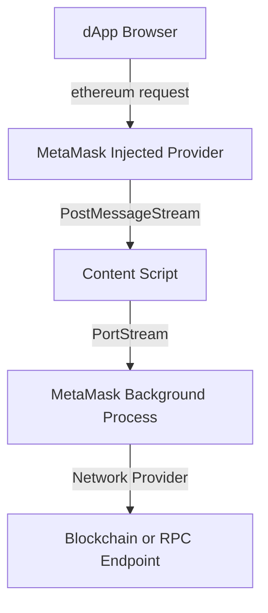
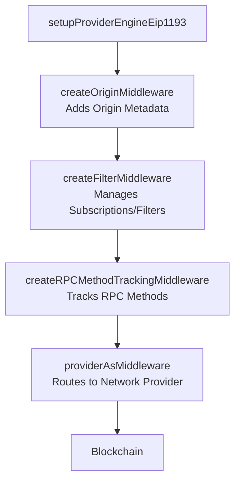

# Onboarding Guide: Understanding the RPC Pipeline in MetaMask

## Overview of MetaMask Extension's (Legacy) RPC Pipeline

This will be a high-level overview of MetaMask Extension's RPC pipeline, which manages JSON-RPC requests originating from dApps. This pipeline is comprised of several key components:

1. **Injected Provider (`inpage.js`)**:
   - Injects a provider (accessible as `window.ethereum`) into the dApp's JavaScript runtime, enabling dApps to send RPC requests.
   - Abstracts the complexities of direct blockchain communication by providing a structured API.

2. **Content Script (`contentscript.js`)**:
   - Bridges the injected provider in the browser's context with the MetaMask background process.
   - Secures communication while maintaining isolation from the browser's runtime.

3. **MetaMask Background Process**:
   - Orchestrates request handling, authentication, permissions, and transaction signing via the `metamask-controller.js` module and other controllers.
   - Routes requests to the appropriate network providers and ensures compliance with user permissions.

4. **Blockchain or External API**:
   - Processes requests from MetaMask and delivers responses, completing the interaction cycle.

This architecture ensures secure, performant, and extensible communication between dApps and blockchain networks.

See here for a rough diagram of the [overall MetaMask Extension architecture](https://github.com/MetaMask/metamask-extension?search=1#architecture).


---

## JSON-RPC Request Flow

### Step-by-Step Breakdown

### **1. Initialization in the dApp Context**
   - When a dApp is loaded, the `inpage.js` script injects the MetaMask provider into the browser's `window` object. This makes `window.ethereum` available as a standard entry point for dApps.
   - The provider initialization uses `initializeProvider`, which configures a `WindowPostMessageStream` to communicate securely with the content script.
   - The provider also handles feature negotiation (e.g., whether Web3 shimming is enabled) and exposes methods like `window.ethereum.request`, enabling dApps to make JSON-RPC calls.

   Example RPC request:
   ```javascript
   const accounts = await window.ethereum.request({ method: 'eth_requestAccounts' });
   console.log(accounts);
   ```

### **2. Content Script: Bridging Contexts**
   - The content script (`contentscript.js`) listens for RPC requests from the inpage provider via `WindowPostMessageStream`.
   - It initializes streams (`initStreams`) to forward these requests to the MetaMask background process over a secure `PortStream`.
   - This step ensures that dApps remain isolated and have no direct access to the MetaMask internals, preserving security.

   Example in `contentscript.js`:
   ```javascript
   if (shouldInjectProvider()) {
       initStreams(); // Connects to the MetaMask background process.
   }
   ```

### **3. MetaMask Background Process**
   - At the heart of the MetaMask background process is the `MetamaskController`. It handles RPC requests via the `setupProviderEngineEip1193` method.
   - The `setupProviderEngineEip1193` initializes a middleware stack using `JsonRpcEngine`, routing requests through multiple middleware layers for processing. Examples of middleware:
     - **`createOriginMiddleware`**: Appends origin metadata to each request for security and tracking.
     - **`createFilterMiddleware`**: Manages event subscriptions and filters, handling Web3-style APIs.
     - **`providerAsMiddleware`**: Passes requests to the appropriate blockchain network provider.
   - The background process interacts with network controllers to determine the active network, validate permissions, and relay requests to the blockchain.

   Key function in `metamask-controller.js`:
   ```javascript
   const engine = new JsonRpcEngine();
   engine.push(createOriginMiddleware({ origin }));
   engine.push(createFilterMiddleware(proxyClient));
   engine.push(providerAsMiddleware(proxyClient.provider));
   ```

### **4. Blockchain/External API Interaction**
   - The processed JSON-RPC requests are sent to the blockchain via the selected network provider, such as Infura or a custom RPC endpoint.
   - Responses, such as transaction receipts or account balances, are sent back through the same pipeline, reaching the dApp that initiated the request.

---

## Enhanced Diagrams

### **1. RPC Pipeline Overview**


### **2. Middleware Stack in the Background**


---

## Key Code Components and Responsibilities

### **1. Injected Provider (`inpage.js`)**
   - **Responsibilities**:
     - Exposes the `ethereum` object for dApp interaction.
     - Uses `initializeProvider` to bootstrap the provider and establish communication channels with the content script.
     - Implements Web3 shims (if enabled) for backward compatibility with legacy dApps.

   **Key Code Snippet**:
   ```javascript
   const metamaskStream = new WindowPostMessageStream({
       name: INPAGE,
       target: CONTENT_SCRIPT,
   });

   initializeProvider({
       connectionStream: metamaskStream,
       logger: log,
       shouldShimWeb3: true,
   });
   ```

### **2. Content Script (`contentscript.js`)**
   - **Responsibilities**:
     - Forwards JSON-RPC requests from the injected provider to the background process.
     - Maintains isolation between the dApp runtime and MetaMask internals.

   **Key Code Snippet**:
   ```javascript
   if (shouldInjectProvider()) {
       initStreams();
   }
   ```

### **3. Background Process (`metamask-controller.js`)**
   - **Responsibilities**:
     - Manages middleware stacks for RPC request validation, permissions, and routing.
     - Tracks network state, user preferences, and permissions.

   **Key Code Snippet**:
   ```javascript
   const engine = new JsonRpcEngine();
   engine.push(createOriginMiddleware({ origin }));
   engine.push(createFilterMiddleware(proxyClient));
   engine.push(providerAsMiddleware(proxyClient.provider));
   ```

---

## Middleware Deep Dive

### Essential Middleware in `setupProviderEngineEip1193`:

1. **`createOriginMiddleware`**:
   - Attaches the origin of the request (e.g., the requesting dApp) to the RPC payload.
   - Crucial for enforcing domain-based permissions.

2. **`createFilterMiddleware`**:
   - Implements `eth_subscribe` and `eth_unsubscribe` for managing blockchain event subscriptions.
   - Filters blockchain responses to match subscription criteria.

3. **`providerAsMiddleware`**:
   - The final layer that forwards requests to the active network provider (e.g., Infura, custom RPC endpoints).

4. **Custom Middleware Options**:
   - Developers can implement custom middleware to log requests, enforce additional validations, or modify responses.

---

## Key Takeaways

- **Middleware Customization**: Middleware is the backbone of MetaMask's RPC pipeline. By modifying or extending the middleware stack, developers can implement features like enhanced logging, security, or analytics.
- **Secure Communication**: The content script isolates the dApp from the MetaMask internals, ensuring robust security while enabling extensibility.
- **Extensibility**: The modular architecture allows seamless integration of additional network providers, APIs, and custom user flows.

---

## Next Steps

1. **Environment Setup**:
   - Clone the MetaMask repository and follow the build instructions.
   - Use browser developer tools to inspect the communication between the inpage provider, content script, and background process.

2. **Explore Middleware**:
   - Experiment with custom middleware in `metamask-controller.js`.
   - For example, implement a middleware that logs all incoming RPC requests for debugging.
