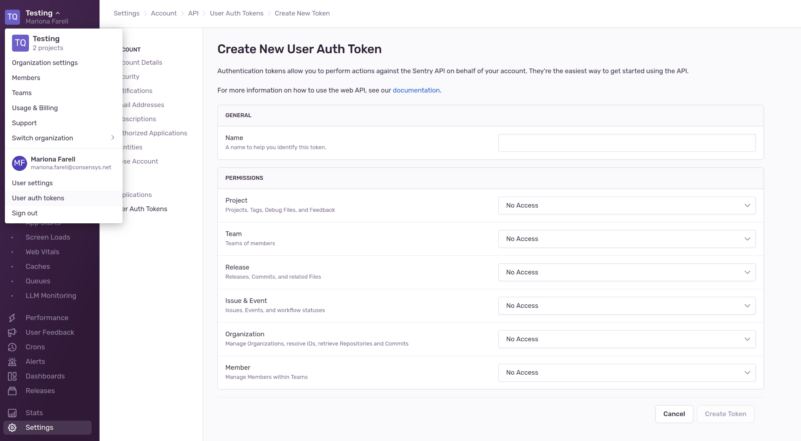
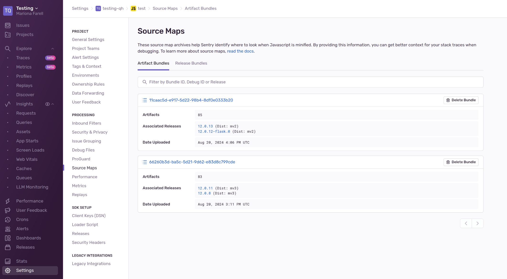

# Development

Several files which are needed for developing on MetaMask.

Usually each file or directory contains information about its scope / usage.

## Segment

### Debugging with the Mock Segment API

To start the [Mock Segment API](./mock-segment.js):

-   Add/replace the `SEGMENT_HOST` and `SEGMENT_WRITE_KEY` variables in `.metamaskrc`
    ```
    SEGMENT_HOST='http://localhost:9090'
    SEGMENT_WRITE_KEY='FAKE'
    ```
-   Build the project to the `./dist/` folder with `yarn dist`
-   Run the Mock Segment API from the command line
    ```
    node development/mock-segment.js
    ```

Events triggered whilst using the extension will be logged to the console of the Mock Segment API.

More information on the API and its usage can be found [here](./mock-segment.js#L28).

### Debugging in Segment

To debug in a production Segment environment:

- Create a free account on [Segment](https://segment.com/)
- Create a New Workspace
- Add a Source (Node.js)
- Copy the `Write Key` from the API Keys section under Settings
-   Add/replace the `SEGMENT_HOST` and `SEGMENT_WRITE_KEY` variables in `.metamaskrc`
    ```
    SEGMENT_HOST='https://api.segment.io'
    SEGMENT_WRITE_KEY='COPIED_WRITE_KEY'
    ```
-   Build the project to the `./dist/` folder with `yarn dist`

Events triggered whilst using the extension will be displayed in Segment's Debugger.

### Debugging Segment requests in MetaMask

To opt in to MetaMetrics;
- Unlock the extension
- Open the Account menu
- Click the `Settings` menu item
- Click the `Security & Privacy` menu item
- Toggle the `Participate in MetaMetrics` menu option to the `ON` position

You can inspect the requests in the `Network` tab of your browser's Developer Tools (background.html)
by filtering for `POST` requests to `/v1/batch`. The full url will be `http://localhost:9090/v1/batch`
or `https://api.segment.io/v1/batch` respectively.

## Sentry
### Debugging Sentry

1. Set `SENTRY_DSN_DEV`, or `SENTRY_DSN` if using a production build, in `.metamaskrc` to a suitable Sentry URL.
  - The example value specified in `.metamaskrc.dist` uses the `test-metamask` project in the MetaMask account.
  - Alternatively, create a free Sentry account with a new organization and project.
  - The DSN is specified in: `Settings > Projects > [Project Name] > Client Keys (DSN)`.

2. To display Sentry logs, include `DEBUG=metamask:sentry:*` in `.metamaskrc`.

3. To display more verbose logs if not in a developer build, include `METAMASK_DEBUG=true` in `.metamaskrc`.

4. Ensure metrics are enabled during onboarding or via `Settings > Security & privacy > Participate in MetaMetrics`.

5. To test Sentry via the developer options in the UI, include `ENABLE_SETTINGS_PAGE_DEV_OPTIONS=true` in `.metamaskrc`.

6. Alternatively, call `window.stateHooks.throwTestError()` or `window.stateHooks.throwTestBackgroundError()` via the UI console.

### Debugging the Publish Release Flow
#### Sentry UI Setup
1. Go to Sentry and Create an Organization, by clicking `Account Menu > Switch organization > Create a new organization`
2. Create a Javascript Project, by clicking `Projects > Create Project > Javascript`
3. Create a User Auth Token, by clicking `Account Menu > User auth tokens`
4. Select your newly created project and grant all permissions to your token
5. Copy your token to your clipboard

[](sentry-auth-token.png)

#### Sentry-Cli Setup
1. Go to your terminal, inside the `metamask-extension` project
2. Login to Sentry using the command line `yarn sentry-cli login --auth-token YOUR_TOKEN`
3. List your organizations and copy the id for the organization you want to see `yarn sentry-cli organizations list`
4. List your organization projects and copy the id for the you created `yarn sentry-cli projects list --org YOUR_ORG_ID`

[](sentry-cli.png)

#### Publish a Release to Sentry
1.  Build your desired MetaMask project. Examples:
    1.  `yarn dist` to create an MV3 build
    2.  `yarn dist:mv2` to create an MV2 build
    3.  (and so on)
2.  Move the build to its corresponding folder. Ie: `mv dist dist-mv2` (skip this step, if you did the regular MV3 build)
3.  Publish the release to Sentry:
    1.  If it's an MV3 build `yarn sentry:publish --org YOUR_ORG_ID --project YOUR_PROJECT_ID`
    2.  If it's an MV2 build `yarn sentry:publish --dist mv2 --org YOUR_ORG_ID --project YOUR_PROJECT_ID`
4.  See build files and source maps are uploaded
5.  Go to Sentry
6.  Check the Source Maps have been uploaded correctly in Sentry: go to `Settings > Projects > Project Name > Source Maps`

[](sentry-source-maps.png)

Extra Note: if you already uploaded one version, you can change the `package.json` version and run again the publish step, to test the complete flow.

## Source Maps
### Debugging production builds using Source Maps
To unbundle the extensions compiled and minified JavaScript using Source Maps:

- Open Chrome DevTools to inspect the `background.html` or `home.html` view
- Click on the `Sources` tab in Chrome DevTools
- In the Sources tab, click on the `Page` panel
- Expand the file directory in the Page panel until you see the source files you're after
- Select a source file in the Page panel
```
chrome-extension://{EXTENSION_ID}/common-0.js
```
- Double click the source file to open it in the Workspace
- Right click in the body of the source file and select `Add source map...`
- Enter the path to the corresponding source map file, and Click `Add`
```
file:///{LOCAL_FILE_SYSTEM}/metamask-extension/dist/sourcemaps/common-0.js.map
```
- Repeat the steps above as necessary adding all the relevant source map files
- Your source maps should now be added to the DevTools Console, and you should be able to see your original source files when you debug your code
