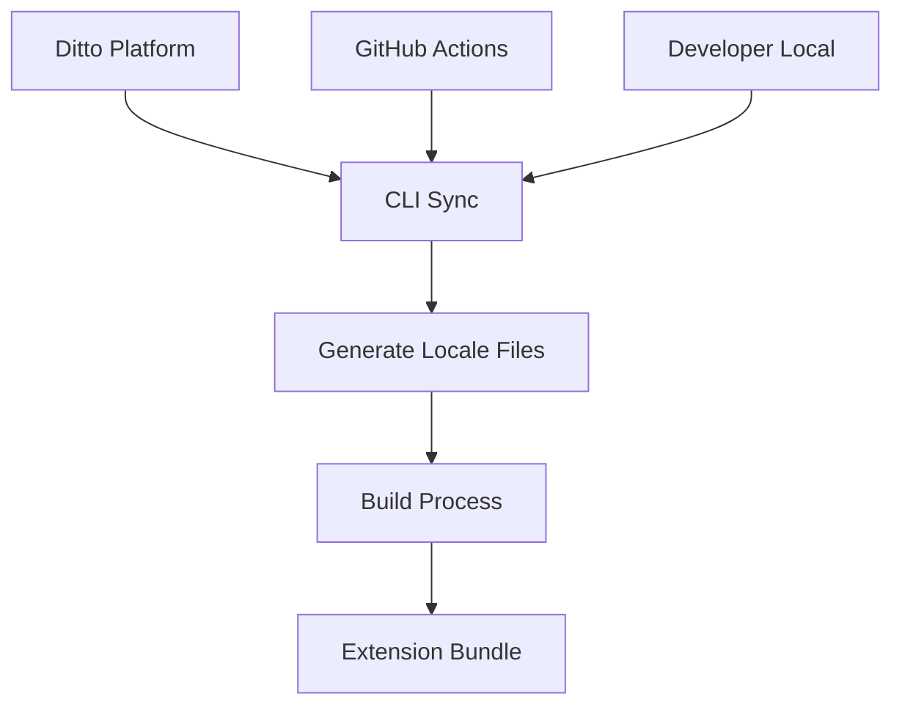
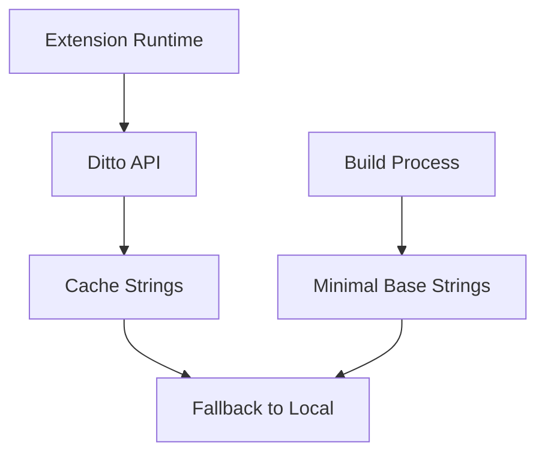
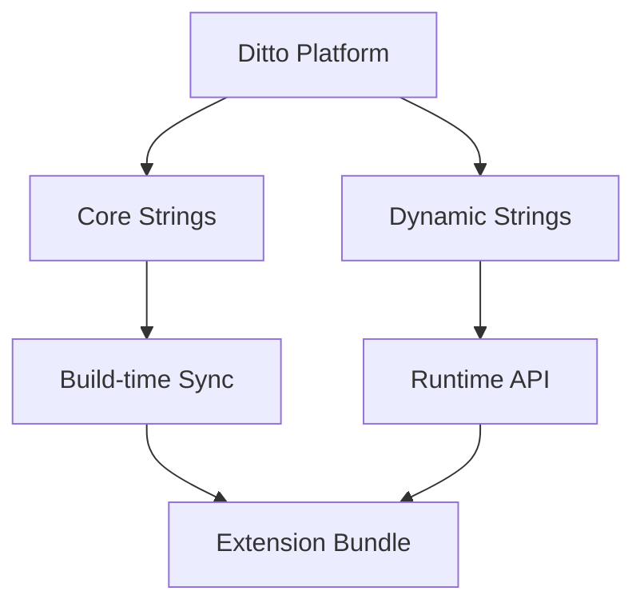

# Ditto POC for MetaMask Localization

This POC demonstrates how to integrate [Ditto](https://www.dittowords.com) content management into MetaMask's browser extension to replace the current manual locale management system.

## Current State vs. Proposed State

### Current State
- 56 languages stored in `app/_locales/` directory
- Manual JSON file management
- Community-driven translation process via GitHub PRs
- Static files copied during build process
- Verification via `development/verify-locale-strings.js`

### Proposed State (Ditto Integration)
- Centralized content management via Ditto platform
- Automated sync between Ditto and codebase
- Enhanced translation workflow with built-in collaboration
- Build-time or runtime string fetching
- Real-time updates capability

## POC Architecture

### Integration Options

#### Option 1: Build-time Integration (Recommended)


#### Option 2: Runtime Integration


#### Option 3: Hybrid Approach


## Implementation Plan

### Phase 1: Setup & Configuration
1. Create Ditto workspace
2. Configure CLI integration
3. Set up sample locales (en, es, fr)
4. Create build integration scripts

### Phase 2: Core Integration
1. Modify build system to use Ditto
2. Create fallback mechanisms
3. Implement error handling
4. Add caching layer

### Phase 3: Advanced Features
1. Runtime updates (optional)
2. Translation workflow setup
3. Community integration
4. Performance optimization

## Files in this POC

### Configuration
- `ditto/config.yml` - Ditto CLI configuration
- `scripts/ditto-sync.js` - Custom sync script
- `scripts/ditto-build-integration.js` - Build system integration

### Sample Implementation
- `sample-implementation/` - Working example with 3 languages
- `sample-implementation/ditto/` - Generated Ditto files
- `sample-implementation/build/` - Build integration example

### Documentation
- `docs/` - Complete documentation
- `docs/integration-guide.md` - Step-by-step integration guide
- `docs/workflow-guide.md` - New translation workflow
- `docs/migration-plan.md` - Migration from current system

### Testing
- `tests/` - Integration tests
- `tests/sync-test.js` - Test Ditto sync functionality
- `tests/build-test.js` - Test build integration

## Getting Started

### Prerequisites
- Node.js 16.0.0 or higher
- Ditto account and API key
- MetaMask extension development environment

### Quick Start
```bash
# 1. Install dependencies
npm install

# 2. Set up Ditto authentication
npx @dittowords/cli auth

# 3. Run the POC
npm run poc:demo

# 4. Test build integration
npm run poc:build
```

## Key Benefits Demonstrated

### 1. Developer Experience
- **Simplified workflow**: `npm run ditto:sync` instead of manual file editing
- **Type safety**: Generated TypeScript definitions
- **IDE integration**: IntelliSense for string keys
- **Error prevention**: Validation of string references

### 2. Translation Management
- **Centralized platform**: Single source of truth
- **Real-time collaboration**: Translators work in dedicated interface
- **Progress tracking**: Translation completion status
- **Quality assurance**: Built-in review and approval workflows

### 3. Operational Benefits
- **Automated sync**: CI/CD integration
- **Version control**: Built-in change tracking
- **Rollback capability**: Easy reversion of changes
- **Performance**: Optimized string delivery

## Risk Mitigation

### 1. Fallback Strategy
- Local copies maintained in repository
- Graceful degradation when Ditto unavailable
- Emergency rollback procedures

### 2. Open Source Compatibility
- Public Ditto workspace option
- GitHub-first workflow maintained
- Community contribution guidelines

### 3. Performance Safeguards
- Caching mechanisms
- Build-time optimization
- Bundle size monitoring

## Cost Analysis

### Current System Costs
- Developer time for string management
- Review time for translation PRs
- Coordination overhead
- Manual error fixing

### Ditto Integration Costs
- Ditto platform subscription
- Initial setup time
- Learning curve
- Ongoing maintenance

### ROI Calculation
- Time saved per release cycle
- Reduced translation errors
- Faster feature deployment
- Improved developer productivity

## Success Metrics

### Technical Metrics
- Build time impact: < 10% increase
- Bundle size impact: < 5% increase
- Error rate reduction: > 50%
- Translation turnaround: > 40% faster

### Process Metrics
- Developer satisfaction survey
- Translation team feedback
- Community adoption rate
- Support ticket reduction

## Next Steps

1. **Review this POC** with the team
2. **Approve approach** and resource allocation
3. **Pilot implementation** with limited scope
4. **Gather feedback** and iterate
5. **Full rollout** with migration plan

## Support

For questions about this POC:
- Technical issues: Check `docs/troubleshooting.md`
- Integration help: See `docs/integration-guide.md`
- Workflow questions: Review `docs/workflow-guide.md`

---

*This POC demonstrates the technical feasibility and benefits of integrating Ditto with MetaMask's localization system while maintaining compatibility with the existing open-source workflow.*