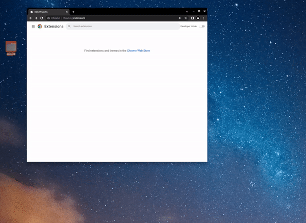
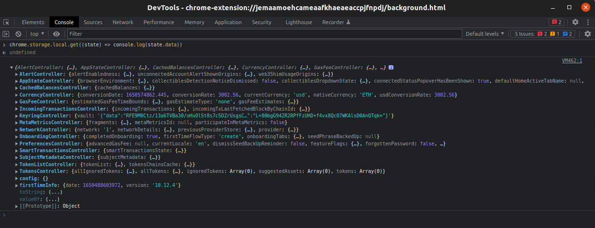
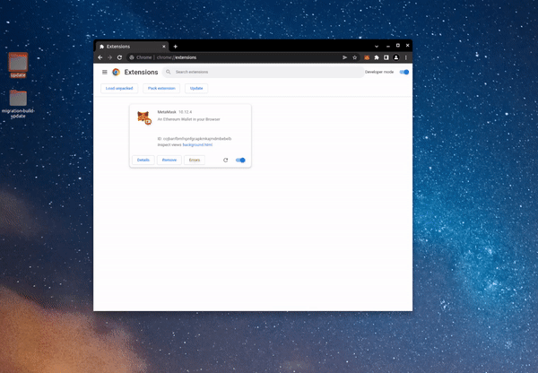

### QA Migrations Guide
Migrations are needed to change top-level state data, this can be found in the browser's storage. This can look like removing specific keys/value pairs from state, changing objects to an array of objects, changing the name of a controller, etc.

Steps
  1. Create a new MetaMask directory\* folder locally with the source files before the migration, and load it as an unpacked extension in Chrome\*. If the migration is in a pull request, then build the `main` branch to load. If the migration is already in `main`, get a commit before the migration was added to build.

      

      #####  \* For migrations targeting specific features behind a feature flag add them appropriately to the `.metamaskrc` file before building.
      ##### \* In order for the "Load unpacked" button to be shown developer mode needs to be enabled.

  2. Once the build has been loaded and state data has been initialized, ensure that the data in question that the migration targets is present in the local storage data.

      

  3. To trigger the migration a build with the migration will need to replace the files in the directory where the extension is loaded from, and refresh the extension.

      

  4. Ensure that the data has been changed/deleted/etc.
