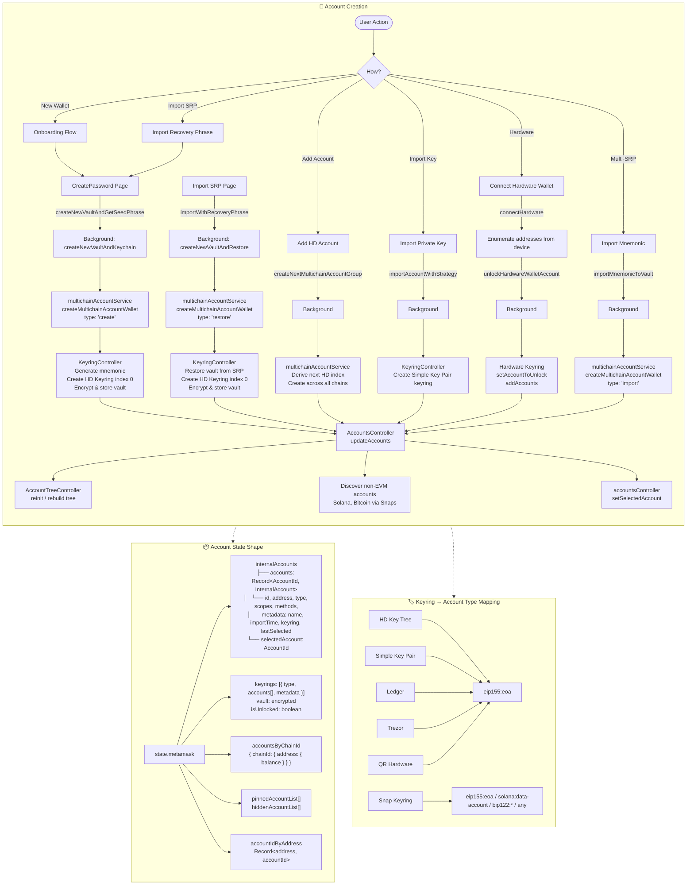

# Account & Transaction Flow

MetaMask account creation, state management, and the full transaction lifecycle.

---

## Account Creation



---

## Full Transaction Lifecycle

```mermaid
flowchart TB
    subgraph Transaction_Flow["💸 Full Transaction Lifecycle"]
        direction TB

        subgraph Dapp["🌐 Dapp Layer"]
            DappCall["dapp calls<br/>eth_sendTransaction"]
        end

        subgraph Provider["📡 Provider Layer"]
            Inpage["Inpage Provider"] --> CS["Content Script<br/>WindowPostMessageStream"]
            CS --> BgPort["Background Port<br/>ExtensionPortStream"]
        end

        subgraph Middleware["🔧 Middleware Pipeline (in order)"]
            direction TB
            M1["Origin middleware"]
            M2["SelectedNetwork middleware"]
            M3["Origin throttling"]
            M4["PPOM / Blockaid<br/>security check"]
            M5["Dapp swap detection"]
            M6["Trust signals"]
            M7["Permission check"]
            M8["Wallet middleware<br/>processTransaction"]
            M9["EIP-5792 middleware"]
            M10["Provider → network"]
        end

        DappCall --> Inpage
        BgPort --> M1
        M1 --> M2 --> M3 --> M4 --> M5 --> M6 --> M7 --> M8 --> M9 --> M10

        M8 -->|processTransaction| AddTx["addDappTransaction()<br/>app/scripts/lib/transaction/util.ts"]

        AddTx --> Route{Route by account type}
        Route -->|Tempo chain| Batch["addTransactionBatch()"]
        Route -->|ERC-4337 SCA| UO["addUserOperationWithController()"]
        Route -->|Standard EOA| Std["addTransactionWithController()"]

        Std --> TC["TransactionController<br/>.addTransaction()"]
        TC --> CreateTx["Create TransactionMeta<br/>status: unapproved<br/>Estimate gas"]
        CreateTx --> Approval["ApprovalController<br/>.addRequest()"]
        Approval --> Popup[" Opens notification popup"]

        subgraph UI_Confirm["🖥️ Confirmation UI"]
            direction TB
            ConfirmPage["confirm.tsx<br/>Confirmation screen"]
            Footer["Footer: Confirm / Cancel buttons"]
            ConfirmPage --> Footer
        end

        Popup --> ConfirmPage

        Footer -->|User clicks Confirm| OnConfirm["useTransactionConfirm<br/>onTransactionConfirm()"]
        Footer -->|User clicks Cancel| OnReject["useConfirmActions<br/>rejectPendingApproval()"]

        OnConfirm --> ApproveTx["updateAndApproveTx()<br/>ui/store/actions.ts:2068"]

        ApproveTx --> HWCheck{Hardware wallet?}
        HWCheck -->|Yes| HWSign["approveHardwareWalletTransaction()<br/>Sign on device"]
        HWCheck -->|No| Resolve["resolvePendingApproval()<br/>submitRequestToBackground"]

        HWSign --> Resolve
        OnReject --> RejectBg["rejectPendingApproval()"]

        Resolve --> BgAccept["Background:<br/>approvalController.acceptRequest()"]
        RejectBg --> BgReject["Background:<br/>approvalController.rejectRequest()"]
    end

    subgraph Sign_and_Publish["✍️ Sign & Publish"]
        direction TB
        BgAccept --> BeforeSign["beforeSign hook<br/>Enforced simulation"]
        BeforeSign --> Sign["KeyringController<br/>.signTransaction()"]

        Sign --> SignRoute{Keyring type}
        SignRoute -->|HD Key Tree| SignHD["Sign with derived private key"]
        SignRoute -->|Hardware| SignHW["Send to hardware device"]
        SignRoute -->|Snap| SignSnap["Delegate to snap"]

        SignHD --> Publish
        SignHW --> Publish
        SignSnap --> Publish

        Publish["beforePublish hook"] --> PublishRoute{Publish route}

        PublishRoute -->|1st| PayTx["TransactionPay<br/>(MetaMask Pay)"]
        PublishRoute -->|2nd| Del7702["EIP-7702 Delegation<br/>Delegation7702PublishHook"]
        PublishRoute -->|3rd| SmartTx["Smart Transaction<br/>(Sentinel relay)"]
        PublishRoute -->|4th| StandardRPC["Standard RPC<br/>eth_sendRawTransaction"]

        PayTx --> StatusUpdate
        Del7702 --> StatusUpdate
        SmartTx --> StatusUpdate
        StandardRPC --> StatusUpdate

        StatusUpdate["Status: signed → submitted"]
    end

    subgraph Tx_Status["📊 Transaction Status Lifecycle"]
        direction LR
        Unapproved["unapproved"] --> Approved["approved"]
        Approved --> Signed["signed"]
        Signed --> Submitted["submitted"]
        Submitted --> Confirmed["confirmed"]
        Submitted --> Failed["failed"]
        Submitted --> Dropped["dropped"]
        Unapproved --> Rejected["rejected"]
    end

    subgraph EIP7702["🔗 EIP-7702 Delegation Detail"]
        direction TB
        E7Check{"accountSupports7702()?"}
        E7Check -->|HD / Simple / Ledger| E7Yes["Supported"]
        E7Check -->|Trezor / QR / Snap| E7No["Skipped"]

        E7Yes --> E7Delegate["checkEip7702Support()<br/>Check chain support"]
        E7Delegate --> E7Auth["signEip7702Authorization()<br/>Sign delegation"]
        E7Auth --> E7Wrap["Wrap tx with authorization_list<br/>Temporarily upgrades EOA<br/>to smart contract code"]
        E7Wrap --> E7Enable["Enables:<br/>• Gas fee tokens (pay with ERC-20)<br/>• Gasless transactions (Sentinel)<br/>• Batch transactions (Tempo)"]
    end

    Transaction_Flow --> Sign_and_Publish
    Sign_and_Publish --> Tx_Status
    Del7702 -.-> EIP7702
```



---

## Controller Architecture

```mermaid
flowchart LR
    subgraph Controller_Architecture["🏛️ Controller Relationships"]
        direction TB

        KC["🔑 KeyringController<br/>(cryptographic keys)<br/>vault, keyrings[], sign()"]

        KC -->|stateChange event| AC["👤 AccountsController<br/>(account metadata)<br/>internalAccounts,<br/>selectedAccount"]

        AC -->|flattened into| Redux["Redux state.metamask<br/>(all controller states merged)"]

        KC -->|signTransaction()| TC["💸 TransactionController<br/>(transaction lifecycle)<br/>addTransaction, status tracking"]

        TC -->|addRequest| AppC["✅ ApprovalController<br/>(pending approvals)<br/>opens popup for user action"]

        TC -->|getGasFeeEstimates| GFC["⛽ GasFeeController<br/>(gas estimation)<br/>polls every 10s"]

        TC -->|publishHook| D7702["🔗 Delegation7702PublishHook<br/>(EIP-7702 wrapping)"]

        TC -->|publishHook| STX["⚡ Smart Transactions<br/>(Sentinel relay)"]

        ATC["📊 AccountTrackerController<br/>(EVM balances)"] -->|balances| Redux
        MBC["💰 MultichainBalancesController<br/>(non-EVM balances)"] -->|balances| Redux
        AOC["📌 AccountOrderController<br/>(pinning/hiding)"] -->|order| Redux
        ATree["🌳 AccountTreeController<br/>(group structure)"] -->|tree| Redux
        MAS["🌐 MultichainAccountService<br/>(wallet creation)"] -->|creates accounts| KC
        MAS -->|creates accounts| AC

        D7702 -->|"signEip7702Authorization"| KC
    end
```

---

## Key Files Reference

### Account Creation

| Category | Path |
|---|---|
| KeyringController init | `app/scripts/messenger-client-init/keyring-controller-init.ts` |
| AccountsController init | `app/scripts/messenger-client-init/accounts-controller-init.ts` |
| MultichainAccountService init | `app/scripts/messenger-client-init/multichain/multichain-account-service-init.ts` |
| AccountTreeController init | `app/scripts/messenger-client-init/accounts/account-tree-controller-init.ts` |
| AccountTracker init | `app/scripts/messenger-client-init/account-tracker-controller-init.ts` |
| MetaMask Controller (orchestrator) | `app/scripts/metamask-controller.js` |
| UI Store Actions | `ui/store/actions.ts` |
| Onboarding Flow | `ui/pages/onboarding-flow/onboarding-flow.tsx` |
| Keyring type constants | `shared/constants/keyring.ts` |
| 7702 support check | `app/scripts/lib/account-supports-7702.ts` |
| Keyrings supporting 7702 | `shared/constants/keyring.ts:36` |

### Transactions

| Category | Path |
|---|---|
| TransactionController init | `app/scripts/messenger-client-init/confirmations/transaction-controller-init.ts` |
| Transaction utils (bridge) | `app/scripts/lib/transaction/util.ts` |
| 7702 delegation hook | `app/scripts/lib/transaction/hooks/delegation-7702-publish.ts` |
| Delegation logic | `app/scripts/lib/transaction/delegation.ts` |
| Enforced simulation hook | `app/scripts/lib/transaction/hooks/enforce-simulation-hook.ts` |
| Smart transactions | `app/scripts/lib/smart-transaction/smart-transactions.ts` |
| Middleware pipeline | `app/scripts/metamask-controller.js:7653-7975` |
| Confirm page | `ui/pages/confirmations/confirm/confirm.tsx` |
| Transaction confirm hook | `ui/pages/confirmations/hooks/transactions/useTransactionConfirm.ts` |
| Gas fee controller init | `app/scripts/messenger-client-init/confirmations/gas-fee-controller-init.ts` |
| EIP-7702 support utils | `shared/lib/eip7702-support-utils.ts` |

### State & Selectors

| Category | Path |
|---|---|
| Account selectors | `ui/selectors/accounts.ts` |
| Shared account selectors | `shared/lib/selectors/accounts.ts` |
| Main selectors | `ui/selectors/selectors.js` |
| Transaction selectors | `ui/selectors/transactionController.ts` |
| Metamask Redux duck | `ui/ducks/metamask/metamask.js` |
| Background state types | `shared/types/background.ts` |

---

## EIP-7702 vs ERC-4337

| Aspect | EIP-7702 | ERC-4337 |
|---|---|---|
| Account type in state | `eip155:eoa` (unchanged) | `eip155:erc4337` (distinct type) |
| When applied | At transaction publish time | Account is a smart contract |
| How | Wraps tx with `authorization_list` | Submits `UserOperation` via bundler |
| Persistence | Ephemeral (per-transaction delegation) | Permanent (deployed contract) |
| Supported keyrings | HD, Simple, Ledger | Smart account controllers |
| Enables | Gas fee tokens, gasless tx, batching | Account abstraction, paymasters |
