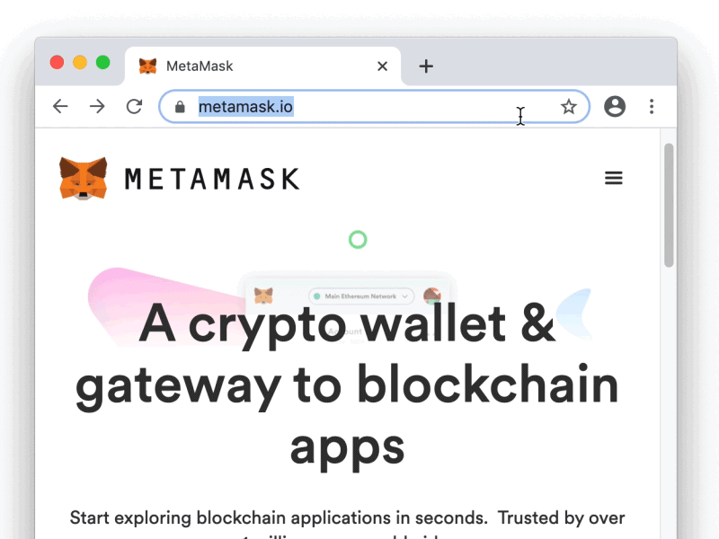

## Add Custom Build to Chrome

* Open `Settings` > `Extensions`.
* Check "Developer mode".
* Alternatively, use the URL `chrome://extensions/` in your address bar
* At the top, click `Load Unpacked Extension`.
* Navigate to your `metamask-plugin/dist/chrome` folder.
* Click `Select`.
* Change to your locale via `chrome://settings/languages`
* Restart the browser and test the plugin in your locale

You now have the plugin, and can click 'inspect views: background plugin' to view its dev console.
