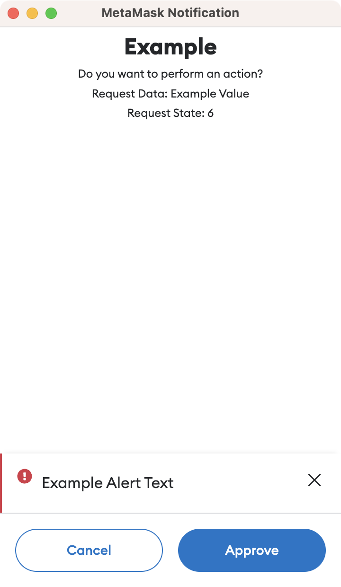

# Adding New Confirmations

## Overview

Given the security focused nature of self-custody, confirmations and approvals form a pivotal aspect of the MetaMask extension.

Confirmations can be triggered by dApps and the UI itself, and are used to approve a variety of operations such as:

- Connecting to dApps
- Giving permissions to dApps
- Sending Eth
- Transfering tokens
- Signing data
- Interacting with Snaps
- Adding Ethereum networks

It is vital any new confirmations are implemented using best practices and consistent patterns, to avoid adding complexity to the code, and to minimise the maintenance cost of many alternate confirmations.

As we try to maintain a clean boundary between the UI and background page, the effort to implement a new confirmation can also be split accordingly.

## Background

### 1. Create Messenger

Ensure the controller or logic requiring a confirmation has access to a controller messenger.

Provide a `messenger` argument in the constructor if using a controller.

Ensure the allowed actions include at least the `ApprovalController:addRequest` action.

If the controller extends `BaseControllerV2`, the property `messagingSystem` is available to access the messenger passed to the base controller. Otherwise, ensure the provided messenger is assigned to a private property.

#### Example

```
this.someController = new SomeController({
    messenger: this.controllerMessenger.getRestricted({
      name: 'SomeController',
      allowedActions: [
        `${this.approvalController.name}:addRequest`,
        `${this.approvalController.name}:acceptRequest`,
        `${this.approvalController.name}:rejectRequest`,
      ],
    }),
    ...
});
```

### 2. Create Approval Request

Send an `addRequest` message to the `ApprovalController` to create an approval request.

This message returns a `Promise` which will resolve if the confirmation is approved, and reject if the confirmation is denied or cancelled.

Use an `async` function to send the message so the logic can `await` the confirmation and code execution can continue once approved. This enables the logic ran after approval to be kept in the same flow and therefore the logic to remain readable and encapsulated.

Ensure suitable error handling is in place to handle the confirmation being cancelled or denied and therefore the `Promise` being rejected.

The available message arguments are:

| Name | Description | Example Value |
| -- | -- | -- |
| opts.id | The ID of the approval request.<br>Assigned to a random value if not provided. | `"f81f5c8a-33bb-4f31-a4e2-52f8b94c393b"` |
| opts.origin | The origin of the request.<br>Either the dApp host or "metamask" if internal. | `"metamask.github.io"` |
| opts.type | An arbitrary string identifying the type of request. | `"eth_signTypedData"` |
| opts.requestData | Additional fixed data for the request.<br>Must be a JSON compatible object.| `{ transactionId: '123' }` |
| opts.requestState | Additional mutable data for the request.<br>Must be a JSON compatible object.<br>Can be updated using the `ApprovalController.updateRequestState` action. | `{ status: 'pending' }` |
| shouldShowRequest | A boolean indicating whether the popup should be displayed. | `true` |

#### Example

```
await this.messagingSystem.call(
  'ApprovalController:addRequest',
  {
    id,
    origin,
    type,
    requestData,
  },
  true,
);
```

### 3. Update Approval Request

If you wish to provide additional state to the confirmation while it is visible, send an `updateRequestState` message to the `ApprovalController`.

This requires you to have provided the `id` when creating the approval request, so it can be passed to the update message.

The available message arguments are:

| Name | Description | Example Value |
| -- | -- | -- |
| opts.id | The ID of the approval request to update. | `"f81f5c8a-33bb-4f31-a4e2-52f8b94c393b"` |
| opts.requestState | The updated mutable data for the request.<br>Must be a JSON compatible object. | `{ status: 'pending' }` |

#### Example

```
await this.messagingSystem.call(
  'ApprovalController:updateRequestState',
  {
    id,
    requestState: { counter },
  },
);
```

## Frontend

### 1. Create Template File

The `ConfirmationPage` component is already configured to display any approval requests generated by the `ApprovalController` and the associated `pendingApprovals` state.

In order to configure how the resulting confirmation is rendered, an **Approval Template** is required.

Create a new JavaScript file in `ui/pages/confirmation/templates` with the name matching the `type` used in the background approval request.

### 2. Update Approval Templates

Add your imported file to the `APPROVAL_TEMPLATES` constant in:
[ui/pages/confirmation/templates/index.js](../ui/pages/confirmation/templates/index.js)

### 3. Define Values

Inside the template file, define a `getValues` function that returns an object with the following properties:

| Name | Description | Example Value |
| -- | -- | -- |
| content | An array of objects defining the components to be rendered in the confirmation.<br>Processed by the [MetaMaskTemplateRenderer](../ui/components/app/metamask-template-renderer/metamask-template-renderer.js).  | See example below. |
| onSubmit | A callback to execute when the user approves the confirmation. | `actions.resolvePendingApproval(...)` |
| onCancel | A callback to execute when the user rejects the confirmation. | `actions.rejectPendingApproval(...)` |
| submitText | Text shown for the accept button. | `t('approveButtonText')` |
| cancelText | Text shown on the reject button. | `t('cancel')` |
| loadingText | Text shown while waiting for the onSubmit callback to complete. | `t('addingCustomNetwork')` |
| networkDisplay | A boolean indicating whether to show the current network at the top of the confirmation. | `true` |

#### Example

```
function getValues(pendingApproval, t, actions, _history) {
  return {
    content: [
      {
        element: 'Typography',
        key: 'title',
        children: 'Example',
        props: {
          variant: TypographyVariant.H3,
          align: 'center',
          fontWeight: 'bold',
          boxProps: {
            margin: [0, 0, 4],
          },
        },
      },
      ...
    ],
    cancelText: t('cancel'),
    submitText: t('approveButtonText'),
    loadingText: t('addingCustomNetwork'),
    onSubmit: () =>
      actions.resolvePendingApproval(
        pendingApproval.id,
        pendingApproval.requestData,
      ),
    onCancel: () =>
      actions.rejectPendingApproval(
        pendingApproval.id,
        ethErrors.provider.userRejectedRequest().serialize(),
      ),
    networkDisplay: true,
  };
}
```

### 4. Define Alerts

If any alerts are required in the confirmation, define the `getAlerts` function in the template file.

This needs to return an array of any required alerts, based on the current pending approval.

Each alert is an object with the following properties:

| Name | Description | Example Value |
| -- | -- | -- |
| id | A unique string to identify the alert.  | `"MISMATCHED_NETWORK_RPC"` |
| severity | The severity of the alert.<br>Use the constants from the design system. | `SEVERITIES.DANGER` |
| content | The component to be rendered inside the alert.<br>Uses the same format as the `content` returned from `getValues`.<br>The component can have nested components via the `children` property. | See example below. |

#### Example

```
function getAlerts(_pendingApproval) {
  return [
    {
      id: 'EXAMPLE_ALERT',
      severity: SEVERITIES.WARNING,
      content: {
        element: 'span',
        children: {
          element: 'MetaMaskTranslation',
          props: {
            translationKey: 'exampleMessage',
          },
        },
      },
    },
  ];
}
```

### 5. Export Functions

Ensure the `getValues` and `getAlerts` functions are exported from the template file.

#### Example

```
const example = {
  getAlerts,
  getValues,
};

export default example;
```

## Example Branch

See [this branch](https://github.com/MetaMask/metamask-extension/compare/develop...example/confirmation) as an example of the full code needed to add a confirmation.

The confirmation can be tested using the [E2E Test dApp](https://metamask.github.io/test-dapp/) and selecting `Request Permissions`.

## Glossary

### ApprovalController

The [ApprovalController](https://github.com/MetaMask/core/blob/main/packages/approval-controller/src/ApprovalController.ts) is a controller defined in the core repository which is responsible for creating and tracking approvals and confirmations in both the MetaMask extension and MetaMask mobile.

The `pendingApprovals` state used by the `ApprovalController` is not currently persisted, meaning any confirmations created by it will not persist after restarting the browser for example.

### ConfirmationPage

The [ConfirmationPage](../ui/pages/confirmation/confirmation.js) is a React component that aims to provide a generic confirmation window which can be configured using templates, each implementing a consistent interface.

This avoids the need for additional React components when creating confirmations, as additional templates with less logic, and less duplication, can be created instead.

## Screenshots

### Confirmation Window

[](assets/confirmation.png)
