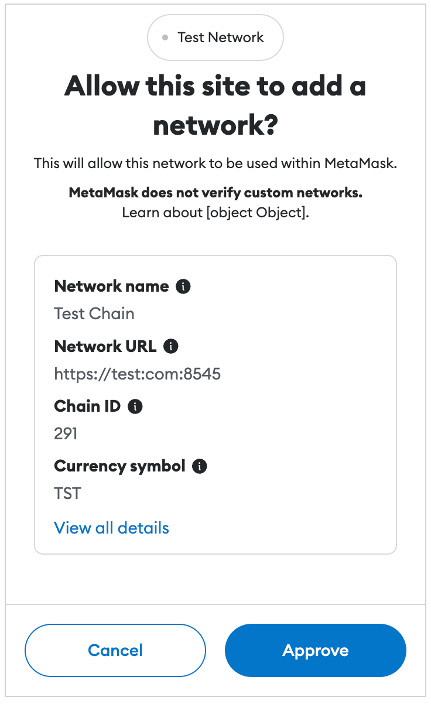
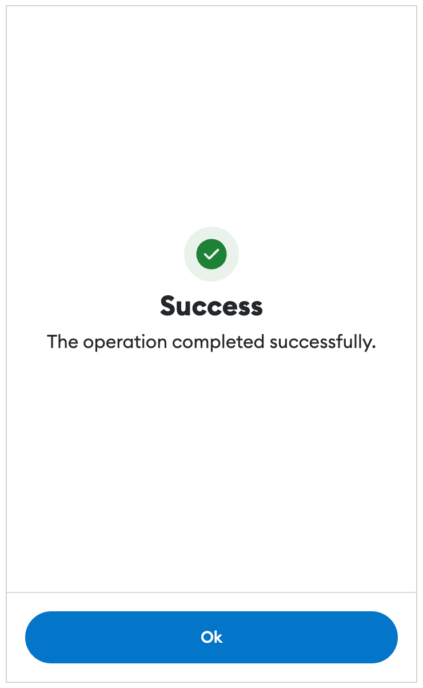
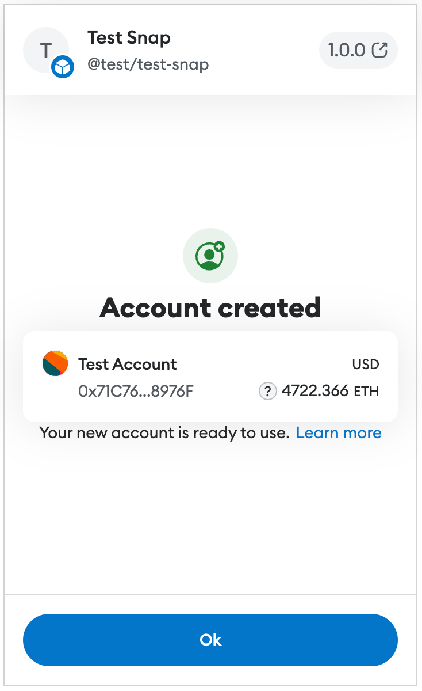

# Adding New Confirmations

## Overview

Given the security focused nature of self-custody, confirmations and approvals form a pivotal aspect of the MetaMask extension.

Confirmations can be triggered by dApps and the UI itself, and are used to approve a variety of operations such as:

- Connecting to dApps
- Giving permissions to dApps
- Sending Eth
- Transferring tokens
- Signing data
- Interacting with Snaps
- Adding Ethereum networks

It is vital any new confirmations are implemented using best practices and consistent patterns, to avoid adding complexity to the code, and to minimize the maintenance cost of many alternate confirmations.

As we try to maintain a clean boundary between the UI and background page, the effort to implement a new confirmation can also be split accordingly.

## Background

### 1. Create Messenger

Ensure the controller or logic requiring a confirmation has access to a controller messenger.

Provide a `messenger` argument in the constructor if using a controller.

Ensure the allowed actions include at least the `ApprovalController:addRequest` action.

If the controller extends `BaseControllerV2`, the property `messagingSystem` is available to access the messenger passed to the base controller. Otherwise, ensure the provided messenger is assigned to a private property.

#### Example

```js
this.someController = new SomeController({
    messenger: this.controllerMessenger.getRestricted({
      name: 'SomeController',
      allowedActions: [
        `${this.approvalController.name}:addRequest`,
        `${this.approvalController.name}:acceptRequest`,
        `${this.approvalController.name}:rejectRequest`,
      ],
    }),
    ...
});
```

### 2. Create Approval Request

Send an `addRequest` message to the `ApprovalController` to create an approval request.

This message returns a `Promise` which will resolve if the confirmation is approved, and reject if the confirmation is denied or cancelled.

Use an `async` function to send the message so the logic can `await` the confirmation and code execution can continue once approved. This enables the logic ran after approval to be kept in the same flow and therefore the logic to remain readable and encapsulated.

Ensure suitable error handling is in place to handle the confirmation being cancelled or denied and therefore the `Promise` being rejected.

The available message arguments are:

| Name | Description | Example Value |
| -- | -- | -- |
| opts.id | The ID of the approval request.<br>Assigned to a random value if not provided. | `"f81f5c8a-33bb-4f31-a4e2-52f8b94c393b"` |
| opts.origin | The origin of the request.<br>Either the dApp host or "metamask" if internal. | `"metamask.github.io"` |
| opts.type | An arbitrary string identifying the type of request. | `"eth_signTypedData"` |
| opts.requestData | Additional fixed data for the request.<br>Must be a JSON compatible object.| `{ transactionId: '123' }` |
| opts.requestState | Additional mutable data for the request.<br>Must be a JSON compatible object.<br>Can be updated using the `ApprovalController.updateRequestState` action. | `{ status: 'pending' }` |
| shouldShowRequest | A boolean indicating whether the popup should be displayed. | `true` |

#### Example

```js
await this.messagingSystem.call(
  'ApprovalController:addRequest',
  {
    id,
    origin,
    type,
    requestData,
  },
  true,
);
```

### 3. Update Approval Request

If you wish to provide additional state to the confirmation while it is visible, send an `updateRequestState` message to the `ApprovalController`.

This requires you to have provided the `id` when creating the approval request, so it can be passed to the update message.

The available message arguments are:

| Name | Description | Example Value |
| -- | -- | -- |
| opts.id | The ID of the approval request to update. | `"f81f5c8a-33bb-4f31-a4e2-52f8b94c393b"` |
| opts.requestState | The updated mutable data for the request.<br>Must be a JSON compatible object. | `{ status: 'pending' }` |

#### Example

```js
await this.messagingSystem.call(
  'ApprovalController:updateRequestState',
  {
    id,
    requestState: { counter },
  },
);
```

## Frontend

### 1. Create Template File

The `ConfirmationPage` component is already configured to display any approval requests generated by the `ApprovalController` and the associated `pendingApprovals` state.

In order to configure how the resulting confirmation is rendered, an **Approval Template** is required.

Create a new JavaScript file in `ui/pages/confirmations/confirmation/templates` with the name matching the `type` used in the background approval request.

### 2. Update Approval Templates

Add your imported file to the `APPROVAL_TEMPLATES` constant in:
[ui/pages/confirmation/templates/index.js](../ui/pages/confirmations/confirmation/templates/index.js)

### 3. Define Values

Inside the template file, define a `getValues` function that returns an object with the following properties:

| Name | Description | Example Value |
| -- | -- | -- |
| content | An array of objects defining the components to be rendered in the confirmation.<br>Processed by the [MetaMaskTemplateRenderer](../ui/components/app/metamask-template-renderer/metamask-template-renderer.js).  | See example below. |
| onSubmit | A callback to execute when the user approves the confirmation. | `actions.resolvePendingApproval(...)` |
| onCancel | A callback to execute when the user rejects the confirmation. | `actions.rejectPendingApproval(...)` |
| submitText | Text shown for the accept button. | `t('approveButtonText')` |
| cancelText | Text shown on the reject button. | `t('cancel')` |
| loadingText | Text shown while waiting for the onSubmit callback to complete. | `t('addingCustomNetwork')` |
| networkDisplay | A boolean indicating whether to show the current network at the top of the confirmation. | `true` |

#### Example

```js
function getValues(pendingApproval, t, actions, _history) {
  return {
    content: [
      {
        element: 'Typography',
        key: 'title',
        children: 'Example',
        props: {
          variant: TypographyVariant.H3,
          align: 'center',
          fontWeight: 'bold',
          boxProps: {
            margin: [0, 0, 4],
          },
        },
      },
      ...
    ],
    cancelText: t('cancel'),
    submitText: t('approveButtonText'),
    loadingText: t('addingCustomNetwork'),
    onSubmit: () =>
      actions.resolvePendingApproval(
        pendingApproval.id,
        pendingApproval.requestData,
      ),
    onCancel: () =>
      actions.rejectPendingApproval(
        pendingApproval.id,
        ethErrors.provider.userRejectedRequest().serialize(),
      ),
    networkDisplay: true,
  };
}
```

#### 3.1 Create React Component

Unless the component is very simple as in the example above, we recommend creating a standard React component for the content of each approval template so it can be more easily maintained, extended, and tested.

Any new components will need to be added to the [safe component list](../ui/components/app/metamask-template-renderer/safe-component-list.js) which defines the list of components that can be used by the [MetaMaskTemplateRenderer](../ui/components/app/metamask-template-renderer/metamask-template-renderer.js).

##### Example

```js
content: [
  {
    element: 'ExampleApprovalContent',
    key: 'content',
    props: {
      exampleBooleanProperty: true,
      exampleNumberProperty: 123,
      exampleStringProperty: 'example'
    },
  },
]
```

### 4. Define Alerts

If any alerts are required in the confirmation, define the `getAlerts` function in the template file.

This needs to return an array of any required alerts, based on the current pending approval.

Each alert is an object with the following properties:

| Name | Description | Example Value |
| -- | -- | -- |
| id | A unique string to identify the alert.  | `"MISMATCHED_NETWORK_RPC"` |
| severity | The severity of the alert.<br>Use the constants from the design system. | `SEVERITIES.DANGER` |
| content | The component to be rendered inside the alert.<br>Uses the same format as the `content` returned from `getValues`.<br>The component can have nested components via the `children` property. | See example below. |

#### Example

```js
function getAlerts(_pendingApproval) {
  return [
    {
      id: 'EXAMPLE_ALERT',
      severity: SEVERITIES.WARNING,
      content: {
        element: 'span',
        children: {
          element: 'MetaMaskTranslation',
          props: {
            translationKey: 'exampleMessage',
          },
        },
      },
    },
  ];
}
```

### 5. Export Functions

Ensure the `getValues` and `getAlerts` functions are exported from the template file.

### Example

For live examples of the current approval templates, see [storybook](https://metamask.github.io/metamask-storybook/index.html?path=/docs/pages-confirmationpage-addethereumchain--docs) and the entries under the `ConfirmationPage` folder.

#### Example

```js
const example = {
  getAlerts,
  getValues,
};

export default example;
```

## Approval Flows

### Overview

When an approval request is created, the extension popup is shown and a suitable approval is displayed.

When this approval request is approved or rejected, the standard behavior is for the extension popup to be automatically closed.

In some scenarios, multiple sequential approvals are needed such as when adding a new network, and then being prompted to switch to the new network.

Depending on the work done between the approvals and the latency of the state updates from the background page to the extension, this can result in poor UX due to the notification window repeatedly being closed and opened again or even "flashing" if the interval is very small.

Approval flows are a mechanism to avoid this by ensuring the extension popup is not closed until the final approval in the sequence has been approved or rejected.

### Usage

#### 1. Start Flow

Before creating the first approval, call the `ApprovalController.startFlow` method or send a `ApprovalController:startFlow` action using the controller messenger.

This supports the following parameters:

| Name | Description | Example Value |
| -- | -- | -- |
| id | An optional string to identify the flow.<br>Generated automatically if not specified.  | `"550e8400-e29b-41d4-a716-446655440000"` |
| loadingText | The text to display on the loading page between approvals. | `"Processing something..."` |

#### 2. Create Approval Requests

Create sequential approval requests as normal using the above instructions.

While the an approval request has been approved or rejected but no subsequent approval request has been created, a loading page is automatically displayed containing a spinner.

This has no text by default, but can be specified using the `loadingText` option above, or by calling the `setFlowLoadingText` method or messenger action.

#### 3. End Flow

Once all approval requests have been processed, the flow must be ended using the `endFlow` method or messenger action while providing the approval flow ID returned by `startFlow`.

This will close the popup as normal.

We recommend the use of a `try finally` block to ensure the flow is ended even if an error is thrown.

In rare scenarios where an approval flow is initialized within another approval flow, the popup will remain open until the parent approval flow has been ended.

#### Example

For an example usage, see the [add network middleware](../app/scripts/lib/rpc-method-middleware/handlers/add-ethereum-chain.js) and the call to `startApprovalFlow`.

## Result Pages

### Overview

Many types of approvals are not needed before a process is executed, but instead aim to provide a simple status page to display a success or error message after a process has completed.

The standardized result pages exist to simplify the creation of these types of approvals, and to avoid many very similar approval templates with the same intent.

### Usage

A default success or error message can be displayed simply by calling the `ApprovalController.success` or `ApprovalController.error` methods, or using the `showSuccess` or `showError` messenger actions.

No options are required but both success and error approvals can be configured with the following:

| Name | Description | Example Value |
| -- | -- | -- |
| error | The text of the error message in the center of the window.<br>Also supports templates.<br>Used only by the `error` method. | See example below. |
| header | The text or template to optionally display above the message at the top of the window. | See example below. |
| icon | The name of the icon to display above the message.<br>Can be hidden with `null`. | `"confirmation"` |
| message | The text of message in the center of the window.<br>Also supports templates.<br>Used only by the `success` method. | See example below. |
| title | The title text in the center of the page.<br>Can be hidden with `null`. | `"Success"`

#### Example

```js
await this.messagingSystem.call(
  'ApprovalController:showSuccess',
  {
    title: 'Example Success',
    icon: IconName.UserCircleAdd,
    header: [
      {
        name: 'ExampleHeaderComponent',
        key: 'exampleHeader',
        properties: { exampleProperty: 'exampleValue' },
      },
    ],
    message: [
      {
        name: 'ExampleMessageComponent',
        key: 'exampleMessage',
        properties: { exampleProperty: 'exampleValue' },
      },
    ]
  }
);
```

For live examples, see [storybook](https://metamask.github.io/metamask-storybook/index.html?path=/docs/pages-confirmationpage-resultsuccess--docs).

## Glossary

### ApprovalController

The [ApprovalController](https://github.com/MetaMask/core/blob/main/packages/approval-controller/src/ApprovalController.ts) is a controller defined in the core repository which is responsible for creating and tracking approvals and confirmations in both the MetaMask extension and MetaMask mobile.

The `pendingApprovals` state used by the `ApprovalController` is not currently persisted, meaning any confirmations created by it will not persist after restarting the browser for example.

### Approval Request

A standardized object added to the state by the `ApprovalController` that contains details about an instance of approval such as the `type` and any associated `requestData`.

The UI will automatically display a suitable approval when an approval request is detected in the state.

### Approval Template

A standardized JavaScript object specifying the content and details of a type of approval.

Used by the `ConfirmationPage` React component to automatically show the approval if an `ApprovalRequest` is detected in the state with a matching type

### ConfirmationPage

The [ConfirmationPage](../ui/pages/confirmations/confirmation/confirmation.js) is a React component that aims to provide a generic confirmation window which can be configured using templates, each implementing a consistent interface.

This avoids the need for custom routing logic for each confirmation type, and reduces duplicate code across the approvals.

### MetaMaskTemplateRenderer

A React component that is able to render dynamic child components using a JSON format that includes a hierarchy of the components and properties needed.

This is useful for dynamically rendering UI from backend code from controllers and snaps..

### Approval Flow

A mechanism to prevent the popup closing until multiple sequential approvals have been approved or rejected.

When an approval flow is created, this is reflected in the state and the UI will automatically prevent the popup being closed.

## Screenshots

### Approval Template

[](assets/confirmation.png)

### Success Approval

[](assets/confirmation.png)

### Custom Success Approval

[](assets/confirmation.png)