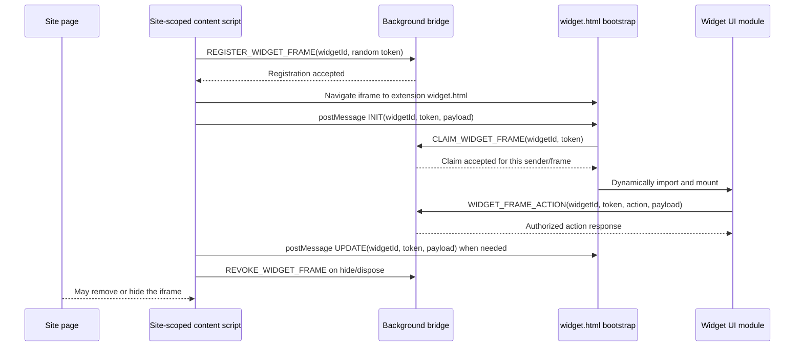

# Security and communication protocol

The widget page is an extension-origin iframe. Its HTML starts with an empty
`#root` and the generic bootstrap; feature code loads only after a background
claim. The website can place, hide, remove, or try to frame the page, but it
cannot read or execute code in the extension-origin document through ordinary
same-origin DOM access. The authorization flow decides whether a particular
frame may use widget actions.

## One instance, end to end

The site page is shown as a participant because it controls the surrounding
DOM. It is not a participant in the extension's registration or claim messages.
The host's `postMessage` target is the exact extension origin; the message does
not put a token or widget ID in the frame URL.

## Control plane

1. [`createWidgetFrame`](../../app/scripts/widgets/host.ts) generates a
   32-byte random token for each `show` call. The site-scoped content script
   registers the widget ID and token with the background before setting the
   frame's `src` to `widget.html`.
2. On frame load, the host sends `METAMASK_WIDGET_INIT` with the token, widget
   ID, and payload. The
   [bootstrap](../../app/scripts/widgets/widget-bootstrap.ts) accepts it only
   from its parent, from an origin allowed for that widget ID, with a token in
   the expected format. It attempts one claim.
3. The [background authorization](../../app/scripts/widgets/authorization.ts)
   checks that registration came from the extension's top-frame content script
   on an allowed origin and that the claimant is a subframe at the exact
   extension `widget.html` URL in the same tab. It checks the tab's current
   origin, and binds the claim to the frame ID and, where provided by the
   browser, the document ID. A token can be claimed once.
4. Only after a successful claim does the bootstrap dynamically import the
   selected widget module. The widget module receives `payload: unknown` and
   must validate it before rendering or using it.

Registrations not claimed within 15 seconds expire. The authorization map
allows at most 32 live sessions per tab. A host `hide` or `dispose` revokes its
session; tab removal clears that tab's sessions. Each visible instance has its
own token, so multiple widgets can coexist on a site. The 32-session cap is a
memory bound, not a request budget for feature-specific data fetches.

## Data plane

[`sendWidgetAction`](../../app/scripts/widgets/frame-runtime.ts) sends
`WIDGET_FRAME_ACTION` with the widget ID, token, action name, and payload. The
single [background bridge](../../app/scripts/widgets/background.ts) checks
that the feature is enabled, the action name is explicitly present in that
widget's definition, and the sender matches the claimed frame and document.
It then calls the feature's handler. There is no general purpose proxy from a
frame to background APIs.

Widget authors must validate action payloads in their handlers, including
types, lengths, identifiers, and any user-state prerequisites. Validate data
returned to the frame before using it as well. A content script or site may
choose the initial payload; its presence in an authorized frame does not make
it trusted. Keep expensive data operations bounded separately: the framework
does not add a per-action rate limit, fetch concurrency cap, or cache.

The host may send `METAMASK_WIDGET_UPDATE` for feature-specific live state.
The bootstrap checks the active widget ID, token, parent, and origin before
passing the unknown payload to the widget. It retains the latest update during
the claim and module load, so the widget can subscribe when it mounts. The
widget must validate the update before using it. Cashtag uses this for X's
theme; theme is not a framework field.

## Message reference

| Message                          | Transport and sender                                                     | Receiver and validation                                                                |
| -------------------------------- | ------------------------------------------------------------------------ | -------------------------------------------------------------------------------------- |
| `METAMASK_REGISTER_WIDGET_FRAME` | Content script to extension runtime                                      | Background checks top-frame sender, allowed site origin, widget ID, and token.         |
| `METAMASK_WIDGET_INIT`           | Content script to iframe via `postMessage` with extension `targetOrigin` | Bootstrap checks parent source, allowed sender origin, ID, and token format.           |
| `METAMASK_CLAIM_WIDGET_FRAME`    | Widget bootstrap to extension runtime                                    | Background checks exact frame URL, tab and site origin, unused token, and expiry.      |
| `METAMASK_WIDGET_FRAME_ACTION`   | Claimed widget UI to extension runtime                                   | Background checks claimed frame/document, enabled state, and named action.             |
| `METAMASK_WIDGET_UPDATE`         | Content script to iframe via `postMessage`                               | Bootstrap checks the matching session and origin; widget validates the update payload. |
| `METAMASK_REVOKE_WIDGET_FRAME`   | Content script to extension runtime                                      | Background checks the registered parent tab, origin, and document when available.      |

The message names and shapes live in
[`protocol.ts`](../../app/scripts/widgets/protocol.ts) and
[`messages.ts`](../../shared/constants/messages.ts). Widgets add action names
and handlers to their own definition; they do not add another generic runtime
listener.

## Browser and site boundaries

MV3's `web_accessible_resources.matches` limits which sites can load
`widget.html`. MV2 exposes the named WAR page more broadly. In both cases, a
directly opened or site-created frame stays blank without a valid background
registration and claim. `frame-ancestors` permits listed sites to embed
extension pages, but is set at the extension-page policy level; review changes
to it as platform security changes. See [platform wiring](./platform.md) for
the exact manifest locations.

The embedding site can send messages to a frame, manipulate the outer iframe
element, and deny or remove the UI. It may also adopt a `frame-src` CSP that
prevents the extension URL from loading. Neither Shadow DOM nor a nested shadow
root is used as a trust boundary here. The iframe's extension origin protects
its internal DOM and React handlers from normal page-script access. Authorization
still matters because a web-accessible page can be opened or embedded by
parties other than the intended content script.

## Review and verification

- Add colocated tests for every new payload validator, feature action, and
  permission condition. Existing widget authorization and bridge tests cover
  sender and token checks; extend them if the protocol changes.
- Check both built manifests and `widget.html` after MV3 and MV2 test builds.
  Verify the site's content-script match, MV3 WAR match, and `frame-ancestors`
  entries, plus the lazy widget bundle and LavaMoat build.
- In a browser, verify an intended frame renders, a second instance gets an
  independent session, and a directly embedded `widget.html` remains blank.
  Also verify cleanup when the host removes a widget or navigates away.

For a concrete implementation, follow the [MVP](./mvp.md).
