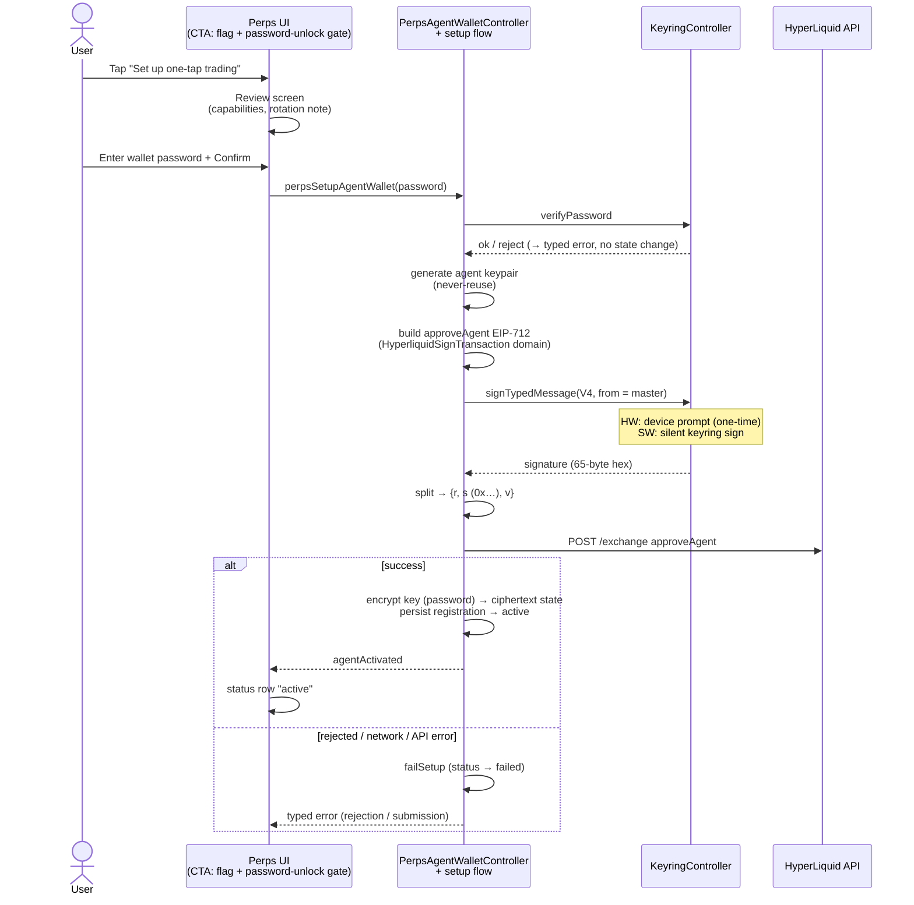
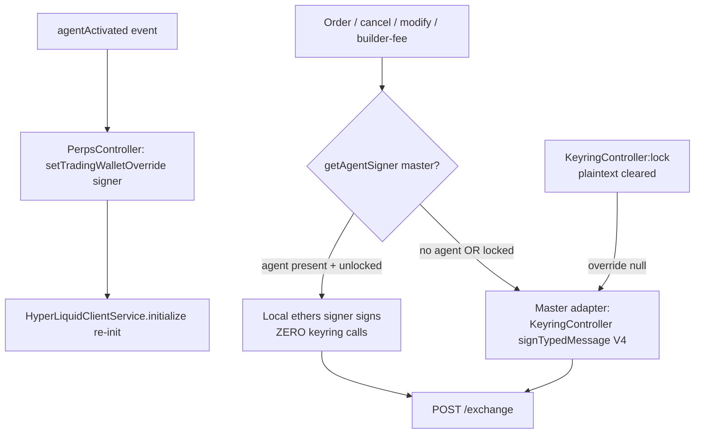

# Deep Dive: Perps on Hardware Wallets — What Needs to Change

**Status:** Investigation deliverable (gap analysis; no product code changed)
**Date:** 2026-09-01
**Scope:** (1) the perps deposit flow, (2) "agent wallet" usage — i.e. how the
perps feature signs HyperLiquid exchange actions — for hardware wallet accounts
(Ledger, Trezor, OneKey, Lattice, QR).

> Research state and citations are preserved in
> `.slim/deepwork/perps-hw-wallet-support.md` (session log). All `file:line`
> references below point at this repository (including
> `node_modules/@metamask/perps-controller/dist` for the controller package).

---

## 1. Executive summary

- **There is no keyring-level blocker.** Every hardware keyring family in the
  extension can sign the exact shapes perps requires: plain EIP-1559/EIP-155
  transactions (deposit) and EIP-712 **V4** typed data (all HyperLiquid
  exchange actions). Ledger is V4-only — perps only ever requests V4.
- **Perps has no separate agent wallet.** All HyperLiquid signing is performed
  by the **user's currently selected account key** via a direct background
  call to `KeyringController:signTypedMessage`. The word "agent" appears only
  in the EIP-712 primary type (`Agent`) of HyperLiquid's L1-action signature
  envelope. (The MetaMask "Agent Wallet" CLI/notifications feature is
  unrelated: `ui/helpers/constants/routes.ts:145-146,694-695`,
  `app/_locales/en/messages.json:6376-6381`.)
- **The deposit flow is blocked by policy, not capability.** A single,
  unconditional, blocking alert (`usePayHardwareAccountAlert`) fires for any
  hardware account on `perpsDeposit`, making deposits impossible. (The same
  alert list also names `perpsWithdraw`, but that case only guards pay/MUSD
  display paths — real HyperLiquid withdrawals are L1 actions with no EVM
  transaction; their actual HW gate is the signing gap below.) The underlying
  deposit transaction — one USDC `transfer()` to the HyperLiquid bridge on
  Arbitrum — is natively signable by every HW keyring.
- **The central UX/security gap (per Gate-1 review): all HyperLiquid action
  signing bypasses MetaMask's confirmation system.** PerpsController calls the
  low-level `KeyringController:signTypedMessage` directly from the background,
  so **no confirmation screen, no hardware footer preflight
  (`ensureDeviceReady`), and no blind-signing guidance ever appears** — for any
  account type. Hardware users are dropped into a raw device prompt showing an
  **undecodable 32-byte hash** (`connectionId`).
- Supporting perps on HW is therefore mostly a **product-layer** change:
  lift/condition the deposit block, route HL action signing through a surfaced
  confirmation (with human-readable action content), add device-readiness and
  Ledger blind-signing guidance, and budget signing latency (nonce/
  `expiresAfter`) for device round-trips.

- **Decision: adopt a single-path agent-wallet architecture.** If an approved
  HyperLiquid agent (API wallet) key exists for the current account, all
  order/builder-fee actions are signed by that agent key with no user
  interaction; otherwise the master (current wallet) signs — identical logic
  for hardware and software accounts, no wallet-type branches. Hardware
  friction drops to one device signature at setup. See §5.

---

## 2. How perps works today

### 2.1 Deposit flow (`perpsDeposit`)

| Step | What happens | Where |
|---|---|---|
| 1 | User taps Add funds / deposit CTA in perps UI (`perps-view.tsx:90,469`, `perps-order-entry-page.tsx:352-353`) | UI |
| 2 | Hook ensures **Arbitrum One** network exists (always Arbitrum — even in perps-testnet mode) | `usePerpsNetworkManagement.ts:14-42` |
| 3 | `createPerpsDepositTransaction({})` → background `perpsDepositWithConfirmation` | `createPerpsDepositTransaction.ts:18-33`, `perps-controller-init.ts:426-435` |
| 4 | `PerpsController.depositWithConfirmation` → `DepositService.prepareTransaction` | `PerpsController.cjs:1232-1453`, `DepositService.cjs:55-95` |
| 5 | Tx constructed: ERC-20 `transfer(bridge, 0x0)` — **native USDC** `0xaf88d065e77c8cC2239327C5EDb3A432268e5831` on chain `0xa4b1` (42161), recipient = HL bridge `0x2df1c51e09aecf9cacb7bc98cb1742757f163df7` (mainnet) / `0x08cfc1B6b2dCF36A1480b99353A354AA8AC56f89` (testnet). **No approve step exists.** Fixed gas 100 000; `skipInitialGasEstimate: true`; `isInternal: true` | `hyperLiquidConfig.cjs:39,66-75,167-168`, `DepositService.cjs:73-83`, `PerpsController.cjs:1266-1270` |
| 6 | `TransactionController:addTransaction` (type `perpsDeposit`) → user lands on the **CustomAmount confirmation screen**; typed amount is debounced into the calldata (`0xa9059cbb…`) | `PerpsController.cjs:1294-1297`, `useTransactionCustomAmount.ts:224` |
| 7 | Funding source chosen in the confirmation **Pay flow** (`TransactionPayController`): can fund Arbitrum-USDC from other chains/tokens via relay/across/server/fiat strategies | `ui/pages/confirmations/constants/pay.ts:5-13`, `transaction-pay-controller/dist/strategy/server/perps.cjs:14-38` |
| 8 | Completion tracked via `depositRequests` state + `PerpsDepositToast` (`selectPerpsDepositPending`) + HL WebSocket balance stream. No polling | `PerpsController.cjs:1245-1256`, `ui/selectors/perps-controller.ts:88-132` |

`perpsDepositAndOrder` is an **unused reserved/mobile path** (same single
transfer tx; no order is placed by it; zero call sites in the extension).

### 2.2 Withdraw flow

Withdrawal is **not an EVM transaction**: `perps-withdraw-page.tsx:417-420` →
`PerpsController.withdraw` → `HyperLiquidProvider.withdraw`
(`HyperLiquidProvider.cjs:3607+`) → `ensureUnifiedAccountEnabled` (may first
prompt the **unified-account migration** signature) → HyperLiquid **L1 action**
`withdraw3` signed via `KeyringController:signTypedMessage` (V4).

### 2.3 Trading actions ("agent wallet" usage)

- Signer: `HyperLiquidWalletService.createWalletAdapter()` — address = fresh
  selected account, signing = `KeyringController:signTypedMessage(msgParams,
  'V4')` (`HyperLiquidWalletService.cjs:72-110,174-185`), gated only on
  keyring unlock (`KEYRING_LOCKED` retry).
- Messenger grants: exactly `KeyringController:getState` +
  `KeyringController:signTypedMessage` (`perps-controller-messenger.ts:38-39,86-87`).
- Two signature envelopes (SDK `@nktkas/hyperliquid`):
  - **L1 actions** — orders (5 call sites), cancels, modifies, TWAP,
    updateLeverage, updateIsolatedMargin, setReferrer, agentSetAbstraction:
    hash = `keccak256(msgpack(action) ‖ nonce ‖ vault ‖ expires)`; signed as
    EIP-712 domain `{name:"Exchange", version:"1", chainId:1337,
    verifyingContract:0x0}`, primaryType **`Agent`**, message
    `{source:"a"|"b", connectionId:<action hash>}`
    (`esm/signing/_l1.js:21-52,118-149`).
  - **User-signed actions** — unified-account migration (`userSetAbstraction`),
    `approveBuilderFee`, `sendAsset`, `withdraw3`: EIP-712 domain
    `{name:"HyperliquidSignTransaction", version:"1",
    chainId:<signatureChainId e.g. 0xa4b1>}` (`_userSigned.js:70-88`).
- Multi-sig HL accounts: probed via `userToMultiSigSigners`; multi-sig users
  skip the migration and fall back to programmatic collateral transfer
  (`HyperLiquidProvider.cjs:4841-4872,5011-5033`).
- **No API/agent wallet is created, stored, or rotated** anywhere in the
  extension (zero `approveAgent`/`createAgent` usage; no key material in
  state). HyperLiquid-side, "API wallets (agent wallets)" are signer-only
  delegates approved by a master account (HL docs, *Nonces and API wallets*).
- HW-awareness already native in controller v12: `HARDWARE_KEYRING_TYPES`
  (all 5 families), `isSelectedHardwareWallet()`, and init-time
  `allowUserSigning:false` deferral so HW users are not prompted while merely
  browsing (`HyperLiquidWalletService.cjs:22-28,57-65`,
  `HyperLiquidProvider.cjs:5209-5216`), plus `TradingReadinessCache` to
  prevent prompt spam across provider re-creation. (The
  `.yarn/patches/*perps-controller*6.0.0*` patch is stale — installed package
  is 12.0.0 with no `patchedDependencies` entry.)

### 2.4 The confirmation bypass (Gate-1 central finding)

`KeyringController:signTypedMessage` is the **low-level** keyring API. The
normal, dapp-facing path runs through `SignatureController` approval →
confirmation UI → keyring. Perps skips SignatureController and calls the
keyring directly from the background
(`KeyringController.cjs:811-839` is the low-level method; perps grant at
`perps-controller-messenger.ts:86-87`). Consequences:

- No MetaMask signature confirmation screen for any HL action, for any
  account type (software-wallet users sign silently — intentional for trading
  latency, presumably).
- The HW confirmation machinery never engages: the hardware footer preflight
  `ensureDeviceReady` (Ledger app-open + blind-signing checks,
  `useHardwareFooter.ts:109-115,171-193`; consumed by confirmations
  `footer.tsx:369-395`) only runs inside the confirmations flow. Perps UI has
  zero HW-context references.
- The device therefore displays an **opaque bytes32 `connectionId` inside a
  fake-chainId (1337) EIP-712 envelope** with no MetaMask-side context, no
  action summary, and no blind-signing guidance.

---

## 3. Hardware wallet capability vs perps requirements

| Requirement | Ledger | Trezor / OneKey | QR (Keystone et al.) | Lattice |
|---|---|---|---|---|
| EVM tx signing (deposit transfer) | ✅ | ✅ | ✅ | ✅ |
| EIP-712 **V4** (all HL actions) | ✅ V4-only (`ledger-keyring.cjs:327-374`) | ✅ `metamask_v4_compat:true` (`trezor-keyring.cjs:265-315`; model-1 signs hashes blindly) | ✅ v4-equivalent (`qr-keyring.cjs:271-275`) | ✅ (EIP-712 display limits not verified in code) |
| Extra conditions | **Blind signing** (`arbitraryDataEnabled`) required for contract data/signatures (`LedgerAdapter.ts:190-217`); ETH app open; preview DMK keyring build | HD-path allowlist; op timeout | Camera round-trip at sign time; no preflight | offscreen wrapper |
| `eth_sign` (raw hash) | ❌ not wired for **any** account — irrelevant, perps never uses it | ❌ | ❌ | ❌ |

**Conclusion:** every perps signing operation is *possible* on all five HW
families; nothing requires raw-hash signing, key export, or EIP-7702 (HW is
already excluded from 7702/gasless paths and perps doesn't use them:
`shared/constants/keyring.ts:36-39`, `useIsGaslessSupported.ts:33-77`).

---

## 4. Gap analysis

### Part 1 — Deposit flow on HW

| # | Gap | Evidence | Impact |
|---|---|---|---|
| D1 | **Hard block:** blocking Danger alert for HW accounts — **unconditional** (not tied to pay-with token selection; only `musdConversion` is flag-gated). For `perpsDeposit` this blocks the real deposit confirmation. The `perpsWithdraw` entry only guards pay/MUSD display paths (real HL withdrawal is an L1 action — its gate is T1, not this alert) | `usePayHardwareAccountAlert.ts:17-24,30-82` (`isBlocking:true`) | HW users cannot deposit at all today |
| D2 | Pay-layer funding routes unassessed for HW: `TransactionPayController` relay/across/server/fiat strategies fund the deposit from other chains; HW eligibility of each strategy is not uniformly defined (HW is excluded from 7702 relay paths elsewhere) | `pay.ts:5-13`, `strategy/server/perps.cjs`, `useAutomaticTransactionPayToken.ts:327-329` | Funding a deposit from non-Arbitrum assets may silently restrict or break for HW |
| D3 | Fixed 100k gas + `skipInitialGasEstimate` + amount rewritten into calldata at confirm time: HW confirm flow must re-check device readiness after the CustomAmount edit, and gas-fixed txs can fail on HW-ledger quirks seen elsewhere (`0x6a80` padding errors, `shared/constants/hardware-wallets.ts:181-186`) | `DepositService.cjs:23,82`; `useTransactionCustomAmount.ts:224` | Edge-case confirm failures |
| D4 | No perps deposit E2E for HW (existing HW E2E covers send/swap/personal-sign only) | `test/e2e/tests/hardware-wallets/ledger/` | Regression risk once unblocked |

The deposit transaction itself (single USDC transfer) is HW-signable as-is;
**D1 is pure policy** and is the only thing making deposits impossible.

### Part 2 — Trading / "agent wallet" usage on HW

| # | Gap | Evidence | Impact |
|---|---|---|---|
| T1 | **Confirmation bypass** (§2.4): no surfaced approval, no action summary, no HW footer preflight (`ensureDeviceReady`) before device signing | `perps-controller-messenger.ts:86-87`, `useHardwareFooter.ts:102-105,171-193` | Central UX/security gap: user approves an opaque hash with zero context; no blind-signing gate; inconsistent with every other MetaMask signing surface |
| T2 | Undecodable payload on device: EIP-712 `Agent {source, connectionId(bytes32)}`, fake `chainId: 1337` domain; devices cannot render what the action is | `_l1.js:118-149` | Users cannot verify what they sign (blind trust); likely support burden |
| T3 | Ledger **blind signing** must be enabled for typed-data signing with data; nothing detects/guides this in perps (the generic confirmations flow does) | `LedgerAdapter.ts:190-217`, `useHardwareFooter.ts:109-115` | Cryptic device errors; users stuck |
| T4 | **Per-action device approval**: every order/cancel/modify/TWAP/leverage/margin action = one device round-trip; caches only prevent *repeats* of setup signatures | Lane-1b call-site inventory; `TradingReadinessCache.cjs:1-40` | Trading on HW is high-friction; cancels become latency-critical |
| T5 | Timing budget: nonce is current-timestamp-ms; actions may set `expiresAfter`; HL rejects nonces outside `(T−2d, T+1d)` — device round-trips + retries (wrong PIN, blind-signing toggle) must fit | HL docs (Nonces; Exchange endpoint `expiresAfter`); `_l1.js:21-52` | Stale-action rejections after slow device flows |
| T6 | `KEYRING_LOCKED` / account-switch mid-flow re-arms device prompts and can strand readiness caches in retry state | `HyperLiquidProvider.cjs:5083-5090,5228-5234` | Confusing repeated prompts |
| T7 | One-time setup writes still prompt on first action: unified-account migration (`userSetAbstraction`), `approveBuilderFee`, `setReferrer` | `HyperLiquidProvider.cjs:5051-5058,6134-6137,8260+` | First-trade surprise multi-prompt sequences on device |
| T8 | QR/Lattice edge cases unverified: QR keyring drops the version arg; Lattice EIP-712 display limits; device message-size limits unknown | Lane-1c "could not verify" list | Unknown-unknowns for those families |

---

## 5. What needs to change

### Implementation status (branch `feat/perps-agent-wallet`, September 2026)

Implemented on branch `feat/perps-agent-wallet` in this repo, with the
matching `@metamask/perps-controller` source changes on a
`feat/perps-agent-wallet` branch in the core repo (consumed via a `file:`
dependency) — see the
[implementation plan](./superpowers/plans/2026-09-01-perps-agent-wallet-hw-support.md):

- **WS-1** agent key management — `PerpsAgentWalletController`: fresh keypair
  per setup, password-encrypted per-account storage, unlock/lock lifecycle,
  registration metadata in persisted state (no key material).
- **WS-2** single-path signing — core `getAgentSigner` /
  trading-wallet-override seam; agent signs while active, master keyring path
  otherwise; override resets on lock.
- **WS-3** setup flow — extension-side, surfaced `approveAgent` review before
  the one-time master signature, behind a remote feature flag.
- **WS-4** hardware-wallet deposits unblocked (perps entries removed from the
  hardware-pay confirmation alert).
- **WS-7 (partial)** remote flag + rollout metrics: setup
  started/completed/failed and agent-signed action count (the action counter
  covers every agent-mode signature — orders, cancels, modifies).

Remaining follow-ups: **WS-5** (master-fallback & withdrawal confirmations +
HW `ensureDeviceReady` preflight), **WS-6** (rotation, expiry & revocation
UI), and WS-7's security review plus E2E coverage.

### 5.1 Chosen architecture: single-path agent-wallet design

**Rule (all wallet types, no hardware/software branches):** when initializing
perps for the current account, if an approved HyperLiquid agent (API wallet)
key exists in secure storage for that account → initialize the exchange
client with an **agent** wallet; otherwise initialize with the **master**
(current wallet) adapter — today's behavior. Orders and builder-fee approvals
signed by the agent require no user interaction; master-signed actions keep
the current flow (device prompt on HW).

**Setup flow (opt-in, offered to every account type):** generate an ephemeral
agent keypair → user signs HyperLiquid `approveAgent({agentAddress,
agentName})` **once** with the master key (a normal L1-action signature — on
hardware this is the only device signature the design ever requires for
trading) → verify registration via the info endpoint → store the agent key
(keyed by account id) → re-initialize the exchange client with the agent
wallet. Users who never set up an agent keep using master signing; nothing is
blocked.

**Agent-key storage lifecycle (extension):** passworder-encrypted ciphertext in
`PerpsAgentWalletController` state (never state-logged); plaintext exists only
in memory while the wallet is unlocked — decrypted via the extension-owned
unlock hook (`LegacyBackgroundApiService:submitPasswordOrEncryptionKey`),
cleared on lock; re-encrypted on password change; deleted on account removal
or explicit revoke. Limitation: on `encryptionKey` unlocks (passkey /
social-login) there is no password — agent signing stays inactive and perps
falls back to master signing for that session. (A vault keyring variant was
evaluated and rejected: AccountsController's account sync auto-surfaces
non-money keyrings, and hiding one would mean patching the sync core — the
agent key is a signing secret, not an account.)

**Constraints the research adds to the design:**

1. **`approveAgent` is the highest-stakes master signature in the system** —
   it delegates trading power for the account. It MUST go through a surfaced,
   human-readable confirmation (agent address, name, capabilities, revocation
   path) — never the current blind background sign. This is T1 concentrated
   into one prompt: it raises the stakes even as it removes per-order prompts.
2. **Custody wording (Gate-2 correction):** per HL docs, API/agent wallets are
   **signer-only delegates**; `withdraw3` (bridge withdrawal) is not
   agent-scoped, so the agent cannot withdraw to external addresses — but
   agents CAN sign `agentSendAsset` (internal perp/spot/subaccount transfers,
   destination constrained to the source address). The confirmation copy must
   say "trade and move funds between your Hyperliquid balances", not "cannot
   touch your funds".
3. **Never reuse an agent address** (HL docs): replacing an unnamed/same-name
   agent prunes its nonce set, making previously signed actions replayable.
   Rotation = fresh keypair + new `approveAgent`; old keys must be deleted,
   never re-imported. Named agents may carry `valid_until` (≤180 days) — the
   extension should treat expiry as rotation time.
4. **Residual master signing exists even with an agent:** withdrawals
   (`withdraw3`), unified-account migration (`userSetAbstraction`),
   `setReferrer` remain master L1/user-signed actions. Master-fallback
   accounts (no agent) still sign every order. The confirmation-bypass gap
   (T1) therefore shrinks but does not disappear — master-signed perps
   actions still need a surfaced confirmation (WS-5).
5. **Multi-sig HL accounts:** agent flows interact with the
   `userToMultiSigSigners` probe/deferral logic; the design must keep the
   existing multi-sig fallback behavior intact.

### 5.2 Workstreams

- **WS-1. Agent key management (new, foundational).** Key generation,
  encrypted per-account storage with unlock/lock lifecycle, deletion on
  account removal/revoke; agent registry metadata (agentAddress, agentName,
  createdAt, expiry) in PerpsController persisted state (no key material).
- **WS-2. Single-path signing in the perps stack.** Wallet-adapter selection
  (agent vs master) at client init; re-init support when the agent is
  approved mid-session; delivered via upstream `@metamask/perps-controller`
  change, extension-side DI seam, or yarn patch (decided in the
  implementation plan).
- **WS-3. Setup flow + surfaced `approveAgent` confirmation.** Opt-in CTA
  (perps UI), readable confirmation (address/name/capabilities/revoke),
  verification of registration, key storage, client re-init.
- **WS-4. Unblock deposits.** Remove the perps entries from
  `usePayHardwareAccountAlert` (keep money/predict blocks); audit
  `TransactionPayController` strategies for HW funding eligibility (D2).
- **WS-5. Master-fallback & withdrawal confirmations (residual T1/T2).**
  Surface master-signed perps actions (approveAgent is WS-3's case) through
  the SignatureController approval flow or a dedicated page with
  human-readable action content; HW footer preflight (`ensureDeviceReady`)
  before device signing; Ledger blind-signing guidance (T3).
- **WS-6. Rotation, expiry & revocation.** Perps settings surface (agent
  status, rotate, revoke); never-reuse enforcement; expiry handling;
  `KEYRING_LOCKED` retry semantics (T6); `expiresAfter` sizing for device
  round-trips on master-fallback paths (T5).
- **WS-7. Rollout & assurance.** Remote flag; metrics (setup completion,
  agent-signed share, device-rejection rates, deposit completion for HW);
  security review of the key-custody model; E2E under
  `test/e2e/tests/hardware-wallets/` (deposit + setup + agent-signed order,
  Ledger first).

**Sequencing:** WS-1 → WS-2 → WS-3 (+WS-4 in parallel, small) → WS-5 → WS-6;
WS-7 continuous. WS-4 can also ship first independently if deposits must be
unblocked before the agent design lands (deposits are master-signed EVM txs
either way).

---

## 6. Open questions / risks

1. **Agent-key storage mechanism — RESOLVED:** passworder-encrypted ciphertext
   in `PerpsAgentWalletController` state, decrypted at unlock via the
   extension-owned unlock hook (`LegacyBackgroundApiService:submitPasswordOrEncryptionKey`);
   plaintext memory-only while unlocked. Vault-keyring variant rejected:
   AccountsController's sync auto-surfaces non-money keyrings, and hiding one
   would require patching the sync core for a non-account secret.
2. **Upstream vs patch for `@metamask/perps-controller`:** adapter-selection
   seam availability determines yarn-patch size or upstream PR need.
3. Can the HL SDK expose structured action data alongside the opaque
   `connectionId` for readable confirmations (upstream
   `@nktkas/hyperliquid` or provider wrapper)? Required by WS-3/WS-5.
4. Revocation semantics server-side: is there an explicit revoke action, or
   is replacement-by-`approveAgent` the only path? (Docs describe pruning on
   replacement; explicit revoke unverified.)
5. Does silent software-wallet signing (no per-order confirmation) remain
   acceptable once agents make it the default for agent users?
   (Product/security sign-off.)
6. QR (Keystone-class) + Lattice signing of the `Agent` envelope for
   master-fallback users: untested (T8) — include/exclude from support matrix.
7. Ledger DMK-build EIP-712 display for `chainId:1337`/bytes32 fields needs
   device validation (`docs/ledger-gen5-eip712-signature-mismatch-solution.md`).
8. Public MetaMask perps rollout posture (regions/flags) not researched here
   (external-research lanes failed; noted in session log).

---

## Appendix A: Flow diagrams (as implemented)

### A.1 Agent setup (one-time, per account)



### A.2 Activation → single-path signing



### A.3 Session lifecycle (extension)

```mermaid
flowchart TD
    UNLOCK[submitPasswordOrEncryptionKey] --> PW{password payload?}
    PW -->|yes| DEC[onUnlock: decrypt agent ciphertexts<br/>→ plaintext in AgentSecretStore only]
    PW -->|encryptionKey only<br/>passkey / social-login| INACTIVE[Agent signing inactive this session<br/>master fallback — CTA hidden]
    DEC --> ACTIVE[Agent active for session]
    LOCK2[lock] --> CLEAR[onLock: plaintext cleared<br/>override → null → master fallback]
    CHGPW[changePassword] --> REENC[onPasswordChange:<br/>re-encrypt all blobs, new ciphertext persisted]
    RESTART[app restart] --> REG{persisted registration?}
    REG -->|yes| RESUME[active again after unlock decrypts<br/>(status map is transient)]
    REG -->|no| NONE[master signing only]
    FAILSETUP[failed re-setup] --> STILLACTIVE[existing registration stays active]
```

### A.4 Hardware-wallet deposit (after Task 7)


---

## 7. References

- Session log with full lane research + citations:
  `.slim/deepwork/perps-hw-wallet-support.md`
- Prior related deepwork: `.slim/deepwork/monad-hw-gasless-fix.md`
  (HW/7702/isExternalSign precedent)
- HyperLiquid docs: *Exchange endpoint*, *Nonces and API wallets*, *Signing*
  (hyperliquid.gitbook.io/hyperliquid-docs)
- Key repo entry points: `app/scripts/messenger-client-init/perps-controller-init.ts`,
  `app/scripts/messenger-client-init/messengers/perps-controller-messenger.ts`,
  `node_modules/@metamask/perps-controller/dist/{PerpsController,providers/HyperLiquidProvider,services/HyperLiquidWalletService,services/DepositService,constants/hyperLiquidConfig}.cjs`,
  `ui/pages/confirmations/hooks/alerts/transactions/usePayHardwareAccountAlert.ts`,
  `ui/contexts/hardware-wallets/{useHardwareFooter,adapters/LedgerAdapter}.ts*`,
  `shared/constants/hardware-wallets.ts`
