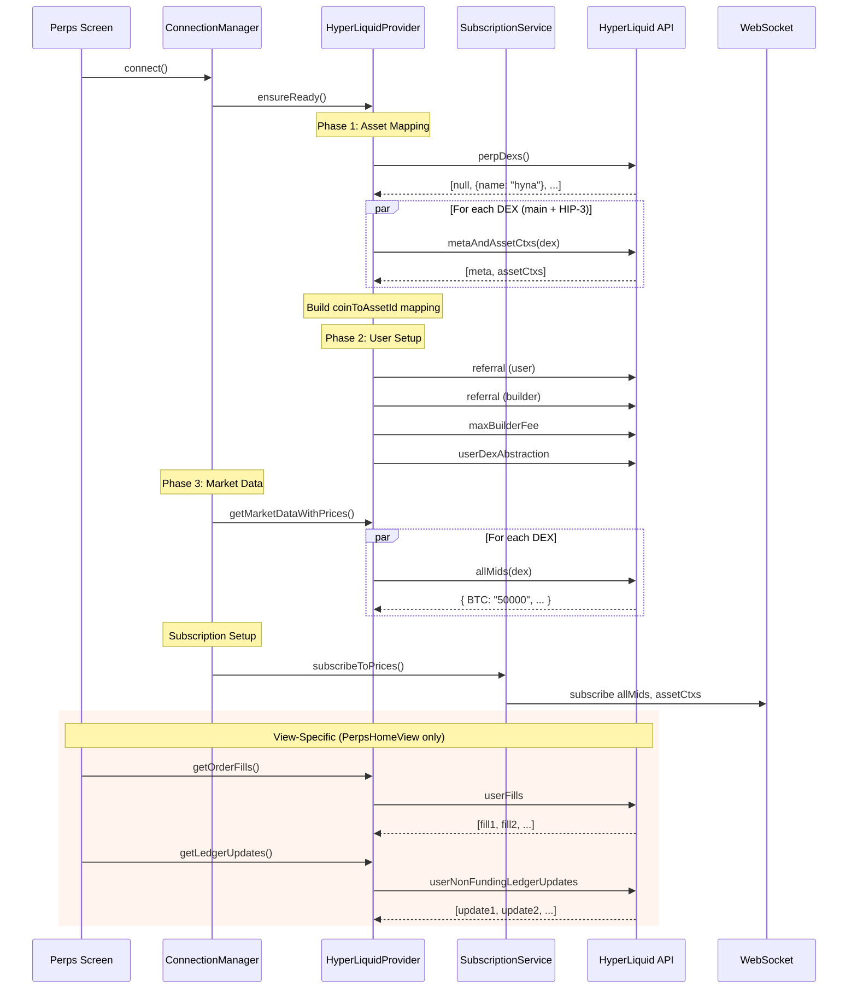
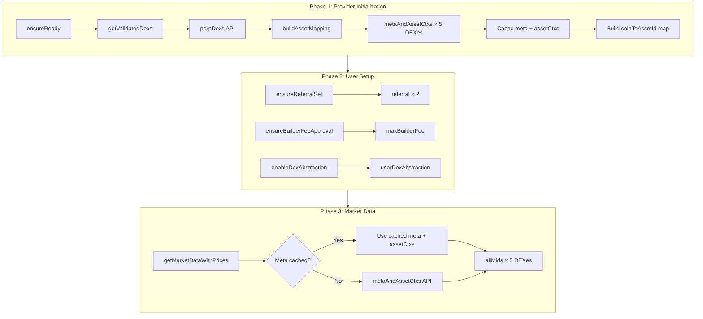
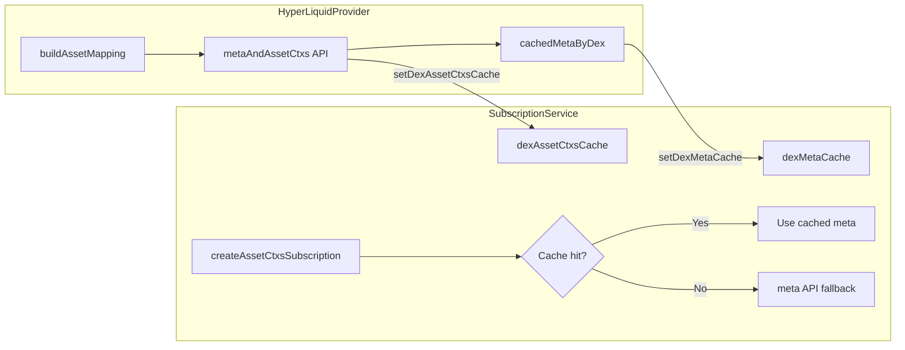
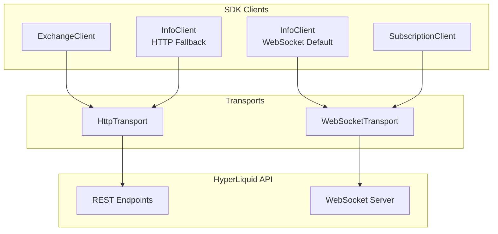

# HyperLiquid Initialization Flow

## Overview

This document describes the API calls made during Perps initialization and the optimization strategies applied to minimize redundant network requests.

## Entry Points

Users can enter the Perps environment through different entry points, each with different API call patterns:

### 1. PerpsTabView (Wallet Homepage Tab)

**File**: `app/components/UI/Perps/Views/PerpsTabView/PerpsTabView.tsx`

- Lightweight view showing open positions and orders
- Uses WebSocket streams only (after core init)
- **Total API calls: 15** (core init only)

**Hooks used:**

- `usePerpsLiveAccount()` - Account balance via WebSocket
- `usePerpsLivePositions()` - Positions via WebSocket
- `usePerpsLiveOrders()` - Orders via WebSocket

### 2. PerpsHomeView (Full Perps Screen)

**File**: `app/components/UI/Perps/Views/PerpsHomeView/PerpsHomeView.tsx`

- Rich UI with markets, watchlist, and recent activity
- Adds REST API calls for historical activity data
- **Total API calls: 17** (core init + 2 view-specific)

**Hooks used:**

- `usePerpsLiveAccount()` - Account balance via WebSocket
- `usePerpsHomeData()` - Aggregator hook that includes:
  - WebSocket streams for positions/orders
  - REST API calls for historical activity (`userFills`, `userNonFundingLedgerUpdates`)
  - Market data fetching

## Initialization Sequence Diagram



## API Calls During Initialization

### Core Init (All Entry Points) - 15 Calls

These calls are made regardless of which entry point is used.

#### Phase 1: Provider Initialization (`ensureReady`)

| Call | Endpoint           | Purpose                                   | Count              |
| ---- | ------------------ | ----------------------------------------- | ------------------ |
| 1    | `perpDexs`         | Discover available HIP-3 DEXes            | 1                  |
| 2-6  | `metaAndAssetCtxs` | Get asset metadata + contexts for mapping | 5 (main + 4 HIP-3) |

#### Phase 2: User Setup (first connection only)

| Call | Endpoint             | Purpose                         | Count |
| ---- | -------------------- | ------------------------------- | ----- |
| 7    | `referral`           | Check user's referral status    | 1     |
| 8    | `referral`           | Check builder's referral status | 1     |
| 9    | `maxBuilderFee`      | Get max builder fee for user    | 1     |
| 10   | `userDexAbstraction` | Check DEX abstraction status    | 1     |

#### Phase 3: Market Data (`getMarketDataWithPrices`)

| Call  | Endpoint  | Purpose                              | Count              |
| ----- | --------- | ------------------------------------ | ------------------ |
| 11-15 | `allMids` | Get current mid prices for all DEXes | 5 (main + 4 HIP-3) |

#### Core Init Summary

| Category      | Calls  | Details                                               |
| ------------- | ------ | ----------------------------------------------------- |
| DEX Discovery | 1      | `perpDexs`                                            |
| Metadata      | 5      | `metaAndAssetCtxs` × 5 DEXes                          |
| User Setup    | 4      | `referral` × 2, `maxBuilderFee`, `userDexAbstraction` |
| Prices        | 5      | `allMids` × 5 DEXes                                   |
| **Total**     | **15** |                                                       |

### View-Specific: PerpsHomeView Only - 2 Additional Calls

These calls are only made when entering via PerpsHomeView (full Perps screen), not from PerpsTabView.

Called via `usePerpsHomeData()` hook for the Recent Activity section:

| Call | Endpoint                      | Purpose                                | Count |
| ---- | ----------------------------- | -------------------------------------- | ----- |
| 16   | `userFills`                   | Historical trade fills for activity    | 1     |
| 17   | `userNonFundingLedgerUpdates` | Ledger history (deposits, withdrawals) | 1     |

### Total API Calls by Entry Point

| Entry Point   | Core Init | View-Specific | Total  |
| ------------- | --------- | ------------- | ------ |
| PerpsTabView  | 15        | 0             | **15** |
| PerpsHomeView | 15        | 2             | **17** |

## Call Flow Detail



## Optimization History

### Before Optimization: 19+ API Calls

The original initialization made redundant calls:

```
┌─────────────────────────────────────────────────────────────┐
│ REDUNDANT CALLS (before optimization)                       │
├─────────────────────────────────────────────────────────────┤
│ 1. meta() × 5 DEXes in buildAssetMapping           ← REMOVED│
│ 2. Duplicate metaAndAssetCtxs() from race conditions        │
│    - ensureReady() called multiple times           ← FIXED  │
│    - getMarketDataWithPrices() before cache ready  ← FIXED  │
│ 3. Duplicate perpDexs() calls                      ← CACHED │
│ 4. assetCtxs not cached from buildAssetMapping     ← FIXED  │
└─────────────────────────────────────────────────────────────┘
```

### After Optimization: 15 API Calls

| Optimization                                                      | Calls Saved | Implementation                               |
| ----------------------------------------------------------------- | ----------- | -------------------------------------------- |
| Replace `meta()` with `metaAndAssetCtxs()` in `buildAssetMapping` | 5           | `HyperLiquidProvider.ts:buildAssetMapping()` |
| Promise deduplication in `ensureReady()`                          | Variable    | `ensureReadyPromise` singleton               |
| Cache meta from `metaAndAssetCtxs` calls                          | Variable    | `cachedMetaByDex` + `setDexMetaCache()`      |
| Cache assetCtxs from `buildAssetMapping`                          | 4           | `setDexAssetCtxsCache()`                     |
| Cache `perpDexs` response                                         | 1+          | `cachedAllPerpDexs`                          |

## Data Flow: metaAndAssetCtxs Response

The `metaAndAssetCtxs` endpoint returns both meta and asset contexts in a single call:

```typescript
// Response structure
type MetaAndAssetCtxsResponse = [
  Meta, // [0] - Same as meta() response
  AssetCtx[], // [1] - Asset contexts with prices, funding, etc.
];

// Meta contains:
interface Meta {
  universe: Array<{
    name: string; // e.g., "BTC"
    szDecimals: number; // Size decimals
    maxLeverage: number; // Max leverage
    // ... other fields
  }>;
}

// AssetCtx contains:
interface AssetCtx {
  funding: string; // Current funding rate
  openInterest: string; // Open interest in contracts
  prevDayPx: string; // Previous day price
  dayNtlVlm: string; // Daily notional volume
  markPx: string; // Mark price
  midPx?: string; // Mid price (optional)
  oraclePx: string; // Oracle price
}
```

## Caching Strategy

### Three-Level Cache Sharing

The Provider and SubscriptionService share cached data to avoid redundant API calls:



### Level 1: Provider Meta Cache

```typescript
// HyperLiquidProvider.ts
private cachedMetaByDex: Map<string, Meta> = new Map();

// Populated during buildAssetMapping() via metaAndAssetCtxs
// Cache key: '' for main DEX, 'xyz'/'hyna'/etc for HIP-3 DEXes
// Used by getCachedMeta() for subsequent calls
```

### Level 2: Subscription Service DEX Meta Cache

```typescript
// HyperLiquidSubscriptionService.ts
private dexMetaCache: Map<string, Meta> = new Map();

// Populated via setDexMetaCache() from Provider during buildAssetMapping
// Used by createAssetCtxsSubscription() to avoid API calls
public setDexMetaCache(dex: string, meta: Meta): void {
  this.dexMetaCache.set(dex, meta);
}
```

### Level 3: Subscription Service AssetCtxs Cache

```typescript
// HyperLiquidSubscriptionService.ts
private dexAssetCtxsCache: Map<string, AssetCtx[]> = new Map();

// Populated via setDexAssetCtxsCache() from Provider during buildAssetMapping
// Used by getMarketDataWithPrices() to avoid duplicate metaAndAssetCtxs calls
public setDexAssetCtxsCache(dex: string, assetCtxs: AssetCtx[]): void {
  this.dexAssetCtxsCache.set(dex, assetCtxs);
}
```

### Cache Key Convention

**Important:** Both caches use empty string `''` for main DEX (not `'main'`):

- Main DEX: key = `''`
- HIP-3 DEXes: key = dex name (e.g., `'xyz'`, `'hyna'`, `'flx'`, `'vntl'`)

## Transport Architecture

### Overview

The HyperLiquid SDK supports two transports: HTTP and WebSocket. For optimal performance, we use WebSocket as the default transport for InfoClient API calls during initialization, multiplexing all requests over a single connection.



### Transport Selection

Transport selection is handled at the **HyperLiquidClientService** level:

```typescript
// HyperLiquidClientService.ts

// WebSocket InfoClient (default) - multiplexed requests
private infoClient?: InfoClient;        // Uses wsTransport

// HTTP InfoClient (fallback) - per-request connections
private infoClientHttp?: InfoClient;    // Uses httpTransport

/**
 * Get the info client
 * @param options.useHttp - Force HTTP transport instead of WebSocket (default: false)
 */
public getInfoClient(options?: { useHttp?: boolean }): InfoClient {
  if (options?.useHttp) {
    return this.infoClientHttp;  // HTTP fallback
  }
  return this.infoClient;  // WebSocket default
}
```

### Transport Usage by Client

| Client                | Transport | Use Case                                                        |
| --------------------- | --------- | --------------------------------------------------------------- |
| ExchangeClient        | HTTP      | Write operations (orders, approvals) - must be HTTP for signing |
| InfoClient (default)  | WebSocket | Read operations (market data, user data) - multiplexed          |
| InfoClient (fallback) | HTTP      | Fallback if WebSocket has issues with specific calls            |
| SubscriptionClient    | WebSocket | Real-time pub/sub (price feeds, position updates)               |

### Benefits of WebSocket Transport

| Metric              | HTTP          | WebSocket   |
| ------------------- | ------------- | ----------- |
| Network connections | 1 per request | 1 shared    |
| TLS handshakes      | Per request   | Once        |
| Connection overhead | High          | Minimal     |
| Request latency     | Per-request   | Multiplexed |

### Fallback Strategy

If a specific API call has issues with WebSocket transport, it can be overridden in `HyperLiquidProvider`:

```typescript
// Default (WebSocket):
const infoClient = this.clientService.getInfoClient();

// Force HTTP for specific call if needed:
const infoClient = this.clientService.getInfoClient({ useHttp: true });
```

This architecture keeps transport selection as an implementation detail, invisible to higher layers like `PerpsController`.

## WebSocket Subscriptions

After initialization, the following WebSocket subscriptions are active:

| Subscription | Channel | Purpose                              |
| ------------ | ------- | ------------------------------------ |
| `allMids`    | Per DEX | Real-time mid price updates          |
| `assetCtxs`  | Per DEX | Funding rates, OI, mark prices       |
| `webData3`   | Main    | User account data, positions, orders |

## Troubleshooting

### Identifying Redundant Calls

Enable network logging to track API calls:

```typescript
// In HyperLiquidClientService or similar
console.log(`API Call: ${type}`, { dex, timestamp: Date.now() });
```

### Common Issues

1. **Multiple `metaAndAssetCtxs()` calls**: Check if `ensureReady()` is being called before cache is ready
2. **Duplicate `perpDexs()` calls**: Ensure `cachedAllPerpDexs` is populated before subsequent calls
3. **Race conditions**: Ensure `ensureReadyPromise` is properly reused across concurrent calls
4. **Slow initialization**: Check if HIP-3 DEXes are enabled but failing (adds timeout delays)

### Verifying Optimization

Check network logs for expected call counts:

**Core Init (all entry points):**

- `perpDexs`: 1×
- `metaAndAssetCtxs`: 5× (one per DEX)
- `referral`: 2× (user + builder)
- `maxBuilderFee`: 1×
- `userDexAbstraction`: 1×
- `allMids`: 5× (one per DEX)
- **Subtotal**: 15×

**View-Specific (PerpsHomeView only):**

- `userFills`: 1×
- `userNonFundingLedgerUpdates`: 1×
- **Subtotal**: 2×

**Expected Totals:**

| Entry Point   | Expected Calls |
| ------------- | -------------- |
| PerpsTabView  | 15             |
| PerpsHomeView | 17             |

## Related Documentation

- [Perps Connection Architecture](../perps-connection-architecture.md) - Overall connection flow
- [HIP-3 Implementation](./HIP-3.md) - HIP-3 DEX support details
- [Subscriptions](./subscriptions.md) - WebSocket subscription formats
