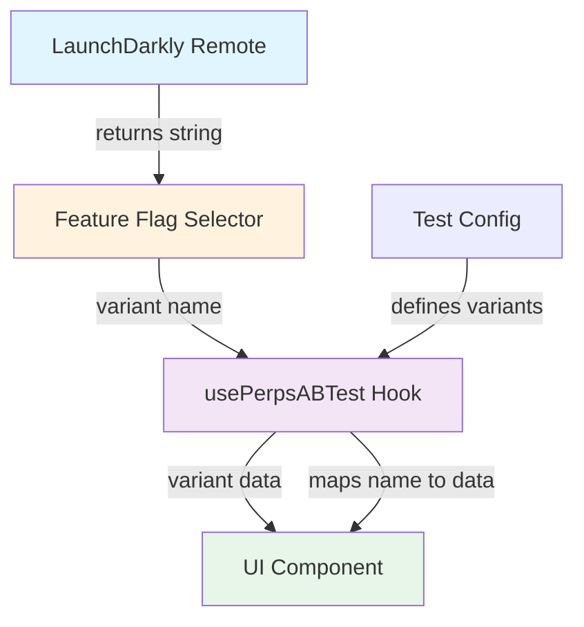

# Perps A/B Testing Framework

## Overview

Simplified A/B testing framework for Perps that leverages LaunchDarkly for user identification, variant assignment, and persistence. The implementation focuses on reading variants and applying them in UI, while LaunchDarkly handles all complex logic.

**Key Design Principles:**

- LaunchDarkly is the single source of truth for variant assignment
- Simple string flags (not JSON) for variant names
- Fallback to first variant when flag is disabled
- Type-safe hook API for UI components
- No client-side assignment logic or storage

## Platform-Aware Testing

A/B tests can be run independently on mobile vs extension, or across both platforms simultaneously:

| Scenario       | LaunchDarkly Setup                                | Analytics Query                   |
| -------------- | ------------------------------------------------- | --------------------------------- |
| Extension only | Target: `context.app.name = 'MetaMask Extension'` | `app.name = 'MetaMask Extension'` |
| Mobile only    | Target: `context.app.name = 'MetaMask'`           | `app.name = 'MetaMask'`           |
| Both platforms | No targeting (serves all)                         | Group by `app.name` in analysis   |

### Extension-Specific Targeting

In LaunchDarkly, you can target extension users specifically:

```json
{
  "rules": [
    {
      "clauses": [
        {
          "attribute": "appName",
          "op": "equals",
          "values": ["MetaMask Extension"]
        }
      ],
      "rollout": {
        "variations": [
          { "variation": 0, "weight": 50000 },
          { "variation": 1, "weight": 50000 }
        ]
      }
    }
  ]
}
```

## Architecture



## Layer Responsibilities

### Test Configuration (`tests.ts`)

**Owns:**

- Variant definitions (control, treatment, etc.)
- Variant data (button colors, text, behavior flags)
- Test metadata (ID, description, min version)

**Example:**

```typescript
export const BUTTON_COLOR_TEST: ABTestConfig<ButtonColorTestVariants> = {
  testId: 'button_color_test',
  featureFlagKey: 'perpsAbtestButtonColor',
  description: 'Tests impact of button colors on trading behavior',
  variants: {
    control: {
      weight: 50, // Informational only
      data: { long: 'green', short: 'red' },
    },
    monochrome: {
      weight: 50, // Informational only
      data: { long: 'white', short: 'white' },
    },
  },
};
```

**Note:** Weights are informational only. LaunchDarkly controls actual distribution via percentage rollout rules.

---

### Feature Flag Selector (`selectors/featureFlags/index.ts`)

**Owns:**

- Reading LaunchDarkly flag value from Redux
- Returning variant name as string or null

**Example:**

```typescript
export const selectPerpsButtonColorTestVariant = createSelector(
  selectRemoteFeatureFlags,
  (remoteFeatureFlags): string | null => {
    const flag = remoteFeatureFlags?.perpsAbtestButtonColor;
    return flag || null; // Returns 'control' | 'monochrome' | null
  },
);
```

**Redux State:**

```typescript
{
  RemoteFeatureFlagController: {
    remoteFeatureFlags: {
      perpsAbtestButtonColor: 'control'; // String value from LaunchDarkly
    }
  }
}
```

---

### Hook (`usePerpsABTest`)

**Owns:**

- Mapping variant name to variant data
- Fallback logic (first variant when flag is null)
- `isEnabled` state (true if LaunchDarkly returned a variant)

**Returns:**

```typescript
{
  variant: T; // Typed variant data (e.g., { long: 'green', short: 'red' })
  variantName: string; // Variant name (e.g., 'control')
  isEnabled: boolean; // true if LaunchDarkly assigned variant, false if using fallback
}
```

**Usage in Component:**

```typescript
import { usePerpsABTest } from '../../utils/abTesting/usePerpsABTest';
import { BUTTON_COLOR_TEST } from '../../utils/abTesting/tests';
import { selectPerpsButtonColorTestVariant } from '../../selectors/featureFlags';

const MyComponent = () => {
  const { variant, variantName, isEnabled } = usePerpsABTest({
    test: BUTTON_COLOR_TEST,
    featureFlagSelector: selectPerpsButtonColorTestVariant,
  });

  const buttonColors = variant as ButtonColorVariant;

  // Track screen view with AB test context (baseline exposure)
  usePerpsEventTracking({
    eventName: MetaMetricsEvents.PERPS_SCREEN_VIEWED,
    properties: {
      [PerpsEventProperties.SCREEN_TYPE]:
        PerpsEventValues.SCREEN_TYPE.ASSET_DETAILS,
      [PerpsEventProperties.ASSET]: market.symbol,
      // AB test context - only included when test is enabled
      ...(isEnabled && {
        [PerpsEventProperties.AB_TEST_BUTTON_COLOR]: variantName,
      }),
    },
  });

  // Get imperative track function for button press tracking
  const { track } = usePerpsEventTracking();

  const handleButtonPress = (direction: 'long' | 'short') => {
    // Track AB test on button press (engagement)
    if (isEnabled) {
      track(MetaMetricsEvents.PERPS_UI_INTERACTION, {
        [PerpsEventProperties.INTERACTION_TYPE]:
          PerpsEventValues.INTERACTION_TYPE.TAP,
        [PerpsEventProperties.ASSET]: market.symbol,
        [PerpsEventProperties.DIRECTION]: direction === 'long'
          ? PerpsEventValues.DIRECTION.LONG
          : PerpsEventValues.DIRECTION.SHORT,
        [PerpsEventProperties.AB_TEST_BUTTON_COLOR]: variantName,
      });
    }

    // Navigate or perform action
    // ...
  };

  return (
    <ButtonSemantic
      onPress={() => handleButtonPress('long')}
      severity={getButtonSeverityForDirection('long', buttonColors)}
    />
  );
};
```

---

## File Structure (Extension)

```
ui/
├── hooks/perps/
│   ├── abTesting/
│   │   ├── types.ts              # TypeScript interfaces
│   │   ├── usePerpsABTest.ts     # Main hook
│   │   └── tests.ts              # Test configurations
│   └── index.ts
├── selectors/perps/
│   └── feature-flags.ts          # Feature flag selectors
├── pages/perps/
│   └── perps-order/              # Example usage
└── components/app/perps/
    └── constants/
        └── eventNames.ts         # AB test event properties
```

---

## Adding New Tests

### 1. Define Variant Data Type

**File:** `app/components/UI/Perps/utils/abTesting/types.ts`

```typescript
export interface MyTestVariant {
  property: string;
  anotherProperty: number;
}
```

### 2. Create Test Configuration

**File:** `app/components/UI/Perps/utils/abTesting/tests.ts`

```typescript
export const MY_TEST: ABTestConfig<{
  control: ABTestVariant<MyTestVariant>;
  treatment: ABTestVariant<MyTestVariant>;
}> = {
  testId: 'my_test',
  featureFlagKey: 'perpsAbtestMyTest',
  description: 'Test description',
  variants: {
    control: {
      weight: 50,
      data: { property: 'value1', anotherProperty: 1 },
    },
    treatment: {
      weight: 50,
      data: { property: 'value2', anotherProperty: 2 },
    },
  },
};
```

**Note:** LaunchDarkly flag name would be `perps-abtest-my-test` (kebab-case), which becomes `perpsAbtestMyTest` (camelCase) in Redux state.

### 3. Add Feature Flag Selector

**File:** `app/components/UI/Perps/selectors/featureFlags/index.ts`

```typescript
export const selectPerpsMyTestVariant = createSelector(
  selectRemoteFeatureFlags,
  (flags): string | null => flags?.perpsAbtestMyTest || null,
);
```

### 4. Add Event Constants

**File:** `app/components/UI/Perps/constants/eventNames.ts`

```typescript
AB_TEST: {
  BUTTON_COLOR_TEST: 'button_color_test',
  MY_TEST: 'my_test', // Add new test ID
}
```

### 5. Use in Component

```typescript
const { variant, variantName, isEnabled } = usePerpsABTest({
  test: MY_TEST,
  featureFlagSelector: selectPerpsMyTestVariant,
});
```

---

## Multiple Concurrent Tests

### Why Flat Properties?

To support multiple AB tests running simultaneously (e.g., TAT-1937 button colors, TAT-1940 asset CTA, TAT-1827 homepage CTA), we use **flat properties per test** instead of generic properties.

**❌ Generic Pattern (doesn't scale):**

```typescript
{
  ab_test_id: 'button_color_test',
  ab_test_variant: 'control',
  ab_test_enabled: true
}
// Problem: Only supports ONE test per event
```

**✅ Flat Pattern (scales to 3+ tests):**

```typescript
{
  ab_test_button_color: 'control',
  ab_test_asset_cta: 'variant_a',
  ab_test_homepage_cta: 'treatment'
}
// ✓ Supports multiple concurrent tests in same event
// Note: Only include properties when test is enabled (don't send event if disabled)
```

### Naming Convention

**Pattern:** `ab_test_{test_name}` (no `_enabled` suffix needed)

**Why no `_enabled` property?**

- Events are only sent when test is enabled
- Including the property means the test is active
- No need for redundant `_enabled` flag

**Examples:**

- Button color test: `ab_test_button_color`
- Asset CTA test: `ab_test_asset_cta`
- Homepage CTA test: `ab_test_homepage_cta`

### Implementation

**1. Add properties to `eventNames.ts`:**

```typescript
export const PerpsEventProperties = {
  // ... existing properties ...

  // A/B testing properties (flat per test for multiple concurrent tests)
  // Only include AB test properties when test is enabled (event not sent when disabled)
  // Button color test (TAT-1937)
  AB_TEST_BUTTON_COLOR: 'ab_test_button_color',
  // Asset CTA test (TAT-1940)
  AB_TEST_ASSET_CTA: 'ab_test_asset_cta',
  // Future tests: add as AB_TEST_{TEST_NAME} (no _ENABLED property needed)
} as const;
```

**2. Use in component tracking:**

```typescript
const { variant, variantName, isEnabled } = usePerpsABTest({
  test: BUTTON_COLOR_TEST,
  featureFlagSelector: selectPerpsButtonColorTestVariant,
});

// Track screen view (baseline exposure)
usePerpsEventTracking({
  eventName: MetaMetricsEvents.PERPS_SCREEN_VIEWED,
  properties: {
    [PerpsEventProperties.SCREEN_TYPE]:
      PerpsEventValues.SCREEN_TYPE.ASSET_DETAILS,
    [PerpsEventProperties.ASSET]: market.symbol,
    ...(isEnabled && {
      [PerpsEventProperties.AB_TEST_BUTTON_COLOR]: variantName,
    }),
  },
});

// Get imperative track function for button press tracking
const { track } = usePerpsEventTracking();

// In button press handler
const handleLongPress = () => {
  // Track AB test on button press (engagement)
  if (isEnabled) {
    track(MetaMetricsEvents.PERPS_UI_INTERACTION, {
      [PerpsEventProperties.INTERACTION_TYPE]:
        PerpsEventValues.INTERACTION_TYPE.TAP,
      [PerpsEventProperties.ASSET]: market.symbol,
      [PerpsEventProperties.DIRECTION]: PerpsEventValues.DIRECTION.LONG,
      [PerpsEventProperties.AB_TEST_BUTTON_COLOR]: variantName,
    });
  }

  // Navigate to order screen
  navigation.navigate(/* ... */);
};
```

### Where to Track

**Best Practice:** Track AB test context in **both screen view and button press** events to enable engagement rate calculation.

**Dual Tracking Approach:**

1. **PERPS_SCREEN_VIEWED** (baseline exposure):
   - Tracks when user views the asset details screen
   - Establishes how many users were exposed to each variant
   - Only includes AB test property when test is enabled

2. **PERPS_UI_INTERACTION** (engagement):
   - Tracks when user presses Long/Short button
   - Measures which variant drives more button presses
   - Only sent when test is enabled

**Why Both Events?**

- **Engagement Rate** = Button presses / Screen views per variant
- Answers: "Which button color makes users more likely to press the button?"
- Screen views alone = exposure but not engagement
- Button presses alone = engagement but no baseline for comparison

**Example Flow (TAT-1937):**

1. User views PerpsMarketDetailsView → `PERPS_SCREEN_VIEWED` with `ab_test_button_color: 'control'` (baseline)
2. User taps Long button → `PERPS_UI_INTERACTION` with `ab_test_button_color: 'control'`, `interaction_type: 'tap'` (engagement)
3. User navigates to PerpsOrderView (order screen) - button colors applied, no tracking
4. User completes trade → `PERPS_TRADE_TRANSACTION` event (no AB test context needed)

**Calculating Engagement Rate:**

Compare button presses to screen views for each variant to determine which color drives higher engagement.

---

## Local Development (Extension)

### Testing Variants

**Production:** LaunchDarkly assigns variants automatically based on MetaMetrics ID and targeting rules.

**Local Testing Options:**

**Option 1: Manifest Overrides (Recommended)**

Create `.manifest-overrides.json`:

```json
{
  "_flags": {
    "remoteFeatureFlags": {
      "perpsAbtestButtonColor": "monochrome"
    }
  }
}
```

Add to `.metamaskrc`:

```bash
MANIFEST_OVERRIDES=.manifest-overrides.json
```

Rebuild: `yarn start`

**Option 2: Temporary Hardcode**

```typescript
// Temporarily override for testing - REMOVE BEFORE COMMIT!
const buttonColorVariant = 'monochrome';

// Comment out the actual hook call while testing:
// const { variant, variantName } = usePerpsABTest({...});
```

**Debug via Redux DevTools:**

1. Open Redux DevTools in browser
2. Navigate to `metamask.remoteFeatureFlags`
3. Check `perpsAbtestButtonColor` value

**Important:** Always remove hardcoded overrides before committing.

---

## LaunchDarkly User Context & Bucketing

**How User Identification Works:**

Mobile sends user context to LaunchDarkly for per-user A/B testing via the `RemoteFeatureFlagController`:

- **MetaMetrics ID** (when enabled): Used as the primary LaunchDarkly user key
- **Fallback identification**: LaunchDarkly seem to maintain its own user segmentation even when MetaMetrics is disabled
- **Bucketing**: Users are consistently assigned to variants based on their identifier

---

## LaunchDarkly Configuration

### Backend Team Setup

**Flag Type:** Use **String** flag (not Boolean or JSON) for AB tests.

**Naming Convention:** `perps-abtest-{test-name}`

**Examples:**

- Button color test: `perps-abtest-button-color`
- Asset details test: `perps-abtest-asset-details`
- Homepage test: `perps-abtest-homepage`

**Why this pattern?**

- `perps-` = Feature area (Perps trading)
- `abtest-` = Identifies it as an AB test (vs feature flag)
- `{test-name}` = What's being tested
- No `-enabled` suffix needed (LaunchDarkly has ON/OFF toggle)

**Configuration Steps:**

1. **Create flag:** `perps-abtest-button-color` (kebab-case in LaunchDarkly UI)
2. **Flag type:** String (from dropdown)
3. **String variations:**
   - Variation 0: Name=`Control`, Value=`control` (default)
   - Variation 1: Name=`Monochrome`, Value=`monochrome` (treatment)

4. **Default rule (for all traffic):**
   - **Serve:** A percentage rollout
   - **Split:** 50% → `control`, 50% → `monochrome` (adjust percentages as needed)
   - **By:** `user | key` (buckets users by their LaunchDarkly user key, which is the MetaMetrics ID)

5. **Targeting rules:** Optional - leave empty for simple A/B test, or add custom rules for gradual rollout

6. **Default variations:**
   - **When ON:** Serves default rule (percentage rollout)
   - **When OFF:** Serves `control` (variation 0)

**Example config:**

```json
{
  "fallthrough": {
    "rollout": {
      "variations": [
        { "variation": 0, "weight": 50000 },
        { "variation": 1, "weight": 50000 }
      ],
      "bucketBy": "key"
    }
  },
  "offVariation": 0,
  "variations": [
    { "name": "Control", "value": "control" },
    { "name": "Monochrome", "value": "monochrome" }
  ]
}
```

**Note:** Weights are in basis points (50000 = 50%). Adjust for different splits (e.g., 70/30 = 70000/30000).

### What the App Receives

```typescript
// Redux state structure (kebab-case converted to camelCase)
{
  RemoteFeatureFlagController: {
    remoteFeatureFlags: {
      perpsAbtestButtonColor: 'control'; // Simple string value
    }
  }
}
```

**Selector behavior:**

- `"control"` → Returns control variant data
- `"treatment"` → Returns treatment variant data
- `null` (flag OFF) → Returns first variant (fallback), `isEnabled: false`
- Invalid value → Warns, returns first variant, `isEnabled: true`

---

## Testing Strategy

1. **Manual Testing:** Test variants locally using temporary hardcoded values
2. **QA Validation:** Verify in staging environment with LaunchDarkly enabled
3. **Gradual Rollout:** Start with small percentage (5-10%), monitor metrics
4. **Data Collection:** Track for 2-4 weeks minimum to reach statistical significance
5. **Analysis:** Compare metrics between variants (Amplitude/DataDog)
6. **Decision:** Roll winning variant to 100%, remove AB test code

## Design Rationale

### Why String Flags (Not JSON)?

- **Simpler:** LaunchDarkly handles assignment, app just reads variant name
- **Type-safe:** Variant data defined in TypeScript config, not JSON
- **Cleaner:** No version-gating complexity in flag payload
- **Use JSON when:** Per-variant version requirements needed (feature flags, not AB tests)

### Why No Client-Side Storage?

- **LaunchDarkly handles persistence:** User ID determines assignment deterministically
- **No stale data:** Always fresh from remote
- **Fewer bugs:** No sync issues between local storage and LaunchDarkly
- **Simpler code:** No storage management logic needed

### Why Fallback to First Variant?

- **Graceful degradation:** App works even if LaunchDarkly is down
- **Predictable behavior:** Always show control variant as fallback
- **No blank states:** User experience never breaks

---

## Related Files (Extension)

- **Hook:** `ui/hooks/perps/abTesting/usePerpsABTest.ts` (to be created)
- **Types:** `ui/hooks/perps/abTesting/types.ts` (to be created)
- **Test configs:** `ui/hooks/perps/abTesting/tests.ts` (to be created)
- **Selectors:** `ui/selectors/perps/feature-flags.ts` (to be created)
- **Event constants:** `ui/components/app/perps/constants/eventNames.ts` (to be created)

---

## Extension vs Mobile Differences

| Aspect         | Mobile                     | Extension                                       |
| -------------- | -------------------------- | ----------------------------------------------- |
| User context   | `react-native-device-info` | `browser.runtime.getManifest()`                 |
| App name in LD | `'MetaMask'`               | `'MetaMask Extension'`                          |
| Local override | `.js.env`                  | `.manifest-overrides.json`                      |
| UI context     | N/A                        | `environment_type` (popup/sidepanel/fullscreen) |

---

## FAQ

**Q: What if LaunchDarkly is down?**
A: Selector returns `null`, hook falls back to first variant, `isEnabled` is `false`.

**Q: How are users assigned to variants?**
A: LaunchDarkly uses MetaMetrics ID with deterministic hashing. Same user always gets same variant.

**Q: Can I test both variants locally?**
A: Yes, use `.manifest-overrides.json` to set the flag value, or temporarily hardcode in component.

**Q: Why are weights informational only?**
A: LaunchDarkly controls actual distribution via percentage rollout rules, not client-side weights.

**Q: How do I track AB test in analytics?**
A: Use `isEnabled`, `variantName` in event properties. The extension's MetaMetrics automatically includes `app.name: 'MetaMask Extension'` for platform filtering.

**Q: Can I run different tests on mobile vs extension?**
A: Yes, use LaunchDarkly targeting rules based on `appName` context attribute.
