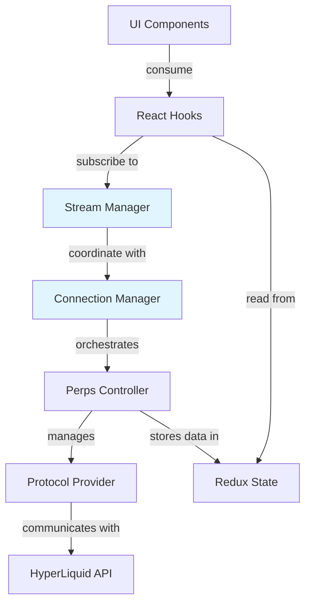

# Perps Architecture

## Overview

The Perps feature enables perpetual futures trading in MetaMask Extension. This document provides a high-level architectural overview of the codebase structure, key patterns, and references to detailed documentation.

**UI Location**: `ui/components/app/perps/`, `ui/pages/perps/`
**Controller**: `@metamask/perps-controller` (from core packages)

## Quick Navigation

- **[Connection Architecture](./perps-connection-architecture.md)** - Connection lifecycle, reconnection logic, WebSocket management
- **[Screen Documentation](./perps-screens.md)** - Detailed view documentation
- **[Sentry Integration](./perps-sentry-reference.md)** - Error tracking and monitoring
- **[MetaMetrics Events](./perps-metametrics-reference.md)** - Analytics events
- **[Protocol Documentation](./hyperliquid/)** - HyperLiquid protocol specifics

## Layer Architecture

The Perps system uses a layered architecture where each layer has clear responsibilities:



### Layer Responsibilities

| Layer                  | Purpose                                           | Examples                                           |
| ---------------------- | ------------------------------------------------- | -------------------------------------------------- |
| **UI Components**      | Presentational components, user interactions      | PerpsOrderView, PerpsMarketList, PerpsPositionCard |
| **React Hooks**        | Data access, business logic, state management     | usePerpsTrading, usePerpsMarkets, useLivePrices    |
| **Stream Manager**     | WebSocket subscription management, real-time data | PerpsStreamManager, component-level throttling     |
| **Connection Manager** | Connection lifecycle, reconnection orchestration  | PerpsConnectionManager (singleton)                 |
| **Perps Controller**   | Business logic, provider management, Redux state  | PerpsController (from @metamask/perps-controller)  |
| **Protocol Provider**  | Exchange-specific API implementation              | HyperLiquidProvider (REST + WebSocket)             |

**See [perps-connection-architecture.md](./perps-connection-architecture.md) for detailed connection flow.**

## Directory Structure

```
ui/
├── components/app/perps/    - Reusable UI components
│   ├── components/          - Shared presentational components
│   ├── contexts/            - React contexts
│   └── index.ts             - Public exports
├── pages/perps/             - Page-level components (views)
│   ├── home/                - Landing/dashboard page
│   ├── market-details/      - Individual market view
│   ├── order/               - Order entry form
│   ├── positions/           - Positions list
│   └── index.ts             - Route exports
├── hooks/perps/             - React hooks for data access and logic
│   └── stream/              - WebSocket subscription hooks (real-time data)
├── selectors/perps/         - Redux selectors by domain
└── ducks/perps/             - Redux slice (actions, reducers)

shared/
├── constants/perps.ts       - Configuration values
└── lib/perps/               - Shared utilities

test/e2e/tests/perps/        - E2E tests
```

### Components

Reusable UI components organized by feature:

- **Display Components**: LivePriceDisplay, PerpsAmountDisplay, PerpsBadge, PerpsProgressBar, PerpsLoader
- **Form Components**: PerpsSlider, PerpsOrderTypeModal, PerpsLeverageModal, PerpsLimitPriceModal
- **Card Components**: PerpsCard, PerpsPositionCard, PerpsOpenOrderCard, PerpsMarketStatisticsCard
- **List Components**: PerpsMarketList, PerpsRecentActivityList, PerpsWatchlistMarkets
- **Modal Components**: PerpsCancelAllOrdersModal, PerpsCloseAllPositionsModal, PerpsGTMModal
- **Header Components**: PerpsHomeHeader, PerpsMarketHeader, PerpsOrderHeader, PerpsTabControlBar
- **Navigation**: PerpsNavigationCard, PerpsMarketTabs
- **Tooltips**: PerpsTooltip (with content registry), PerpsNotificationTooltip
- **Charts**: TradingViewChart, PerpsCandlestickChartIntervalSelector, FundingCountdown
- **Developer Tools**: PerpsDeveloperOptionsSection

### Pages (Views)

Main page-level components representing full screens:

- **PerpsHomePage** - Landing/dashboard screen
- **PerpsMarketListPage** - Market browser with search/filters
- **PerpsMarketDetailsPage** - Individual market with chart
- **PerpsOrderPage** - Order entry form
- **PerpsPositionsPage** - Active positions list
- **PerpsClosePositionPage** - Single position close flow
- **PerpsCloseAllPositionsPage** - Close all positions flow
- **PerpsCancelAllOrdersPage** - Cancel all orders flow
- **PerpsTPSLPage** - Take profit/stop loss management
- **PerpsTransactionsPage** - Transaction history
- **PerpsWithdrawPage** - Withdrawal flow
- **PerpsEmptyState** - Empty state screens

**See [perps-screens.md](./perps-screens.md) for detailed view documentation.**

### Hooks

React hooks organized by category:

#### Controller Access

- `usePerpsTrading` - Trading operations (place/cancel/close)
- `usePerpsDeposit` - Deposit flow
- `usePerpsDepositQuote` - Deposit quotes
- `usePerpsMarkets` - Market data
- `usePerpsNetwork` - Network configuration
- `usePerpsWithdrawQuote` - Withdrawal quotes

#### State Management

- `usePerpsAccount` - Redux account state
- `usePerpsConnection` - Connection provider context
- `usePerpsPositions` - Position list
- `usePerpsNetworkConfig` - Network state
- `usePerpsOpenOrders` - Open orders list

#### Live Data (Stream Architecture)

- `useLivePrices` - Real-time prices with component-level throttling
- `usePerpsLiveAccount` - Account state updates
- `usePerpsLiveFills` - Order fill notifications
- `usePerpsLiveOrders` - Order updates
- `usePerpsLivePositions` - Position updates
- `usePerpsTopOfBook` - Top-of-book data
- `usePerpsPositionData` - Position data aggregation

#### Calculations

- `usePerpsLiquidationPrice` - Liquidation price calculation
- `usePerpsOrderFees` - Fee calculation
- `useMinimumOrderAmount` - Minimum order calculation
- `usePerpsMarketData` - Market-specific data
- `usePerpsMarketStats` - Market statistics
- `usePerpsFunding` - Funding rate data

#### Validation

- `usePerpsOrderValidation` - Order validation (protocol + UI rules)
- `usePerpsClosePositionValidation` - Close validation
- `useWithdrawValidation` - Withdrawal validation

#### Form Management

- `usePerpsOrderForm` - Order form state
- `usePerpsOrderExecution` - Order execution flow
- `usePerpsClosePosition` - Close position flow
- `usePerpsTPSLForm` - TP/SL form management
- `usePerpsTPSLUpdate` - TP/SL updates

#### UI Utilities

- `useColorPulseAnimation` - Price change animations
- `useBalanceComparison` - Balance comparison
- `useHasExistingPosition` - Position existence check
- `useStableArray` - Array reference stability
- `usePerpsNavigation` - Navigation utilities
- `usePerpsToasts` - Toast notifications

#### Assets/Tokens

- `usePerpsAssetsMetadata` - Asset metadata
- `usePerpsPaymentTokens` - Payment tokens
- `useWithdrawTokens` - Withdrawal tokens

#### Monitoring & Tracking

- `usePerpsEventTracking` - Analytics events
- `usePerpsDataMonitor` - Data monitoring
- `usePerpsMeasurement` - Performance measurement
- `usePerpsDepositStatus` - Deposit status tracking
- `usePerpsWithdrawStatus` - Withdrawal status tracking

### Controller

The PerpsController is provided by the `@metamask/perps-controller` package from core:

- **PerpsController** - Main controller managing providers, orders, positions, market data
- **HyperLiquidProvider** - HyperLiquid protocol implementation
- **Selectors** - Redux state selectors (in `ui/selectors/perps/`)
- **Error Codes** - Error code definitions

### Services

External integrations and infrastructure (part of controller package):

- **HyperLiquidClientService** - HTTP client for REST API
- **HyperLiquidSubscriptionService** - WebSocket subscription management
- **HyperLiquidWalletService** - Wallet operations
- **PerpsConnectionManager** - Connection lifecycle orchestration (singleton)

### Providers

React context providers:

- **PerpsConnectionProvider** - Connection state and methods for UI
- **PerpsStreamManager** - WebSocket stream management with caching
- **PerpsOrderContext** - Order form context

### Utils

Pure utility functions organized by domain:

- **Calculations**: orderCalculations, positionCalculations, pnlCalculations
- **Formatting**: formatUtils, amountConversion, textUtils
- **Validation**: hyperLiquidValidation, tpslValidation
- **Transforms**: marketDataTransform, transactionTransforms, arbitrumWithdrawalTransforms
- **Market Utils**: marketUtils, marketHours, sortMarkets
- **Error Handling**: perpsErrorHandler, translatePerpsError
- **Protocol**: hyperLiquidAdapter, hyperLiquidOrderBookProcessor
- **Blockchain**: idUtils, tokenIconUtils

## Key Patterns

### Validation Flow

Protocol validation (provider) → UI validation (hook) → Display errors (component)

```typescript
// Provider validates protocol rules
provider.validateOrder(order) // throws if invalid

// Hook adds UI-specific rules
usePerpsOrderValidation(orderParams) // returns { isValid, errors }

// Component displays errors
{errors.amount && <ErrorMessage>{errors.amount}</ErrorMessage>}
```

### Data Flow

Controller → Redux Store → Hooks → Components

```typescript
// Controller fetches and stores
await controller.getAccountState() // updates Redux

// Hook reads from Redux
const account = usePerpsAccount() // subscribes to Redux

// Component renders
<div>{account.balance}</div>
```

### Real-time Updates

WebSocket → Stream Manager → Hooks → Components

```typescript
// Stream Manager maintains single WebSocket connection
streamManager.subscribeToPrices(['BTC', 'ETH'])

// Hook throttles updates at component level
const prices = useLivePrices({
  symbols: ['BTC', 'ETH'],
  throttleMs: 2000, // 2s updates
})

// Component renders with throttled data
<div>{prices.BTC?.price}</div>
```

**See [perps-connection-architecture.md](./perps-connection-architecture.md) for WebSocket architecture details.**

### Form Management

Perps follows the extension's established form patterns:

- **State hooks**: Custom hooks like `usePerpsOrderFormState` (see `useNetworkFormState` in `ui/pages/settings/networks-tab/networks-form/`)
- **Validation**: `useEffect`-based validation with `errors` state object (see `networks-form.tsx`)
- **Redux**: For state shared across pages (see Swaps pattern in `ui/pages/swaps/`)
- **No form libraries**: Use native React patterns (no Formik, React Hook Form, etc.)

## Stream Architecture

**Single WebSocket connections shared across all components with component-level debouncing.**

### Benefits

- **90% fewer WebSocket connections** - One subscription per data type (not per component)
- **No subscription interference** - Each component controls its own update rate
- **Component-level control** - Different throttle rates for different views
- **Instant first render** - Pre-warmed connections provide cached data immediately
- **Zero parent re-renders** - Updates go directly to subscribers

### How It Works

1. **PerpsConnectionManager** pre-warms critical subscriptions on connection
2. **PerpsStreamManager** maintains single WebSocket subscriptions with reference counting
3. **Stream Hooks** provide component-level throttling:

```typescript
// Order view: stable prices (10s throttle)
const prices = useLivePrices({ symbols: ['BTC'], throttleMs: 10000 });

// Market list: responsive updates (2s throttle)
const prices = useLivePrices({ symbols: allSymbols, throttleMs: 2000 });

// Charts: near real-time (100ms throttle)
const prices = useLivePrices({ symbols: ['BTC'], throttleMs: 100 });
```

4. **Shared cache** ensures instant data availability for all subscribers

**See [perps-connection-architecture.md](./perps-connection-architecture.md) for detailed stream architecture.**

## Quick Reference

| Need           | Use Hook                                     | Use Component          |
| -------------- | -------------------------------------------- | ---------------------- |
| Place order    | `usePerpsTrading` + `usePerpsOrderExecution` | PerpsOrderPage         |
| Validate order | `usePerpsOrderValidation`                    | -                      |
| Get prices     | `useLivePrices`                              | LivePriceDisplay       |
| Manage form    | `usePerpsOrderForm`                          | -                      |
| Calculate fees | `usePerpsOrderFees`                          | PerpsFeesDisplay       |
| Check position | `useHasExistingPosition`                     | -                      |
| Close position | `usePerpsClosePosition` + validation         | PerpsClosePositionPage |
| Get account    | `usePerpsAccount`                            | -                      |
| Deposit funds  | `usePerpsDeposit`                            | PerpsBalanceActions    |
| Withdraw funds | `usePerpsWithdrawQuote` + validation         | PerpsWithdrawPage      |
| Show market    | -                                            | PerpsMarketDetailsPage |
| List markets   | `usePerpsMarkets`                            | PerpsMarketListPage    |

## Error Handling

Perps uses a multi-layered error handling approach:

1. **Provider Layer** - Protocol-specific errors, logs to Sentry
2. **Controller Layer** - Business logic errors, updates Redux, logs to Sentry
3. **Manager Layer** - Connection errors, sets local state, logs to console
4. **Hook Layer** - Exposes errors to UI
5. **Component Layer** - Displays errors to user

**See [perps-sentry-reference.md](./perps-sentry-reference.md) for error tracking details.**

## Analytics

All user interactions are tracked via MetaMetrics events:

- Trading actions (orders, closes, cancels)
- Market interactions (views, searches, filters)
- Connection events (connect, disconnect, errors)
- Deposit/withdrawal flows

**See [perps-metametrics-reference.md](./perps-metametrics-reference.md) for complete event catalog.**

## Development Guidelines

### Adding a New Hook

1. Determine category (Controller Access, State Management, Live Data, etc.)
2. Follow naming convention: `usePerps[Feature][Action]`
3. Keep single responsibility
4. Add comprehensive tests (colocated `.test.ts` files)
5. Document in this file

### Adding a New Component

1. Create in appropriate subdirectory under `ui/components/app/perps/`
2. Include `.scss` file for styles (or use Tailwind)
3. Add tests as colocated `.test.tsx` files
4. Export from component directory's `index.ts`
5. Use existing shared components where possible

### Adding a New Page

1. Create in `ui/pages/perps/` directory
2. Follow naming: `Perps[Feature]Page` or `perps-[feature]/`
3. Use hooks for data access (not direct controller calls)
4. Add to routing configuration
5. Document in [perps-screens.md](./perps-screens.md)

### Before Committing

```bash
# Lint and auto-fix changed files
yarn lint:changed:fix

# Type check
yarn lint:tsc

# Run tests for perps
yarn test:unit ui/components/app/perps/
yarn test:unit ui/pages/perps/
yarn test:unit ui/hooks/perps/
yarn test:unit ui/selectors/perps/
```

## Testing

- **Test Coverage**: Target ~95% across hooks, components, and utilities
- **Test Location**: Colocated `.test.ts` / `.test.tsx` files
- **Test Framework**: Jest + React Testing Library

Key testing utilities:

- Mock hooks for isolated component testing
- Mock providers for context testing
- Mock stream hooks for real-time data testing

## Code Quality

The codebase maintains high quality standards:

- **TypeScript**: All new code must be TypeScript
- **Functional Components**: No class components
- **Architecture**: Tight cohesion with clear layer boundaries
- **Patterns**: Consistent use of hooks, components, and utilities
- **Documentation**: Comprehensive inline and external documentation

## Protocol Integration

Currently integrated with HyperLiquid protocol:

- **REST API** - Account queries, order placement, market data
- **WebSocket** - Real-time prices, order fills, position updates
- **Wallet Integration** - Ethereum signing for orders

**See [hyperliquid/](./hyperliquid/) directory for protocol-specific documentation.**

## Extension-Specific Considerations

### Service Worker (MV3)

The extension uses Manifest V3 with a service worker background. Key implications:

- WebSocket connections must handle service worker lifecycle
- Connection manager should reconnect on service worker wake
- State should persist appropriately across UI context changes

### UI Contexts: Popup vs Sidepanel vs Tab

Perps can run in three contexts:

| Context       | Viewport     | Persistence | Use Case                              |
| ------------- | ------------ | ----------- | ------------------------------------- |
| **Popup**     | Limited      | Low         | Quick trades, checking positions      |
| **Sidepanel** | Narrow, tall | High        | Persistent trading alongside browsing |
| **Full tab**  | Full         | High        | Detailed analysis, complex orders     |

**Sidepanel advantages for Perps:**

- Stays open while browsing - ideal for monitoring positions
- Persistent WebSocket connection while panel is open
- Doesn't close on focus loss like popup

Components should handle all three modes gracefully. See [Connection Architecture](./perps-connection-architecture.md) for lifecycle details.

### Controller Location

The PerpsController is part of the `@metamask/perps-controller` package in the core monorepo, not local to the extension. This follows the pattern of other controllers like TokensController, SwapsController, etc.

## Migration Notes

### HIP-3 Upgrade (Nov 2024)

Major protocol upgrade with webData3 migration:

- Single WebSocket connection for positions + orders
- Improved performance and reliability

### Stream Architecture (Oct 2024)

Migrated from per-component subscriptions to shared streams:

- Old: `usePerpsPrices` (deprecated)
- New: `useLivePrices` with component-level throttling
- 90% reduction in WebSocket connections

## Additional Resources

- **[Perps Screens](./perps-screens.md)** - Detailed view documentation
- **[Connection Architecture](./perps-connection-architecture.md)** - Connection management deep dive
- **[Sentry Integration](./perps-sentry-reference.md)** - Error tracking
- **[MetaMetrics Events](./perps-metametrics-reference.md)** - Analytics events
- **[HyperLiquid Docs](./hyperliquid/)** - Protocol documentation

## Questions?

For architecture questions or contributions, refer to the specific documentation linked above or reach out in #metamask-perps.
