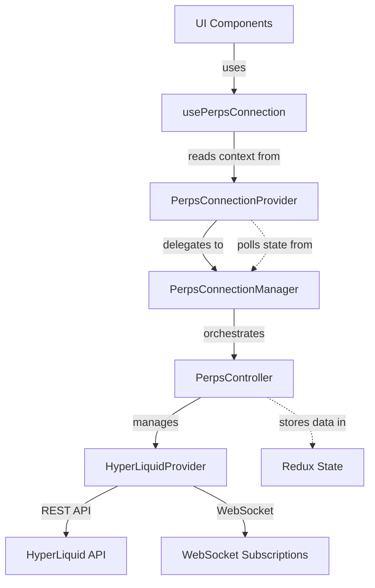
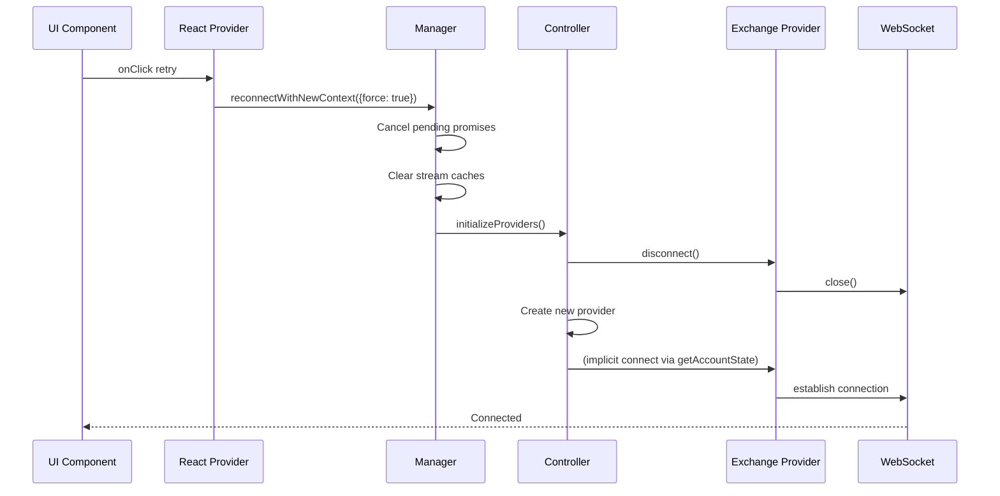
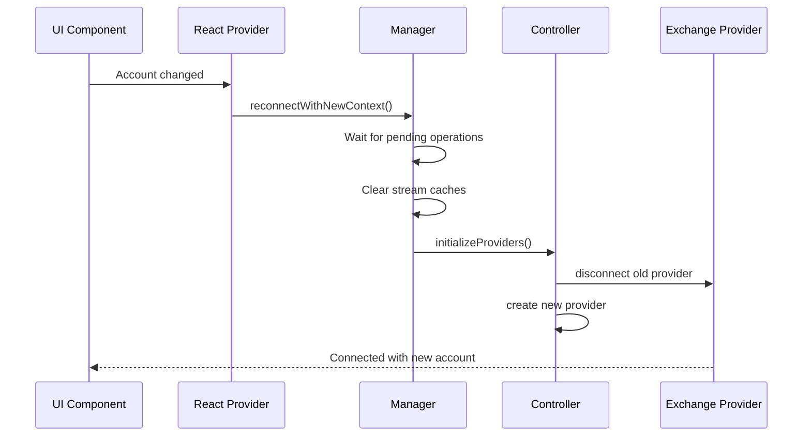
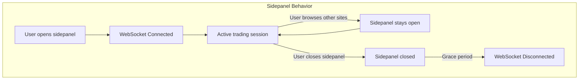
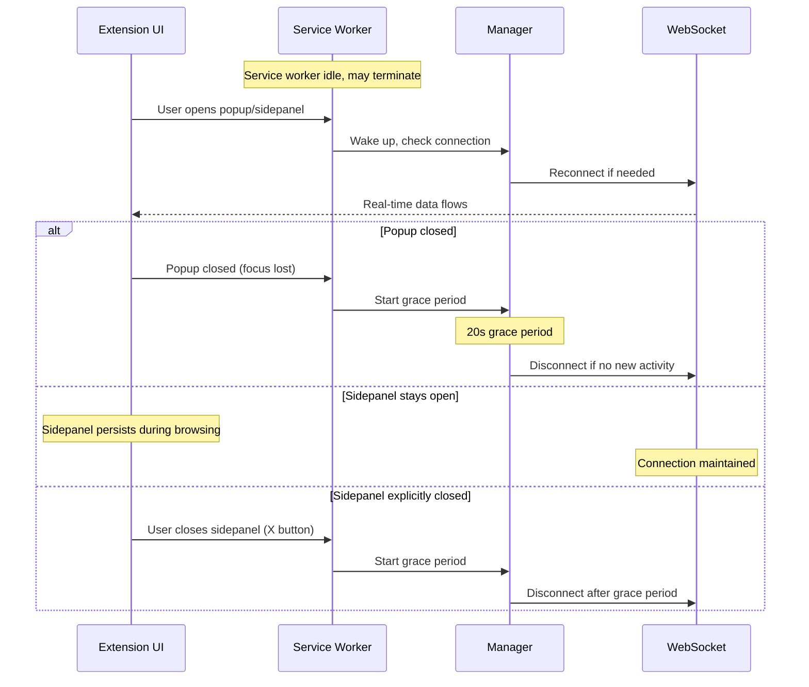

# Perps Connection Architecture

## Overview

The Perps connection system uses a layered architecture where each layer has clear responsibilities and ownership boundaries. This document describes the extension-specific implementation.

## Layer Stack



## Layer Responsibilities

### Hook Layer: usePerpsConnection

**What it is**: React hook that provides access to connection state and methods for UI components

**Owns**:

- Nothing - it's a pure accessor hook

**Responsibilities**:

- Read connection context from PerpsConnectionProvider
- Provide type-safe access to connection state and methods
- Throw error if used outside of Provider

**Does NOT**:

- Store any state
- Perform any logic
- Know about Manager, Controller, or Provider implementation

**Key API**: Returns `{ isConnected, isConnecting, isInitialized, error, connect, disconnect, reconnectWithNewContext, resetError }`

**Usage**: Primary API for all UI components to interact with the connection system

---

### UI Layer: PerpsConnectionProvider

**What it is**: React Context provider that exposes connection state and methods to UI components

**Owns**:

- Local React state (polled from Manager)
- Polling interval for state synchronization
- UI-level error handling decisions (show error screen vs skeleton)
- Internal visibility lifecycle management (via `usePerpsConnectionLifecycle` hook)

**Responsibilities**:

- Translate singleton Manager state into React state
- Provide stable callback functions to UI
- Decide when to show loading skeleton vs error screen vs content
- Handle popup/tab visibility changes (connect when visible, disconnect when hidden)
- Handle E2E mode with mock state

**Does NOT**:

- Manage actual connection lifecycle (delegates to Manager)
- Know about WebSockets or providers
- Handle race conditions or reconnection logic

**Exposes**: Connection context via `PerpsConnectionContext` that `usePerpsConnection` hook reads from

**Note**: Internally uses `usePerpsConnectionLifecycle` to automatically connect/disconnect based on popup visibility and tab focus. Account and network change monitoring is handled by the Manager layer via Redux subscriptions, not by the Provider.

---

### Manager Layer: PerpsConnectionManager (Singleton)

**What it is**: Orchestrator that coordinates connection lifecycle and manages connection state

**Owns**:

- Connection state (`isConnected`, `isConnecting`, `isInitialized`, `error`)
- Race condition guards (`initPromise`, `pendingReconnectPromise`)
- Grace period timer (`CONNECTION_GRACE_PERIOD_MS` = 20s delay before disconnect)
- Connection timeout management (30s limit for connection attempts)
- Reference counting (tracks active provider instances)
- Stream manager caches (via PerpsStreamManager singleton - separate channels for prices, orders, positions, account state; provides instant cached data to subscribers; supports pause/resume for race condition prevention)
- Redux store subscription for account/network change monitoring

**Responsibilities**:

- Coordinate connect/disconnect based on provider reference counting
- Monitor Redux for account and network changes, trigger reconnection automatically
- Handle force flag logic (cancel pending operations vs wait, including timeout timers)
- Implement grace period (20s) to prevent flickering disconnects
- Enforce connection timeout (30s) to prevent indefinite hanging
- Clear stream caches during reconnection
- Delegate actual provider initialization to Controller
- Validate connection with WebSocket health checks via `provider.ping()` (replaces blocking HTTP calls)

**Does NOT**:

- Create or manage provider instances
- Know about specific exchange protocols
- Update Redux state
- Handle WebSocket connections directly

**Key Methods**:

- `connect()` - Initialize connection if first provider instance
- `disconnect()` - Disconnect if last provider instance (after grace period)
- `reconnectWithNewContext(options?: ReconnectOptions)` - Coordinate full reconnection with optional force flag

---

### Controller Layer: PerpsController (from @metamask/perps-controller)

**What it is**: Controller that manages provider instances and exposes data methods. Part of the `@metamask/perps-controller` core package.

**Owns**:

- Provider instances (`Map<string, Provider>`)
- Redux state (account state, orders, positions, market data)
- Initialization flags (`isInitialized`, `isReinitializing`)
- Network configuration (testnet vs mainnet)

**Responsibilities**:

- Create and destroy provider instances
- Disconnect old providers and create new ones during reinitialization
- Expose data access methods (`getAccountState`, `placeOrder`, etc.)
- Update Redux state based on provider data
- Handle provider-level errors and log to Sentry

**Does NOT**:

- Handle reconnection orchestration (Manager's job)
- Know about force flags or pending operations
- Manage UI state or React lifecycle
- Implement grace periods or reference counting

**Key Methods**:

- `initializeProviders()` - Disconnect old providers, create new ones
- `disconnect()` - Disconnect provider and reset initialization state
- `getAccountState()`, `placeOrder()`, etc. - Data access methods

---

### Provider Layer: HyperLiquidProvider

**What it is**: Exchange-specific implementation of the provider interface

**Owns**:

- REST API clients (InfoClient for queries, ExchangeClient for trading)
- WebSocket connection for real-time subscriptions
- Exchange-specific API request formatting
- Protocol-specific message handling
- Subscription management

**Responsibilities**:

- Make REST API calls for trading operations (place/cancel/edit orders)
- Make REST API calls for data queries (account state, positions, market info)
- Establish and maintain WebSocket connection for real-time subscriptions
- Provide `ping()` for WebSocket health checks (5s timeout) - used by Manager for connection validation
- Format requests according to exchange protocol
- Parse responses and normalize data
- Handle exchange-specific errors
- Manage subscriptions (prices, order fills, position updates)

**Does NOT**:

- Know about Redux or React
- Handle reconnection logic
- Implement grace periods or timeouts
- Manage multiple provider instances

**Communication Methods**:

- **REST API**: Account queries, order placement/cancellation, balance checks, market data
- **WebSocket**: Real-time price updates, order fill notifications, position changes, health checks

**Key Methods**:

- `connect()` - Initialize REST clients and WebSocket connection
- `disconnect()` - Close WebSocket and cleanup clients
- `ping()` - WebSocket health check to validate connection responsiveness
- `placeOrder()`, `cancelOrder()` - Trading via REST API
- `getAccountState()`, `getPositions()` - Data queries via REST API
- `subscribeToPrices()`, `subscribeToOrders()` - Real-time updates via WebSocket

---

## Design Principles

- **Manager Orchestrates, Controller Provides Primitives**: Manager coordinates "when" and "why" to reconnect; Controller provides "how" to initialize/disconnect providers
- **Provider is Exchange-Agnostic Interface**: Controller doesn't know about HyperLiquid specifics; easy to add new providers
- **UI Layer is Presentation Only**: Provider (React) polls state from Manager (singleton); no business logic in React components
- **Clear Ownership Boundaries**: Each layer owns specific concerns; no cross-layer state management; dependencies flow downward only

---

## Key Methods by Layer

### Manager Layer Methods

| Method                      | Signature                                       | Purpose                                         |
| --------------------------- | ----------------------------------------------- | ----------------------------------------------- |
| `connect()`                 | `() => Promise<void>`                           | Initialize connection if first provider         |
| `disconnect()`              | `() => Promise<void>`                           | Disconnect if last provider (with grace period) |
| `reconnectWithNewContext()` | `(options?: ReconnectOptions) => Promise<void>` | Coordinate full reconnection                    |
| `getConnectionState()`      | `() => ConnectionState`                         | Get current connection state (for polling)      |
| `resetError()`              | `() => void`                                    | Clear error state                               |

### Controller Layer Methods

| Method                  | Signature                     | Purpose                              |
| ----------------------- | ----------------------------- | ------------------------------------ |
| `initializeProviders()` | `() => Promise<void>`         | Disconnect old, create new providers |
| `disconnect()`          | `() => Promise<void>`         | Disconnect provider, reset flags     |
| `getAccountState()`     | `() => Promise<AccountState>` | Fetch account data                   |
| `placeOrder()`          | `(order) => Promise<void>`    | Submit order                         |

### Provider Layer Methods (React)

| Method                      | Signature                     | Purpose              |
| --------------------------- | ----------------------------- | -------------------- |
| `connect()`                 | `() => Promise<void>`         | Delegates to Manager |
| `disconnect()`              | `() => Promise<void>`         | Delegates to Manager |
| `reconnectWithNewContext()` | `(options?) => Promise<void>` | Delegates to Manager |
| `resetError()`              | `() => void`                  | Delegates to Manager |

---

## ReconnectOptions

```typescript
interface ReconnectOptions {
  force?: boolean; // default: false
}
```

**Only used at Manager layer** - Controls pending operation handling:

- `force: false` (default): Waits for pending operations → safe for automatic reconnects
- `force: true`: Cancels pending operations AND clears connection timeout timer → user-initiated retry

**Why Controller doesn't need it**: Manager calls `initializeProviders()` directly which always does full reinitialization with provider disconnect/recreate.

**Additional Effects of force: true**:

- Cancels grace period immediately
- Clears connection timeout timer
- Clears all pending promises: `initPromise`, `pendingReconnectPromise`

---

## Flow Scenarios

### User Retry (force: true)

**Why each layer is involved**:

- **UI**: User clicks retry button → Provider.reconnectWithNewContext({ force: true })
- **Provider (React)**: Delegates to Manager singleton
- **Manager**: Cancels pending promises, clears caches, calls Controller.initializeProviders()
- **Controller**: Disconnects old provider, creates new one
- **Provider (Exchange)**: Closes WebSocket, establishes new connection



### Account Switch (force: false)

**Why each layer is involved**:

- **UI**: Account changed → Lifecycle hook calls reconnect
- **Provider (React)**: Delegates to Manager
- **Manager**: Waits for pending operations, then reinitializes
- **Controller**: Disconnects old provider (old account), creates new one
- **Provider (Exchange)**: Closes WebSocket, establishes new connection with new account context



---

## Race Condition Guards

Each layer protects against its own concurrency concerns:

| Guard                     | Location   | Purpose                           | Why This Layer                     |
| ------------------------- | ---------- | --------------------------------- | ---------------------------------- |
| `initPromise`             | Manager    | Prevents concurrent connect()     | Manager owns connection lifecycle  |
| `pendingReconnectPromise` | Manager    | Prevents concurrent reconnects    | Manager coordinates reconnection   |
| `isReinitializing`        | Controller | Prevents concurrent provider init | Controller owns provider instances |

### Rapid Account Switch Protection

**Scenario**: User rapidly switches Account A → B → C

The Manager's `pendingReconnectPromise` ensures only one reconnection happens at a time:

1. **A → B**: Triggers `reconnectWithNewContext()` → creates `pendingReconnectPromise`
2. **B → C** (during B reconnection): Calls `reconnectWithNewContext()` again
3. **Manager**: Returns existing `pendingReconnectPromise` (doesn't start new reconnection)
4. **When B completes**: Promise is cleared, state is updated
5. **C change detected**: New reconnection starts with fresh promise

**Result**: The final account (C) will be correctly connected because:

- Each reconnection fetches account address fresh at execution time
- Redux subscription in Manager detects every account change and queues reconnection
- `pendingReconnectPromise` serializes reconnections to prevent race conditions
- The last account change always triggers a reconnection after previous one completes
- Stream caches are cleared immediately on account change to prevent old data from showing

---

## Extension-Specific Lifecycle

### UI Contexts: Popup vs Sidepanel vs Tab

The extension UI can run in three contexts, each with different lifecycle characteristics:

| Context       | Characteristics                                | Persistence | Connection Behavior                           |
| ------------- | ---------------------------------------------- | ----------- | --------------------------------------------- |
| **Popup**     | Small viewport, closes when focus is lost      | Low         | Disconnect on popup close (with grace period) |
| **Sidepanel** | Persistent panel alongside browser content     | High        | Stays connected while sidepanel is open       |
| **Tab**       | Full viewport in dedicated tab, stable session | High        | Standard visibility-based connection          |

### Sidepanel Lifecycle

The sidepanel is a newer UI context that provides a persistent trading experience:



**Key differences from Popup:**

- Sidepanel **doesn't close when user clicks elsewhere** - remains open while browsing
- Sidepanel persists across **tab switches within the same window**
- WebSocket connections remain stable during normal browsing
- Only disconnects when user **explicitly closes** the sidepanel (via X button or toggle)

**Detection in code:**

```typescript
// Check current UI context
const isSidepanel = process.env.ENVIRONMENT_TYPE === 'sidepanel';
const isPopup = process.env.ENVIRONMENT_TYPE === 'popup';
const isTab = process.env.ENVIRONMENT_TYPE === 'fullscreen';
```

### Service Worker Considerations (MV3)

The extension uses Manifest V3 with a service worker background:

- **Service worker lifecycle**: May be terminated when idle, wakes on events
- **WebSocket handling**: Connections are managed by the service worker
- **Reconnection**: Manager handles service worker wake-up reconnection



### Visibility Events

Instead of mobile app foreground/background:

| Event                | Trigger                          | Action                              |
| -------------------- | -------------------------------- | ----------------------------------- |
| Popup opened         | User clicks extension icon       | `connect()` if not connected        |
| Popup closed         | User clicks away                 | Start grace period, then disconnect |
| Sidepanel opened     | User opens sidepanel             | `connect()` if not connected        |
| Sidepanel closed     | User closes sidepanel (X button) | Start grace period, then disconnect |
| Sidepanel tab switch | User switches tabs (same window) | Connection maintained (no action)   |
| Tab becomes visible  | User switches to Perps tab       | `connect()` if not connected        |
| Tab becomes hidden   | User switches away               | Start grace period                  |
| Window focus         | Browser window gains focus       | Resume connection if needed         |
| Service worker wake  | Event triggers worker            | Check and restore connection        |

---

## When to Use What

| Scenario             | Method                      | Options           | Which Layer Decides                        | Notes                                         |
| -------------------- | --------------------------- | ----------------- | ------------------------------------------ | --------------------------------------------- |
| Initial load         | `connect()`                 | -                 | Manager (via Provider hook)                | Uses WebSocket ping for validation            |
| User retry button    | `reconnectWithNewContext()` | `{ force: true }` | UI → Provider → Manager                    | Cancels pending operations + timeout timer    |
| Account switch       | `reconnectWithNewContext()` | default           | Manager (automatic via Redux subscription) | Clears caches immediately before reconnection |
| Network switch       | `reconnectWithNewContext()` | default           | Manager (automatic via Redux subscription) | Same as account switch                        |
| Popup closed         | `disconnect()`              | -                 | Provider lifecycle hook → Manager          | Grace period (20s) before actual disconnect   |
| Popup opened         | `connect()`                 | -                 | Provider lifecycle hook → Manager          | Immediate connection attempt                  |
| Sidepanel opened     | `connect()`                 | -                 | Provider lifecycle hook → Manager          | Immediate connection attempt                  |
| Sidepanel closed     | `disconnect()`              | -                 | Provider lifecycle hook → Manager          | Grace period before disconnect                |
| Sidepanel tab switch | (no action)                 | -                 | -                                          | Connection maintained automatically           |
| Tab visibility       | varies                      | -                 | Provider lifecycle hook                    | Connect on visible, grace period on hidden    |
| Service worker wake  | `connect()`                 | -                 | Manager                                    | Automatic on worker wake                      |

---

## Error Handling by Layer

Each layer handles errors at its own level:

1. **Provider Layer (Exchange)**:
   - Catches WebSocket errors, logs to Sentry
   - Returns error state to Controller

2. **Controller Layer**:
   - Catches provider errors, logs to Sentry
   - Updates Redux error state
   - Throws to Manager

3. **Manager Layer**:
   - Catches Controller errors, logs to console
   - Sets local error state
   - Does NOT throw (prevents crash)

4. **Provider Layer (React)**:
   - Catches Manager errors, logs to Sentry
   - Polls error state from Manager
   - Decides UI presentation (error screen vs retry button)

**All layers update state regardless of error to keep UI in sync.**

---

## Additional Resources

- **[Perps Architecture](./perps-architecture.md)** - Overall architecture overview
- **[Perps Screens](./perps-screens.md)** - UI screen documentation
- **[HyperLiquid Protocol](./hyperliquid/)** - Protocol-specific documentation
