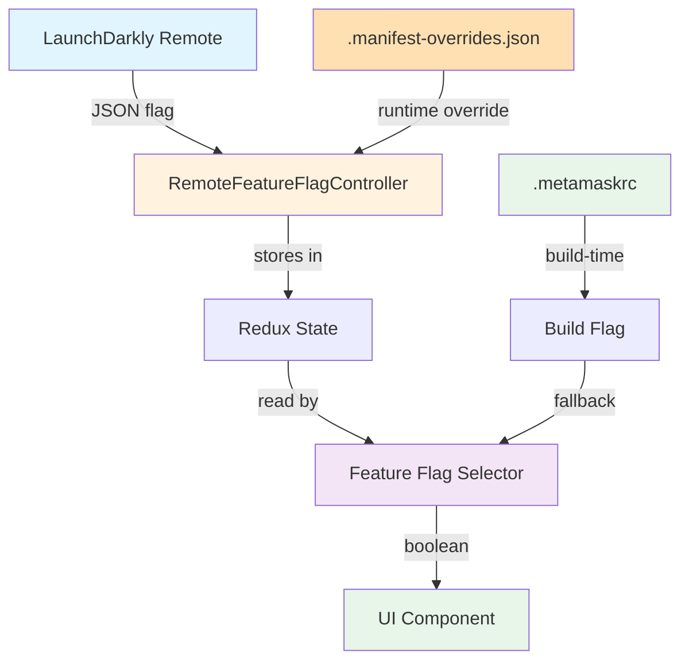

# Perps Feature Flags Framework

## Overview

Framework for controlling Perps feature availability through LaunchDarkly with local fallback support. Supports version-gated rollouts and gradual feature releases.

**Key Design Principles:**

- LaunchDarkly is the single source of truth for feature enablement
- Version-gated flags ensure features only activate on compatible app/extension versions
- Local environment variables (`.metamaskrc`) provide development/testing fallback
- Graceful degradation when LaunchDarkly is unavailable

## Architecture (Extension)



### Extension-Specific Configuration

**Build-time flags** via `.metamaskrc`:

```bash
# Enable Perps feature
PERPS_ENABLED=true
```

**Runtime overrides** via `.manifest-overrides.json`:

```json
{
  "_flags": {
    "remoteFeatureFlags": {
      "perpsTradingEnabled": true
    }
  }
}
```

Then in `.metamaskrc`:

```bash
MANIFEST_OVERRIDES=.manifest-overrides.json
```

## Flag Types

### Version-Gated Boolean Flags

Used for feature on/off toggles with version requirements.

**Interface:**

```typescript
interface VersionGatedFeatureFlag {
  enabled: boolean;
  minimumVersion: string;
}
```

**Example LaunchDarkly JSON:**

```json
{
  "enabled": true,
  "minimumVersion": "7.60.0"
}
```

**Behavior:**

- `enabled: true` + version >= `minimumVersion` = feature ON
- `enabled: true` + version < `minimumVersion` = feature OFF
- `enabled: false` = feature OFF (regardless of version)
- Invalid/missing flag = fallback to local environment variable

### String Flags (for A/B Tests)

See [Perps A/B Testing Framework](./perps-ab-testing.md) for variant-based flags.

---

## Implementation Guide (Extension)

### Adding a New Feature Flag

#### 1. Define the Selector

**File:** `ui/selectors/perps/feature-flags.ts`

```typescript
import { createSelector } from 'reselect';
import { getRemoteFeatureFlags } from '../../../shared/modules/selectors';

/**
 * Selector for My Feature flag
 * Controls visibility of My Feature in the UI
 *
 * @returns boolean - true if feature should be shown, false otherwise
 */
export const selectPerpsMyFeatureEnabled = createSelector(
  getRemoteFeatureFlags,
  (remoteFeatureFlags) => {
    // Build-time flag from .metamaskrc
    const buildFlag = process.env.PERPS_MY_FEATURE_ENABLED === 'true';

    // Remote flag from LaunchDarkly
    const remoteFlag = remoteFeatureFlags?.perpsMyFeatureEnabled;

    // Remote takes precedence, fallback to build-time
    return remoteFlag ?? buildFlag;
  },
);
```

**Default Behavior Options:**

| Pattern       | Default  | Use Case                                              |
| ------------- | -------- | ----------------------------------------------------- |
| `=== 'true'`  | Disabled | New experimental features                             |
| `!== 'false'` | Enabled  | Features that should be on unless explicitly disabled |

#### 2. Add Build-Time Variable

**File:** `.metamaskrc.dist` (add example)

```bash
# Perps feature flags
PERPS_ENABLED=false
PERPS_MY_FEATURE_ENABLED=false
```

**File:** `builds.yml` (if needed for specific builds)

```yaml
env:
  - PERPS_ENABLED
  - PERPS_MY_FEATURE_ENABLED
```

#### 3. Add Runtime Override Option

**File:** `.manifest-overrides.json` (for testing)

```json
{
  "_flags": {
    "remoteFeatureFlags": {
      "perpsMyFeatureEnabled": true
    }
  }
}
```

#### 4. Use in Component

```typescript
import { useSelector } from 'react-redux';
import { selectPerpsMyFeatureEnabled } from '../../../selectors/perps/feature-flags';

const MyComponent = () => {
  const isMyFeatureEnabled = useSelector(selectPerpsMyFeatureEnabled);

  if (!isMyFeatureEnabled) {
    return null; // or alternative UI
  }

  return <MyFeature />;
};
```

#### 5. Add Unit Tests

**File:** `ui/selectors/perps/feature-flags.test.ts`

Follow existing test patterns covering:

- Default behavior (when env var not set)
- Remote flag takes precedence over build-time
- Fallback to build-time when remote is unavailable

---

## Available Flags Reference

| Redux Property                                     | LaunchDarkly Key                                         | Env Variable                                   | Default | Purpose                   |
| -------------------------------------------------- | -------------------------------------------------------- | ---------------------------------------------- | ------- | ------------------------- |
| `perpsPerpTradingEnabled`                          | `perps-perp-trading-enabled`                             | `MM_PERPS_ENABLED`                             | false   | Main Perps feature toggle |
| `perpsPerpTradingServiceInterruptionBannerEnabled` | `perps-perp-trading-service-interruption-banner-enabled` | `MM_PERPS_SERVICE_INTERRUPTION_BANNER_ENABLED` | false   | Service disruption banner |
| `perpsPerpGtmOnboardingModalEnabled`               | `perps-perp-gtm-onboarding-modal-enabled`                | `MM_PERPS_GTM_MODAL_ENABLED`                   | false   | GTM onboarding modal      |
| `perpsOrderBookEnabled`                            | `perps-order-book-enabled`                               | `MM_PERPS_ORDER_BOOK_ENABLED`                  | false   | Order Book feature        |

---

## LaunchDarkly Configuration

### Naming Convention

| Format                    | Example                    |
| ------------------------- | -------------------------- |
| LaunchDarkly (kebab-case) | `perps-order-book-enabled` |
| Redux state (camelCase)   | `perpsOrderBookEnabled`    |

### Flag Structure (JSON type)

```json
{
  "fallthrough": {
    "variation": 0
  },
  "offVariation": 1,
  "variations": [
    {
      "name": "Enabled",
      "value": {
        "enabled": true,
        "minimumVersion": "7.60.0"
      }
    },
    {
      "name": "Disabled",
      "value": {
        "enabled": false,
        "minimumVersion": "0.0.0"
      }
    }
  ]
}
```

### Version Gating

The `minimumVersion` field ensures features only activate on compatible app versions:

- **Format:** Semantic version string (e.g., `"7.60.0"`)
- **Comparison:** Uses `compare-versions` library with `>=` operator
- **Use case:** Prevent feature activation on older app versions that lack required code

---

## Troubleshooting (Extension)

### Flag Not Taking Effect

1. **Check Redux state:** Open Redux DevTools and verify flag exists in `metamask.remoteFeatureFlags`
2. **Check build:** Ensure you rebuilt after changing `.metamaskrc` (`yarn start`)
3. **Check selector:** Verify selector is imported and used correctly

### Build-Time Flag Not Working

1. **Rebuild extension** after changing `.metamaskrc` - env vars are baked in at build time
2. **Check variable name:** Must match exactly (case-sensitive)
3. **Clear cache:** Run `yarn webpack:clearcache` if needed

### Runtime Override Not Working

1. **Verify `.manifest-overrides.json`:** Must be valid JSON
2. **Check `.metamaskrc`:** `MANIFEST_OVERRIDES=.manifest-overrides.json` must be set
3. **Rebuild after changes:** Manifest overrides are applied at build time

### Version Gating (if implemented)

1. **Check extension version:** `browser.runtime.getManifest().version`
2. **Verify `minimumVersion` format:** Must be valid semver string

---

## Related Files (Extension)

- **Selectors:** `ui/selectors/perps/feature-flags.ts` (to be created)
- **Tests:** `ui/selectors/perps/feature-flags.test.ts` (to be created)
- **Environment example:** `.metamaskrc.dist`
- **Build config:** `builds.yml`
- **Remote flags controller:** `app/scripts/controllers/remote-feature-flag-controller.ts`

---

## Extension vs Mobile Differences

| Aspect           | Mobile                     | Extension                       |
| ---------------- | -------------------------- | ------------------------------- |
| Local config     | `.js.env`                  | `.metamaskrc`                   |
| Runtime override | N/A                        | `.manifest-overrides.json`      |
| Build trigger    | Metro bundler restart      | `yarn start` rebuild            |
| Version check    | `react-native-device-info` | `browser.runtime.getManifest()` |

---

## Related Documentation

- [Perps A/B Testing Framework](./perps-ab-testing.md)
- [Perps Connection Architecture](./perps-connection-architecture.md)
- [Perps MetaMetrics Reference](./perps-metametrics-reference.md)
