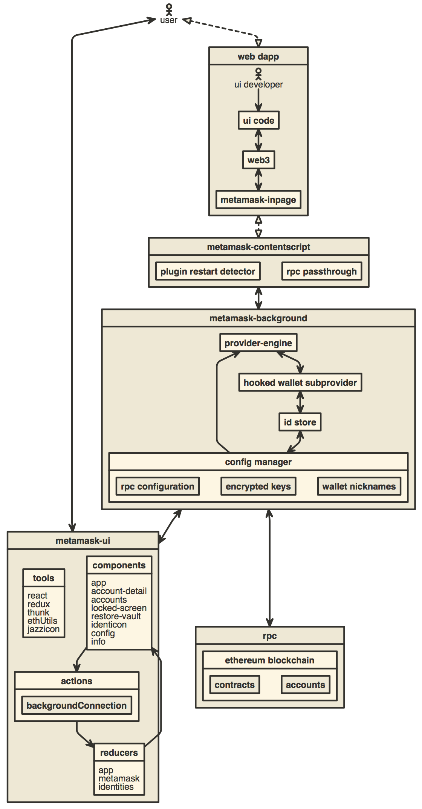

# Guide to Porting MetaMask to a New Environment

MetaMask has been under continuous development for nearly two years now, and we’ve gradually discovered some useful abstractions that have allowed us to grow more easily. A couple of those layers together allow MetaMask to be ported to new environments and contexts increasingly easily (although it still could be easier, and please let us know if you get stuck!)

Before we get started, it's worth becoming familiar with our basic architecture:



The `metamask-background` describes the file at `app/scripts/background.js`, which is the web extension singleton. This context instantiates an instance of the `MetaMask Controller`, which represents the user's accounts, a connection to the blockchain, and the interaction with new Dapps.

When a new site is visited, the WebExtension creates a new `ContentScript` in that page's context, which can be seen at `app/scripts/contentscript.js`. This script represents a per-page setup process, which creates the per-page `web3` api, connects it to the background script via the Port API (wrapped in a [stream abstraction](https://github.com/substack/stream-handbook)), and injected into the DOM before anything loads.

You can choose to use this streaming interface to connect to the MetaMask controller over any transport you can wrap with a stream, by connecting it to the [metamask-inpage-provider](https://github.com/MetaMask/metamask-inpage-provider), but you can also construct a provider per domain like this:

```javascript
const providerFromEngine = require('eth-json-rpc-middleware/providerFromEngine')

/**
* returns a provider restricted to the requesting domain
**/
function incomingConnection (domain, getSiteMetadata) {
  const engine = metamaskController.setupProviderEngine(domain, getSiteMetadata)
  const provider = providerFromEngine(engine)
  return provider
}
```

Please note if you take this approach, you are responsible for cleaning up the filters when the page is closed:

```
const filterMiddleware = engine._middleware.filter(mid => mid.name === 'filterMiddleware')[0]
filterMiddleware.destroy()
```

### getSiteMetadata()

This method is used to enhance our confirmation screens with images and text representing the requesting domain.

It should return a promise that resolves with an object with the following properties:

- `name`: The requesting site's name.
- `icon`: A URI representing the site's logo.

### Using the Streams Interface

Only use this if you intend to construct the [metamask-inpage-provider](https://github.com/MetaMask/metamask-inpage-provider) over a stream!

The most confusing part about porting MetaMask to a new platform is the way we provide the Web3 API over a series of streams between contexts. Once you understand how we create the [MetamaskInpageProvider](https://github.com/MetaMask/metamask-inpage-provider/blob/master/index.js) in the [inpage.js script](../app/scripts/inpage.js), you will be able to understand how the [port-stream](../app/scripts/lib/port-stream.js) is just a thin wrapper around the [postMessage API](https://developer.mozilla.org/en-US/docs/Web/API/Window/postMessage), and a similar stream API can be wrapped around any communication channel to communicate with the `MetaMaskController` via its `setupUntrustedCommunication(stream, domain)` method.

### The MetaMask Controller

The core functionality of MetaMask all lives in what we call [The MetaMask Controller](https://github.com/MetaMask/metamask-extension/blob/master/app/scripts/metamask-controller.js). Our goal for this file is for it to eventually be its own javascript module that can be imported into any JS-compatible context, allowing it to fully manage an app's relationship to Ethereum.

#### Constructor

When calling `new MetaMask(opts)`, many platform-specific options are configured. The keys on `opts` are as follows:

- initState: The last emitted state, used for restoring persistent state between sessions.
- platform: The `platform` object defines a variety of platform-specific functions, including opening the confirmation view, and opening websites.
- encryptor - An object that provides access to the desired encryption methods.

##### Encryptor

An object that provides two simple methods, which can encrypt in any format you prefer. This parameter is optional, and will default to the browser-native WebCrypto API.

- encrypt(password, object) - returns a Promise of a string that is ready for storage.
- decrypt(password, encryptedString) - Accepts the encrypted output of `encrypt` and returns a Promise of a restored `object` as it was encrypted.


##### Platform Options

The `platform` object has a variety of options:

- reload (function) - Will be called when MetaMask would like to reload its own context.
- openWindow ({ url }) - Will be called when MetaMask would like to open a web page. It will be passed a single `options` object with a `url` key, with a string value.
- getVersion() - Should return the current MetaMask version, as described in the current `CHANGELOG.md` or `app/manifest.json`.

#### [metamask.getState()](https://github.com/MetaMask/metamask-extension/blob/master/app/scripts/metamask-controller.js#L241)

This method returns a javascript object representing the current MetaMask state. This includes things like known accounts, sent transactions, current exchange rates, and more! The controller is also an event emitter, so you can subscribe to state updates via `metamask.on('update', handleStateUpdate)`. State examples available [here](https://github.com/MetaMask/metamask-extension/tree/master/development/states) under the `metamask` key. (Warning: some are outdated)

#### [metamask.getApi()](https://github.com/MetaMask/metamask-extension/blob/master/app/scripts/metamask-controller.js#L274-L335)

Returns a JavaScript object filled with callback functions representing every operation our user interface ever performs. Everything from creating new accounts, changing the current network, to sending a transaction, is provided via these API methods. We export this external API on an object because it allows us to easily expose this API over a port using [dnode](https://www.npmjs.com/package/dnode), which is how our WebExtension's UI works!

### The UI

The MetaMask UI is essentially just a website that can be configured by passing it the API and state subscriptions from above. Anyone could make a UI that consumes these, effectively reskinning MetaMask.

You can see this in action in our file [ui/index.js](https://github.com/MetaMask/metamask-extension/blob/master/ui/index.js). There you can see the background connection being passed in, which is essentially the MetaMask controller. With access to that object, the UI is able to initialize a whole React/Redux app that relies on this API for its account/blockchain-related/persistent states.

## Putting it Together

As an example, a WebExtension is always defined by a `manifest.json` file. [In ours](https://github.com/MetaMask/metamask-extension/blob/master/app/manifest.json#L31), you can see that [background.js](https://github.com/MetaMask/metamask-extension/blob/master/app/scripts/background.js) is defined as a script to run in the background, and this is the file that we use to initialize the MetaMask controller.

In that file, there's a lot going on, so it's maybe worth focusing on our MetaMask controller constructor to start. It looks something like this:

```javascript
const controller = new MetamaskController({
    // User confirmation callbacks:
    showUnconfirmedMessage: triggerUi,
    showUnapprovedTx: triggerUi,
    // initial state
    initState,
    // platform specific api
    platform,
})
```
Since `background.js` is essentially the Extension setup file, we can see it doing all the things specific to the extension platform:
- Defining how to open the UI for new messages, transactions, and even requests to unlock (reveal to the site) their account.
- Provide the instance's initial state, leaving MetaMask persistence to the platform.
- Providing a `platform` object. This is becoming our catch-all adapter for platforms to define a few other platform-variant features we require, like opening a web link. (Soon we will be moving encryption out here too, since our browser-encryption isn't portable enough!)

## Ports, streams, and Web3!

Everything so far has been enough to create a MetaMask wallet on virtually any platform that runs JS, but MetaMask's most unique feature isn't being a wallet, it's providing an Ethereum-enabled JavaScript context to websites.

MetaMask has two kinds of [duplex stream APIs](https://github.com/substack/stream-handbook#duplex) that it exposes:
- [metamask.setupTrustedCommunication(connectionStream, originDomain)](https://github.com/MetaMask/metamask-extension/blob/master/app/scripts/metamask-controller.js#L352) - This stream is used to connect the user interface over a remote port, and may not be necessary for contexts where the interface and the metamask-controller share a process.
- [metamask.setupUntrustedCommunication(connectionStream, originDomain)](https://github.com/MetaMask/metamask-extension/blob/master/app/scripts/metamask-controller.js#L337) - This method is used to connect a new web site's web3 API to MetaMask's blockchain connection. Additionally, the `originDomain` is used to block detected phishing sites.

### Web3 as a Stream

If you are making a MetaMask-powered browser for a new platform, one of the trickiest tasks will be injecting the Web3 API into websites that are visited. On WebExtensions, we actually have to pipe data through a total of three JS contexts just to let sites talk to our background process (site -> contentscript -> background).

To see how we do that, you can refer to the [inpage script](https://github.com/MetaMask/metamask-extension/blob/master/app/scripts/inpage.js) that we inject into every website. There you can see it creates a multiplex stream to the background, and uses it to initialize what we call the [MetamaskInpageProvider](https://github.com/MetaMask/metamask-inpage-provider/blob/master/index.js), which you can see stubs a few methods out, but mostly just passes calls to `sendAsync` through the stream it's passed! That's really all the magic that's needed to create a web3-like API in a remote context, once you have a stream to MetaMask available.

In `inpage.js` you can see we create a `PortStream`, that's just a class we use to wrap WebExtension ports as streams, so we can reuse our favorite stream abstraction over the more irregular API surface of the WebExtension. In a new platform, you will probably need to construct this stream differently. The key is that you need to construct a stream that talks from the site context to the background. Once you have that set up, it works like magic!

If streams seem new and confusing to you, that's ok, they can seem strange at first. To help learn them, we highly recommend reading Substack's [Stream Handbook](https://github.com/substack/stream-handbook), or going through NodeSchool's interactive command-line class [Stream Adventure](https://github.com/workshopper/stream-adventure), also maintained by Substack.

## Conclusion

I hope this has been helpful to you! If you have any other questions, or points you think need clarification in this guide, please [open an issue on our GitHub](https://github.com/MetaMask/metamask-plugin/issues/new)!

