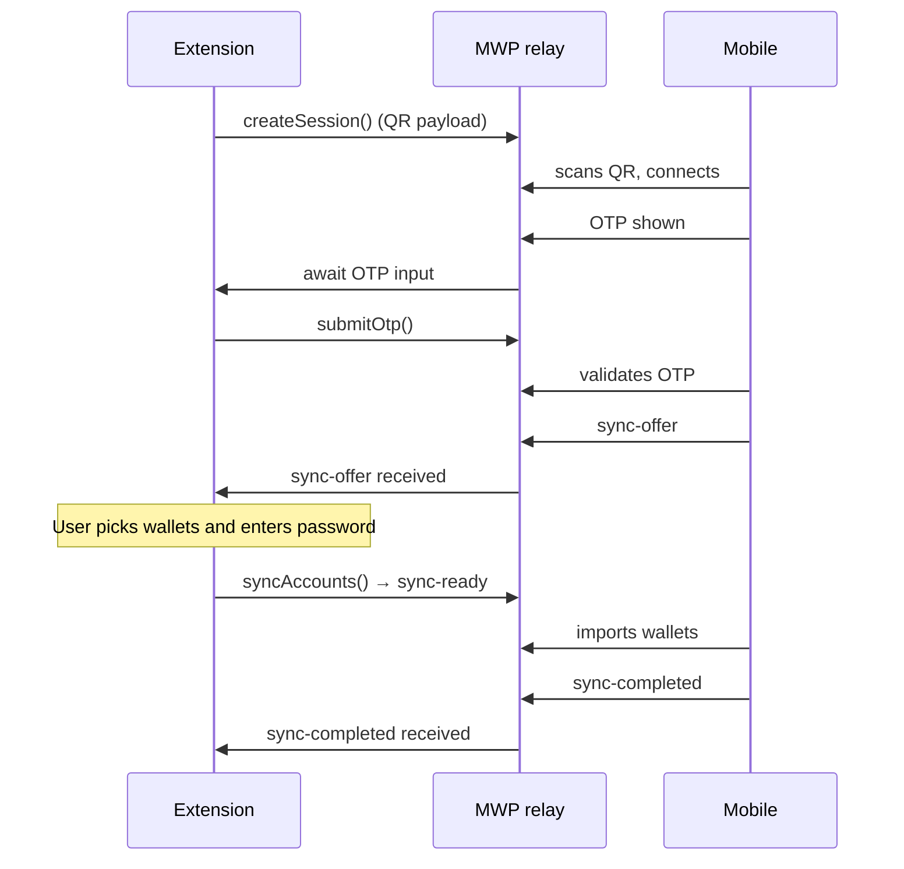

# QR Sync — Wallet Export Documentation

## Overview

QR Sync lets MetaMask Extension users pair with MetaMask Mobile over the Mobile Wallet Protocol (MWP) relay. After scanning a QR code and confirming an OTP, the user selects wallets to sync and enters their password. The extension sends a **`sync-ready`** message containing encrypted wallet secrets plus account metadata; mobile imports the selected accounts.

The extension is the **sender**; mobile is the **receiver**.

**User entry point:** Settings → **Sync with mobile** (`syncAccounts` locale key).

**Last updated:** 2026-07-16.

---

## Table of Contents

1. [End-to-end flow](#end-to-end-flow)
2. [Architecture](#architecture)
3. [Feature flag](#feature-flag)
4. [Payload contract](#payload-contract)
5. [Account tree mapping](#account-tree-mapping)
6. [Background implementation](#background-implementation)
7. [UI implementation](#ui-implementation)
8. [State management](#state-management)
9. [Product decisions](#product-decisions)
10. [Error handling & Sentry](#error-handling--sentry)
11. [Key files](#key-files)
12. [Testing](#testing)
13. [Known issues & future work](#known-issues--future-work)

---

## End-to-end flow



### UI phases (`QR_SYNC_PHASES`)

| Phase | User sees | Trigger |
| ----- | --------- | ------- |
| `idle` / `displaying-qr` | QR code to scan | `createSession()` |
| `awaiting-otp-input` | OTP entry | Mobile scanned QR |
| `awaiting-sync-offer` | Loading (“validating…”) | OTP submitted |
| `reviewing-sync-offer` | Password → wallet picker | Mobile sends `sync-offer` |
| `awaiting-sync-completion` | Loading (“syncing…”) | `syncAccounts()` sent `sync-ready` |
| `completed` | Success summary | Mobile sends `sync-completed` |
| `failed` / `cancelled` | Error or peer cancel | Timeout, disconnect, user/mobile cancel |

Phases are defined in `shared/constants/qr-sync.ts`. The UI maps them in `ui/pages/settings/sync-accounts/sync-accounts-settings.tsx`.

---

## Architecture

QR Sync splits **session transport** from **wallet export assembly**:

```
┌─────────────────────────────────────────────────────────────────┐
│  UI (sync-accounts)                                             │
│  QR → OTP → password → wallet picker → loading / success        │
└───────────────────────────┬─────────────────────────────────────┘
                            │ messengerCall
                            ▼
┌─────────────────────────────────────────────────────────────────┐
│  QrSyncController                                               │
│  MWP connect, OTP, sync-offer, sync-ready send, completion wait │
└───────────────┬─────────────────────────────┬───────────────────┘
                │                             │
                │ QrSyncDataService:          │ MWP DappClient
                │ buildWalletExportEntries    │ (relay + encryption)
                ▼                             ▼
┌───────────────────────────┐         ┌───────────────────────────┐
│  QrSyncDataService        │         │  @metamask/mobile-wallet- │
│  Account tree + keyring   │         │  protocol-dapp-client     │
│  → WalletExportEntry[]    │         └───────────────────────────┘
└───────────────────────────┘
```

**Why two layers?** The controller owns MWP session state and message timing. Export logic needs `AccountTreeController`, `AccountsController`, and `KeyringController` — kept in `QrSyncDataService` with its own restricted messenger so the controller stays focused on protocol flow.

---

## Feature flag

QR Sync is gated at build time by `QR_SYNC_ENABLED`.

| Setting | Location | Default |
| ------- | -------- | ------- |
| Build flag | `.metamaskrc` → `QR_SYNC_ENABLED='true'` | `false` in `.metamaskrc.dist` |
| Runtime check | `getIsQrSyncEnabled()` in `shared/lib/environment.ts` | Compile-time `process.env.QR_SYNC_ENABLED === 'true'` |
| Settings visibility | `ui/pages/settings/settings-registry.ts` | Sync tab only when flag is on |

**Local development**

```bash
# In .metamaskrc
QR_SYNC_ENABLED='true'

yarn start   # or yarn build:test for E2E
```

Test builds force `QR_SYNC_ENABLED=true` automatically (`development/build/set-environment-variables.js`).

---

## Payload contract

> **Locked in with mobile.** Do not change field shapes or encoding without mobile alignment.

### MWP envelope (`sync-ready`)

Every MWP message uses `QrSyncMessageVersion.V1` (`'1.0.0'`) from `app/scripts/controllers/qr-sync/constants.ts`.

The `sync-ready` message carries wallet export entries directly in `data`, with `deadline` at the envelope level:

```json
{
  "type": "sync-ready",
  "version": "1.0.0",
  "deadline": 1700000060000,
  "data": [
    {
      "type": "Mnemonic",
      "mnemonic": "<base64(utf8 space-separated BIP-39 words)>",
      "name": "Wallet 1",
      "isPrimary": true,
      "groups": [
        { "groupIndex": 0, "name": "Account 1", "pinned": true },
        { "groupIndex": 2, "name": "Hidden Account", "hidden": true }
      ]
    },
    {
      "type": "PrivateKey",
      "privateKey": "<base64(utf8 hex string, e.g. \"0xabc…\")>",
      "name": "Imported Account"
    }
  ]
}
```

### Export entries (`QrSyncReadyData`)

Defined in `app/scripts/controllers/qr-sync/types.ts` as `WalletExportEntry[]` (alias `QrSyncReadyData`).

### Encoding rules

| Field | Encoding |
| ----- | -------- |
| `mnemonic` | Wordlist indices → UTF-8 space-separated words → base64 |
| `privateKey` | UTF-8 hex string (`0x…`) → base64 |

Encoding is implemented as private methods on `QrSyncDataService` (`#encodeMnemonicForWalletExport`, `#encodePrivateKeyForWalletExport`), using `convertEnglishWordlistIndicesToCodepoints` and `@metamask/utils` base64 helpers.

### Design decisions (do not change without mobile alignment)

| Decision | Rationale |
| -------- | --------- |
| No `sel` / selection bitmap in payload | User already chose accounts in extension UI; mobile imports exactly what is sent |
| No `address` fields on export entries | User verifies correctness manually on mobile |
| Omit `hidden` / `pinned` when `false` | Smaller payload |
| Omit `isPrimary` when not primary | Only one wallet should have `isPrimary: true` |
| `deadline` on MWP envelope, not nested | Same level as `type` and `version` |
| One `Mnemonic` entry per entropy source (SRP) | Multiple HD keyrings → multiple mnemonic entries, each with its own `groups[]` |
| One `PrivateKey` entry per imported account | Each simple-key-pair account is its own top-level entry |

---

## Account tree mapping

The wallet picker reads from Redux account tree (`getAccountTree` selector).

| `AccountWalletType` | Typical contents | Exportable? | Shown in picker? |
| ------------------- | ---------------- | ----------- | ---------------- |
| `AccountWalletType.Entropy` | HD / SRP wallets (multichain tree) | **Yes** → `Mnemonic` | **Yes** (whole wallet) |
| `AccountWalletType.Keyring` + `KeyringTypes.hd` | HD keyring wallets | **Yes** → `Mnemonic` | **Yes** (whole wallet) |
| `AccountWalletType.Keyring` + `KeyringTypes.simple` | Imported private-key accounts | **Yes** → `PrivateKey` | **Yes** (whole wallet) |
| `Keyring` (hardware) | Ledger, Trezor, … | **No** | **Hidden** |
| `Snap` | Snap-managed wallets | **No** | **Hidden** |

Within an entropy wallet, each **account group** maps to one HD derivation index:

- `group.metadata.entropy.groupIndex` → `AccountGroupExport.groupIndex`
- `group.metadata.name` → `AccountGroupExport.name`
- `group.metadata.hidden` / `pinned` → export flags (omit when `false`)

Imported private-key accounts export via `KeyringController:exportAccount` → `PrivateKey` entry.

**Wallet ID format:** `entropy:<entropyId>` or `keyring:<name>` — use `extractWalletIdFromGroupId` (`ui/selectors/multichain-accounts/utils.ts`) to resolve wallet from group ID.

**Partial selection within one SRP wallet:** The export layer supports exporting a subset of account groups (one mnemonic entry with only selected `groups[]`). The current UI enforces whole-wallet selection, so users always export all groups in a selected wallet.

---

## Background implementation

### QrSyncController

**File:** `app/scripts/controllers/qr-sync/qr-sync-controller.ts`

| Method | Responsibility |
| ------ | -------------- |
| `createSession()` | Connect MWP client, show QR payload |
| `submitOtp(otp)` | Validate OTP, wait for `sync-offer` |
| `syncAccounts(password, selectedAccountGroupIds)` | Build export via data service, send `sync-ready`, wait for completion |
| `cancelOtp()` / `cancelSync()` | User-initiated cancel |

`syncAccounts` delegates export assembly:

```typescript
const exportData = await this.messenger.call(
  'QrSyncDataService:buildWalletExportEntries',
  password,
  selectedAccountGroupIds,
);
```

Then sends `sync-ready` with `deadline = now + SYNC_COMPLETION_TIMEOUT` and transitions to `awaiting-sync-completion`.

**Sync-offer validation:** `isQrSyncOffer()` requires `sessionId` (string) and `isOnboardingCompleted` (boolean). Invalid payloads (e.g. `{}`) are ignored; phase stays `awaiting-sync-offer`.

### QrSyncDataService

**File:** `app/scripts/controllers/qr-sync/qr-sync-data-service.ts`

`buildWalletExportEntries(password, selectedAccountGroupIds)`:

1. Deduplicates group IDs; rejects empty selection.
2. For each group, loads group + wallet via `AccountTreeController`.
3. **Entropy wallet** → groups by `entropyId`, one `Mnemonic` per source with selected `groups[]`.
4. **Keyring + simple** → one `PrivateKey` per group (`exportAccount`).
5. **Keyring + hd** → resolves entropy from account options, exports as `Mnemonic`.
6. **Hardware / Snap / other** → throws `Account group "…" cannot be synced.`
7. Sets `isPrimary` when entropy ID matches first HD keyring (`KeyringController:withKeyringV2`).

### Messenger delegation

| Messenger | Delegated actions |
| --------- | ----------------- |
| `qr-sync-controller-messenger.ts` | `QrSyncDataService:buildWalletExportEntries` |
| `qr-sync-data-service-messenger.ts` | `KeyringController:withKeyringV2`, `exportSeedPhrase`, `exportAccount`; `AccountTreeController:getAccountGroupObject`, `getAccountWalletObject`; `AccountsController:getAccount` |

---

## UI implementation

**Directory:** `ui/pages/settings/sync-accounts/` (replaces the earlier `add-device-tab` naming).

| Step | Component | Notes |
| ---- | --------- | ----- |
| QR scan | `components/qr-code-scan.tsx` | Shown in `idle` / `displaying-qr` |
| OTP | `components/enter-verification-code.tsx` | Calls `QrSyncController:submitOtp` |
| Password | `components/enter-password.tsx` | Required before wallet picker |
| Wallet picker | `components/add-wallets.tsx` + `wallet-selection-list.tsx` | Filters syncable wallets; whole-wallet checkboxes |
| Syncing | `components/loading-step.tsx` | After confirm |
| Success / error | `components/success.tsx`, `sync-error.tsx` | Terminal states |

**Wallet filtering** (`utils.ts`):

- `isSyncableWallet` / `filterSyncableWallets` — entropy, HD keyring, and imported (`simple`) wallets only.
- Hardware and Snap wallets are excluded from the picker.

**Selection model** (`wallet-selection-list.tsx`):

- Wallet-level checkbox selects or deselects **all** account groups in that wallet.
- Account rows are display-only (no per-account checkboxes).
- Continue is disabled when no wallets are selected.

**Sync request shape** (`types.ts`):

```typescript
type AddDeviceSyncRequest = {
  selectedAccountGroupIds: AccountGroupId[];
  syncedAccountCount: number;
  syncedWalletCount: number;
};
```

`sync-accounts-settings.tsx` calls `QrSyncController:syncAccounts` with `[password, selectedAccountGroupIds]`.

---

## State management

### Controller state (`QrSyncController`)

Persisted fields (see `metadata.ts`):

| Field | Purpose |
| ----- | ------- |
| `qrSyncPhase` | Current UI step |
| `qrSyncConnectionStatus` | MWP transport status |
| `qrSyncError` | `{ code, message }` for failures |
| `qrSyncQrPayload` | QR content for display |
| `syncOffer` | Parsed mobile `sync-offer` |
| `qrSyncSelectedAccountGroupIds` | Groups sent in last `sync-ready` |
| `qrSyncCreatedAt` / `qrSyncUpdatedAt` | Timestamps |

### UI selectors

`ui/selectors/qr-sync/qr-sync.ts` — `selectQrSyncPhase`, `selectQrSyncError`, `selectShouldCreateQrSyncSession`, etc.

### Error phase overrides

Some errors route the UI back to an earlier step instead of the generic error screen (`QR_SYNC_ERROR_PHASE_OVERRIDES` in `shared/constants/qr-sync.ts`):

- `QR_EXPIRED` → back to QR
- `OTP_EXPIRED` / `OTP_ATTEMPTS_EXCEEDED` → back to OTP

---

## Product decisions

### Whole-wallet selection only

Users sync entire wallets, not individual accounts within a wallet. This simplifies the picker UX and matches the expectation that secrets (SRP or private key) are wallet-scoped. The export layer still supports partial group lists for future UI changes.

### Hardware and Snap wallets are excluded

These wallet types cannot export portable secrets through the extension keyring APIs in a way mobile can import. They are hidden from the picker rather than shown as disabled — reduces confusion.

### No addresses in the export payload

Mobile derives addresses from mnemonic/group index or private key. Users verify accounts on mobile after import.

### Primary wallet flag

Exactly one mnemonic export should carry `isPrimary: true` (the first HD keyring’s entropy source). Mobile uses this for default wallet ordering.

### Dapp connection / Swaps interaction

Not applicable to QR Sync — this flow runs only in Settings and does not interleave with dapp connection modals.

---

## Error handling & Sentry

Unexpected failures are reported to Sentry via `messenger.captureException` and `createSentryError`. Expected user/peer outcomes (OTP expiry, QR timeout, disconnect, peer cancel) are **suppressed**.

**Full reference:** [`docs/qr-sync/SENTRY.md`](./SENTRY.md)

Summary for PMs:

- **Reported:** relay failures, mobile `sync-error`, export/password failures, message send failures.
- **Not reported:** expired QR, wrong OTP, timeouts, transport disconnect, user cancel.

---

## Key files

### Core implementation

| File | Purpose |
| ---- | ------- |
| `app/scripts/controllers/qr-sync/qr-sync-controller.ts` | MWP session lifecycle, `syncAccounts`, messaging |
| `app/scripts/controllers/qr-sync/qr-sync-data-service.ts` | Wallet export payload assembly |
| `app/scripts/controllers/qr-sync/types.ts` | Payload types, messenger types, controller state |
| `app/scripts/controllers/qr-sync/constants.ts` | Message version, action types, error messages |
| `app/scripts/controllers/qr-sync/utils.ts` | `isQrSyncOffer`, `parseMwpError`, timeouts |
| `app/scripts/controllers/qr-sync/metadata.ts` | Controller state defaults + metadata |
| `app/scripts/messenger-client-init/messengers/qr-sync-controller-messenger.ts` | Controller messenger |
| `app/scripts/messenger-client-init/messengers/qr-sync-data-service-messenger.ts` | Data service messenger |

### UI

| File | Purpose |
| ---- | ------- |
| `ui/pages/settings/sync-accounts/sync-accounts-settings.tsx` | Phase router, `syncAccounts` call |
| `ui/pages/settings/sync-accounts/components/add-wallets.tsx` | Wallet picker screen |
| `ui/pages/settings/sync-accounts/components/wallet-selection-list.tsx` | Whole-wallet selection list |
| `ui/pages/settings/sync-accounts/utils.ts` | `filterSyncableWallets` |
| `ui/selectors/qr-sync/qr-sync.ts` | Redux selectors |
| `ui/selectors/multichain-accounts/account-tree.ts` | Account tree for picker |

### Shared

| File | Purpose |
| ---- | ------- |
| `shared/constants/qr-sync.ts` | Phases, error codes, timeouts |
| `shared/lib/environment.ts` | `getIsQrSyncEnabled()` |

### Documentation

| File | Purpose |
| ---- | ------- |
| `docs/qr-sync/SENTRY.md` | Sentry reporting rules |

### Dependencies

- `@metamask/mobile-wallet-protocol-core`
- `@metamask/mobile-wallet-protocol-dapp-client`
- `eciesjs` (encrypted transport)

### Locale strings

`app/_locales/en/messages.json` — `syncAccounts`, `add_device_*`, `add_wallets_*`, `enter_verification_code_*`, `qrCode*`

---

## Testing

### Unit tests

```bash
yarn test:unit app/scripts/controllers/qr-sync/
yarn test:unit ui/pages/settings/sync-accounts/
```

**Controller** (`qr-sync-controller.test.ts`):

- Session lifecycle, `syncAccounts` → `sync-ready` send
- Invalid sync-offer rejection
- Sentry reporting (reported vs suppressed scenarios)

**Data service** (`qr-sync-data-service.test.ts`):

- Mnemonic export with `groups[]`, `isPrimary`
- Partial SRP group selection (subset of accounts in one wallet)
- Private-key and mixed mnemonic + private-key exports
- Hardware / unsupported wallet rejection
- Sentry on export failure

**UI** (`utils.test.ts`, `wallet-selection-list.test.tsx`, `add-wallets.test.tsx`):

- Syncable wallet filtering
- Whole-wallet checkbox behavior
- `selectedAccountGroupIds` passed to sync handler

### E2E tests

**File:** `test/e2e/tests/qr-sync/qr-sync.spec.ts`

Uses a mobile wallet simulator (`test/e2e/helpers/qr-sync/mobile-wallet-simulator.ts`) to drive MWP messages without a physical device.

**Current coverage:** Single HD wallet happy path (QR → OTP → password → wallet confirm → success).

**Running E2E:**

```bash
yarn build:test   # QR_SYNC_ENABLED=true on test builds
yarn test:e2e:single test/e2e/tests/qr-sync/qr-sync.spec.ts --browser=chrome
```

Follow `test/e2e/AGENTS.md` and `.agents/skills/mms-e2e-testing/SKILL.md` when adding scenarios.

### Manual QA (pending sign-off)

1. Enable `QR_SYNC_ENABLED=true` in `.metamaskrc` and rebuild.
2. Settings → Sync with mobile.
3. Complete QR + OTP flow with MetaMask Mobile.
4. Select wallets with mixed account types (SRP + imported); enter password.
5. Verify loading → success screens on extension.
6. On mobile, confirm imported accounts match names, primary wallet, hidden/pinned state.

---

## Known issues & future work

- ~ OTP display grant — P2; `QrSyncController` TODO ~line 500; MWP SDK not wired
