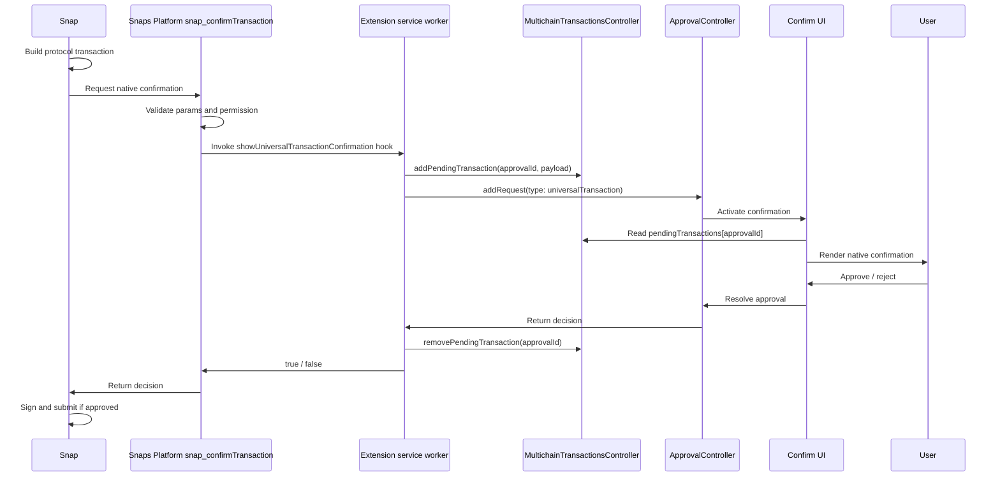

# Universal Multichain Snap Confirmation API POC

## Purpose

This POC proves that a Snap can request a native MetaMask transaction confirmation for a universal multichain transaction.

The API is protocol-agnostic. The Solana wallet snap is only the first consumer used to exercise the flow end to end.

## Architecture Summary

Snaps Platform defines and validates the Snap API. Extension implements the client hook and approval flow. Core stores pending confirmation display data. Extension UI renders the native confirmation. The Solana wallet snap is the first consumer.

Runtime flow:

1. Snap builds a protocol transaction.
2. Snap calls `snap_confirmTransaction`.
3. Snaps Platform validates the request and invokes the confirmation hook.
4. Extension receives the Snap API request through that hook.
5. Extension stores the lean transaction payload in `MultichainTransactionsController.pendingTransactions`.
6. Extension creates an `ApprovalController` request with type `universalTransaction`.
7. Extension Confirm UI renders the approval using the pending transaction data.
8. User approves or rejects.
9. Extension resolves the Snap API request.
10. Snap signs/submits only if approved.

## Flow Diagram

## Changes By Repository And Package

### MetaMask/snaps

#### `@metamask/snaps-rpc-methods`

Defines the new restricted method.

- Adds `snap_confirmTransaction`.
- Defines `ConfirmTransactionParams` with `chainId`, `accountId`, `to`, `amount`, optional `assetId`, and optional `fee`.
- Validates the protocol-agnostic payload, including CAIP chain and asset IDs.
- Registers the method in the restricted method registry.
- Declares the `showUniversalTransactionConfirmation` hook.
- Returns a boolean approval result to the Snap.

#### `@metamask/snaps-sdk`

Exposes the permission in Snap developer-facing types.

- Adds `snap_confirmTransaction: EmptyObject` to `InitialPermissions`.
- Allows Snap manifests and Snap code to type-check when requesting the new permission.

#### `@metamask/snaps-utils`

Adds manifest validation support.

- Adds `snap_confirmTransaction` to manifest permission validation.
- Allows Snaps to declare `"snap_confirmTransaction": {}` in `initialPermissions`.

#### `@metamask/snaps-controllers`

Allows the permission through Snap installation and permission handling.

- Adds `snap_confirmTransaction` to `ALLOWED_PERMISSIONS`.
- Ensures the restricted method permission is accepted by Snap controller permission handling.

### MetaMask/core

#### `@metamask/multichain-transactions-controller`

Provides the temporary Snap-to-UI state bridge.

- Adds non-persisted `pendingTransactions` keyed by `approvalId`.
- Adds `PendingMultichainTransaction`.
- Adds messenger actions: `addPendingTransaction`, `updatePendingTransaction`, `removePendingTransaction`, and `getPendingTransaction`.
- Lets the extension UI read the Snap-provided display payload while the approval is active.

### MetaMask/metamask-extension

#### Snaps Platform Integration

Connects the Snaps Platform hook to extension approval infrastructure.

- Implements `showUniversalTransactionConfirmation`.
- Creates an `approvalId`.
- Writes the lean Snap payload into `MultichainTransactionsController.pendingTransactions`.
- Creates an `ApprovalController` request with type `universalTransaction`.
- Resolves the Snap API request based on approval or rejection.
- Cleans up pending transaction state after resolution.

#### Confirmation UI

Renders the native confirmation.

- Routes `universalTransaction` approvals to universal confirmation UI.
- Reads pending transaction data by `approvalId`.
- Renders heading, From, To, Network, and Network Fee rows.
- Reuses wallet-initiated header so Advanced Details works.
- Matches EVM Send loading and fee-row visual behavior.

#### Send Flow Integration

Aligns non-EVM Send loading with EVM Send.

- Navigates to Confirm with `loader=Send` while Snap approval is being prepared.
- Replaces the old Send loader screen with the EVM-style Confirm skeleton.

### MetaMask/snap-solana-wallet

#### `@metamask/solana-wallet-snap`

Provides the first consumer.

- `SendService` builds the Solana transaction.
- Calls `snap_confirmTransaction` before signing or submitting.
- Passes account, recipient, chain ID, raw amount, optional asset ID, and optional raw fee amount.
- Continues with `SolMethod.SignAndSendTransaction` only if approved.

## What This POC Proves

- A Snap can delegate transaction confirmation UX to the extension.
- The Snap API can be the seam between protocol execution and native confirmation.
- Existing `ApprovalController` and Confirm UI architecture can support universal multichain transaction confirmations.
- Core controller state can bridge async Snap requests to React UI without moving protocol transaction construction into extension.

## What This POC Does Not Cover

- Final API naming or payload schema.
- Final permission/access policy.
- Security and privacy review.
- Validation with protocols beyond Solana.
- Production feature gating.
- Full test coverage.
- Full replacement of hardcoded fee UI with payload data.
