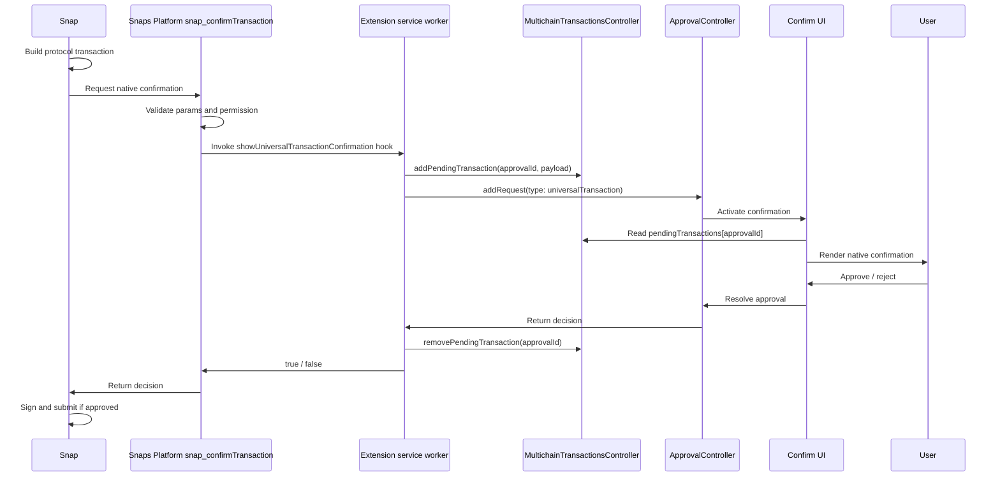

# Universal Multichain Snap Confirmation API POC

## Purpose

This POC proves that a Snap can request a native MetaMask transaction confirmation for a universal multichain transaction.

The API is protocol-agnostic. The Solana wallet snap is only the first consumer used to exercise the flow end to end.

## Architecture Summary

The Snap owns protocol-specific transaction construction and execution. The extension owns user confirmation UX. Core provides short-lived pending transaction state so the extension UI can render the Snap-provided transaction details while the approval is active.

Runtime flow:

1. Snap builds a protocol transaction.
2. Snap calls `snap_confirmTransaction`.
3. Snaps Platform validates the request and invokes the confirmation hook.
4. Extension receives the Snap API request through that hook.
5. Extension stores display data in `MultichainTransactionsController.pendingTransactions`.
6. Extension creates an `ApprovalController` request with type `universalTransaction`.
7. Extension Confirm UI renders the approval using the pending transaction data.
8. User approves or rejects.
9. Extension resolves the Snap API request.
10. Snap signs/submits only if approved.

## Flow Diagram

## Functional Components

### Snap API: `snap_confirmTransaction`

Added a new Snap-facing confirmation API path.

The API accepts protocol-agnostic transaction display data and returns a boolean approval result. It is the boundary between protocol-specific Snap execution and native extension confirmation UX.

The API is defined in the Snaps monorepo as a restricted method. It validates the request payload, requires the `snap_confirmTransaction` permission in the Snap manifest, and delegates rendering to a client-provided `showUniversalTransactionConfirmation` hook.

The POC adds the method to the restricted method registry, the Snap permission types, manifest validation, and the Snap controller restricted-method allowlist.

This POC does not finalize naming, schema, access model, or production gating.

### Solana Wallet Snap

Uses the new Snap API as the first consumer.

`SendService` builds the Solana transaction, prepares display metadata, and calls `snap_confirmTransaction` before signing or submitting. If approval returns `true`, it continues with `SolMethod.SignAndSendTransaction`. If approval returns `false`, it stops.

This proves Solana transaction mechanics can stay in the Snap while confirmation UX moves to the extension.

### Extension Service Worker

Implements the restricted method handler behind `snap_confirmTransaction`.

The handler creates an approval ID, writes the Snap payload into pending multichain transaction state, creates an `ApprovalController` request, waits for the user decision, cleans up pending state, and resolves the Snap request.

### Core `MultichainTransactionsController`

Adds short-lived pending universal transaction state.

`pendingTransactions` is keyed by `approvalId` and stores the transaction display payload needed by the UI. It is non-persisted and removed when the approval resolves.

Added actions:

- `addPendingTransaction`
- `updatePendingTransaction`
- `removePendingTransaction`
- `getPendingTransaction`

Added/exported type:

- `PendingMultichainTransaction`

### Approval Controller Integration

Uses the existing approval system for the user decision lifecycle.

The extension creates an approval request with type `universalTransaction`. This allows the normal Confirm page infrastructure to route and resolve the request, rather than creating a separate Snap-specific confirmation flow.

### Extension Confirmation UI

Adds a universal transaction confirmation view inside the existing Confirm page.

The UI reads pending transaction data by approval ID, then renders:

- Transaction heading
- From row
- To row
- Network row
- Network Fee row

It also reuses the wallet-initiated header so universal confirmations get Advanced Details. Network fee layout was adjusted to match EVM patterns, including right alignment, token icon placement, and advanced fee sub-line behavior.

### Send Flow Loading

Updates non-EVM Send submission loading to match EVM.

Instead of showing the old Send loader screen while the Snap prepares the approval, the flow navigates to the Confirm page with `loader=Send`. This shows the same confirmation skeleton EVM Send uses until the universal approval becomes active.

## What This POC Proves

- A Snap can delegate transaction confirmation UX to the extension.
- The Snap API can be the seam between protocol execution and native confirmation.
- Existing `ApprovalController` and Confirm UI architecture can support universal multichain transaction confirmations.
- Core controller state can bridge async Snap requests to React UI without moving protocol transaction construction into extension.

## What This POC Does Not Cover

- Final API naming or payload schema.
- Final permission/access policy.
- Security and privacy review.
- Validation with protocols beyond Solana.
- Production feature gating.
- Full test coverage.
- Full replacement of hardcoded fee UI with payload data.
