# Harden Chromium extension storage with generated keys and mirrored metadata

<!-- The status should be set to one of these values: -->
<!-- Proposed | Rejected | Accepted | Deprecated | ... | Superseded by [alternative](./alternative.md) -->

Status: Proposed

Deciders: Extension Platform, Wallet Framework, Security, Performance, and
Extension Reliability owners

## TL;DR

MetaMask should stop rewriting the same fixed Chromium extension storage keys
for current wallet state. Instead, persistence batches should write generated
value keys, then publish small redundant metadata pointers that mark the latest
coherent state. Fresh generated value keys should remain the default for
critical state, while audited high-churn keys may reuse their current generated
value key and rotate only after read or write failure. Future reads should
follow generated pointers and avoid old fixed keys once generated storage has
taken ownership, so one corrupt historical key is less likely to block every
startup.

## ELI5

Today, MetaMask keeps putting important notes in the same few labeled drawers.
If one drawer breaks, MetaMask keeps trying to open that same broken drawer and
can get stuck. The proposed fix is to use new drawers for the most important
notes, let noisy low-risk notes keep using a healthy new-style drawer when that
is safer for performance, keep several small maps that point to the newest good
drawers, and stop depending on old broken drawers after the new map system
exists.

## Problem Statement

MetaMask Extension is seeing Chromium `chrome.storage.local` stability failures
that can prevent wallet initialization, trigger critical error recovery paths,
and contribute to user-visible reliability regressions. The failures are
especially damaging because MetaMask stores local wallet state in Chromium
extension storage, and Chromium can reject an entire `storage.local` operation
when one requested LevelDB key is corrupt.

We need an extension-side fix that reduces the chance that a single corrupt key
can repeatedly block startup or recovery. The solution must meet these
requirements:

1. Preserve local-only privacy. Wallet state must remain local to the extension,
   and this ADR must not rely on remote persistence.
2. Avoid depending on IndexedDB for correctness. Chromium does not currently
   guarantee extension IndexedDB usage is free from data purging or storage
   pressure eviction.
3. Avoid increasing persisted state by an order of magnitude. Metadata
   duplication is acceptable when it materially improves recoverability, but a
   full backup database should not be the primary answer.
4. Improve Chromium corruption resilience even when a fixed historical key such
   as `data`, `meta`, `manifest`, `KeyringController`, or an auxiliary key is
   corrupt.
5. Maintain or improve startup and persistence performance by avoiding broad
   scans and avoiding repeated large fixed-key writes.
6. Support incremental rollout from existing solid state and split state without
   requiring users to manually reset extension storage.
7. Improve Sentry observability so future events identify which storage key
   family failed: legacy state, generated state, manifest, pointer, key list, or
   chunk.

## Background

MetaMask historically persisted extension state in `chrome.storage.local` using
a small set of stable keys. The original "solid" format stored most application
state under `data`, with `meta` stored separately. The newer "split state"
format stores state under multiple logical keys and uses a `manifest` key to
know which logical keys to read.

Splitting state reduced individual value size, but it did not remove the most
important Chromium failure mode:

- The key names remained stable across writes.
- Reads still depended on fixed metadata such as `manifest`.
- Startup often had to request known historical keys.
- A corrupt requested key could make the whole storage API operation reject.
- Once a fixed key was corrupt, every future startup could request that same
  key and fail again.

The issue is not simply "large values are bad". Large values are one risk, but
the extension-side root cause is fixed-key reuse plus request patterns that
continue to touch old corrupt keys. If Chromium rejects the whole operation when
any requested key is damaged, a more resilient design must make corrupt old keys
avoidable.

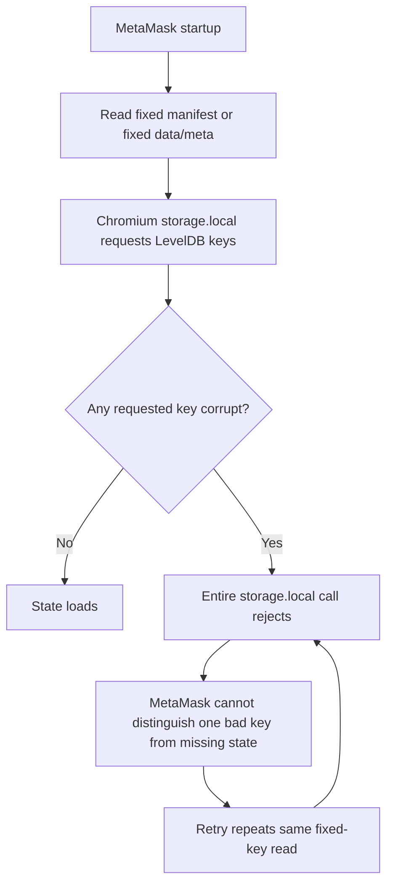

This proposal changes the persistence model so state writes publish generated
storage keys, mirrored metadata, per-logical-key pointers, and tombstones.
Generated metadata becomes authoritative once present, so stale fixed legacy
keys are not touched unless no generated signal exists. Fresh generated values
remain the default, and selected high-churn values may reuse generated keys only
after they have been explicitly audited for that behavior.

## Considered Options

- Status quo: solid state and split state with stable keys
- Increase backup reliance using IndexedDB or another local database
- Attempt browser or LevelDB repair from the extension
- Keep split state, but only narrow read batching
- Add read-after-write verification after every storage write
- Generated value keys with selective high-churn reuse, mirrored manifests, key
  lists, pointers, tombstones, chunking, and fail-closed legacy fallback
- Remote backup or server-side wallet state recovery

## Decision Outcome

Chosen option: "Generated value keys with selective high-churn reuse, mirrored
manifests, key lists, pointers, tombstones, chunking, and fail-closed legacy
fallback"

This ADR is proposed. The decision is not yet formally accepted by the owning
teams, but this solution is the recommended direction because it directly
addresses the extension-side root cause: fixed-key reuse and repeated reads of
old corrupt keys.

The proposal changes the persistence model from "rewrite known legacy keys
forever" to "write generated values and publish small redundant pointers to the
latest healthy generated value". Reads use generated metadata first and avoid
legacy fixed keys once generated metadata, generated key lists, generated
pointers, or unreadable generated metadata indicate that the new system has
taken ownership.

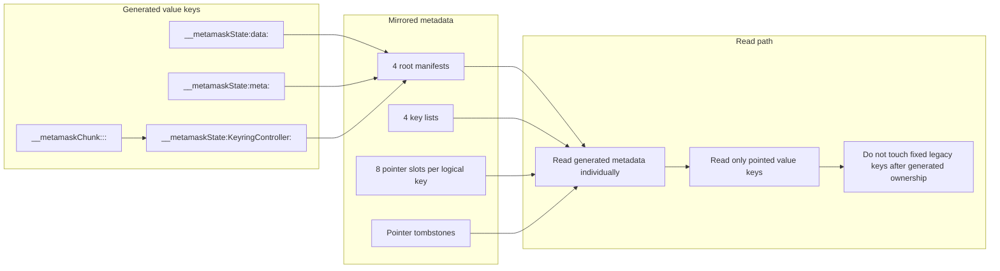

## Proposed Architecture

### Core State Storage

`ExtensionStore` should no longer persist current state under stable legacy
logical keys such as `data`, `meta`, or `KeyringController`. By default, each
durable state write creates a new generated value key:

- `__metamaskState:<logical-key>:<generated-id>`

The generated value key is a physical storage key, not the controller's logical
identity. The default fresh-key behavior should be retained for critical state
and for state with unaudited cross-controller invariants. A narrower
high-churn policy can allow selected logical keys, or explicitly defined groups
of logical keys, to reuse their current generated physical keys while those keys
remain writable and readable. If a reused generated key fails to read or write,
the store should rotate that logical key or reuse group to fresh generated value
keys and publish updated metadata.

The latest mapping from logical key to generated value key is published through
three redundant metadata layers:

- Four mirrored root manifests: `__metamaskStorageKeyManifest0..3`
- Four mirrored key lists: `__metamaskStorageKeyList0..3`
- Eight per-logical-key pointer slots:
  `__metamaskStorageKeyPointer:<logical-key>:0..7`

Deletes and format transitions publish pointer tombstones instead of removing
fixed legacy keys:

```json
{
  "version": 1,
  "updatedAt": 123,
  "storageKey": null
}
```

Large values are chunked behind generated chunk keys:

- `__metamaskChunk:<logical-key>:<generated-id>:<chunk-index>`

The value stored under the generated state key is a descriptor containing the
chunk keys and expected string length.

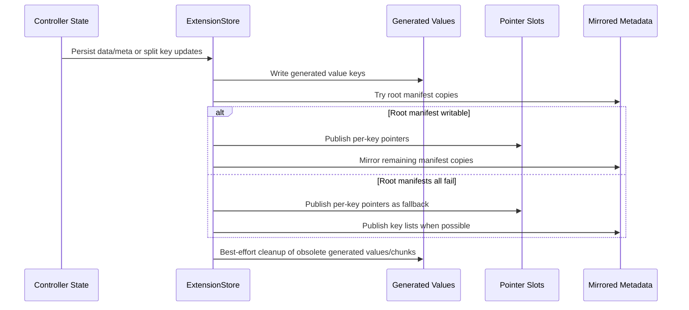

### Logical Write Batching

Generated physical keys must not be interpreted as permission to commit every
logical key independently. MetaMask controllers can carry cross-controller
invariants, where one controller's persisted state assumes that another
controller's persisted state has advanced with it. Examples include account,
permission, network, transaction, and approval surfaces that may duplicate or
index related wallet facts for different workflows.

For that reason, `ExtensionStore` should preserve a serialized logical batch
boundary for state persistence:

1. Collect the logical keys included in the state update.
2. Write generated values and chunks for those logical keys, using fresh keys by
   default and reuse only for audited high-churn keys or reuse groups.
3. Publish metadata that identifies the batch's latest logical-key-to-physical
   key mapping.
4. Expose the new mapping to future readers only after enough metadata has been
   published for recovery.
5. Keep the previous generated values recoverable until cleanup is safe.

This is not a true transaction in Chromium `storage.local`; the browser API does
not provide multi-key atomic commits. It is a commit protocol that reduces torn
state exposure by making readers prefer the last coherent published mapping
instead of whichever individual physical value happened to write most recently.

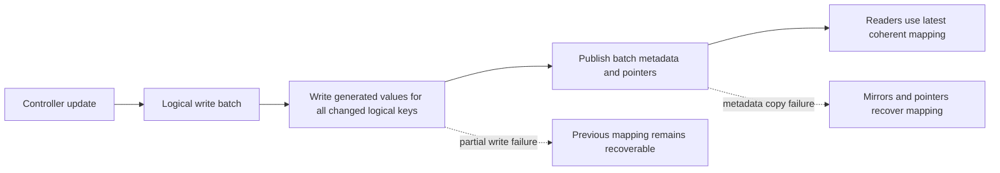

This batching strategy is especially important until controller ownership and
recovery semantics are audited. A simpler per-key persistence model is only safe
when stale or missing paired state can be lazily repaired. MetaMask cannot assume
that across all controllers today, so the storage layer should avoid creating
new partially advanced controller combinations during normal writes.

### High-Churn Generated Key Reuse

Some controller slices may change frequently, potentially every few seconds.
Always rotating those slices to fresh generated value keys can create avoidable
write amplification: more distinct LevelDB user keys, more obsolete generated
keys to remove, more delete markers, and more metadata churn.

LevelDB is already append-oriented, so reusing a key is not an in-place disk
update. An overwrite still appends a newer version to the write-ahead log and
memtable. However, reusing an existing generated physical key can reduce
distinct key cardinality and cleanup pressure compared with creating a new
physical key and deleting the previous one on every high-frequency update.

Chromium's extension storage implementation also makes reuse a useful
best-effort liveness check. `storage.local.set` reads the old value before
writing so Chromium can generate `onChanged` events. If the current generated
physical key is unreadable, the write to that key should fail before the batch
is committed. The store can then fall back to writing a fresh generated value
key and updating metadata.

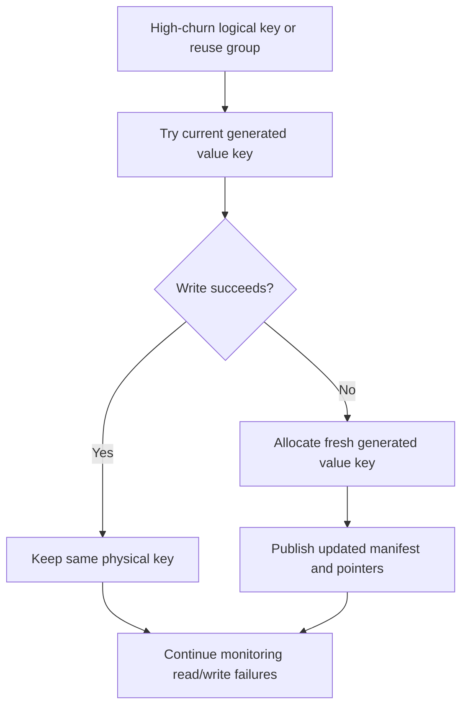

This reuse policy is not equivalent to the fresh-key commit protocol. Fresh keys
allow the store to write new values without exposing them until metadata points
at the new keys, and they keep the previous generated values recoverable until
cleanup. Reused keys overwrite the already-published physical location, so the
previous value is no longer separately recoverable through metadata once the
overwrite succeeds.

Compared with an always-fresh strategy, selective reuse is a performance and
storage-pressure optimization rather than a stronger corruption guarantee.
LevelDB writes are append-oriented in both cases. Always-fresh writes create a
new LevelDB user key and later delete the old generated key; reuse appends a
newer version under the same LevelDB user key. Reuse therefore does not remove
write-ahead log or compaction work, but it can reduce distinct key growth,
obsolete-key cleanup, delete markers, and metadata churn for noisy controller
state.

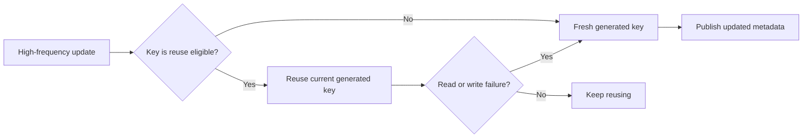

For that reason, generated-key reuse should be opt-in and constrained:

- Use fresh generated value keys by default for `data`, `meta`,
  `KeyringController`, and other critical or unaudited controller state.
- Reuse only high-churn logical keys, or explicit reuse groups, that have been
  audited for partial-update and default-reinitialization safety.
- Preserve serialized write batching for reuse groups so paired logical keys
  are overwritten together.
- Rotate to fresh generated value keys after read failure, write failure,
  pointer disagreement, or telemetry indicating a reused key family is becoming
  unhealthy.
- Treat chunked values carefully. The descriptor key may be reused, but chunk
  keys should remain generated per value unless a separate chunk reuse strategy
  is designed and tested.
- Measure write latency, generated-key cardinality, obsolete-key cleanup,
  LevelDB no-space errors, and corruption events separately for fresh-key and
  reuse-eligible key classes.

### Read and Recovery Rules

The read path should request generated metadata individually or in tightly
scoped sets, because metadata keys define ownership and recovery behavior. It
should prefer generated metadata in this order:

1. Read mirrored root manifests.
2. Read mirrored key lists.
3. Read per-key generated pointers.
4. Read the generated value keys referenced by metadata.
5. Only read legacy fixed keys when no generated metadata or unreadable
   generated metadata is present.

Once a readable generated manifest, key list, or pointer set identifies the
current physical value keys, the store can optimize value reads with a
batch-then-degrade strategy:

1. Read the resolved generated value keys in one bounded
   `chrome.storage.local.get([...keys])` call, or a small number of bounded
   batches.
2. If the batch succeeds, use the full coherent state.
3. If the batch fails, retry the same physical keys individually.
4. Build a failure map from logical key to physical key to status, such as
   readable, missing, unreadable, corrupt, or chunk failure.
5. Use controller safety classification to decide whether startup can continue
   with partial state.
6. Persist repaired manifests, pointers, or tombstones only after a safe
   replacement state has been constructed.

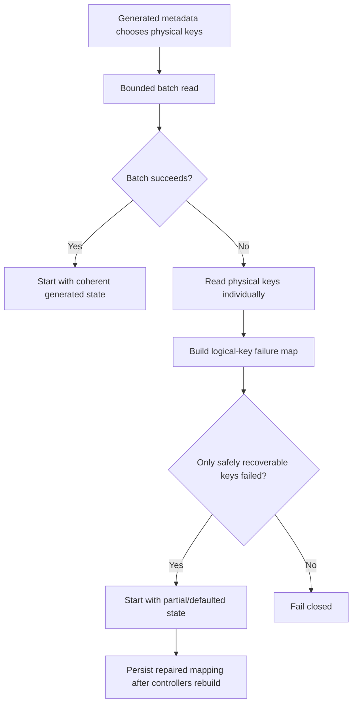

This fallback should be conservative. A failed individual read should not
immediately delete a manifest entry or tombstone a logical key. The failure may
be transient, caused by storage pressure, or caused by a broader database
problem rather than one damaged key. Manifest repair should happen as a later
commit after the application has produced a state that is safe to persist.

Generated metadata ownership is intentionally conservative. If generated
metadata exists, or if generated metadata is unreadable, the store must not
fall back to fixed legacy keys for the same state. This avoids the pattern where
a corrupt old `data`, `meta`, `manifest`, or split-state key continues to be
requested after generated state has already been written.

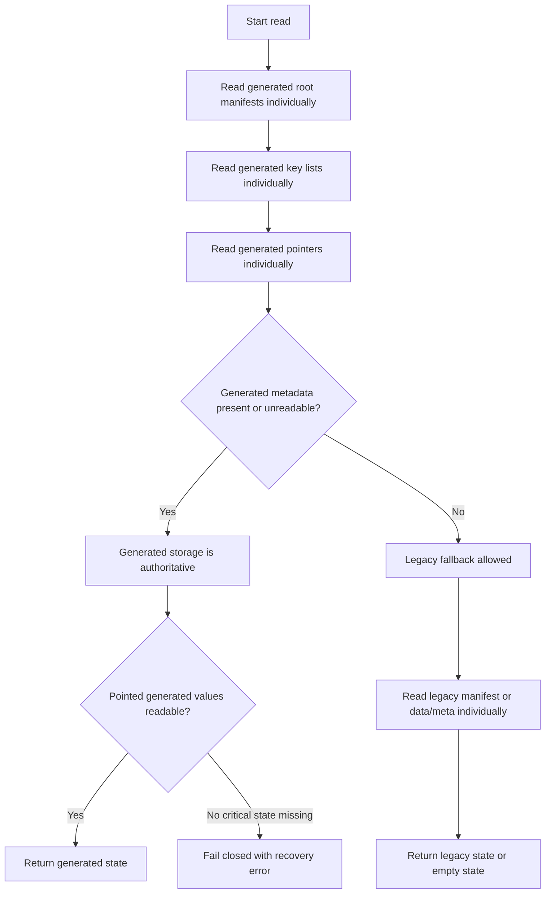

### Critical vs Non-Critical Controller State

The draft implementation deliberately treats only `data`, `meta`, and
`KeyringController` as critical persisted keys. If one of those keys, or the
generated physical value behind one of those keys, cannot be read, startup fails
closed rather than constructing a wallet from incomplete vault-critical state.

Other manifest-listed logical keys are currently treated as recoverable. If a
logical key such as an account-related controller maps to a generated physical
key that cannot be read, the read error is captured and startup can continue
without that persisted slice. The owning controller will then typically
initialize from its default state.

That behavior is an availability tradeoff, not a blanket guarantee of safety.
Many controllers may not be resilient to having their persisted state disappear
while adjacent controllers keep their previous persisted state. Some controller
defaults are designed for first-run initialization, not for partial corruption
recovery after a mature wallet has accumulated related state elsewhere. Making
this fallback safe may require extensive controller refactoring, including:

- classifying every persisted controller slice as critical, reconstructable, or
  safely degradable;
- making default-state initialization idempotent when neighboring controllers
  still have old persisted state;
- rebuilding derived or cache-like controller state from authoritative sources;
- adding explicit invariant checks for cross-controller state dependencies;
- adding controller-specific recovery or tombstone semantics where default
  initialization would be misleading; and
- emitting telemetry when a non-critical slice is skipped so teams can identify
  which controllers need hardening.

Until that audit is complete, the generated-key storage layer should be viewed
as reducing storage-level blast radius. It does not automatically prove that
every controller can safely reinitialize from defaults after its own persisted
slice is lost.

### StorageService Data

`BrowserStorageAdapter` should follow the same model for `StorageService`
namespaces:

- Generated values:
  `storageService:__value:<namespace>:<key>:<generated-id>`
- Mirrored namespace indexes
- Mirrored namespace key lists
- Per-item value pointers
- Namespace clear markers
- Namespace-level mutation queues

Once generated namespace state exists, or any generated namespace metadata is
unreadable, the adapter should suppress fixed legacy key fallback for that
namespace/key. This prevents a stale corrupt fixed `storageService:<namespace>:`
key from blocking reads after generated metadata has taken over.

### Auxiliary Storage Surfaces

The same fixed-key avoidance pattern should be applied to smaller storage
surfaces that participate in startup, reload, migration, or critical-error
flows:

- `CronjobControllerStorageManager`
  - Generated values: `__metamaskCronjobStorage:<id>`
  - Eight pointer slots: `__metamaskCronjobStoragePointer0..7`
  - No legacy fallback if pointer metadata is unreadable
- Critical-error restore handoff
  - Generated values: `__metamaskCriticalErrorRestore:<id>`
  - Primary and secondary pointer slots
  - Tombstone pointers for clear
  - No fixed-key remove during clear
- Split-state migration developer overrides
  - Generated `StorageService` entries are authoritative
  - Legacy fixed override keys are read only when no generated namespace state
    exists
- Migration 190
  - Writes through `BrowserStorageAdapter` instead of direct
    `browser.storage.local` fixed keys
- Fixture extension store
  - Routes fixture `storageServiceData` through the same adapter behavior used
    in production

### Hot Runtime Fallback

`PersistenceManager` should preserve the most recent retrieved state in memory.
When `validateVault` is enabled and a hot runtime local-store read throws or
returns no vault, the manager can return the in-memory snapshot if it contains a
vault. This does not replace durable persistence, but it avoids converting a
transient storage failure during an already-running session into an immediate
user-visible critical failure.

This fallback should not mask cold-start corruption. If no in-memory state has
been loaded, primary storage errors still propagate.

### Observability

Sentry events should include tags that identify the storage area, operation, and
key class. The draft implementation tags reads and writes with values such as:

- `legacy-manifest`
- `legacy-chunk-manifest`
- `legacy-critical-state`
- `legacy-split-state`
- `generated-root-manifest`
- `generated-key-list`
- `generated-pointer`
- `generated-state-value`
- `generated-chunk`
- `cronjob-pointer`
- `critical-error-restore-pointer`

This is required for rollout analysis. Without key-class tags, we cannot tell
whether remaining corruption events come from old legacy keys, generated
metadata, generated values, chunks, or unrelated storage users.

Recent Sentry samples show why this distinction matters. Similar-looking
persistence events include several different failure families:

- Primary `storage.local` or Chromium LevelDB failures, including checksum,
  compressed block, manifest, and log-file errors.
- `FILE_ERROR_NO_SPACE` failures, which are storage-capacity failures rather
  than corrupt-key reuse failures.
- Backup IndexedDB failures, including closing database connections,
  IndexedDB-specific `FILE_ERROR_NO_SPACE`, and contexts where IndexedDB does
  not allow mutations.
- `Data persistence recovered after temporary failure` messages, which indicate
  that a previous `set` or `persist` write failed and a later write succeeded in
  the same runtime.

The recovery message should not be treated as evidence that a corrupt
`storage.local` key became readable, or that durable state fully repaired
itself. It is write-liveness telemetry. During rollout analysis, recovery
messages must be joined to the preceding failure class, such as `set-failed`,
`persist-failed`, `set-backup-failed`, or `persist-backup-failed`. Backup
IndexedDB failures can otherwise make primary storage appear healthier or more
self-healing than it is.

No-space failures should also be tracked separately from corruption events. The
generated-key design reduces repeated reads and writes of corrupt fixed keys,
but it cannot make disk-full writes succeed. Metadata mirroring and chunking add
bounded write overhead, so capacity-related errors should remain part of the
rollout dashboard.

The batch-then-degrade read path should also report when a bounded value batch
fails and individual probing identifies bad logical keys. Useful dimensions
include the logical key, physical key class, failure status, whether the key was
critical, and whether startup continued with defaulted or rebuilt state. This is
how rollout dashboards can distinguish "one generated value failed but was
safely skipped" from "critical generated state failed and startup correctly
failed closed".

### Why Not Read-After-Write Verification

This ADR does not propose immediate read-after-write verification as a primary
corruption mitigation. The idea is to call `chrome.storage.local.get` for keys
immediately after `chrome.storage.local.set`, compare the returned values, and
treat a mismatch as evidence that the write failed or the key is corrupt.

That check can catch application-level serialization mistakes, unexpected API
failures, or same-runtime logical inconsistencies. It does not prove that
Chromium durably persisted the bytes or that the on-disk LevelDB structures are
healthy.

Chromium's extension storage path writes through LevelDB using the default
`leveldb::WriteOptions`, where `sync` is `false`. LevelDB documents this as an
asynchronous write: the operation returns after data is pushed from the process
to the operating system, while transfer to persistent storage can happen later.
LevelDB then makes the update visible through its in-memory memtable. A read
immediately after the write can therefore return the value from memory before
forcing LevelDB to re-read the persisted log, table file, or manifest from disk.

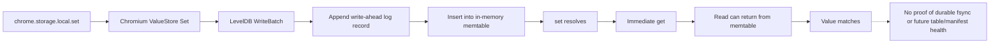

This matters because the observed corruption classes can surface after the
immediate write path:

- a machine, operating system, or storage-device crash can lose recent async
  writes that were accepted by LevelDB but not yet forced to stable storage;
- log replay can encounter malformed or checksum-failing records;
- compaction can later move values into `.ldb` or `.sst` table files whose
  blocks are verified by checksum on future reads;
- metadata files such as `CURRENT` and `MANIFEST-*` can be missing, corrupt, or
  unreadable during later database open/recovery; and
- no-space or other IO failures can occur while appending logs, writing table
  files, syncing manifests, or opening database files.

Read-after-write verification would also add extra storage operations on every
persist, increasing latency and storage pressure while producing a false sense
of durability. It is therefore best treated as a diagnostic tool for narrow
experiments, not as the storage resilience strategy.

## Resilience Model

The proposal does not claim that Chromium LevelDB corruption disappears. It
instead changes MetaMask's interaction pattern so most corrupt keys become
avoidable.

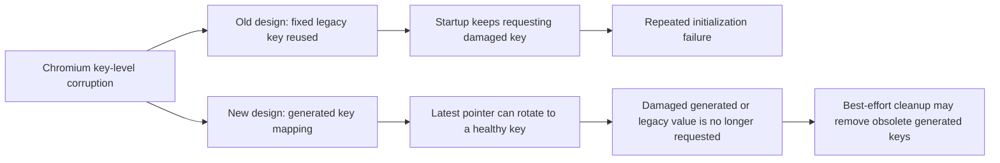

### Failure Containment Table

| Corruption target | Previous behavior | Proposed behavior |
| --- | --- | --- |
| `data` fixed key | Startup could repeatedly fail when solid fallback requested `data` | Generated metadata suppresses fixed-key fallback once generated ownership exists |
| `meta` fixed key | Startup could repeatedly fail when solid fallback requested `meta` | Same as `data`; only read if no generated signal exists |
| `manifest` fixed key | Split-state reads could repeatedly fail before individual state keys were considered | Legacy manifest is lazy and only read when generated metadata cannot determine ownership |
| One split-state key | Batched reads could fail the whole read | Reads are individual; critical keys fail closed, non-critical keys can be skipped/captured, but controller resilience must be audited before default reinitialization is assumed safe |
| Root generated manifest copy | Could block if single metadata key were authoritative | Four manifest copies plus key lists plus per-key pointers |
| All root manifest copies | Previous design had no generated fallback layer | Values can still be recovered through key lists and pointers |
| Pointer slot | Single pointer corruption could lose latest value | Eight pointer slots per logical key |
| Large value chunk | Large value corruption is scoped to generated chunk keys | Chunk read errors are tagged and scoped to the owning value |
| Legacy auxiliary key | Fixed auxiliary keys could continue to be requested | Cronjob, critical-error, and dev override paths move to generated pointers/tombstones |

## Decision Scorecard

Scores use 1 as weakest and 5 as strongest.

| Option | Corruption resilience | Local-only privacy | Avoids IndexedDB dependence | Storage overhead control | Implementation risk | Observability |
| --- | ---: | ---: | ---: | ---: | ---: | ---: |
| Status quo | 1 | 5 | 5 | 5 | 5 | 2 |
| More backup reliance | 3 | 4 | 1 | 2 | 3 | 3 |
| Browser/LevelDB repair | 2 | 5 | 5 | 5 | 1 | 2 |
| Narrow split-state reads only | 2 | 5 | 5 | 5 | 4 | 3 |
| Read-after-write verification | 2 | 5 | 5 | 3 | 4 | 3 |
| Generated keys, selective reuse, and mirrored metadata | 5 | 5 | 5 | 4 | 3 | 5 |
| Remote recovery | 4 | 1 | 5 | 3 | 2 | 4 |

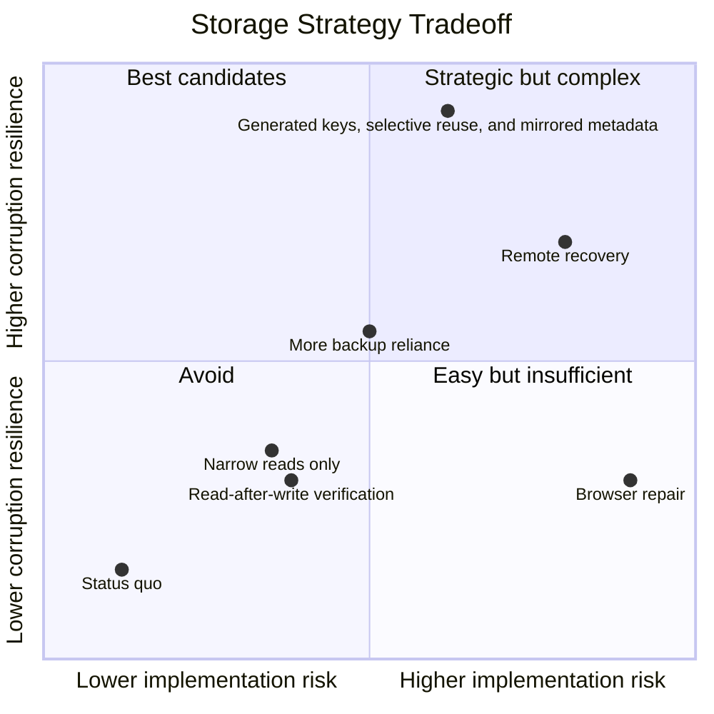

## Pros and Cons of the Options

### Status quo: solid state and split state with stable keys

Continue using fixed keys for solid state and split-state manifests. Keep
relying on backup recovery and existing critical error flows.

- Good, because it requires no new code.
- Good, because it has the lowest short-term release risk.
- Good, because it has no additional metadata overhead.
- Bad, because it does not address repeated reads of corrupt fixed keys.
- Bad, because split state alone did not clearly reduce corruption events.
- Bad, because a corrupt `manifest`, `data`, `meta`, or critical split key can
  keep blocking startup.
- Bad, because observability remains too coarse to separate legacy fixed-key
  failures from newer storage failures.

### Increase backup reliance using IndexedDB or another local database

Store a second local copy of state and recover from it when `storage.local`
fails.

- Good, because a separate backend can recover when `storage.local` is damaged.
- Good, because it can preserve existing primary storage semantics.
- Neutral, because MetaMask already has backup concepts and user-facing
  recovery flows.
- Bad, because IndexedDB is not an acceptable correctness dependency for this
  problem given Chromium extension storage pressure and purging concerns.
- Bad, because a backup database increases persisted local state size.
- Bad, because it treats symptoms rather than removing repeated corrupt-key
  reads from the primary path.
- Bad, because backup reads/writes add more storage operations and another
  failure surface.

### Attempt browser or LevelDB repair from the extension

Try to detect and repair Chromium's underlying LevelDB data from extension code.

- Good, because repairing the underlying database could theoretically recover
  data without changing persistence semantics.
- Neutral, because manual LevelDB recovery has worked in at least one
  investigation.
- Bad, because extensions do not have supported access to Chromium's LevelDB
  internals.
- Bad, because this would depend on browser implementation details outside the
  extension API contract.
- Bad, because incorrect repair logic could make data loss worse.
- Bad, because the goal explicitly requires an extension-side fix, not a
  Chromium patch.

### Keep split state, but only narrow read batching

Continue storing split-state logical keys, but change reads from broad batches
to smaller or individual key reads.

- Good, because it reduces blast radius for one corrupt split-state key.
- Good, because it is simpler than changing write semantics.
- Good, because it can preserve most existing split-state code.
- Neutral, because it helps only after `manifest` has been read successfully.
- Bad, because fixed logical keys are still reused forever.
- Bad, because fixed metadata such as `manifest` remains a single recurring
  failure point.
- Bad, because it does not avoid stale fixed keys after a newer value has been
  written.

### Add read-after-write verification after every storage write

After every `chrome.storage.local.set`, immediately call
`chrome.storage.local.get` for the same keys and compare the returned values.
Treat read mismatches or read failures as evidence that the write did not land
cleanly.

- Good, because it can catch application-level serialization bugs or
  unexpected same-runtime API failures.
- Good, because it can provide targeted telemetry during experiments.
- Neutral, because it verifies same-runtime read visibility, not durable
  persistence.
- Bad, because Chromium extension storage writes through LevelDB with
  asynchronous durability semantics by default.
- Bad, because an immediate LevelDB read can be served from the in-memory
  memtable rather than from persisted table, log, or manifest bytes.
- Bad, because corruption can appear later during database reopen, log replay,
  checksum verification, compaction output reads, or manifest recovery.
- Bad, because it doubles normal-path storage operations and can increase write
  latency and storage pressure.
- Bad, because it does not stop repeated reads of old corrupt fixed keys.

### Generated value keys with selective high-churn reuse, mirrored manifests, key lists, pointers, tombstones, chunking, and fail-closed legacy fallback

Write values to generated keys, publish redundant metadata that points to the
latest keys, use tombstones for deletion/format transitions, and treat
generated metadata as authoritative once present. Fresh generated value keys are
the default for critical or unaudited state. Audited high-churn state may reuse
healthy generated value keys and rotate to fresh keys after read/write failure
or unhealthy telemetry. Read generated metadata and state keys individually, and
only use legacy fixed-key fallback when there is no generated metadata signal.

- Good, because it directly avoids repeated reads of corrupt fixed keys.
- Good, because generated value keys allow future writes or failure recovery to
  move away from old damaged values.
- Good, because selective reuse can reduce distinct-key growth and cleanup
  pressure for audited high-churn state.
- Good, because mirrored manifests, key lists, and pointer slots remove a single
  metadata key as the only recovery path.
- Good, because tombstones prevent stale legacy or stale generated split keys
  from reappearing after deletion or solid/split format changes.
- Good, because it preserves local-only privacy.
- Good, because it avoids IndexedDB as a correctness dependency.
- Good, because metadata overhead is bounded and small relative to state.
- Good, because large values are chunked without reintroducing a global fixed
  chunk manifest dependency.
- Good, because Sentry key-class tags make rollout quality measurable.
- Neutral, because the design is more complex than fixed-key persistence.
- Bad, because there are more metadata writes per logical write.
- Bad, because correctness depends on carefully enforcing generated metadata
  authority and avoiding accidental fixed-key fallback.
- Bad, because old generated values and chunks require best-effort cleanup when
  keys rotate.
- Bad, because selective reuse is weaker than always-fresh writes as a commit
  protocol and must be limited to audited key classes.

### Remote backup or server-side wallet state recovery

Move some wallet state recovery responsibility to a remote service.

- Good, because remote storage can survive local browser storage loss.
- Good, because it can support cross-device recovery workflows.
- Neutral, because some users may already opt into cloud-like wallet features.
- Bad, because it violates the local-only privacy requirement for this
  corruption fix.
- Bad, because it changes the trust model and increases security review scope.
- Bad, because it does not improve users who opt out or cannot use remote
  storage.
- Bad, because it is disproportionate for a Chromium local storage failure mode.

## Implementation Summary

An initial implementation of the proposed option touches these areas:

| Area | Files | Summary |
| --- | --- | --- |
| Core state persistence | `shared/lib/stores/extension-store.ts` and tests | Generated state keys, mirrored root manifests, mirrored key lists, per-key pointers, tombstones, chunking, individual reads, serialized writes, Sentry key-class tags |
| StorageService adapter | `shared/lib/stores/browser-storage-adapter.ts` and tests | Generated namespace value keys, mirrored indexes/key lists, per-item pointers, namespace clear markers, generated-only reads |
| Persistence manager | `shared/lib/stores/persistence-manager.ts` and tests | Hot runtime in-memory snapshot fallback when local store read fails after vault state has been loaded |
| Critical-error handoff | `app/scripts/lib/critical-error/critical-error-tab-handoff.ts` and tests | Generated restore records, primary/secondary pointer slots, tombstone clears, no fixed-key remove |
| Cronjob storage | `app/scripts/lib/CronjobControllerStorageManager.ts` and tests | Generated cronjob storage values, eight pointer slots, no fixed-key fallback when pointers are unreadable |
| Split-state dev overrides | `shared/lib/split-state-migration-dev-overrides.ts`, `app/scripts/lib/use-split-state-storage.ts`, debug UI, and tests | Generated StorageService-backed override state with legacy read-only fallback only before generated ownership |
| Migration 190 | `app/scripts/migrations/190.ts` and tests | Writes through `BrowserStorageAdapter` instead of direct `browser.storage.local` writes |
| Fixture store | `shared/lib/stores/fixture-extension-store.ts` and tests | Fixture `storageServiceData` follows production adapter behavior |
| E2E coverage | `test/e2e/tests/state-persistence/state-persistence.spec.ts` and page object updates | Verifies default split-state persistence and migration from data state |

## Performance and Storage Cost

The proposal intentionally adds small metadata redundancy to avoid large
recovery costs:

- Four root manifest copies.
- Four key-list copies.
- Eight pointer copies per logical state key.
- Four StorageService index/key-list copies and eight per-item pointers.
- Chunk keys only for values larger than the configured chunk threshold.

This is a bounded metadata cost. It is not a full duplicate database and does
not duplicate all wallet state. In exchange, it removes repeated writes to the
same large fixed value and allows future writes to move current state away from
old corrupt keys.

For high-churn state, the architecture should avoid turning generated storage
into an append-like stream of one physical value key per small update. Reusing a
healthy generated value key for audited high-churn slices can lower distinct-key
growth and cleanup work while preserving the ability to rotate away from a key
once Chromium reports that it is unreadable or unwritable.

Read performance should remain acceptable because the implementation avoids
`get(null)` scans and uses targeted reads. Startup performs more small metadata
reads, but those reads are individually scoped and provide fallback paths when a
single metadata key fails. Generated value reads can remain fast by using
bounded batches on the happy path and falling back to individual reads only when
a batch fails.

The proposal intentionally avoids normal-path read-after-write verification.
Such verification would add more storage calls without proving durable
persistence, because LevelDB can satisfy the immediate read from in-memory state
after an asynchronous write.

## Privacy and Security Considerations

This proposal preserves the existing local-only persistence model. It does not
send wallet state to a server, and it does not require users to opt into remote
backup. The design also avoids relying on IndexedDB for correctness.

Security-sensitive behavior should be reviewed around these points:

- Generated metadata must not cause stale state resurrection after deletion.
- Pointer tombstones must remain authoritative for removed logical keys.
- Legacy fallback must stay disabled once generated metadata or unreadable
  generated metadata indicates generated ownership.
- Critical keys such as `data`, `meta`, and `KeyringController` must fail
  closed when generated recovery cannot prove a safe state.
- Sentry tags must classify key families without leaking user state.

## Rollout and Measurement Plan

1. Ship behind the existing state persistence path without changing the public
   wallet API.
2. Monitor Sentry events grouped by `persistence.storage_key_class`.
3. Compare pre-rollout and post-rollout event rates for:
   - legacy manifest failures
   - legacy critical-state failures
   - generated root manifest failures
   - generated pointer failures
   - generated state value failures
   - generated chunk failures
4. Watch for startup latency regressions and persistence write latency
   regressions.
5. Confirm that critical-error and vault recovery events trend down for
   Chromium users.
6. Keep backup recovery as defense in depth, but avoid making it the primary
   normal-path dependency.

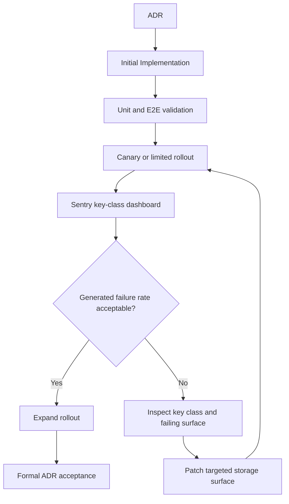

## Validation Performed

The initial implementation has been validated with:

- `yarn test:unit shared/lib/stores/extension-store.test.ts --runInBand`
- `yarn test:unit shared/lib/stores/browser-storage-adapter.test.ts app/scripts/lib/use-split-state-storage.test.ts --runInBand`
- `yarn test:unit app/scripts/lib/CronjobControllerStorageManager.test.ts app/scripts/lib/critical-error/critical-error-tab-handoff.test.ts --runInBand`
- `yarn build:test`
- `yarn test:e2e:single test/e2e/tests/state-persistence/state-persistence.spec.ts --browser=chrome`
- `yarn lint:changed:fix`
- `git diff --check`

## Open Questions

- What rollout percentage and duration are required before this ADR can move
  from Proposed to Accepted?
- Which team owns the post-rollout Sentry dashboard and regression threshold?
- Should generated storage metadata versioning include a future migration plan
  for compacting metadata slot counts if Chromium behavior improves?
- Should extension expose a diagnostic-only view of generated storage health,
  or should this remain Sentry-only?
- Should we eventually remove legacy fixed-key fallback after sufficient
  adoption time?
- Which controller state slices should be promoted to critical, and which
  controllers require refactoring before they can safely reinitialize from
  defaults after a persisted-slice read failure?
- Which controller slices or logical-key groups are high-churn enough to justify
  generated-key reuse, and what invariants must they satisfy before reuse is
  enabled?

## More Information

- Chromium issue: https://issues.chromium.org/issues/432503402
- Chromium manual recovery investigation:
  https://issues.chromium.org/issues/432497646
- Chromium extension storage `LeveldbValueStore`:
  https://chromium.googlesource.com/chromium/src/+/main/components/value_store/leveldb_value_store.cc
- Chromium extension storage `LazyLevelDb`:
  https://chromium.googlesource.com/chromium/src/+/main/components/value_store/lazy_leveldb.cc
- LevelDB write options and synchronous write documentation:
  https://github.com/google/leveldb/blob/7ee830d02b623e8ffe0b95d59a74db1e58da04c5/include/leveldb/options.h
- LevelDB write and read implementation:
  https://github.com/google/leveldb/blob/7ee830d02b623e8ffe0b95d59a74db1e58da04c5/db/db_impl.cc
- LevelDB version lookup and table selection:
  https://github.com/google/leveldb/blob/7ee830d02b623e8ffe0b95d59a74db1e58da04c5/db/version_set.cc
- LevelDB table cache and block checksum paths:
  https://github.com/google/leveldb/blob/7ee830d02b623e8ffe0b95d59a74db1e58da04c5/db/table_cache.cc
  https://github.com/google/leveldb/blob/7ee830d02b623e8ffe0b95d59a74db1e58da04c5/table/format.cc
- Related Sentry shares:
  - https://metamask.sentry.io/share/issue/61c25635cfd7469a8bcbb3c5738a15d4/
  - https://metamask.sentry.io/share/issue/9792491dfe0c4f42975c7ec5c0572913/
  - https://metamask.sentry.io/share/issue/1696fc55419f483182f3a8d428480b9c/
  - https://metamask.sentry.io/share/issue/9fb6ba5b1722408abfc4728df1b19be9/
  - https://metamask.sentry.io/share/issue/aef70d1ea18746f396b8ca3c9c24cbde/
  - https://metamask.sentry.io/share/issue/9562c9d27c944f3fb58f941372744b62/
  - https://metamask.sentry.io/share/issue/98dc4567d3d2442fbcc415368b46a7b6/
  - https://metamask.sentry.io/share/issue/0bf0dd450bf24fff9f07f1024122b4f8/
  - https://metamask.sentry.io/share/issue/c9ec59c2ac7a4a1dafe04645e1064013/
  - https://metamask.sentry.io/share/issue/02b0db1899634837a7d06588e7d7e45c/
  - https://metamask.sentry.io/share/issue/6e83deb5ca764707933fe8ee3381011d/
  - https://metamask.sentry.io/share/issue/0befa216fb994cb38d844971c07a25e8/
