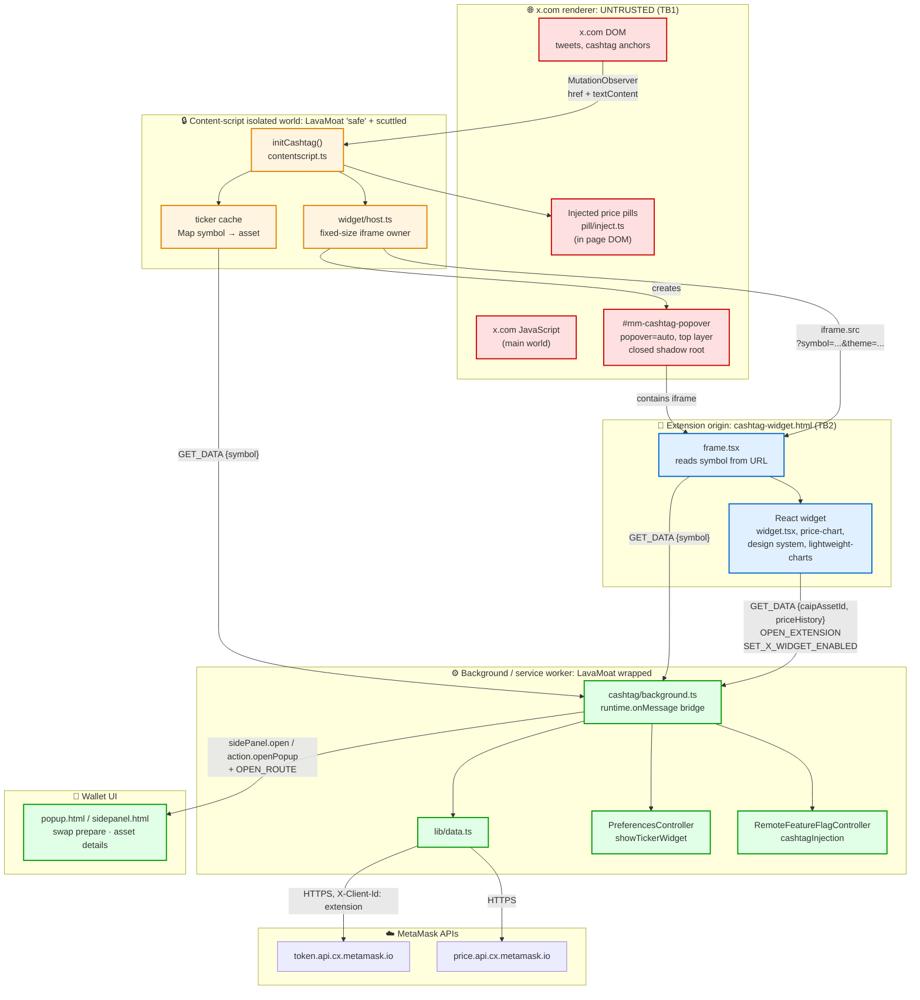

<!-- omit in toc -->

# Threat Model: X Cashtag Widget

We approach threat modelling by answering [4 questions](https://www.threatmodelingmanifesto.org/) related to the system:

1. What are we working on?
2. What can go wrong?
3. What are we going to do about it?
4. Did we do a good enough job?

_For detailed guidance on conducting threat modeling sessions, prerequisites, and process details, see the MetaMask Security Guidance: Threat Modeling._

---

## 1. What are we working on?

When a user browses `x.com`, MetaMask decorates `$TICKER` cashtag links inside tweets with a live price pill, and shows a hover/interest popover card with token details (price, 24h change, market cap, liquidity, volume, 1D price chart, "similar tokens" disambiguation) plus two calls to action _Swap_ and _View details_ that open the MetaMask popup or side panel. The card also exposes a control to turn the feature off. No confirm or approve happens in the widget; the CTAs only navigate.

- **Business logic**
  - The widget is active only when `cashtagInjection` (remote feature flag, default `false`) AND `showTickerWidget` (user preference, `true`) are both true
  - Cashtag anchors are identified by X's own href shape (`?q=%24SYMBOL&src=cashtag_click`) and must live inside a `[data-testid="tweet"]` subtree.
  - Ticker → asset resolution goes to `token.api.cx.metamask.io/tokens/search`, results are filtered to exact symbol match and sorted by market cap; the top hit becomes `primary`, the rest become `similar`.
  - **No wallet state (no addresses, balances, keys, or account list) ever crosses into the page-adjacent code.** The widget shows only public market data.

- **Trust boundaries**

  | #   | Boundary                                                   | Nature                                                                 |
  | --- | ---------------------------------------------------------- | ---------------------------------------------------------------------- |
  | TB1 | x.com page (tweet content) ↔ content-script isolated world | **Fully untrusted input.** Tweet authors are arbitrary internet users. |
  | TB2 | content-script world → widget frame (extension origin)     | One-way iframe navigation with `?symbol=` query parameters             |
  | TB3 | content script / widget frame ↔ background                 | `chrome.runtime.sendMessage` with per-message sender authorization     |

### Architecture

The widget uses an extension-origin iframe. `initCashtag()` runs from the existing `contentscript.js`; a thin host creates a **closed** shadow root containing an `<iframe src="chrome-extension://<id>/cashtag-widget.html?symbol=...&theme=...">`. The frame loads its own data and talks directly to the background. There is no parent/frame message protocol.

The page-adjacent content script owns only the thin host: scanning X anchors, decorating pills, positioning the popover, and navigating a fixed-size iframe. The full React widget runs in `cashtag-widget.html` under the extension origin. The host passes `symbol` and `theme` in the iframe URL; the frame fetches canonical data and sends actions through the background bridge.

**Frame runtime (not a threat: a build constraint).** Production extension pages normally load a shared Webpack/LavaMoat runtime that includes Snow. Snow assumes a framed extension page can read `top.SNOW`. That fails here because the top frame is cross-origin `x.com`, so the widget cannot use the shared UI runtime. `cashtag-widget-frame` is a dedicated Webpack entry with its own SES/LavaMoat runtime (`inlineLockdown`, `mode: 'safe'`). It scuttles via LavaMoat's `scuttleGlobalThis` and never touches `top.SNOW`. The scuttling exception list is `browser`, `chrome`, and `devicePixelRatio` (for `lightweight-charts`); LavaMoat adds `webpackChunk` for chunk loading.

### Data Flow Diagram: iframe architecture



---

## 2./3. What can go wrong & What are we going to do about it?

Severity is our own judgement of pre-mitigation risk.

<!-- omit in toc -->

### Summary table

| ID  | Threat                                                       | Severity   | Decision                                                            |
| --- | ------------------------------------------------------------ | ---------- | ------------------------------------------------------------------- |
| T1  | `frame-ancestors` is global to extension pages               | **Medium** | Limit widget HTML to x.com in `web_accessible_resources`            |
| T2  | Background cashtag messages must be authorized by `sender`   | **High**   | Check sender per message type                                       |
| T3  | Ticker symbol taken without constraints                      | **Low**    | Send the string to token search. Hide the pill if there is no match |
| T4  | Widget confers apparent MetaMask endorsement on scam tokens  | **High**   | Accept. The token API is already public and has its own validation  |
| T5  | Widget resources web-accessible to `<all_urls>`              | **Medium** | Restrict widget HTML to x.com                                       |
| T6  | Ticker lookups leak a user's X browsing to MetaMask backends | **Medium** | Hand off to Privacy                                                 |

---

### Group A: Isolation and code execution

#### Threat T1: `frame-ancestors` is global to extension pages

**Description**

To let x.com embed `cashtag-widget.html`, Chromium and Firefox both set the extension-page CSP from

```
frame-ancestors 'none';
```

to

```
frame-ancestors 'self' https://x.com https://www.x.com;
```

`content_security_policy.extension_pages` is a single policy applied to every extension page. There is no way to scope it to one HTML file. However, `web_accessible_resources` is a second gate: a web page cannot load an extension HTML page that has not been declared web-accessible. Widening `frame-ancestors` therefore does not, by itself, make `home.html`, `popup.html`, or `notification.html` framable.

**What are we going to do about it?**

- Put `cashtag-widget.html` in its own MV3 web-accessible list, only for `https://x.com/*` and `https://www.x.com/*`.
- Set the same CSP on Chromium and Firefox (`app/manifest/v2/chrome.json`, `v2/firefox.json`, `v3/chrome.json`).
- Manifest V2 has no `matches` field on `web_accessible_resources`. If the file is listed, any site can load it. That is Firefox and Chromium MV2.

---

### Group B: Boundary and message-surface authorization

#### Threat T2: Background cashtag messages must be authorized by `sender`

**Description**

The background listens for `GET_DATA`, `OPEN_EXTENSION`, `SET_X_WIDGET_ENABLED`, and `GET_X_WIDGET_ENABLED`. Those messages exist in this design. Without a `sender` check, any extension page or a content script on another site could call them.

**What are we going to do about it?**

- Check `sender` before handling any cashtag message.
- Enable/disable status: only the top frame on x.com.
- Token data: that same content script, or the widget iframe.
- Swap, details, and the disable control: widget iframe only, and only if the tab is on x.com.
- Drop everything else.

#### Threat T3: Ticker symbol taken from page-controlled `textContent` without constraints

**Description**

`app/scripts/cashtag/lib/helpers.ts:86-92`:

```ts
export function symbolFromCashtagAnchor(element: HTMLAnchorElement) {
  const href = element.getAttribute('href') ?? '';
  return (cashtagHrefPattern.exec(href)?.[1] ?? element.textContent ?? '')
    .replace(/^\$/u, '')
    .trim()
    .toUpperCase();
}
```

The href path is constrained by the regex to `[A-Z0-9]+`, but the **fallback to `element.textContent` is unbounded**: arbitrary length, arbitrary Unicode, fully controlled by whoever authored the tweet (or by any script on x.com that mutates an anchor). That string is used as a cache key in an unbounded `Map`, is placed in the widget frame's `?symbol=` query parameter, and is sent to the background, which puts it into `URLSearchParams` for the token-search API.

`URLSearchParams` encodes correctly and the frame renders through React, so this is neither injection nor XSS. The realistic impacts are unbounded local cache growth, oversized outbound requests, and unexpected input reaching a MetaMask backend from a path we do not control.

**What are we going to do about it?**

- Send the string to token search. If there is no match, hide the pill.

---

### Group C: User deception

#### Threat T4: The widget confers apparent MetaMask endorsement on scam tokens

**Description**

Anyone can post a tweet containing `$SCAM`. The widget then renders a MetaMask-branded card next to it. To a user this reads as "MetaMask recognises and supports this token". Ticker collisions make this worse: many distinct assets share a symbol, and the pill shows only the highest-market-cap match.

This is inherent to showing public market data for whatever ticker appears in a tweet.

**What are we going to do about it?**

- Accept it. The token API is already public and has its own validation. The widget only shows what that API already returns.

---

### Group D: Exposure, privacy, consent

#### Threat T5: Widget resources are web-accessible to `<all_urls>`

**Description**

`cashtag-widget.html` is web-accessible so x.com can load the iframe. If it sits on the generic `web_accessible_resources` list, every site can load that page.

**What are we going to do about it?**

- On MV3, only x.com can load `cashtag-widget.html`.
- Widget CSS stays off the public list. The iframe can load it itself.
- Manifest V2 has no per-site list, so any site can load the HTML if it is listed.

#### Threat T6: Ticker lookups leak a user's X browsing to MetaMask backends

**Description**

For every distinct cashtag the user scrolls past, the background issues a request to `token.api.cx.metamask.io` carrying the symbol, the user's IP, and `X-Client-Id: extension`. In aggregate this is a stream of _what the user is reading on X_, flowing to MetaMask infrastructure, generated passively without any per-lookup user action. No wallet identifier or account address is attached, and because the request originates in the background it carries no x.com cookies, but the correlation potential is real and is not obvious to a user who enabled a "price widget".

**What are we going to do about it?**

- Hand this to Privacy.

---

## 4. Did we do a good enough job?

### Completeness Check

- [x] Did we answer all four questions thoroughly?
- [x] Is the system diagram an accurate representation of the system being built?
- [x] Are all threats well described with corresponding mitigations or justifications?
- [x] Have we sufficiently identified the risks that exist within the system?
- [x] Did we consider edge cases in business logic? _(Ticker collisions, unverified assets.)_

### Quality Assessment

- [x] Do the people working on the threat model understand the feature?
- [x] Are the proposed mitigations feasible and effective?
- [x] Have we documented our assumptions clearly?

### Next Steps

The engineering team owns this model. Update the diagram and run another pass if the design changes. T6 sits with Privacy.
