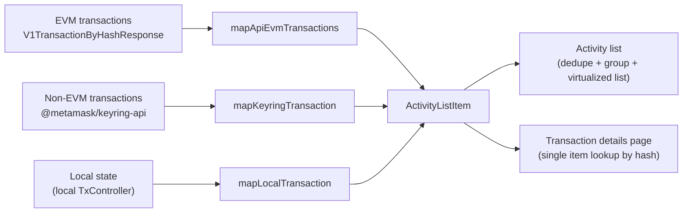

# Activity Adapters

These adapters normalize different shapes from various data sources, currently:

- EVM transactions from the Accounts REST endpoint
- Non-EVM transactions from the multichain transactions controller
- Local transaction state

Each adapter is a pure function that returns a uniform shape used in both [`ui/pages/activity`](../../../../ui/pages/activity)
(the list) and [`ui/pages/details`](../../../../ui/pages/details) (the
details view).

---

## Table of contents

- [Architecture](#architecture)
- [Adapters](#adapters)
  - [EVM Transactions: API adapter](#evm-transactions-api-adapter)
  - [Non-EVM Transactions: keyring adapter](#non-evm-transactions-keyring-adapter)
  - [Local State: TransactionController adapter](#local-state-transactioncontroller-adapter)
- [Where adapters are used](#where-adapters-are-used)
- [Adding a new activity type](#adding-a-new-activity-type)
- [Adding a new adapter / data source](#adding-a-new-adapter--data-source)

---

## Architecture

1. **Single output type** - every adapter returns `ActivityListItem`
2. **Pure functions** - adapters do not touch Redux. Selectors
   fetch/join state before calling these functions.

---

## Adapters

### EVM transactions: API adapter

File: `api-evm-transactions.ts`

Input: `V1TransactionByHashResponse` from `@metamask/core-backend`

The Accounts API classifies each transaction with a `transactionCategory`. The adapter further classifies and maps each item to the UI-facing activity type.

Notes:

- Backend API improvements are ongoing

---

### Non-EVM transactions: Keyring adapter

File: `keyring-transaction.ts`

Input: `Transaction` from `@metamask/keyring-api`

Notes:

The adapter is chain-agnostic; the selector layer
([`selectNonEvmActivityItems`](../../../../ui/selectors/activity.ts))
patches missing/`UNKNOWN` asset units from `AssetsController` metadata
before calling it.

---

### Local state: TransactionController adapter

File: `local-transaction.ts`

Input: a `TransactionGroup` from `shared/lib/multichain/types` -
the shape the EVM `TransactionController` produces after grouping by
nonce (`initialTransaction`, `primaryTransaction`, plus cancel/retry
siblings)

---

## Where adapters are used

| Where                       | Adapter used                                                                    |
| --------------------------- | ------------------------------------------------------------------------------- |
| `selectLocalActivityItems`  | `mapLocalTransaction` per `TransactionGroup`, after computing enrichments       |
| `selectNonEvmActivityItems` | `mapKeyringTransaction` per keyring `Transaction`, after patching missing units |
| `useQueryFilters`           | `mapApiEvmTransactions` per API data page response                              |
| `transaction-details.tsx`   | `mapApiEvmTransactions` directly on an API response                             |

---

## Adding a new activity type

1. **Define the kind** in [`shared/lib/activity/types.ts`](../types.ts):
   add the literal to `ActivityKind`, add a matching `ActivityData<…>`
   variant with that kind's fields.
2. **Emit it** from one or more adapters
3. **Render it** in `ui/pages/activity/rows/activity-row.tsx` and the
   detail view templates if needed.

---

## Adding a new adapter / data source

Use a new adapter when a source has its own data model and can't be
reasonably squeezed through one of the three existing mappers.

1. Create an adapter file with a pure function returning a single `ActivityListItem`.
2. Add a hook that reads the data source and calls the adapter once per item.
3. Include the hook's output in `dedupeItems(...)` inside
   `activity-list.tsx`.
4. Update this README
