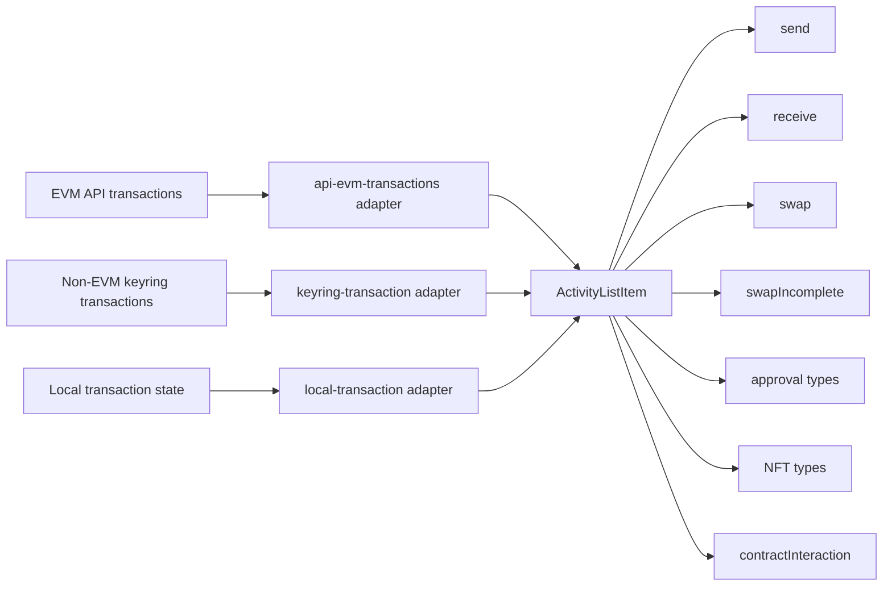

# Activity Adapters

The adapters normalize each activity data source into the shared activity list item shape used by `ui/pages/activity`.

```mermaid
flowchart LR
  api["EVM API transactions"] --> apiAdapter["api-evm-transactions adapter"]
  nonEvm["Non-EVM keyring transactions"] --> nonEvmAdapter["keyring-transaction adapter"]
  local["Local transaction state"] --> localAdapter["local-transaction adapter"]

  apiAdapter --> items["ActivityListItem"]
  nonEvmAdapter --> items
  localAdapter --> items

  items --> send["send"]
  items --> receive["receive"]
  items --> swap["swap"]
  items --> swapIncomplete["swapIncomplete"]
  items --> approval["approval types"]
  items --> nft["NFT types"]
  items --> contract["contractInteraction"]
```
