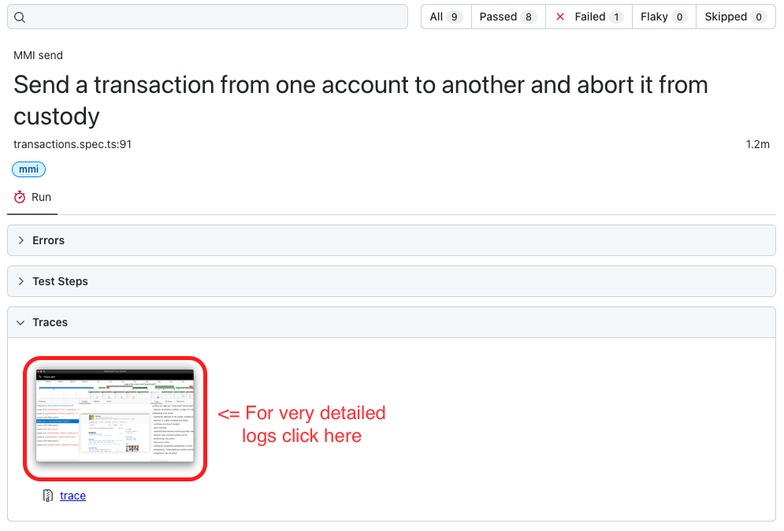
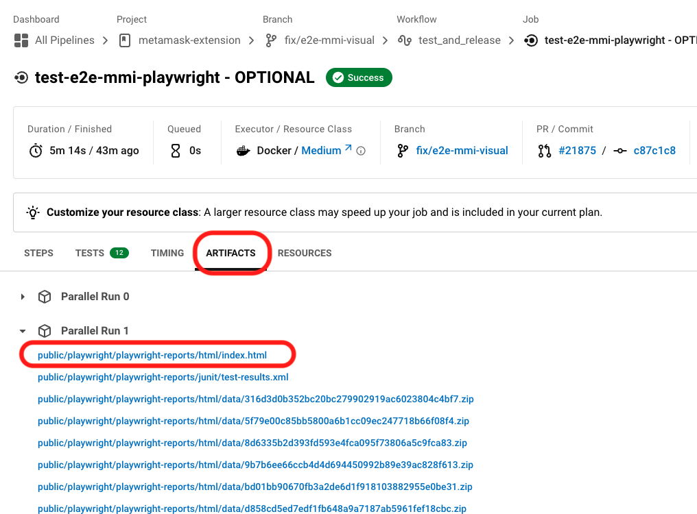

# Playwright MMI E2E Testing

This directory contains a set of specific MMI end-to-end tests created using [Playwright](https://playwright.dev/). These tests are part of the MMI quality assurance legacy framework.

Please, note that this job in the CircleCI pipeline, `test-e2e-mmi-playwright - OPTIONAL`, is optional. Therefore, you can merge your branch even if this job hasn't passed. However, our aim is to keep this job green. If you're unsure how to fix a test, please [ask for help](#contact-mmi-team) from the team.

## Setup

To prepare your environment for the MMI E2E test suite, follow these steps:

1. Create a `.env` file in this directory to store the configuration parameters for the MMI E2E test suite. Please [consult with your MMI colleagues](#contact-mmi-team) to obtain these values ("`MMI .env for MM repo`").

2. Generate a specific MMI build:

    2.1. Add the `.metamaskrc` file to the root directory. This file is necessary for generating the build and points to the development environments. Make sure you add values given by the team.

    2.2. Use the following script to generate the build:
    ```
    yarn dist:mmi
    ```

## Running the Tests

From the root of the project, you can use the following scripts to run the tests:

- To run all tests (locally):
  ```
  yarn test:e2e:mmi:all
  ```
- To run only non visual tests:
  ```
  yarn test:e2e:mmi:regular
  ```
- To run only visual tests ([go to visual test info](#visual-tests)):
  ```
  yarn test:e2e:mmi:visual
  ```
> Note: If you run the tests for first time, you may need to install the browser dependency (Playwright will inform you in case you need):
> ```
> yarn playwright install chromium
>```

In some cases, you will need to update the visual screenshot. For that, you have the next scripts:

- To update visual tests screenshots (always check differences before commit):
  ```
  yarn test:e2e:mmi:visual:update
  ```

### Debug test

If you're interested in [debugging tests](https://playwright.dev/docs/debug), we suggest installing the Visual Studio plugin. This will allow you to run each test individually, providing a more streamlined debugging process.

For those who simply want to run tests locally to ensure no MMI functionality has been compromised, you can adjust the environment variable in your .env file:
```
HEADLESS=true
```
By doing this, all tests will run in headless mode. This allows you to continue with other tasks while the tests are running, optimizing your workflow.

#### Lavamoat

Due to the constraints imposed by Lavamoat, certain visual details that could be beneficial during a debugging session are not displayed in the Playwright logs. To overcome this, you can create a local, Lavamoat-free build that allows Playwright to access and display all available browser information. To create this specialized build, execute the following command:
```
yarn build:mmi:debug
```
After the build is complete, you can proceed to run the tests as usual.

## Visual Tests

For more information on visual tests, refer to the [Playwright documentation](https://playwright.dev/docs/test-snapshots).

### Requirements

You need to have docker installed. You won't nned to run any command to build images. packege.json scripts will do the magic.

Running visual tests requires the generation of a Docker image. This ensures that the screenshots are consistent with the operating system used in the pipeline. All required to build this image is described in file `test/e2e/mmi/Dockerfile`. The actual process to build, call the tests, and tear down files is defined in `test/e2e/mmi/scripts/run-visual-test.sh`.

**Only docker generated screenshots will be commited. Those generated out of docker will be git-ignored.**

## Reports

Test reports are generated in the public folder. To obtain comprehensive, readable reports with direct access to `traces.zip`, run the following script:
```
yarn test:e2e:pw:report
```

Note that the attachment on every test, `trace` provide you with a wealth of useful information for debugging.



### CircleCI logs

When tests finish on the pipeline, you can find the same logs that you use locally. The logs are generated split by thread and can be found within the Artifact tab on the Job run page on CircleCI. You will see a link `public/playwright/playwright-reports/html/index.html` (it is the first artifact of each thread). Click there and you will be redirected to the Playwright report.


## Contact MMI team
If you encounter any problems while working on these e2e tests, you can write into the Consensys Slack channel `metamask-mmi-collab`.