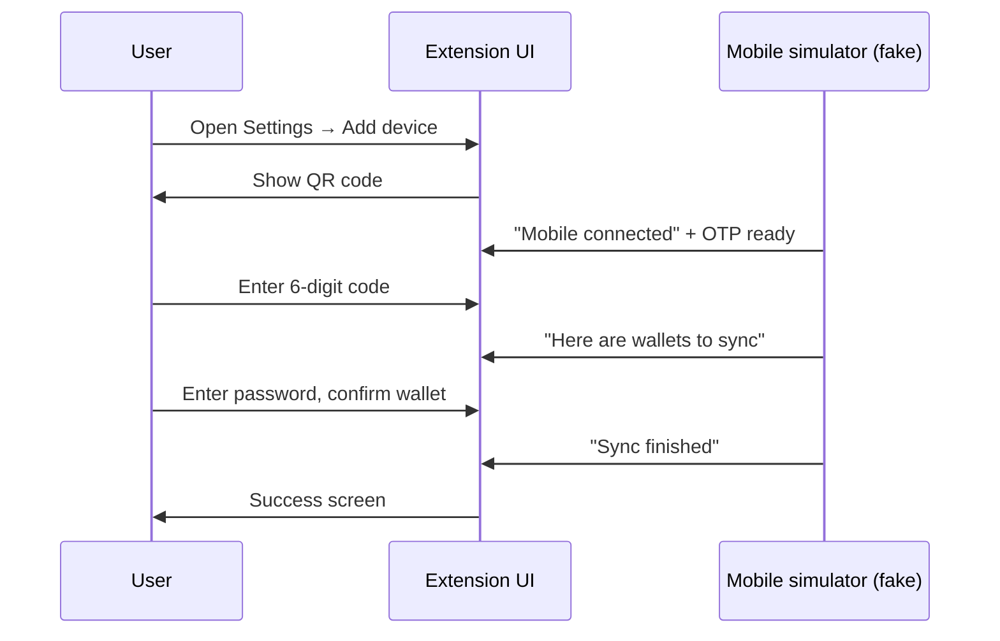

# QrSync E2E Setup Plan

> **Last updated:** 2026-07-11  
> **Resume from:** [Phase 6 — Happy path E2E test](#phase-6--happy-path-e2e-test)  
> **First test goal:** Happy path — user syncs one wallet from extension to mobile (simulated)

---

## For everyone (non-technical summary)

### What is QrSync?

QrSync lets a MetaMask **browser extension** user send their wallet to **MetaMask Mobile**
by scanning a QR code and entering a short verification code (OTP).

### What are we building?

Automated browser tests that check the **extension does the right thing** at each step:
shows a QR code, asks for the code, asks for the password, confirms which wallets to
sync, and shows success.

### How do we fake “mobile” without a real phone?

In production, extension and phone talk through a **relay server** on the internet.
For our tests we **skip the real relay** and use a **fake connection inside the test
setup** that pretends to be mobile — sending the same kinds of messages mobile would
send (verification code ready, wallet list, sync finished).

This is intentional. Our other extension tests also **mock external services** rather
than hitting real backends. We care that **the extension behaves correctly**, not
that a third-party server is running.

### What we are NOT doing (for now)

- Running a real relay server (e.g. Docker / Centrifugo)
- Testing phone app UI
- Testing encryption over the live network

Those can be separate efforts later if needed.

---

## Progress tracker

Use this table to see where we are and what to do next.

| Phase | Name | Status | Outcome when done |
|-------|------|--------|-------------------|
| **0** | [Mock transport design](#phase-0--mock-transport-design) | ✅ **Done** | [MOCK_TRANSPORT_DESIGN.md](./MOCK_TRANSPORT_DESIGN.md) complete |
| **1** | [Build & feature flags](#phase-1--build--feature-flags) | ✅ **Done** | Test builds show “Add device” in Settings |
| **2** | [Faster timers](#phase-2--faster-timers) | ✅ **Done** | Tests don’t wait 60s for QR/code expiry |
| **3** | [Mock transport + simulator code](#phase-3--mock-transport--simulator) | ✅ **Done** | Test harness can script mobile behaviour |
| **4** | [UI hooks for automation](#phase-4--ui-hooks-for-automation) | ✅ **Done** | Stable buttons/fields for the test robot |
| **5** | [Test helpers & page objects](#phase-5--test-helpers--page-objects) | ✅ **Done** | Reusable “go to Add device / enter OTP” steps |
| **6** | [Happy path E2E test](#phase-6--happy-path-e2e-test) | ⬜ Not started | One passing automated test in CI |
| **7** | [CI & follow-ups](#phase-7--ci--follow-ups) | ⬜ Not started | Documented run commands; optional error scenarios |

**Legend:** ⬜ Not started · 🟡 In progress · ✅ Done · ⏸️ Paused · ❌ Cancelled

### Cancelled / superseded work

| Item | Status | Notes |
|------|--------|-------|
| Real Centrifugo relay + Docker (`spike/`) | ❌ Cancelled | Decided fake transport is enough for extension E2E |
| `@metamask/mobile-wallet-protocol-wallet-client` devDep | ✅ Removed | Was added during early spike; not needed for fake transport |
| `test/e2e/tests/qr-sync/spike/` (Docker, handshake script) | ✅ Removed | Abandoned Centrifugo spike artifacts |

### Resume checklist (for the next coding session)

1. Read **Progress tracker** — start at first non-✅ phase (currently **Phase 6**).
2. Phase 0 complete — see [MOCK_TRANSPORT_DESIGN.md](./MOCK_TRANSPORT_DESIGN.md).
3. Then Phase 1 → 2 → 3 in order (don’t skip — each phase unlocks the next).
4. `spike/` folder was removed — do not recreate unless we revisit real relay testing.

---

## Key decision (2026-07-10)

**Use a fake mock transport in test builds**, not a real websocket relay.

| | Fake transport (chosen) | Real relay (deferred) |
|---|------------------------|------------------------|
| **Tests** | Extension UI + controller + real `DappClient` | + Centrifuge wire protocol |
| **Mobile** | `MobileWalletSimulator` in test process | `WalletClient` + Centrifugo |
| **Matches repo** | Same as mock HTTP / mock WS elsewhere | Heavier; integration-style |
| **Scenarios** | Easy: wrong OTP, timeout, cancel | Harder to control timing |

Background research on the real MWP protocol lives in
[PHASE_0_PROTOCOL_NOTES.md](./PHASE_0_PROTOCOL_NOTES.md) (reference only).

---

## User journey we automate (happy path)



---

## Phase 0 — Mock transport design

**Status:** ✅ Done (2026-07-10)  
**Deliverable:** [MOCK_TRANSPORT_DESIGN.md](./MOCK_TRANSPORT_DESIGN.md)

### Summary

- **E2eMwpMockClient** — test-build stand-in for `DappClient` (inside extension)
- **MobileWalletSimulator** — scripts mobile behaviour (inside extension)
- **QrSyncE2eBridge** — E2E test controls simulator via port `8111` background socket
- **Injection** — `createMwpStack` option on `QrSyncController` when `IN_TEST`

**Exit criteria:** ✅ Design doc reviewed; Phase 1 can start.

---

## Phase 1 — Build & feature flags

**Status:** ✅ Done (2026-07-10)  
**Depends on:** Phase 0 ✅

### What changed

Test builds (`yarn build:test`, `yarn start:test`) now set `ADD_DEVICE_SYNC_ENABLED=true`
automatically, same pattern as `PERPS_ENABLED` and `SEEDLESS_ONBOARDING_ENABLED`.

| File | Change |
|------|--------|
| `development/build/set-environment-variables.js` | `ADD_DEVICE_SYNC_ENABLED: isTestBuild ? 'true' : …` |
| `.metamaskrc.dist` | Documented auto-enable for test builds |
| `development/build/set-environment-variables.test.ts` | Unit tests for test vs dev behaviour |

### Manual verification (when you have a test build)

1. `yarn build:test`
2. Load extension → Settings
3. Confirm **Add device** tab is visible (`settings-tab-item-add-device`)

**Exit criteria:** ✅ Auto-enabled in test builds; documented; unit tests pass.

---

## Phase 2 — Faster timers

**Status:** ✅ Done (2026-07-10)  
**Depends on:** Phase 1 ✅

### What changed

`QR_SYNC_TIMEOUT_MS` in `shared/constants/qr-sync.ts` now uses shorter values when
`IN_TEST` is set (test builds and Jest).

| Setting | Production | Test (`IN_TEST`) |
|---------|------------|----------------|
| QR / session window (`MWP_SESSION_TIMEOUT`) | 60s | 10s |
| Sync offer wait | 5s | 1s |
| Sync completion wait | 5s | 1s |

Unit tests: `shared/constants/qr-sync.test.ts` (uses `jest.isolateModules` to verify
both branches).

**Exit criteria:** ✅ Constants updated; unit tests pass.

---

## Phase 3 — Mock transport + simulator

**Status:** ✅ Done (2026-07-10)  
**Depends on:** Phase 0 design doc ✅, Phase 2 ✅

### What changed

Fake MWP client + mobile simulator wired into test builds via `mwpStackFactory`
(env-gated, same pattern as `webAuthenticatorFactory`) and the background socket
(`qrSyncSimulate` command).

| Component | Location |
|-----------|----------|
| `E2eMwpMockClient` | `app/scripts/controllers/qr-sync/e2e/e2e-mwp-mock-client.ts` |
| `MobileWalletSimulator` | `app/scripts/controllers/qr-sync/e2e/mobile-wallet-simulator.ts` |
| Factory + bridge registration | `create-e2e-mwp-stack.ts`, `qr-sync-e2e-bridge.ts` |
| Env-based MWP stack | `mwp-stack-factory.ts` (used inside `QrSyncController`) |
| Background socket handler | `test/e2e/background-socket/types.ts`, `socket-background-to-mocha.ts` |
| Node helper | `test/e2e/tests/qr-sync/qr-sync-e2e-bridge.ts` |
| E2E constants | `test/e2e/tests/qr-sync/constants.ts` |

**Usage from E2E tests:**

```ts
import { qrSyncSimulate } from './qr-sync-e2e-bridge';
import { QR_SYNC_E2E_OTP } from './constants';

// After extension shows QR:
qrSyncSimulate('mobileScanned');
// User enters QR_SYNC_E2E_OTP ('123456')
qrSyncSimulate('deliverSyncOffer');
// User confirms sync
qrSyncSimulate('deliverSyncCompleted');
```

**Exit criteria:** ✅ Happy-path simulator sequence verified via unit/integration tests.

---

## Phase 4 — UI hooks for automation

**Status:** ✅ Done (2026-07-11)  
**Depends on:** Phase 3 ✅

### What changed

`data-testid` attributes added directly on Add Device flow elements.

| Screen | Test IDs |
|--------|----------|
| QR code | `qr-sync-qr-code`, `qr-sync-qr-loading` |
| OTP | `qr-sync-otp-input-0` … `5`, `qr-sync-otp-expired` |
| Password | `qr-sync-password-input`, `qr-sync-password-continue` |
| Wallet pick | `qr-sync-sync-button`, `qr-sync-wallet-row-{id}` |
| Success | `qr-sync-success`, `qr-sync-done-button` |
| Loading | `qr-sync-loading` |

Settings tab (unchanged): `settings-tab-item-add-device`.

**Exit criteria:** ✅ Each happy-path step has at least one reliable selector.

---

## Phase 5 — Test helpers & page objects

**Status:** ✅ Done (2026-07-11)  
**Depends on:** Phase 4 ✅

### What changed

| # | Deliverable | File |
|---|-------------|------|
| 5.1 | Add device page object | `test/e2e/page-objects/pages/settings/add-device-settings-page.ts` |
| 5.2 | Flow helpers | `test/e2e/page-objects/flows/qr-sync.flow.ts` |
| 5.3 | Fixture helper + password constant | `buildQrSyncFixtures()`, `QR_SYNC_E2E_PASSWORD` in `test/e2e/tests/qr-sync/constants.ts` |

`SettingsPage.goToAddDeviceSettings()` added for tab navigation.

**Exports:** `navigateToAddDeviceSettings()`, `completeQrSyncHappyPath()`

**Exit criteria:** ✅ Page object documented; dry-run path in `qr-sync.flow.ts` comments.

---

## Phase 6 — Happy path E2E test

**Status:** ⬜ Not started  
**Depends on:** Phases 3, 4, 5

### Plain language

One automated test: log in → Add device → complete sync → see success.

### Spec

**File:** `test/e2e/tests/qr-sync/sync-single-wallet-happy-path.spec.ts`

| Step | Action |
|------|--------|
| 1 | Login with fixture wallet |
| 2 | Settings → Add device |
| 3 | Wait for QR |
| 4 | Simulator: mobile ready + OTP |
| 5 | Enter OTP in UI |
| 6 | Simulator: send sync-offer |
| 7 | Enter password, confirm one wallet |
| 8 | Simulator: send sync-completed |
| 9 | Assert success; click Done |

### Run

```bash
yarn build:test
yarn test:e2e:single test/e2e/tests/qr-sync/sync-single-wallet-happy-path.spec.ts \
  --browser=chrome
```

**Exit criteria:** Test passes locally on Chrome.

---

## Phase 7 — CI & follow-ups

**Status:** ⬜ Not started  
**Depends on:** Phase 6

| # | Task |
|---|------|
| 7.1 | Confirm CI runs E2E when `test/e2e/**` changes |
| 7.2 | ~~Remove unused spike artifacts + `wallet-client` devDep~~ | ✅ Done (2026-07-10) |
| 7.3 | Run `yarn lavamoat:auto` only if deps changed |
| 7.4 | v2 tests: wrong OTP, offer timeout, peer cancel (separate specs) |

---

## Out of scope (v1)

- Real Centrifugo / Docker relay
- mockttp WebSocket forward for MWP relay
- Multi-wallet / imported-key sync scenarios
- Firefox MV2
- Testing MetaMask Mobile app UI

---

## File map (target state)

```text
test/e2e/tests/qr-sync/
├── E2E_SETUP_PLAN.md              ← tracker + plan
├── MOCK_TRANSPORT_DESIGN.md       ← Phase 0 ✅ — implementation spec
├── PHASE_0_PROTOCOL_NOTES.md      ← reference (real protocol; not v1 approach)
├── constants.ts                   ← Phase 3.8
├── qr-sync-e2e-bridge.ts         ← Phase 3.7 (Node helper)
├── scenarios/
│   └── happy-path.ts              ← Phase 6
└── sync-single-wallet-happy-path.spec.ts  ← Phase 6

app/scripts/controllers/qr-sync/e2e/   ← Phase 3 (extension-side mock)
├── e2e-mwp-mock-client.ts
├── mobile-wallet-simulator.ts
├── create-e2e-mwp-stack.ts
├── qr-sync-e2e-bridge.ts
└── types.ts
```

---

## References

- Unit test behaviour: `app/scripts/controllers/qr-sync/qr-sync-controller.test.ts`
- Controller: `app/scripts/controllers/qr-sync/qr-sync-controller.ts`
- UI flow: `ui/pages/settings/add-device-tab/add-device-settings.tsx`
- E2E conventions: [test/e2e/AGENTS.md](../../AGENTS.md)
