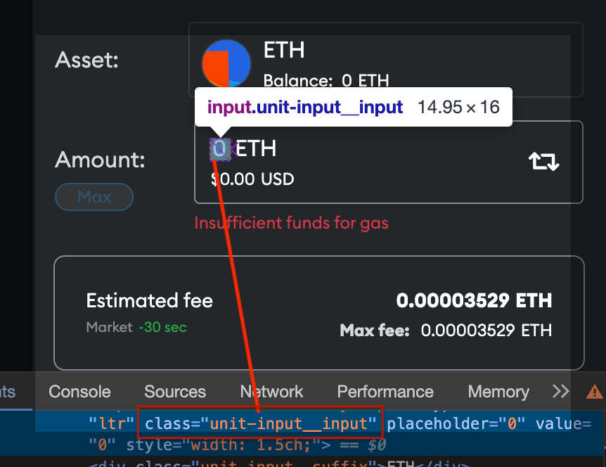
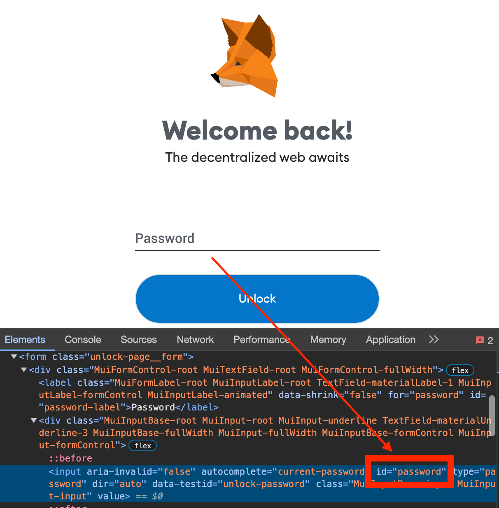
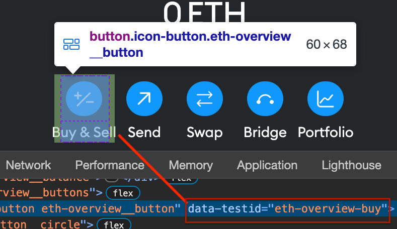
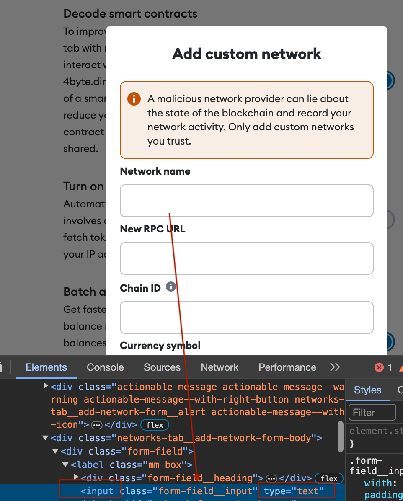
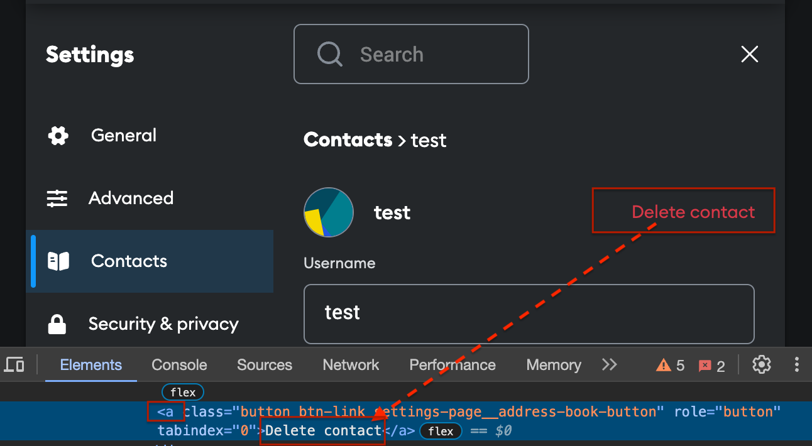
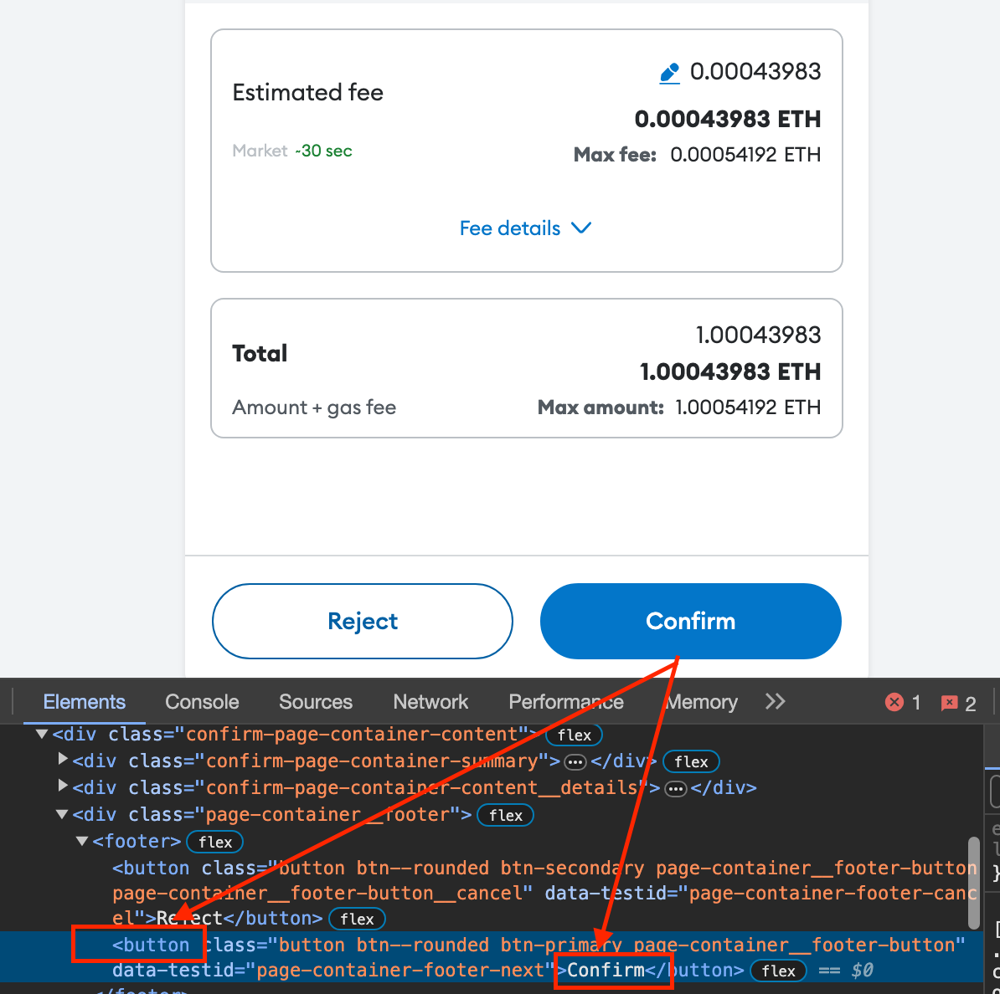
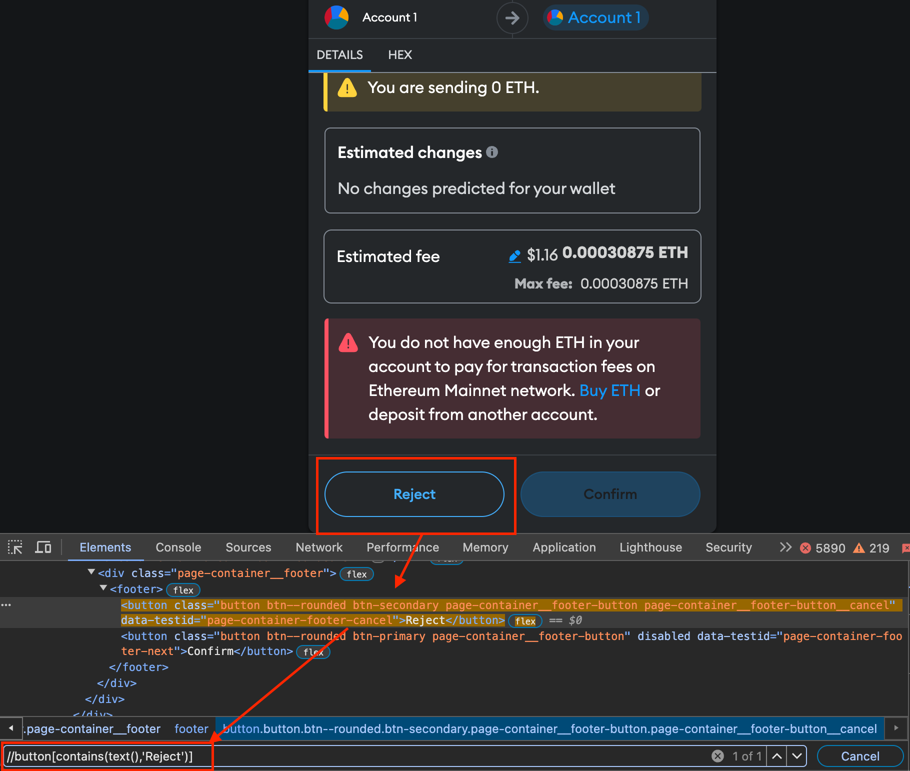
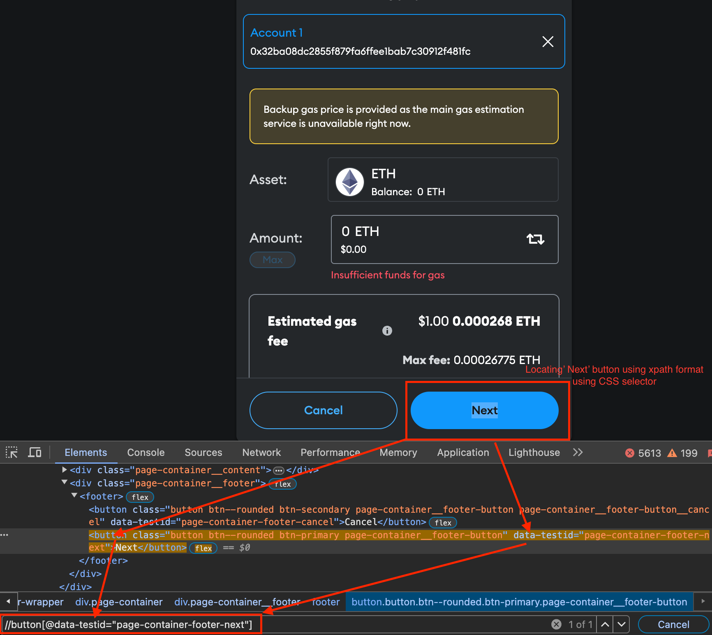

# About Driver

Driver is a custom class designed for handling web automation interactions, serving as a wrapper around the Selenium WebDriver library.

## Driver key features:

- Locator strategy that utilizes the buildLocator function, supporting inline locators as an alternative to the traditional use of Selenium's By abstraction.
- The finding element calls the wrapElementWithAPI function which mirrors the Playwright API, facilitating tool migration.
- A comprehensive suite of functions for element, interacting with them, and performing actions using keyboard and mouse.
- Appropriate waiting strategies for elements to appear within a time period or condition is met.
- Management of browser windows, tabs, alerts, and frames with appropriate navigation, switching, and closing capabilities.
- Validation of the application with assertion statements to check expected values and conditions.
- Error-handling mechanisms to capture and log browser console errors, simplifying the identification and troubleshooting of issues encountered during testing.
- Capture of screenshots during automated testing in the event of failures, aiding in debugging and issue pinpointing.

## Locators

In web automation testing, locators are crucial commands that guide the framework to identify and select [HTML elements](https://www.w3schools.com/html/default.asp) on a webpage for interaction. They play a vital role in executing various actions such as clicking buttons, fill text, or retrieving data from web pages. Gaining a solid understanding of locators is a key step in initiating web testing automation, as they form the foundation for engaging with web elements.

### buildLocator

The **`buildLocator`** function enhances element-matching capabilities by introducing support for inline locators, offering an alternative to the traditional use of Selenium's `By` abstraction.

[source](https://github.com/MetaMask/metamask-extension/blob/1f2bfb388695034db8859877ed21b4b045514f9f/test/e2e/webdriver/driver.js#L190)

#### Arguments

@param {string | object} locator - this could be 'css' or 'xpath' and value to use with the locator strategy.

#### Returns

@returns {object} By object that can be used to locate elements.<br>
@throws {Error} Will throw an error if an invalid locator strategy is provided.

<details><summary><b>Locate element by CSS</b></summary>

CSS Selectors in Selenium are string patterns used to identify an element based on a combination of HTML tag, id, class, and attributes.

> <details><summary><b>Class - CSS Selector</b></summary>
> To locate an element by its class using a CSS selector, prepend the class name with a dot (.) symbol.
>
> 
>
> Syntax for locating by Class
>
> ```jsx
> await driver.findElement('.unit-input__input’);
> ```
>
> </details>
> <details><summary><b>ID - CSS selector</b></summary>
>
> To locate an element by its ID using a CSS selector, prepend the ID with a hash sign (#).
>
> 
>
> Syntax for locating by ID
>
> ```tsx
> await driver.findElement('#password');
> ```
>
> </details>
> <details><summary><b>Attribute - CSS selector</b></summary>
>
> To target an element based on its attribute using a CSS selector, use square brackets ([]) to specify the attribute name and its value.
>
> 
>
> Syntax for locating the attribute **data-testid**
>
> ```tsx
> await driver.findElement('[data-testid="eth-overview-buy"]');
> ```
>
> </details>
> <details><summary><b>Attribute and tag - CSS  Selector</b></summary>
>
> Tag and attribute selectors provide a powerful way to precisely target and style HTML elements based on their type and characteristics.
>
> 
>
> Syntax for locating the elements of type input text.
>
> ```tsx
> await driver.findElements('input[type="text"]');
> ```
>
> </details>
> <details><summary><b>Locate element by link text</b></summary>
>
> This type of CSS locator applies only to hyperlink texts with the anchor tags.
>
> 
>
> Syntax for locating the links
>
> ```tsx
> await driver.findElement({ text: 'Delete contact', tag: 'a' });
> ```

</details>

<details><summary><b>Locate element by XPath</b></summary>
XPath is a language used for locating nodes in an XML document, which can also be applied to HTML documents for locating elements in the test automation. It utilizes path expressions to navigate through and select elements and attributes within the document.<br>
<br>
Below is the video to locate the element based on XPath.

https://github.com/MetaMask/metamask-extension/assets/539738/7a67a35f-5e42-465c-a376-4b24f931783a

There are two types of XPath

> <details><summary><b>Absolute XPath</b></summary>
>
> This is the direct way to find the element, but the disadvantage of an absolute XPath is that if there are any changes made in the path of the element, then that XPath fails. Hence this locator strategy should be avoided.
>
> </details>
> <details><summary><b>Relative XPath</b></summary>
> <br>
> Relative XPath starts from the middle of HTML DOM structure. It starts with double forward slash (//). It can search elements anywhere on the webpage, so there's no need to write a long xpath and you can start from the middle of HTML DOM structure. Relative XPath is always preferred, as it is not a complete path from the root element.<br>
> Standard XPath syntax - `//tagname[@attribute='value']`<br>
> </details>

<br>Our framework supports XPath representation in the patterns mentioned below

> <details><summary><b>Basic XPath</b></summary>
> XPath expressions select nodes or lists of nodes based on attributes such as `id`,`name`,`classname` and these can be directly specified as shown in the syntax.<br>
>
> 
>
> Syntax for locating the button element ‘Confirm’ using xpath
>
> ```tsx
> await driver.findClickableElement({ xpath: '//button[@value=‘Confirm’]' });
> ```
>
> </details>
>
> <details><summary><b>Contains</b></summary>
> Locate element with search text using the method `contains` in the XPath expression (mainly used when there is dynamic text)
>
> 
>
> Syntax for locating the button element that contains text ‘Reject’
>
> ```tsx
> await driver.findClickableElement({ text: 'Reject', tag: 'button' });
> ```
>
> Another syntax for locating the div menu element that contains text ‘Settings’
>
> ```tsx
> await driver.clickElement({ text: 'Settings', tag: 'div' });
> ```
>
> </details>
>
> <details><summary><b>With CSS selector</b></summary>
> Locate element with a combination of the xpath format and using the CSS selector.
>
> 
>
> Syntax for locating the button that contains text ‘Next’ and css attribute selector
>
> ```tsx
> await driver.clickElement({
>   text: 'Next',
>   tag: 'button',
>   css: '[data-testid="page-container-footer-next"]',
> });
> ```

</details>

<details><summary><b>**** Note - locators ****</b></summary>

> Our team utilizes a custom locator identification syntax consisting of Element Type, Identifier Type, and Identifier Value for efficient finding. Adherence to this syntax is crucial for maintaining consistency and streamlining our workflow.
>
> Selenium syntax for locator declaration
>
> ```jsx
> const passwordBox = await findElement(driver, By.css('#password'));
> await passwordBox.sendKeys('password123');
> ```
>
> Our framework syntax
>
> ```tsx
> await driver.fill('#password', 'password123');
> ```

</details>

## Elements

Finding web elements is a fundamental task in web automation and testing, allowing scripts to interact with various components of a web page, such as input fields, buttons, links, and more. One of the element identification functions listed below combines with the use [locators](#locators) to uniquely identify an element on the page.

<details><summary><b>findElement</b></summary>

> **`findElement`** returns a reference to the first element in the DOM that the provided locator matches.
>
> [source](https://github.com/MetaMask/metamask-extension/blob/1f2bfb388695034db8859877ed21b4b045514f9f/test/e2e/webdriver/driver.js#L458)
>
> #### Arguments
>
> @param {string} rawLocator - element locator
>
> #### Returns
>
> @return `{Promise<WebElement>}` A promise that resolves to the WebElement.
>
> **Example - Evaluating entire DOM**
>
> ```jsx
> await driver.findElement('[data-testid="account-menu-icon"]');
> ```
>
> Example - **Evaluating a subset of the DOM**
>
> ```jsx
> await driver.findElement({
>   css: '[data-testid="network-display"]',
>   text: 'Localhost 8545',
> });
> ```

</details>

<details><summary><b>findElements</b></summary>

> **`findElements`** function return a collection of element references. If there are no matches, an empty list is returned.
>
> [source](https://github.com/MetaMask/metamask-extension/blob/671c9975424a83904a4752dfb8a7cf728ae67355/test/e2e/webdriver/driver.js#L370)
>
> #### Arguments
>
> @param {string | object} rawLocator - Element locator
>
> #### Returns
>
> @returns `{Promise<Array<WebElement>>} `A promise that resolves to an array of found elements.
>
> **Example for all matching FindElements**
>
> ```jsx
> let assets = await driver.findElements('.multichain-token-list-item');
> ```
>
> Example of FindElements with getText()
>
> ```jsx
> const warnings = await driver.findElements('.import-srp__banner-alert-text');
> const warning = warnings[1];
> warningText = await warning.getText();
> ```

</details>

<details><summary><b>findVisibleElement</b></summary>

> **`findVisibleElement`** function is used to track (or) find DOM element which is visible
>
> [source](https://github.com/MetaMask/metamask-extension/blob/671c9975424a83904a4752dfb8a7cf728ae67355/test/e2e/webdriver/driver.js#L355)
>
> #### Arguments
>
> @param {string | object} rawLocator - Element locator
>
> #### Returns
>
> @return `{Promise<WebElement>}` A promise that resolves to the WebElement.
>
> **Example for all matching** findVisibleElement
>
> ```jsx
> await driver.findVisibleElement(
>   '[data-testid="confirm-delete-network-modal"]',
> );
> ```

</details>

<details><summary><b>findClickableElement</b></summary>

> **`findClickableElement`** function is used to track (or) find DOM element which is clickable
>
> [source](https://github.com/MetaMask/metamask-extension/blob/671c9975424a83904a4752dfb8a7cf728ae67355/test/e2e/webdriver/driver.js#L361)
>
> #### Arguments
>
> @param {string | object} rawLocator - Element locator
>
> #### Returns
>
> @return `{Promise<WebElement>}` A promise that resolves to the WebElement.
>
> **Example for f**indClickableElement
>
> ```jsx
> await driver.findClickableElement('#depositButton');
> ```

</details>
<details><summary><b>findClickableElements</b></summary>

> **`findClickableElements`** function is used to track (or) find DOM elements which are clickable
>
> [source](https://github.com/MetaMask/metamask-extension/blob/671c9975424a83904a4752dfb8a7cf728ae67355/test/e2e/webdriver/driver.js#L379)
>
> #### Arguments
>
> @param {string | object} rawLocator - Element locator
>
> #### Returns
>
> @return `{Promise<WebElement>}` A promise that resolves to the WebElement.
>
> **Example**
>
> ```jsx
> const domains = await driver.findClickableElements(
>   '.connected-sites-list__subject-name',
> );
> assert.equal(domains.length, 1);
> ```

</details>

## Interactions

In this context, interacting with web elements implies simulating actions a user might take on a webpage. This includes:

- **Clicking**: Simulating a mouse click on buttons, links, or any clickable elements.
- **Typing**: Entering text into input fields like text boxes or text areas.
- **Reading**: Extracting text or attributes from web elements to verify content or use it elsewhere.
- **Selecting**: Choosing options from dropdown menus or lists.
- **Scrolling**: Moving through the webpage, either to specific elements or a certain distance up or down.
- **Navigating**: Going through the web pages by clicking on links, using the back or forward buttons, or directly setting the URL.

Each of these actions requires first [locating](#locators) the web element you want to interact with, which is usually done using selectors like IDs, class names, CSS selectors, or XPath expressions.

<details><summary><b>fill</b></summary>

> **`fill`** function is designed to locate a web element on the page and input a specified text value into it. This function is particularly useful for automating interactions with text fields, such as username or password inputs, search boxes, or any editable text areas within a web application.
>
> [source](https://github.com/MetaMask/metamask-extension/blob/671c9975424a83904a4752dfb8a7cf728ae67355/test/e2e/webdriver/driver.js#L208)
>
> #### Arguments
>
> @param {string | object} rawLocator - Element locator<br>
> @param {string} input - The value to fill the element
>
> #### Returns
>
> @returns `{Promise<WebElement>}` Promise resolving to the filled element
>
> **Example**
>
> ```jsx
> await driver.fill(
>   'input[data-testid="ens-input"]',
>   '0xc427D562164062a23a5cFf596A4a3208e72Acd28',
> );
> ```

</details>
<details><summary><b>clickElementSafe</b></summary>

> **`clickElementSafe`** clicks on an element if it's present. If the element is not found, catch the exception, log the failure to the console, but do not cause the test to fail. It is particularly useful in instances where an element requires scrolling, but the scroll button does not appear due to rendering differences.
>
> [source](https://github.com/MetaMask/metamask-extension/blob/671c9975424a83904a4752dfb8a7cf728ae67355/test/e2e/webdriver/driver.js#L420)
>
> #### Arguments
>
> @param {string | object} rawLocator - Element locator<br>
> @param timeout - The maximum time in ms to wait for the element
>
> #### Returns
>
> @return `{Promise<WebElement>}` A promise that resolves to the WebElement.
>
> **Example**
>
> ```jsx
> await driver.clickElementSafe('[data-testid="snap-install-scroll"]');
> ```

</details>
<details><summary><b>clickElement</b></summary>

> **`clickElement`** function is an asynchronous function that aims to simulate a click action on a specified web element within a web page. This function is commonly used to interact with clickable elements such as buttons, links, checkboxes, or any other elements that respond to click events.
>
> [source](https://github.com/MetaMask/metamask-extension/blob/671c9975424a83904a4752dfb8a7cf728ae67355/test/e2e/webdriver/driver.js#L393)
>
> #### Arguments
>
> @param {string | object} rawLocator - Element locator
>
> #### Returns
>
> @returns `{Promise<WebElement>}` - promise that resolves to the WebElement
>
> **Example**
>
> ```jsx
> const nextPageButton = '[data-testid="page-container-footer-next"]',
> await driver.clickElement(nextPageButton);
> ```

</details>
<details><summary><b>press</b></summary>

> **`press`** function enables the simulation of keyboard actions on a specified web element. This can include typing characters into a text field, activating keyboard shortcuts, or any other keyboard-related interactions within a web page.
>
> [source](https://github.com/MetaMask/metamask-extension/blob/671c9975424a83904a4752dfb8a7cf728ae67355/test/e2e/webdriver/driver.js#L214)
>
> #### Arguments
>
> @param {string | object} rawLocator - Element locator<br>
> @param {string} keys - The key to press
>
> #### Returns
>
> @returns `{Promise<WebElement>}` promise resolving to the filled element
> **Example**
>
> ```jsx
> const ENTER = '\uE007',
> await driver.press('#password', ENTER);
> ```
>
> Other key actions
>
> ```
> this.Key = {
>      BACK_SPACE: '\uE003',
>      ENTER: '\uE007',
>      SPACE: '\uE00D',
>      CONTROL: '\uE009',
>      COMMAND: '\uE03D',
>      MODIFIER: process.platform === 'darwin' ? Key.COMMAND : Key.CONTROL,
>    };
> ```

</details>
<details><summary><b>getText</b></summary>

> **`getText`** function in Selenium is used to retrieve the visible text of a web element.
>
> #### Arguments
>
> @param {string | object} rawLocator - Element locator
>
> #### Returns
>
> @returns {text} String
>
> **Example**
>
> ```jsx
> const pageTitle = await driver.findElement('.unlock-page__title');
> assert.equal(await pageTitle.getText(), 'Welcome back!');
> ```
>
> >

</details>

## Waits

Selenium provides several mechanisms for managing waits, crucial for handling the asynchronous nature of web applications where elements may load at different times. These waits help avoid errors in test scripts that occur when trying to interact with elements that are not yet available on the web page

### When do we need to wait?

- **Before Locating the Element:**
  - Ensure that the page or relevant components have fully loaded.
  - You can use explicit waits to wait for certain conditions, like the visibility of an element or the presence of an element in the DOM.
- **CSS Selector and Element Existence:**
  - Ensure that the CSS selector is correct and that the element you're trying to locate actually exists in the DOM at the time you're trying to find it.
  - It's possible the element is dynamically loaded or changed due to a recent update in the application.
- **Context Switching:**
  - Consider switching the context to that iframe or modal before attempting to locate the element.
- **Recent Changes:**
  - If the issue started occurring recently, review any changes made to the application that could affect the visibility or availability of the element.
- **Timeout Period:**
  - If the default timeout is too short for the page or element to load, consider increasing the timeout period. This is especially useful for pages that take longer to load due to network latency or heavy JavaScript use.

This organization helps provide a clear structure for understanding the various situations in which waiting may be necessary when working with web elements.

<details><summary><b>wait</b></summary>

> **`wait`** function is an asynchronous function to wait for a specific condition to be met within a given timeout period, with an option to catch and handle any errors that occur during the wait.
>
> [source](https://github.com/MetaMask/metamask-extension/blob/671c9975424a83904a4752dfb8a7cf728ae67355/test/e2e/webdriver/driver.js#L224)
>
> #### Arguments
>
> @param {Function} condition - condition or function the method awaits to become true.<br>
> @param {number} timeout - Optional parameter specifies the maximum milliseconds to wait.<br>
> @param catchError - Optional parameter that determines whether errors during the wait should be caught and handled within the function
>
> #### Returns
>
> @returns {Promise} - promise resolving with a delay.<br>
> @throws {Error} Will throw an error if the condition is not met within the timeout period.
>
> **Example wait until a condition occurs**
>
> ```jsx
> await driver.wait(async () => {
>   info = await getBackupJson();
>   return info !== null;
> }, 10000);
> ```
>
> **Example wait until the condition for finding the elements is met and ensuring that the length validation is also satisfied.**
>
> ```jsx
> await driver.wait(async () => {
>   const confirmedTxes = await driver.findElements(
>     '.transaction-list__completed-transactions .transaction-list-item',
>   );
>   return confirmedTxes.length === 1;
> }, 10000);
> ```
>
> **Example wait until a mock condition occurs**
>
> ```jsx
> await driver.wait(async () => {
>   const isPending = await mockedEndpoint.isPending();
>   return isPending === false;
> }, 3000);
> ```

</details>
<details><summary><b>waitForSelector</b></summary>

> **`waitForSelector`** function allows for flexible handling of element visibility and detachment from the DOM, making it useful for ensuring that web interactions occur only when the page is in the desired state. This function can be used in scenarios where you need to wait for an element to appear or disappear before performing further actions, such as:
>
> - Ensuring a modal dialog is visible before attempting to close it.
> - Verifying that an item has been removed from the page after a delete action.
>
> [source](https://github.com/MetaMask/metamask-extension/blob/671c9975424a83904a4752dfb8a7cf728ae67355/test/e2e/webdriver/driver.js#L236)
>
> #### Arguments
>
> @param {string | object} rawLocator - Element locator<br>
> @param {number} timeout - optional parameter that specifies the maximum amount of time (in milliseconds) to wait for the condition to be met and desired state of the element to wait for.<br>
> It defaults to 'visible', indicating that the function will wait until the element is visible on the page.<br>
> The other supported state is 'detached', which means waiting until the element is removed from the DOM.
>
> #### Returns
>
> @returns `{Promise<WebElement>}` promise resolving when the element meets the state or timeout occurs.<br>
> @throws {Error} Will throw an error if the element does not reach the specified state within the timeout period.
>
> **Example** wait for element to load
>
> ```jsx
> await driver.waitForSelector('.import-srp__actions');
> ```

</details>
<details><summary><b>waitForMultipleSelectors</b></summary>

> **`waitForMultipleSelectors`** function is designed for scenarios where you need to wait for multiple elements to either become visible or be detached from the DOM before proceeding with further actions. It enhances test robustness by allowing for simultaneous waits on several conditions, making it particularly useful in complex web interactions, such as:
>
> - Waiting for all parts of a page to load before performing a comprehensive test.
> - Ensuring multiple UI components are removed after an action.
>
> [source](https://github.com/MetaMask/metamask-extension/blob/671c9975424a83904a4752dfb8a7cf728ae67355/test/e2e/webdriver/driver.js#L357)
>
> #### Arguments
>
> @param `{Array<string | object>}` rawLocators - Array of element locators<br>
> @param `{number}` timeout - Optional parameter that specifies the maximum amount of time (in milliseconds) to wait for the condition to be met and desired state of the elements to wait for.<br>
> It defaults to 'visible', indicating that the function will wait until the elements are visible on the page.<br>
> The other supported state is 'detached', which means waiting until the elements are removed from the DOM.
>
> #### Returns
> @returns `{Promise<Array<WebElement>>}` Promise resolving when all elements meet the state or timeout occurs.<br>
> @throws `{Error}` Will throw an error if any of the elements do not reach the specified state within the timeout period.

> **Example** wait for multiple elements to load
>
> ```jsx
> await driver.waitForMultipleSelectors(['.selector1', '.selector2', '.selector3']);
> ```
>
</details>
<details><summary><b>waitForNonEmptyElement</b></summary>

> **`waitForNonEmptyElement`** function is an asynchronous function designed to wait until a specified web element contains some text, i.e., it's not empty. This can be particularly useful in scenarios where the content of an element is dynamically loaded or updated, and you need to ensure the element has content before proceeding with further actions. This function is useful when you need to wait for a message, label, or any piece of information to appear in a UI element before performing further actions, such as:
>
> - Waiting for a success message after submitting a form.
> - Ensuring that a dynamically loaded piece of text, like a user's name or a search result, is displayed before proceeding.
>
> [source](https://github.com/MetaMask/metamask-extension/blob/671c9975424a83904a4752dfb8a7cf728ae67355/test/e2e/webdriver/driver.js#L262)
>
> #### Arguments
>
> @param {string | object} element - Element locator
>
> #### Returns
>
> @returns `{Promise<WebElement>}` promise resolving once the element fills or timeout hits.<br>
> @throws {Error} Will throw an error if the element does not become non-empty within the timeout period.
>
> **Example**
>
> ```jsx
> const revealedSeedPhrase = await driver.findElement(
>   '.reveal-seed-phrase__secret-words',
> );
> await driver.waitForNonEmptyElement(revealedSeedPhrase);
> ```

</details>
<details><summary><b>waitForElementState</b></summary>

> **`waitForElementState`** function waits for a specific state of an element.
>
> [source](https://github.com/MetaMask/metamask-extension/blob/671c9975424a83904a4752dfb8a7cf728ae67355/test/e2e/webdriver/driver.js#L55)
>
> #### Arguments
>
> @param {WebElement} element - Element locator<br>
> @param {string} state - state to wait for could be 'visible', 'hidden', 'enabled', 'disabled'
> @param {number} [timeout=5000] - amount of time in milliseconds to wait before timing out
>
> #### Returns
>
> @returns `'{Promise<void>}'` A promise that resolves when the element is in the specified state. <br>
> @throws {Error} Will throw an error if the element does not reach the specified state within the timeout period.
>
> **Example**
>
> ```jsx
> const networkSelectionModal = await driver.findVisibleElement('.mm-modal');
> // Wait for network to change and token list to load from state
> await networkSelectionModal.waitForElementState('hidden');
> ```

</details>
<details><summary><b>clickElementAndWaitToDisappear</b></summary>
<br>

> **`clickElementAndWaitToDisappear`** function clicks on an element identified by the provided locator and waits for it to disappear.<br>
> For scenarios where the clicked element, such as a notification or popup, needs to disappear afterward.
> The wait ensures that subsequent interactions are not obscured by the initial notification or popup element.
>
> [source](https://github.com/MetaMask/metamask-extension/blob/671c9975424a83904a4752dfb8a7cf728ae67355/test/e2e/webdriver/driver.js#L406)
>
> #### Arguments
>
> @param rawLocator - Element locator<br>
> @param timeout - The maximum time in ms to wait for the element to disappear after clicking.
>
> **Example**
>
> ```jsx
> await driver.clickElementAndWaitToDisappear({
>   text: 'Got it',
>   tag: 'button',
> });
> ```

</details>
<details><summary><b>elementCountBecomesN</b></summary>

> **`elementCountBecomesN`** function waits until the expected number of tokens to be rendered <br>
>
> [source](https://github.com/MetaMask/metamask-extension/blob/671c9975424a83904a4752dfb8a7cf728ae67355/test/e2e/webdriver/driver.js#L270)
>
> #### Arguments
>
> @param {string | object} rawLocator - element locator
> @param {number} count - The expected number of elements.<br>
>
> #### Returns
>
> @returns {Promise} promise resolving when the count of elements is matched.
>
> **Example**
>
> ```jsx
> const expectedTokenListElementsAreFound = await driver.elementCountBecomesN(
>   '.multichain-token-list-item',
>   4,
> );
> ```

</details>
<a id="waitX"></a>
<details><summary><b>waitUntilXWindowHandles</b></summary>

> **`waitUntilXWindowHandles`** function waits until the specified number of window handles are present.
>
> [source](https://github.com/MetaMask/metamask-extension/blob/671c9975424a83904a4752dfb8a7cf728ae67355/test/e2e/webdriver/driver.js#L574)
>
> #### Arguments
>
> @param {number} x - The number of window handles to wait for<br>
> @param {number} [timeout=5000] - The amount of time in milliseconds to wait before timing out<br>
>
> #### Returns
>
> @returns `{Promise<void>}` promise resolving when the target window handle count is met<br>
> @throws {Error} - throws an error if the target number of window handles isn't met by the timeout
>
> **Example**
>
> ```jsx
> windowHandles = await driver.waitUntilXWindowHandles(1, 1000, 10000);
> ```

</details>

#### [assertElementNotPresent](#assertElemntNotPresent-click-here)

### \***\* NOTE - Delay \*\***

** The `delay`** function is a hard-coded wait that may be longer than needed, resulting in slower test execution. Please avoid using this function.

## Actions

These interactions include keyboard and mouse actions.

### Keyboard

---

Selenium can simulate keyboard shortcuts by sending combinations of keys.

<details><summary><b>sendKeys</b></summary>

```jsx
const approveInput = await driver.findElement('#approveTokenInput');
await approveInput.sendKeys('1');
```

</details>

<details><summary><b>clear</b></summary>

```jsx
const approveInput = await driver.findElement('#approveTokenInput');
await approveInput.clear();
```

</details>

<details><summary><b>pasteIntoField</b></summary>

> **`pasteIntoField`** function simulates the pasting of content into a specified field, employing a unique approach to managing the clipboard.
>
> [source](https://github.com/MetaMask/metamask-extension/blob/671c9975424a83904a4752dfb8a7cf728ae67355/test/e2e/webdriver/driver.js#L502)
>
> #### Arguments
>
> @param {string | object} rawLocator - Element locator
> @param {string} contentToPaste - content to paste.
>
> #### Returns
>
> @return `{Promise<WebElement>}` A promise that resolves to the WebElement.
>
> **Example**
>
> ```jsx
> await driver.pasteIntoField('#bip44Message', '1234');
> ```

</details>

### Mouse

---

A representation of any pointer device for interacting with a web page.

<details><summary><b>clickElementUsingMouseMove</b></summary>

> **`clickElementUsingMouseMove`** function by simulating a more natural mouse movement towards the element before initiating a click. This is essential for web pages with buttons that only respond correctly to user interactions when the mouse physically moves to the button before clicking, as opposed to executing a direct click command.
>
> [source](https://github.com/MetaMask/metamask-extension/blob/671c9975424a83904a4752dfb8a7cf728ae67355/test/e2e/webdriver/driver.js#L440)
>
> #### Arguments
>
> @param {string | object} rawLocator - Element locator
>
> #### Returns
>
> @returns `{Promise<void>}` promise that will be fulfilled when the click command has completed.
>
> **Example**
>
> ```jsx
> await driver.clickElementUsingMouseMove({
>   text: 'Reject request',
>   tag: 'div',
> });
> ```

</details>

<details><summary><b>scrollToElement</b></summary>

> **`scrollToElement`** function scrolls the web page until the specified element comes into view.
>
> [source](https://github.com/MetaMask/metamask-extension/blob/671c9975424a83904a4752dfb8a7cf728ae67355/test/e2e/webdriver/driver.js#L471)
>
> #### Arguments
>
> @param {string | object} element - Element locator
>
> #### Returns
>
> @returns `{Promise<void>}` - promise resolving after scrolling
>
> **Example**
>
> ```jsx
> const removeButton = await driver.findElement(
>   '[data-testid="remove-snap-button"]',
> );
> await driver.scrollToElement(removeButton);
> await driver.clickElement('[data-testid="remove-snap-button"]');
> ```

</details>

<details><summary><b>holdMouseDownOnElement</b></summary>

> **`holdMouseDownOnElement`** function simulates the action of pressing and holding down the mouse button on a specific element for a specified duration.
>
> [source](https://github.com/MetaMask/metamask-extension/blob/671c9975424a83904a4752dfb8a7cf728ae67355/test/e2e/webdriver/driver.js#L459)
>
> #### Arguments
>
> @param {string | object} rawLocator - Element locator<br>
> @param {int} ms - The number of milliseconds to hold the mouse button down
>
> #### Returns
>
> @returns `{Promise<void>}` - promise resolving after mouse down completed
>
> **Example**
>
> ```jsx
> await driver.holdMouseDownOnElement(
>   {
>     text: tEn('holdToRevealPrivateKey'),
>     tag: 'span',
>   },
>   2000,
> );
> ```

</details>

<details><summary><b>clickPoint</b></summary>

> **`clickPoint`** function is designed to click on a specific point, determined by the x and y coordinates
>
> [source](https://github.com/MetaMask/metamask-extension/blob/671c9975424a83904a4752dfb8a7cf728ae67355/test/e2e/webdriver/driver.js#L450)
>
> #### Arguments
>
> @param {string | object} rawLocator - Element locator<br>
> @param {number} x - x coordinate to click at<br>
> @param {number} y - y coordinate to click at<br>
>
> #### Returns
>
> @returns `{Promise<void>}` - promise resolving after a click

</details>

## Navigation

Navigation refers to the process of moving through web pages within a browser session. This involves tasks such as:

- **Going to a URL**: This is the starting point of navigation, where you direct the browser to load a specific web page by providing its URL.
- **Refreshing the Page**: Refreshes the current page to update content or re-execute certain actions.
- **Handling Redirects**: Web pages might redirect to different URLs automatically. Automation scripts need to handle these redirects gracefully, ensuring they can continue to interact with the correct page elements after the redirect.

<details><summary><b>navigate</b></summary>

> **`navigate`** function is an asynchronous function designed for navigating to different pages within a web application.
>
> [source](https://github.com/MetaMask/metamask-extension/blob/671c9975424a83904a4752dfb8a7cf728ae67355/test/e2e/webdriver/driver.js#L522)
>
> #### Arguments
>
> @param {string} [page] - its optional parameter to specify the page you want to navigate. Defaults to home if no other page is specified.
>
> #### Returns
>
> @returns {Promise} promise resolves when the page has finished loading<br>
> @throws {Error} Will throw an error if the navigation fails or the page does not load within the timeout period.
>
> **Example - navigate to the home page by default without passing parameter.**
>
> ```jsx
> await driver.navigate();
> ```
>
> **Example - navigate to the home page**
>
> ```jsx
> await driver.navigate(PAGES.HOME);
> ```
>
> **Example - navigate to the background page**
>
> ```jsx
> await driver.navigate(PAGES.BACKGROUND);
> ```

</details>

<details><summary><b>getCurrentUrl</b></summary>

> **`getCurrentUrl`** function to retrieve the current URL of the browser session.
>
> [source](https://github.com/MetaMask/metamask-extension/blob/671c9975424a83904a4752dfb8a7cf728ae67355/test/e2e/webdriver/driver.js#L532)
>
> #### Returns
>
> @returns `{Promise<string>}` promise resolves upon retrieving the text.
>
> **Example**
>
> ```jsx
> const currentUrl = await driver.getCurrentUrl();
> ```

</details>

<details><summary><b>refresh</b></summary>

> **`refresh`** function to refresh the current page in the browser.
>
> [source](https://github.com/MetaMask/metamask-extension/blob/671c9975424a83904a4752dfb8a7cf728ae67355/test/e2e/webdriver/driver.js#L554)
>
> **Returns**
>
> @returns `{Promise<void>}` promise resolves page is loaded
>
> **Example**
>
> ```jsx
> await driver.refresh();
> ```

</details>

## Window and Tabs

Web browsers can have multiple windows or tabs open at the same time. In web automation:

- **Switching Between Windows/Tabs**: Automation scripts often need to switch the context from one window or tab to another. This is done by obtaining a handle or identifier for each window/tab and then instructing the automation tool to switch contexts.
- **Opening and Closing Windows/Tabs**: Scripts can open new windows or tabs and close them as needed, just like a user might do manually.

<details><summary><b>openNewPage</b></summary>

> **`openNewPage`** function to open a new browser tab or window and navigate to a specified URL.
>
> [source](https://github.com/MetaMask/metamask-extension/blob/671c9975424a83904a4752dfb8a7cf728ae67355/test/e2e/webdriver/driver.js#L547)
>
> #### Arguments
>
> @param {string} url - The URL to navigate to in the new window tab.
>
> #### Returns
>
> @returns {newHandle} The handle of the new window tab. This handle can be used later to switch between different tab windows during the test.
>
> **Example**
>
> ```jsx
> await driver.openNewPage('http://127.0.0.1:8080');
> ```

</details>

<details><summary><b>openNewURL</b></summary>

> **`openNewURL`** function to open a new URL in the browser window controlled by the driver.
>
> [source](https://github.com/MetaMask/metamask-extension/blob/671c9975424a83904a4752dfb8a7cf728ae67355/test/e2e/webdriver/driver.js#L543)
>
> #### Arguments
>
> @param {string} url - Any URL
>
> #### Returns
>
> @returns `{Promise<void>}` promise resolves when the URL page has finished loading
>
> **Example**
>
> ```jsx
> await driver.openNewURL('http://127.0.0.1:8080');
> ```

</details>

<details><summary><b>switchToNewWindow</b></summary>

> **`switchToNewWindow`** function to open a new browser window and switch the WebDriver's context to this new window.
>
> [source](https://github.com/MetaMask/metamask-extension/blob/671c9975424a83904a4752dfb8a7cf728ae67355/test/e2e/webdriver/driver.js#L562)
>
> #### Returns
>
> @returns `{Promise<void>}` A promise resolves after switching to the new window.
>
> **Example**
>
> ```jsx
> await driver.switchToNewWindow();
> ```

</details>

### Get window handle

<details><summary><b>getAllWindowHandles</b></summary>

> **`getAllWindowHandles`** function retrieves all window handles that are currently open in the WebDriver session.
>
> [source](https://github.com/MetaMask/metamask-extension/blob/671c9975424a83904a4752dfb8a7cf728ae67355/test/e2e/webdriver/driver.js#L570)
>
> #### Returns
>
> @returns {int} - number of windows<br>
> @return `{Promise<Array<string>>}` A promise that will be resolved with an array of window handles.
>
> **Example**
>
> ```jsx
> const windowHandles = await driver.getAllWindowHandles();
> ```

</details>

<details><summary><b>switchToHandleAndWaitForTitleToBe</b></summary>

> **`switchToHandleAndWaitForTitleToBe`** switches to a specific window tab using its ID and waits for the title to match the expectedTitle.
>
> [source](https://github.com/MetaMask/metamask-extension/blob/671c9975424a83904a4752dfb8a7cf728ae67355/test/e2e/webdriver/driver.js#L589)
>
> #### Arguments
>
> @param {int} handleId - unique ID for the tab whose title is needed.
> @param {string} expectedTitle - the title we are expecting.
>
> #### Returns
>
> @returns nothing on success.
>
> **Example**
>
> ```jsx
> const fullScreenWindowTitle = await driver.switchToHandleAndWaitForTitleToBe(
>   windowHandles[0],
>   WINDOW_TITLES.Dialog,
> );
> ```

</details>

### Switching windows or tabs

<details><summary><b>switchToWindow</b></summary>

> **`switchToWindow`** function designed to switch the context of the browser session to the window or tab with the given handle.
>
> [source](https://github.com/MetaMask/metamask-extension/blob/671c9975424a83904a4752dfb8a7cf728ae67355/test/e2e/webdriver/driver.js#L558)
>
> #### Arguments
>
> @param {int} handle - unique ID for the tab to which you want to switch.
>
> #### Returns
>
> @returns `{Promise<void>}` promise that resolves once the switch is complete
>
> **Example**
>
> ```jsx
> await driver.switchToWindow(windowHandles[0]);
> ```

</details>

<details><summary><b>switchToWindowWithUrl</b></summary>

> **`switchToWindowWithUrl`** function is intended switches the context of the browser session to the window tab with the given URL.
>
> [source](https://github.com/MetaMask/metamask-extension/blob/671c9975424a83904a4752dfb8a7cf728ae67355/test/e2e/webdriver/driver.js#L631)
>
> #### Arguments
>
> @param {string} url - The URL of the window tab to switch<br>
> @param {string} [initialWindowHandles] - optional array of window handles to search through<br>
> If not provided, the function fetches all current window handles.<br>
> @param {int} delayStep - optional defaults to 1000 milliseconds<br>
> @param {int} timeout - optional set to the defaults to 1000 milliseconds in the file<br>
> @param {int} retries - optional for retrying the URL fetch operation, defaults to starting at 8 ms<br>
> @param {int} retryDelay - optional for retrying the URL fetch operation, with defaults max 2500 ms<br>
>
> #### Returns
>
> @returns `{Promise<void>} `- promise that resolves once the switch is complete<br>
> @throws {Error} - throws an error if no window with the specified url is found
>
> **Example**
>
> ```jsx
> const DAPP_URL = 'http://127.0.0.1:8080';
> await driver.switchToWindowWithUrl(DAPP_URL);
> ```

</details>

<details><summary><b>switchToWindowWithTitle</b></summary>

> **`switchToWindowWithTitle`** function is intended for use in web automation testing and aims to switch the testing framework's context to a window or tab that matches a specific title. This functionality is especially valuable in complex testing scenarios involving multiple windows or tabs, allowing for interaction with a particular window or tab based on its title.
>
> [source](https://github.com/MetaMask/metamask-extension/blob/671c9975424a83904a4752dfb8a7cf728ae67355/test/e2e/webdriver/driver.js#L594)
>
> #### Arguments
>
> @param {string} title - The title of the window tab to switch<br>
> @param {string} [initialWindowHandles] - optional array of window handles to search through<br>
> If not provided, the function fetches all current window handles<br>
> @param {int} delayStep - optional defaults to 1000 milliseconds<br>
> @param {int} timeout - optional set to the defaults to 1000 milliseconds in the file<br>
> @param {int} retries - optional for retrying the title fetch operation, defaults to starting at 8 ms<br>
> @param {int} retryDelay - optional for retrying the title fetch operation, with defaults max 2500 ms<br>
>
> #### Returns
>
> @returns `{Promise<void>}` promise that resolves once the switch is complete<br>
> @throws {Error} throws an error if no window with the specified title is found.
>
> **Example**
>
> ```jsx
> windowHandles = await driver.waitUntilXWindowHandles(2, 1000, 10000);
> await driver.switchToWindowWithTitle('Test Snaps', windowHandles);
> ```

</details>

### [Waits for window handles](#waitX)

### Closing windows or tabs

<details><summary><b>closeWindow</b></summary>

> **`closeWindow`** function loses the current window tab in the browser session. This is particularly useful for cleaning up after a test or when switching between different window tabs.
>
> [source](https://github.com/MetaMask/metamask-extension/blob/671c9975424a83904a4752dfb8a7cf728ae67355/test/e2e/webdriver/driver.js#L668)
>
> #### Returns
>
> @returns `{Promise<void>}` promise resolving after closing the current window
>
> **Example**
>
> ```jsx
> await driver.closeWindow();
> ```

</details>

<details><summary><b>closeWindowHandle</b></summary>

> **`closeWindowHandle`** function closes a specific browser window or tab identified by its window handle.
>
> [source](https://github.com/MetaMask/metamask-extension/blob/671c9975424a83904a4752dfb8a7cf728ae67355/test/e2e/webdriver/driver.js#L672)
>
> #### Arguments
>
> @param {string} windowHandle - representing the unique identifier of the browser window to be closed.
>
> #### Returns
>
> @returns `{Promise<void>} `- promise resolving after closing the specified window
>
> **Example**
>
> ```jsx
> const serviceWorkerTab = await switchToWindow(
>   driver,
>   WINDOW_TITLES.ServiceWorkerSettings,
> );
> await driver.closeWindowHandle(serviceWorkerTab);
> ```

</details>

<details><summary><b>closeAllWindowHandlesExcept</b></summary>

> **`closeAllWindowHandlesExcept`** function close all browser windows or tabs except for those specified in a list of exceptions.
>
> [source](https://github.com/MetaMask/metamask-extension/blob/671c9975424a83904a4752dfb8a7cf728ae67355/test/e2e/webdriver/driver.js#L689)
>
> #### Arguments
>
> @param {Array<string>} exceptions - list of window handle exceptions<br>
> @param {Array} [windowHandles] - full list of window handles
>
> #### Returns
>
> @returns `{Promise<void>}`- promise resolving after closing the specified window

</details>

<details><summary><b>quit</b></summary>

> **`quit`** function quits driver and closing every associated window.
>
> [source](https://github.com/MetaMask/metamask-extension/blob/671c9975424a83904a4752dfb8a7cf728ae67355/test/e2e/webdriver/driver.js#L336)
>
> #### Returns
>
> @returns `{Promise<void>}` - promise resolving after quitting
>
> **Example**
>
> ```jsx
> await driver.quit();
> ```

</details>

### Alerts

Alerts are pop-up messages that appear

- **Handling Alerts**: Scripts must be able to detect when an alert has appeared, read its message, and interact with it by accepting, dismissing, or providing input (in the case of prompt alerts).

<details><summary><b>closeAlertPopup</b></summary>

> **`closeAlertPopup` is method to handle and close alert popups in a web browser.**
>
> [source](https://github.com/MetaMask/metamask-extension/blob/671c9975424a83904a4752dfb8a7cf728ae67355/test/e2e/webdriver/driver.js#L678)
>
> #### Returns
>
> @returns `{Promise<void>}` promise resolving when the alert is closed
>
> **Example**
>
> ```jsx
> await driver.closeAlertPopup();
> ```

</details>

### Frames and iFrames

Web pages can be segmented into frames or IFrames, which are essentially documents within documents. Handling frames involves:

- **Switching to a Frame**: To interact with elements inside a frame, the automation script must first switch its context to that frame.
- **Default Content**: After interacting with a frame, the script often needs to switch back to the main page or another frame, commonly referred to as switching back to the default content.

<details><summary><b>switchToFrame</b></summary>

> **`switchToFrame`** is function to switch the WebDriver's context to a specified iframe or frame within a web page.
>
> [source](https://github.com/MetaMask/metamask-extension/blob/671c9975424a83904a4752dfb8a7cf728ae67355/test/e2e/webdriver/driver.js#L566)
>
> #### Arguments
>
> @param {string | object} rawLocator - Element locator
>
> #### Returns
>
> @returns `{Promise<void>}` promise that resolves once the switch is complete
>
> **Example**
>
> ```jsx
> const iframe = await driver.findElement('iframe');
> await driver.switchToFrame(iframe);
> ```

</details>

## Assertions

Assertion is a statement that checks if a specified condition is true. If the condition is true, the program continues to execute. If the condition is false, throws an error or fails.

### When do we need Assertions?

They are used to verify that the application under test behaves as expected under various conditions. Common assertions include:

- Checking if a variable has the expected value.
- Verifying that an object is not null.
- Ensuring that a web element is visible, contains specific text, or is enabled/disabled.
- Verify that a certain condition holds at a specific point in the program or test case.

### key points to remember

- When writing assertions, provide clear and informative error messages. This helps in quickly understanding what went wrong when an assertion fails.
- While assertions are powerful, overusing them can clutter the code and make tests harder to maintain. Use them to check critical conditions.
- Race condition: Sometimes, we might check something too quickly before everything is set up properly. This can lead to getting the wrong information, which might not match what we finally see or use.

<details><summary><b>isElementPresent</b></summary>

> **`isElementPresent`** function to check if a specific web element, exists on the web page.
>
> [source](https://github.com/MetaMask/metamask-extension/blob/671c9975424a83904a4752dfb8a7cf728ae67355/test/e2e/webdriver/driver.js#L478)
>
> #### Arguments
>
> @param {string | object} rawLocator - Element locator
>
> #### Returns
>
> @returns `{Promise<boolean>}` - promise that resolves to a boolean indicating whether the element is present.
>
> **Example**
>
> ```jsx
> const tooltipText = '[data-original-title="Copiar al Portapapeles"]',
> const isHeaderTooltipPresent = await driver.isElementPresent(
>          tooltipText,);
> assert.equal(
>          isHeaderTooltipPresent,
>          true,
>          'Language changes is not reflected on the toolTip',
>        );
> ```

</details>

<details><summary><b>isElementPresentAndVisible</b></summary>

> **`isElementPresentAndVisible`** function to check not only if a specific web element, exists on the web page but also if it is visible to the user.
>
> [source](https://github.com/MetaMask/metamask-extension/blob/671c9975424a83904a4752dfb8a7cf728ae67355/test/e2e/webdriver/driver.js#L487)
>
> #### Arguments
>
> @param {string | object} rawLocator - Element locator
>
> #### Returns
>
> @returns `{Promise<Boolean>}`- promise that resolves to a boolean indicating whether the element is present and visible.
>
> **Example**
>
> ```jsx
> const nftImageIsStillDisplayed = await driver.isElementPresentAndVisible(
>   '.nft-item__container',
> );
> assert.equal(
>   nftIsStillDisplayed,
>   true,
>   'Nft is no longer displayed after adding an account and switching back to account 1',
> );
> ```

</details>
<a id="assertElemntNotPresent-click-here"></a>
<details><summary><b>assertElementNotPresent</b></summary>

> **`assertElementNotPresent`** function wait until an element is absent. This function MUST have a guard to prevent a race condition. For example, when the previous step is to click a button that loads a new page, then of course during page load, the rawLocator element will be absent, even though it will appear a half-second later. The first choice for the guard is to use the findElementGuard, which executes before the search for the rawLocator element. The second choice for the guard is to use the waitAtLeastGuard parameter.
>
> [source](https://github.com/MetaMask/metamask-extension/blob/671c9975424a83904a4752dfb8a7cf728ae67355/test/e2e/webdriver/driver.js#L303)
>
> #### Arguments
>
> @param {string | object} rawLocator - Element locator<br>
> @param {object} guards<br>
> @param {string | object} [guards.findElementGuard] - A rawLocator to perform a findElement and act as a guard<br>
> @param {number} [guards.waitAtLeastGuard] - The minimum milliseconds to wait before passing<br>
> @param {number} [guards.timeout] - The maximum milliseconds to wait before failing<br>
>
> #### Return
>
> @returns `{Promise<void>}` - promise resolving after the element is not present<br>
> @throws {Error} - throws an error if the element is present
> **Example**
>
> ```jsx
> await driver.assertElementNotPresent('.loading-overlay');
> ```
>
> ```jsx
> const pinnedIconSelector = '.account-pinned-icon';
> await driver.assertElementNotPresent(pinnedIconSelector, {
>   waitAtLeastGuard: 200, // A waitAtLeastGuard of 200ms is the best choice here
> });
> ```

</details>
