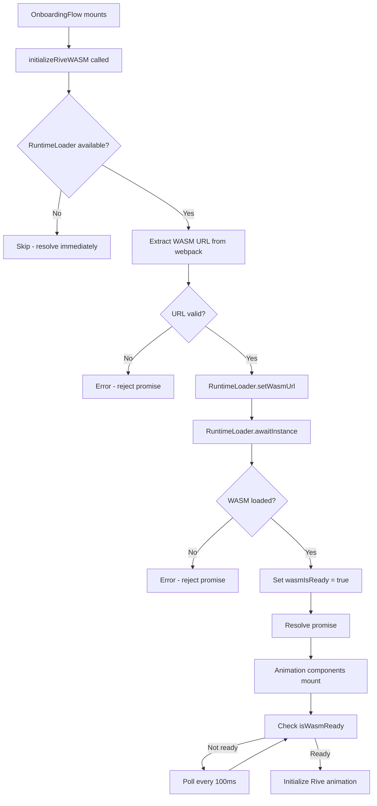

# Rive WASM Animation Integration

This module handles the initialization and management of Rive animations using WebAssembly (WASM) in the MetaMask onboarding flow.

## 📁 Structure

```
rive-wasm/
├── README.md       # This file
└── init.ts         # WASM initialization module
```

## 🎯 Purpose

Provides centralized WASM initialization for Rive animations to ensure:

- Single initialization point (no duplicate loading)
- Proper resource management
- Security-focused implementation
- Better performance

## 🔒 Security Improvements

### Previous Implementation Issues

**❌ CDN Dependency Risk**

- Relied on unpkg.com CDN for WASM loading
- External network requests could be blocked or compromised
- No control over CDN availability or integrity

**❌ No Resource Preloading**

- WASM loaded on-demand when animation components mounted
- Race conditions between components
- Poor user experience with loading delays

**❌ Code Duplication**

- Each animation component had its own initialization logic (~140 lines duplicated)
- Inconsistent error handling
- Difficult to maintain and update

### Current Implementation Benefits

**✅ Bundled WASM**

```typescript
import riveWASMResource from '@rive-app/canvas/rive.wasm';
```

- WASM file is bundled with the extension using webpack's `asset/resource` loader
- No external network requests
- Reduces attack surface by eliminating CDN dependency
- Guaranteed availability offline

**✅ Centralized Initialization**

```typescript
// In onboarding-flow.js
useEffect(() => {
  initializeRiveWASM()
    .then(() => console.log('[Rive] WASM ready'))
    .catch((error) => console.error('[Rive] WASM failed:', error));
}, []);
```

- Single initialization in parent component
- Child components poll for readiness
- No race conditions

**✅ Proper Error Handling**

- Comprehensive type checking for webpack module formats
- Fallback mechanisms
- Graceful degradation if WASM fails to load

## 🏗️ Architecture

### Initialization Flow



### Component Hierarchy

```
OnboardingFlow (Initializes WASM once)
└── OnboardingWelcome
    ├── MetaMaskWordMarkAnimation (Checks WASM ready)
    └── FoxAppearAnimation (Checks WASM ready)
```

## 📝 Usage

### 1. Import the Module

```typescript
import { initializeRiveWASM, isWasmReady } from '../rive-wasm/init';
```

### 2. Initialize in Parent Component

```typescript
useEffect(() => {
  if (process.env.IN_TEST) return;

  initializeRiveWASM()
    .then(() => console.log('[Rive] WASM ready'))
    .catch((error) => console.error('[Rive] Failed:', error));
}, []);
```

### 3. Check Readiness in Child Components

```typescript
const [isWasmReady, setIsWasmReady] = useState(false);

useEffect(() => {
  if (checkWasmReady()) {
    setIsWasmReady(true);
    return;
  }

  const checkInterval = setInterval(() => {
    if (checkWasmReady()) {
      setIsWasmReady(true);
      clearInterval(checkInterval);
    }
  }, 100);

  return () => clearInterval(checkInterval);
}, []);
```

## 🔧 Technical Details

### Webpack Configuration

**Problem:** The `browser` field in `package.json` stubs WASM as `false` for Browserify compatibility:

```json
{
  "browser": {
    "@rive-app/canvas/rive.wasm": false
  }
}
```

**Solution:** Webpack ignores the `browser` field and processes the actual WASM file:

```typescript
// webpack.config.ts
resolve: {
  aliasFields: [],  // Don't use 'browser' field
  mainFields: ['module', 'main'],
}
```

This allows:

- ✅ Browserify sees the stub and doesn't process WASM (prevents parse errors)
- ✅ Webpack ignores the stub and bundles the real WASM file

### WASM URL Extraction

The webpack `asset/resource` loader returns a module object. We extract the URL using multiple fallbacks:

```typescript
let wasmUrl: string | undefined;

if (typeof riveWASMResource === 'string') {
  wasmUrl = riveWASMResource;
} else if (riveWASMResource && typeof riveWASMResource === 'object') {
  const resource = riveWASMResource as any;
  wasmUrl =
    resource.default ||
    resource.src ||
    resource.url ||
    String(riveWASMResource); // Final fallback
}
```

The `String()` conversion is crucial - it properly extracts the bundled asset URL.

## 🧪 Testing

### Test Environment Handling

```typescript
const isTestEnvironment = Boolean(process.env.IN_TEST);

if (isTestEnvironment) {
  setIsWasmReady(true); // Skip WASM initialization
  return;
}
```

This prevents:

- Network requests in tests
- WASM loading delays
- Test flakiness

## 🐛 Debugging

### Debug Logs

The module includes debug logs that can be removed once confirmed working:

```typescript
// TODO: Remove debug log after confirming WASM loads correctly
console.log('[Rive] WASM URL from webpack:', wasmUrl);
```

Search for `TODO: Remove debug log` to find and remove these.

### Common Issues

1. **"WASM URL not found or invalid"**
   - Check that webpack is bundling the WASM file
   - Verify `aliasFields: []` in webpack config
   - Check the `NormalModuleReplacementPlugin` configuration

2. **"Element type is invalid" (React.lazy)**
   - Ensure animation components have `export default`
   - Check that the file names match the import paths

3. **"startsWith is not a function"**
   - The WASM URL extraction is failing
   - Verify the `String()` fallback is working

## 📊 Performance Benefits

| Metric           | Before          | After         | Improvement    |
| ---------------- | --------------- | ------------- | -------------- |
| Code duplication | ~140 lines × 2  | ~80 lines × 1 | -62% code      |
| Network requests | 1 per animation | 0 (bundled)   | -100% requests |
| Initialization   | Per component   | Once globally | Single init    |
| Bundle size      | +0 KB           | +1.4 MB       | WASM bundled   |

## 🔮 Future Improvements

- [ ] Remove debug logs after confirmation
- [ ] Add metrics/telemetry for WASM load times
- [ ] Consider pre-warming WASM in service worker
- [ ] Explore WASM streaming compilation for faster loads

## 📚 Related Files

- **Configuration:** `development/webpack/webpack.config.ts`
- **Parent Component:** `ui/pages/onboarding-flow/onboarding-flow.js`
- **Animation Components:**
  - `ui/pages/onboarding-flow/welcome/metamask-wordmark-animation.tsx`
  - `ui/pages/onboarding-flow/welcome/fox-appear-animation.tsx`
- **Type Definitions:** `types/wasm.d.ts`

## 🤝 Contributing

When modifying this module:

1. Test in both development and production builds
2. Verify animations work in test environment
3. Check webpack bundle output for WASM file
4. Ensure no external network requests
5. Update this README if behavior changes

## 📖 References

- [Rive Documentation](https://rive.app/community/doc/web-js/docvlgrS5H7E)
- [Webpack Asset Modules](https://webpack.js.org/guides/asset-modules/)
- [WebAssembly Best Practices](https://developer.mozilla.org/en-US/docs/WebAssembly)
